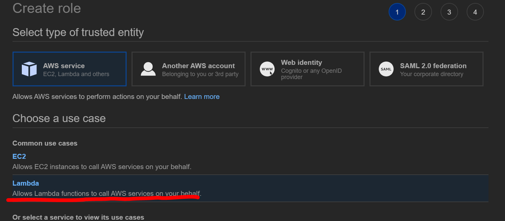

# API Gateway with Lambda

## 목적

---

- API Gateway의 기초적인 사용법 확인
- API Gateway에 Lambda를 연결하여 동작 확인
- HTTP GET Parameter(매개변수) 전송과 응답 확인
- 두 개의 Lambda Function을 생성하여 Root·Resource Page에 각각 적용하기

## 실습

---

1. Lambda 동작에 필요한 권한을 부여하기 위해 Role 을 생성합니다
    
    
    
2. Lambda의 최소 권한인 CloudWatch 접근 권한을 부여합니다
    
    
    
3. 위 Role을 활용할 수 있는 Lambda를 생성합니다
    
    
    
    
    
4. Root Page(/)에 적용할 첫 번째 Lambda Function의 코드는 다음과 같이 입력합니다
    
```
import json

def lambda_handler(event, context):
    myParam = event['myParam']
    print('myFunction1 excuted')
    return {
        'statusCode': 200,
        'body': json.dumps(myParam)
    }
```
    
    
    
5. 코드 작성을 완료하였으면 배포해줍니다
    
    
    
6. (/resource)페이지에 적용할 두 번째 함수도 같은 설정으로 생성합니다
    
    
    
7. 두번째 Lambda Function의 코드는 다음과 같이 입력합니다
    
```
import json

def lambda_handler(event, context):
    myParam = event['myParam']
    print('myFunction2 excuted')
    return {
        'statusCode': 200,
        'body': json.dumps(myParam)
    }
```

    
    
8. 마찬가지로 두 번쨰 코드도 작성을 완료하였으면 배포해줍니다
    
    
    
9. API Gateway를 생성합니다. 타입은 REST API로 설정합니다
    
    
    
10. 첫 API 이름은 평범하게 myAPI로 설정하겠습니다
    
    
    
11. 루트페이지를 GET 할때 myFunction1을 호출합니다
    
    
    
12. /resource페이지를 GET 할 때 myFunction2를 호출합니다
    
    
    
13. 페이지별 Function을 연결했으면 Integration Request 메뉴에서 GET 요청시 파라메터값을 가져올 수 있도록 설정해줍니다
    
    
    
14. 아래와 같이 템플릿을 설정하면 됩니다
    
    

```
{
    "myParam": "$input.params('myParam')"
}
```

15. 통합보고 경고가 뜨면 YES를 선택합니다
    
    
    
16. /resource 의 Request 에도 똑같이 적용합니다
17. 설정이 완료되면 API를 배포합니다
    
    
    
18. 배포할 API이름은 testAPI로 설정하겠습니다
    
    
    
19. 배포가 완료되면 API가 적용된 DNS주소가 발생합니다
    
    
    
20. 해당 DNS는 HOST에서 바로 접근할 수 있습니다
    
    
    
21. API가 Lambda를 잘 호출하는 것을 Cloudwatch에서 확인할 수 있습니다
    
    
    
22. 리눅스 터미널을 이용해 간편하게 API를 테스트 해봅시다
23. curl 을 사용해 접근합니다
    
```
curl -X GET '{DNS ADDRESS}'
```

24. 접속이 가능하고 파라메터값이 없기 떄문에 리턴값도 없음을 확인할 수 있습니다


25. curl 명령에 파라메터값도 같이 날려봅니다

```
curl -X GET '{DNS ADDRESS}?myParam=HELLO'
```

26. API가 파라메터값에 정상적으로 반응하는 것을 볼 수 있습니다


27. /resource페이지도 정상적으로 반응하는 것을 볼 수 있습니다

```
curl -X GET '{DNS ADDRESS}/resource?myParam=HELLO'
```
    
