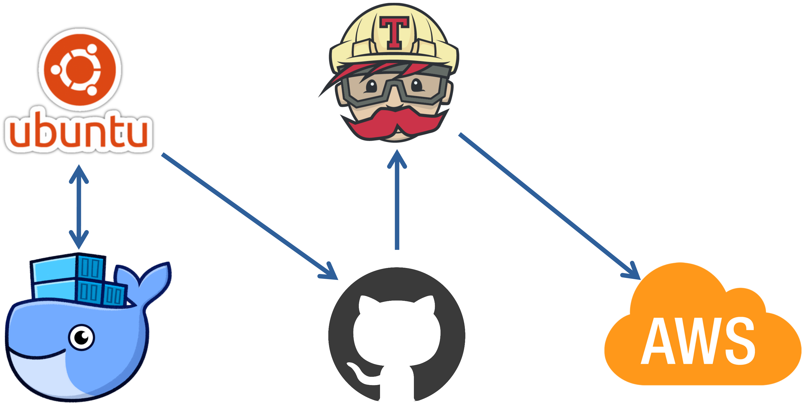

# CICD on Single container



## 목표

---

1. 도커, 도커컴포즈를 이용한 테스트베드, 운영환경 실행환경 구성
2. Travis CI를 이용해 Github → Travic CI → AWS Beanstalk 파이프라인 구현
3. CICD 체험이 목적이기 떄문에 Nginx, 리액트는 작업하지 않습니다

## Init

---

### React setup

1. 작업 디렉터리를 생성합니다
    ```s
    mkdir simple_app
    cd simple_app
    ```
        
2. 현재 디렉터리에 react를 설치합니다
    ```s
    npx create-react-app ./
    ```
    
    
    
3. 리액트가 잘 동작합니다
    - npm run test
        
        
        
    - npm run start
        
        
        

### Dockerfile

1. 개발환경(dev)과 운영환경(prod)는 특성이 다를 수 있기 때문에 도커파일을 분리해야합니다
2. 개발 환경의 도커파일을 생성합니다
    ```s
    code dockerfile.dev
    ```

    ```dockerfile
    FROM node:alpine

    WORKDIR /usr/src/app

    COPY package.json ./

    RUN npm install

    COPY ./ ./

    CMD ["npm", "run", "start"]
    ```


### Deploy container

1. 이미지를 빌드해봅니다
    !!! tip
        💡 도커 환경에서 node를 실행할 때는 로컬에 node_module가 필요하지 않습니다
        쓸데없이 빌드 시간만 길어지게 하는 node_module를 지우고 이미지를 빌드 합니다
        rm -rf node_modules

    !!! warning
        💡 현재 도커파일 이름은 dockerfile이 아니므로 -f 파라메터로 지정해줍니다
    
    ```s
    docker build -t dotoryeee/simple-app -f dockerfile.dev ./
    ```
    
2. 생성이 완료되었으면 컨테이너로 돌려봅니다
    ```s
    docker run -it -p 3000:3000 dotoryeee/simple-app
    ```
    
3. 컨테이너 서버가 잘 실행되었습니다
    
    

### Mapping volume

1. 실험을 위해 app.js 내용을 살짝 변경해줍니다
    
    
2. 호스트에서 node_moules 폴더를 삭제했기 때문에 예외처리 해줍니다
    ``` bash
    docker run -it -p 3000:3000 -e CHOKIDAR_USEPOLLING=true -v /usr/src/app/node_modules -v $(pwd):/usr/src/app dotoryeee/simple-app
    ```
    
1. 현재 WSL에서 작업 시 컨테이너 node_module 폴더 권한 에러(EACCESS)로 인해 다음과 같이 실행했습니다
    ```s
    docker run -it -p 3000:3000 -e CHOKIDAR_USEPOLLING=true -v $(pwd):/usr/src/app dotoryeee/simple-app
    ```
    

### restart

1. 코드 변경이 잘 적용되었습니다
    
    
2. 코드 편집 후 저장하면 새로고침조차 할 필요 없이 실시간으로 리액트에 적용됩니다
    
    

## Docker compose 사용

---

### compose 설정

1. 이번에는 도커 실행 명령어 단축을 위해 compose를 사용합니다
2. 컴포즈파일 작성을 시작합니다
    
    ```s
    code docker-compose.yml
    ```

    ```yaml
    version: "3" #도커 컴포즈 버전
    services: #컴포즈에서 실행할 컨테이너들을 정의
        react: #컨테이너 이름
        build: #dockerfile 정보 ↓
            context: . #현재 위치에 있다
            dockerfile: dockerfile.dev #파일이름
        ports: #컨테이너 포트 매핑
            - "3000:3000"
        volumes: #호스트와 볼륨 매핑
            - /usr/src/app/node_modules
            - ./:/usr/src/app
        stdin_open: true #리액트 앱을 종료할 떄 필요한 옵션(없으면 리액트에서 버스 발생)
        environment:
            - CHOKIDAR_USEPOLLING=true #리액트에서 핫 리로딩(실시간 업데이트)를 위한 옵션
    ```
    
1. 컴포즈를 실행합니다
 
    ```s
    docker-compose up
    ```
 
4. 리액트가 잘 시작되었습니다
    
    
    

### react test container 설정

1. 도커에서 리액트를 테스트 하는 기본적인 명령어는 다음과 같습니다

    ```s
    docker run -it {IMAGE} npm run test
    ```

2. 테스트도 소스코드를 핫 리로딩 할 수 있으면 매우 편리할 것입니다
    
    다음과 같이 컴포즈파일에 컨테이너를 추가해주면 됩니다

    ```yaml
    tests:
        build:
            context: .
            dockerfile: Dockerfile.dev
        volumes:
            - /usr/src/app/node_modules
            - ./:/usr/src/app
        command: ["npm", "run", "test"]
    ```
        
3. 이번에는 재빌드 해야하니 build 명령을 추가해줍니다

    ```s
    docker-compose up --build
    ```


## 운영환경을 위한 dockerfile

---

1. 개발환경은 npm run start를 사용해 서버를 실행하지만 운영환경은 build후 Nginx를 이용합니다
2. 도커파일 작성을 시작합니다

    ```s
    code dockerfile
    ```

3. 운영환경용 dockerfile은 두 단계로 나눠집니다
    - Builder stage : 빌드 파일을 생성합니다

    ```dockerfile
    FROM node:alpine as builder
    #이곳(as)부터 다음 FROM이 나올 떄 까지는 builder stage임을 명시
    WORKDIR '/usr/src/app'
    COPY package.json ./
    RUN npm install
    COPY ./ ./
    RUN npm run build
    #생성된 빌드 파일은 /usr/src/app/build에 위치하게 됩니다
    ```
        
    - Nginx stage : NginX를 가동하고 생성된 빌드 파일을 요청에 따라 제공합니다(Run stage)
        
    ```dockerfile
    FROM nginx
    #nginx 베이스 이미지
    EXPOSE 80
    #AWS에 배포하기 위해 80포트 오픈
    COPY --from=builder /usr/src/app/build /usr/share/nginx/html
    #--from=builder : 다른 stage에 있는 파일을 복사할 때, 다른 stage 이름을 명시
    #/usr/src/app/build , /usr/share/nginx/html : builder stage에서 생성된 파일을 nginx 폴더에 복사
    ```
        
    - 참고 : dockerhub에서 제공하는 nginx 공식 설명

    ```dockerfile
    FROM nginx
    COPY static-html-directory /usr/share/nginx/html
    ```
        
4. 작성이 완료되면 이미지 빌드를 시작합니다

    ```s
    docker build -t dotoryeee/test2 ./
    ```

5. 이미지 생성이 완료되면 컨테이너를 실행해봅니다. nginx의 기본 포트는 80 입니다

    ```s
    docker run -it -p 7070:80 dotoryeee/test2
    ```

6. nginx에서 리액트가 잘 실행되었습니다
    
    
    

## Travis CI 세팅

---

### 연결

1. 트레비스CI를 사용하려면 github과 연동되어야 합니다. 사이트에 접속해 연동해줍니다
    
    [Travis CI - Test and Deploy with Confidence](https://travis-ci.com/)
    
2. 로그인 후 깃헙에서 repository 접근 권한을 허용합니다
    
    
    
3. 트레비스에 repository가 연결된 것을 확인합니다
    
    
    

### Travis CI yaml 설정

1. 트레비스도 yaml파일로 설정하게 됩니다. 작성을 시작합니다
    
    yaml파일은 매우 직관적이기 때문에 설명이 필요 없습니다
    
    - 언어설정에 generic에 대한 설명은 [이곳](https://docs.travis-ci.com/user/languages/minimal-and-generic/)에서 확인할 수 있습니다
    - — —coverage 옵션을 이용하면 콘솔에서 자세한 로그를 확인할 수 있습니다

    ```s
    code .travis.yml
    ```
            
    ```yaml
    sudo: required

    language: generic

    services:
        - docker

    before_install:
        - echo "building image with dockerfile"
        - docker build -t dotoryeee/test2 -f dockerfile.dev ./

    script:
        - docker run -e CI=true dotoryeee/test2 npm run test -- --coverage

    after_success:
        - echo "TEST SUCCESS"
    ```
    
2. 깃헙에 푸쉬하면 트레비스에서 자동으로 작업을 시작합니다
    
    
    
3. 첫 CI는 에러입니다. 바로 이메일도 날라와서 편리합니다
    
    
    
4. 이후 코드를 수정하고 다시 커밋 → 푸시 해주면 travis ci가 자동으로 pull 하고 build합니다
    
    
    

## CD : AWS에 배포하기

---

1. AWS Beanstalk 에서 docker - amazon linux 플랫폼으로 생성을 시작합니다
    
    
    
2. Travis → AWS 접근을 위해 IAM AK, SK를 생성합니다. 이때 트래비스yaml파일에 직접 기입하면 보안상 위험하기 떄문에 트래비스 환경변수에 AK, SK를 넣어주고 배포시에 값을 가져오도록 설정합니다
3. 트래비스에서 more option → setting으로 진입합니다
    
    
    
4. 트래비스 환경변수에 AWS_ACCESS_KEY / AWS_SECRET_ACCESS_KEY를 추가합니다
    
    
    
5. AWS에 배포를 위해 travis를 설정합니다. 당연히 yaml 파일로.

    ```s
    code .travis.yml
    ```
    
6. 다음 내용을 추가하고 푸시해줍니다
        
    ```yaml
    deploy:
        provider: elasticbeanstalk
        region: "ap-northeast-2"
        app: "simple-app"
        env: "Simpleapp-env" #빈스톡 생성시 env 지정 가능
        bucket_name: "elasticbeanstalk-ap-northeast-2-737382971423" #빈스톡 생성시 자동으로 생성된 s3 이름
        bucket_path: "simple-app" #app 이름과 동일하게 작성
        on:
        branch: master #어떤 브랜치를 배포할 것 인가
        access_key_id: $AWS_ACCESS_KEY #트래비스에 등록된 환경변수
        secret_access_key: $AWS_SECRET_ACCESS_KEY
    ```
    
7. 빌드가 성공적으로 이뤄지면
    
    
    
    
    
8. 자동으로 AWS Beanstalk에 배포됩니다
    
    
    
