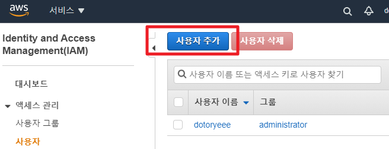

# Circle-CI Basics

## AWS S3

---

1. IAM에서 사용자 생성
    
    
    
2. 콘솔 접근 권한은 필요없습니다
    
    
    
3. S3에 업로드하기 위해 S3 FA 권한을 부여합니다
    
    
    
4. 사용자는 이름이 자동으로 적용되기 때문에 태그는 따로 추가하지 않습니다
    
    
    
5. 이후 생성되는 AccessKey와 SecretKey를 복사합니다
    
    
    
6. CircleCI Projects에서 Project Settings에 진입합니다
    
    
    
7. Environment Variables에서 환경변수를 추가합니다
    
    
    
8. 다음 그림과 같이 설정하면 됩니다
    
    
    
9. yml파일 위치는 다음과 같습니다
    
    `
    .circleci/config.yml
    `
    
10. config.yml내용은 다음과 같습니다
```
version: 2.1

orbs:
  aws-cli: circleci/aws-cli@1.3.1
  aws-s3: circleci/aws-s3@2.0

jobs:
  deploy-s3:
    executor: aws-cli/default
    steps:
      - attach_workspace:
          at: .
      - persist_to_workspace:
          root: .
          paths:
            - .
      - run: ls /home/circleci/project
      - aws-s3/sync:
          arguments: --acl public-read
          aws-region: AWS_REGION
          aws-access-key-id: AWS_ACCESS_KEY_ID
          aws-secret-access-key: AWS_SECRET_ACCESS_KEY
          from: .
          to: "s3://nuspam-static/frontend"
      - aws-s3/copy:
          arguments: "--dryrun"
          from: .
          to: "s3://nuspam-static/frontend"

workflows:
  deploy-frontend:
    jobs:
      - deploy-s3:
        filters:
          branches:
            only: main
    
```
## AWS CodeDeploy for EC2

1. AWS CLI접속용 User에 CodeDeploy FA 권한을 부여합니다
    
    
    
2. IAM에서 CodeDeploy용 역할을 생성합니다
    
    
    
3. AWS CodeDeploy에서 어플리케이션을 생성하고 배포그룹을 만드는데, 앞서 생성한 역할을 적용합니다
    
    
    
4. 배포 타겟에 인스턴스 이름을 사용하면 편리합니다
    
    
    
5. EC2 인스턴스에서 CodeDeploy 접근을 위한 역할을 생성합니다
    
    
    
6. EC2RoleforAWSCodeDeploy권한을 부여하면 됩니다
    
    
    
7. EC2 인스턴스에 해당 역할을 연결하고
    
    
    
8. EC2 인스턴스에 CodeDeploy 에이전트를 설치합니다
    
```
aws s3 cp s3://aws-codedeploy-ap-northeast-2/latest/install . --region ap-northeast-2
sudo yum install -y ruby wget
chmod +x ./install
sudo ./install auto
sudo service codedeploy-agent start
sudo service codedeploy-agent status
```
 
9. CircleCI config.yml을 다음과 같이 적당하게 작성합니다
    
```
version: "2.1"
orbs:
  aws-code-deploy: circleci/aws-code-deploy@2.0.0
  aws-s3: circleci/aws-s3@2.0
  aws-cli: circleci/aws-cli@1.3.1

jobs:
  deploy-step1:
    executor: aws-cli/default
    steps:
      - checkout
      - attach_workspace:
          at: .
      - persist_to_workspace:
          root: .
          paths:
            - .
      - aws-s3/sync:
          aws-region: AWS_REGION
          aws-access-key-id: AWS_ACCESS_KEY_ID
          aws-secret-access-key: AWS_SECRET_ACCESS_KEY
          from: .
          to: "s3://nuspam-static/backend/"

workflows:
  deploy_application:
    jobs:
      - deploy-step1
      - aws-code-deploy/deploy:
          requires:
            - deploy-step1
          application-name: nuspam-api
          bundle-bucket: nuspam-static
          bundle-key: app
          deployment-group: api-server
          service-role-arn: arn:aws:iam::737382971423:role/Role_for_codedeploy
          filters:
            branches:
              only: main
```
    
10. CircleCI에서 작업이 완료되면
    
    
    
11. AWS CodeDeploy에서 배포현황을 확인할 수 있습니다
    
    
    
12. 인스턴스 초기에 python3 정지하는 스크립트 에러가 발생할 경우 다음과 같이 스크립트를 작성하면 됩니다.
    
```
#!/bin/bash
if pgrep -x python3 >/dev/null
then
  sudo kill $(pgrep -f python3)
else
  exit 0
fi
```
    
13. 배포 후 flask가 종료되버리는 경우 다음과 같이 명령 마지막에 & 을 삽입해 백그라운드에 동작을 유도하면 됩니다
    
    
    
