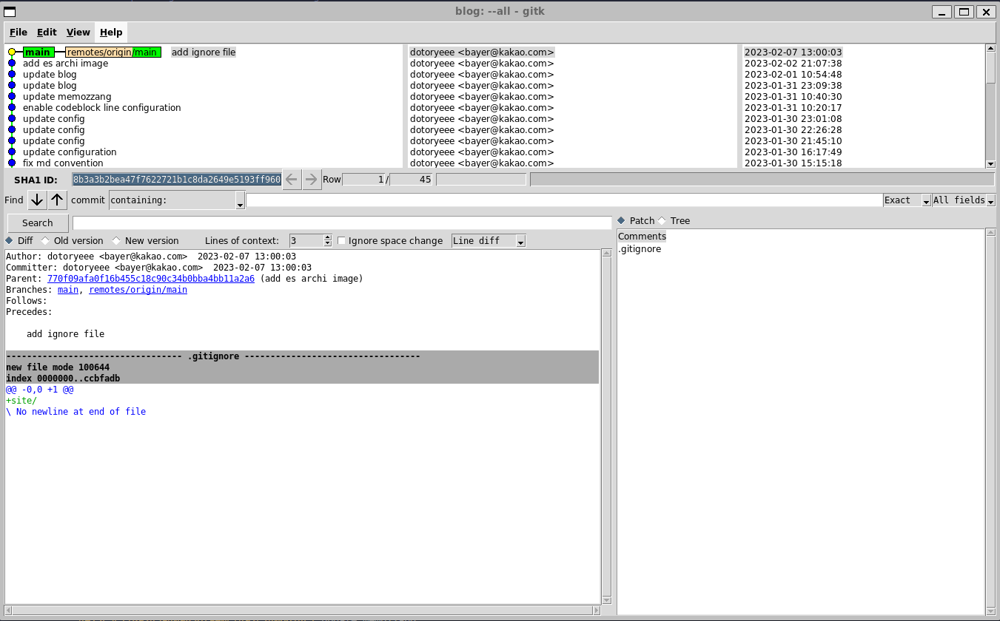

# Git 정리


## Commands
1. git checkout & git switch, git restore
2. git revert & git reset
3. git merge & git rebase


## Tools
## gitk
- 용도
GUI로 git 관리하기

- Install
```s 
sudo apt-get -y install gitk
```

- Run
```s
gitk
```
