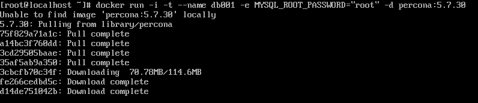

# Docker volume with MySQL

## 목표

---

- CentOS8에 도커를 설치하고 MySQL 컨테이너를 로드합니다
- 컨테이너를 종료하고 외부에서 접속하도록 다시 로드합니다
- 컨테이너를 삭제해도 이전 데이터를 그대로 유지하는 stateful한 상태를 구현합니다
- Stateful 상태는 Volume설정을 통해 구현합니다

## Docker 설치

---

1. yum util 패키지 설치
    
    ```s
    yum install -y yum-utils
    ```
    
2. docker를 위한 repo를 설정
        
    ```s
    yum-config-manager --add-repo=https://download.docker.com/linux/centos/docker-ce.repo
    ```
        
3. docker-ce 설치
    
    ```s
    yum install -y docker-ce 
    ```
        
4. (이미 설치된 패키지 떄문에)설치 에러 발생시 allowerasing 옵션
    
    ```s
    yum install -y --allowerasing docker-ce
    ```

    ```s
    dnf install --nobest --allowerasing -y docker-ce
    ```
        
5. docker를 실행

    ```s
    systemctl start docker
    ```
        
6. docker 버전 확인
    
    ```s
    docker --version
    ```


## MySQL 컨테이너 설치

---

1. MYSQL 컨테이너를 실행합니다. 5.7.30 버전 mySQL 컨테이너를 다운로드하고 db001이라는 컨테이너 이름으로 로드하는 명령입니다
    
    -i, -t : 컨테이너의 shell에 접속하기 위한 옵션
    —name : 컨테이너 이름
    -e : 환경변수 세팅
    -d : 백그라운드에서 컨테이너 실행
    
    ```s
    docker run -i -t --name db001 -e MYSQL_ROOT_PASSWORD="root" -d percona:5.7.30
    ```
    
    아래 스크린샷 처럼 우선 로컬에서 컨테이너를 찾아보고 없으면 도커허브에서 알아서 찾고 다운로드하여 컨테이너를 로드합니다
    
    
    
2. 다음 명령으로 현재 실행중인 컨테이너에 MySQL이 존재하는 것을 확인할 수 있습니다
    
    ```s
    docker ps
    ```

    
    
3. db001컨테이너에 /bin/bash 셸을 통해 접속합니다
        
    ```s
    docker exec -it db001 /bin/bash
    ```
        
    
    
4. 컨테이너에 접속되었으면 MySQL에 접속하고 데이터베이스 목록을 호출합니다
    
    ```s
    mysql -uroot -p
    ```

    ```sql
    show databases;
    ```
        
    
    
5. 다음 실습을 위해 컨테이너를 중지 후 삭제합니다

    ```s
    docker stop db001
    docker rm db001
    ```


## 외부에서 MySQL 컨테이너 접속

---

1. 호스트에 MySQL 클라이언트를 설치합니다
    
    ```s
    dnf -y install mysql
    ```
    
2. 외부에서 컨테이너를 접속하려면 접속포트와 컨테이너포트, 도커 호스트 IP가 필요합니다
3. 컨테이너를 로드할 때 포트를 매칭해줍니다
    
    ```s
    docker run -i -t --name db001 -p 3306:3306 -e MYSQL_ROOT_PASSWORD="root" -d percona:5.7.30
    ```
        
4. docker ps를 이용해 동작중인 컨테이너 목록을 확인하면 이번엔 포트가 연결된 것을 확인할 수 있습니다
    
    
    
5. 도커 호스트 IP를 파라미터에 전달하여 MySQL을 실행합니다
    
    ```s
    mysql -uroot -p -h {HOST IP}
    ```
    
6.  컨테이너 외부에서 DB 접속을 성공하였습니다
    
    
    
7. 다음 실습을 위해 컨테이너를 중지 후 삭제합니다

    ```s
    docker stop db001
    docker rm db001
    ```
    

## Stateful 구현을 위한 Volume 설정

---

1. 도커 호스트에 데이터 저장을 위한 디렉터리 생성

    ```s
    mkdir -p /db/db001/data
    ```
    
2. 작업이 가능하도록 디렉터리에 권한 부여
    
    ```s
    chmod 777 /db /db/db001 /db/db001/data
    ```
    
3. 볼륨 옵션을 추가하여 컨테이너를 로드합니다
    
    이는 데이터 저장을 위해 생성했던 디렉터리와 컨테이너의 디렉터리가 공유되도록 설정(매핑)합니다
    
    ```s
    docker run -i -t --name db001 -p 3306:3306 -v /db/db001/data:/var/lib/mysql -e MYSQL_ROOT_PASSWORD="root" -d percona:5.7.30
    ```
    
4. 컨테이너 로드 후 데이터 저장용 디렉터리로 이동하면 파일이 생성된 것을 확인할 수 있습니다

    ```s
    cd /db/db001/data
    ```
        
    
    
    MAGIC
    
5. stateful 구현 테스트를 위한 데이터를 생성합니다

    ```sql
    create database test default character set=utf8;
    use test;
    create table tt(num int);
    insert into tt values(1), (2), (3);
    select * from tt;
    ```

    
    
6. Stateful 테스트를 위해 컨테이너를 삭제합니다

    ```s
    docker stop db001
    docker rm db001
    ```

7. 컨테이너를 다시 로드합니다

    ```s
    docker run -i -t --name db001 -p 3306:3306 -v /db/db001/data:/var/lib/mysql -e MYSQL_ROOT_PASSWORD="root" -d percona:5.7.30
    ```
        
8. 구동된 컨테이너에서 아까 작성했던 테이블이 살아있는 것을 확인할 수 있습니다.
    
    
    
9. Stateful 구현에 성공하였습니다
    
    
    
10. 데이터뿐만 아니라 로그, 설정파일 등에 응용할 수 있습니다
11. 다시 컨테이너를 제거합니다

    ```s
    docker stop db001
    docker rm db001
    ```
    
12. 로그와 설정을 위한 디렉토리를 생성하고 권한을 부여합니다
    
    ```s
    mkdir -p /db/db001/log /db/db001/conf
    chmod 777 /db/db001/log /db/db001/conf
    ```
        
13. /db/db001/conf 디렉터리에 644 퍼미션을 가지는 cnf 파일을 생성합니다
    - my.cnf
        
        server-id와 report_host 값은 유니크한 특성(고유값)을 가져야합니다
        
    ```conf
    [mysqld]
    log_bin                     = mysql-bin
    binlog_format               = ROW
    gtid_mode                   = ON
    enforce-gtid-consistency    = true
    server-id                   = 100
    log_slave_updates
    datadir                     = /var/lib/mysql
    socket                      = /var/lib/mysql/mysql.sock

    # Disabling symbolic-links is recommended to prevent assorted security risks
    symbolic-links              = 0

    log-error                   = /var/log/mysql/mysqld.log
    pid-file                    = /var/run/mysqld/mysqld.pid

    report_host                 = db001

    [mysqld_safe]
    pid-file                    = /var/run/mysqld/mysqld.pid
    socket                      = /var/lib/mysql/mysql.sock
    nice                        = 0
    ```
            
    
    [my.cnf](Docker volume with MySQL/my.cnf)
    
14. 다음 명령으로 데이터, 로그, 설정파일이 모두 매핑된 컨테이너를 실행합니다

    ```s
    docker run -i -t --name db001 -p 3306:3306 -v /db/db001/data:/var/lib/mysql -v /db/db001/log:/var/log/mysql -v /db/db001/conf:/etc/percona-server.conf.d -e MYSQL_ROOT_PASSWORD="root" -d percona:5.7.30
    ```
        
15.  로그폴더에 들어가보면 로그가 정상적으로 보이는 것을 확인할 수 있습니다

    ```s
    cd /db/db001/log
    ```
    
    
    

## 링크

---

- percona 이미지 정보는 다음 주소에서 그 내용을 확인할 수 있습니다
    
    [https://github.com/percona/percona-docker/blob/master/percona-server-5.7/Dockerfile](https://github.com/percona/percona-docker/blob/master/percona-server-5.7/Dockerfile)
    
