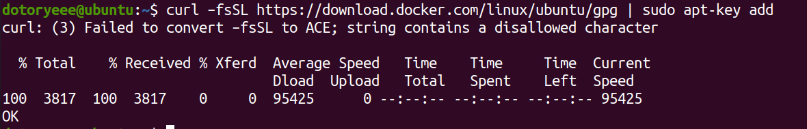

# Docker compose and web GUI

## 작업요약

---

- Docker를 설치하는 과정에 필요한 파라미터 변수에 대해 알아봅니다
- 빠른 이해와 편리한 사용을 위해 Portainer를 설치합니다
- Docker-Hub에서 컨테이너를 찾고 DVWA 컨테이너를 로드해봅니다
- YAML + Docker Compose를 이용해 코드로 관리하는 법을 알아봅니다

## 설치 전 기본 작업

---

1. 원활한 작업을 위해 Ubuntu 시스템을 업데이트합니다

```
sudo apt update && sudo apt upgrade
```
    
2. 트러블슈팅 혹은 작업시 필요한 net-tools와 ssh, vim을 설치합니다

```
sudo apt install net-tools ssh vim
```
    
3. https를 이용하여 프로그램에 접근 / ca서명 / http를 이용한 통신 / GPG키 관리자 / PPA액세스를 위한 프로그램을 각각 설치합니다
    
```
sudo apt install apt-transport-https ca-certificates curl gnupg-agent software-properties-common
```
    

## Docker 설치 및 확인

---

1. 도커의 GPG PublicKey를 다운로드한 후 apt-key에 추가합니다
    
```
curl –fsSL https://download.docker.com/linux/ubuntu/gpg | sudo apt-key add -
```
    
2. OK를 확인하여 정상적으로 완료된 것을 알 수 있습니다
    
    
    
3. ppa저장소를 추가하고 업데이트 합니다
    
```
sudo add-apt-repository "deb [arch=amd64] https://download.docker.com/linux/ubuntu bionic stable"
sudo apt update
```
    
4. 도커를 설치합니다
    
    docker-ce : 도커 데몬으로 모든 작업을 수행하는 부분입니다
    
    docker-cli : 데몬은 제어하는 CLI 도구입니다
    
    containerd.io : 컨테이너 데몬입니다
    
```
sudo apt install docker-ce docker-cli containerd.io
```

5.  도커의 명령을 실행해봅니다

```
docker –v
```
    
6.  정상적으로 설치가 완료되었습니다
    
    
    
7.  리눅스 부팅될 때 자동으로 도커가 실행될 수 있도록 서비스에 등록합니다

```
sudo systemctl enable docker && service docker start
```

8.  리눅스에서 도커 서비스 상태를 확인합니다

```
service docker status
```
    
9.  정상적으로 동작하고 있는 것을 확인할 수 있습니다
    
    
    

## DOCKER 명령어

---

<aside>
💡 옵션이 너무 많은 경우 생략 → 각 명령어의 파라미터 —help 참조

</aside>

### 기본 명령어

---

- docker version : 도커 버전 확인
- docker system info : 도커 구동 환경

### 이미지 관련 명령어

---

- docker system df (-v) : 도커 이미지 사용량 확인
    
    
    
- docker images : 도커 이미지 확인
    
    
    
- docker pull {-a -q} {image}: 도커 이미지 다운로드
- docker rmi {-f} {image} : 도커 이미지 삭제

### 컨테이너 관련 명령어

---

- docker run {-a -c -d -e -h -i etc...}  : 컨테이너 실행
- docker ps {-a -f -n -l -q -s} : 도커 컨테이너 확인
- docker start : 컨테이너 시작
- docker restart : 컨테이너 재시작
- docker stop : 컨테이너 중지
- docker attach : 컨테이너 분리
- docker rm {-f} : 컨테이너 삭제

## Portainer 설치

---

1. docker를 쉽게 관리할 수 있는 GUI 도구인 portainer를 설치합니다
2. portainer를 설치할 디렉토리를 생성합니다
    
```
sudo mkdir -p /data/portainer
```

3.  portainer를 실행할 수 있도록 docker에 컨테이너 형태로 추가합니다
    
    —name : {컨테이너 이름}
    
    -p : {호스트포트}:{내부포트}
    
    -d : {백그라운드 데몬}
    
    —restart : always ← 재부팅 시 자동 시작
    
    -v {호스트-컨테이너 간 볼륨 매칭}
    
    portainer/portainer ← 이미지 사용

```
sudo docker run --name portainer -p 9000:9000 -d --restart always -v /data/portainer:/data -v /var/run/docker.sock:/var/run/docker.sock portainer/portainer
```
    
4. 명령에 대한 진행사항을 확인할 수 있습니다
    
    
    
5. 웹브라우저를 열고 [localhost:9000](http://localhost:9000) 에 진입합니다
6. portainer에 정상적으로 연결되었습니다
    
    
    
    admin / 12345678
    
7. 로컬에서 작업할 수 있도록 설정합니다
    
    
    
    
    

## 컨테이너 직접 로드 해보기

---

1. [https://hub.docker.com/](https://hub.docker.com/) 에서 컨테이너를 검색합니다
2. 이번에는 dvwa를 사용해보겠습니다. vulnerables/web 를 검색합니다
    
    
    
3. 검색된 페이지를 읽으면 중간에 설치 명령을 찾을 수 있습니다
    
    
    
4. 도커는 항상 root 권한이 필요하니 sudo를 붙여서 명령해줍니다

```
sudo docker run --rm -it -p 80:80 vulnerables/web-dvwa
```

5. 로컬 시스템에서 컨테이너를 찾아보고 없으면 알아서 다운로드 → 컨테이너로드 까지 한 번에 실행됩니다
    
    
    
6. 다른 포트와 겹치는 경우 (호스트)포트를 변경하고 다시 명령을 실행하면 됩니다
    
    
    
    포트 중복 에러
    
    
    
    호스트포트 변경 후 재 시도
    
7. 명령어 한 줄로 DVWA가 실행되는 마법을 볼 수 있습니다
    
    
    
    localhost:90
    

## YAML + Compose를 활용해 Code로 관리하기

---

1. root 권한으로 docker-compose를 설치합니다

```
sudo apt install docker-compose
```

2. YAML파일 작성을 위해 홈 디렉토리로 이동합니다
    
```
cd /home/{USER}
```

3. 컴포즈를 위한 YAML파일을 생성(수정)합니다
    
```
sudo vi docker-compose.yml
```

4. 다음과 같이 작성합니다. wordpress와 mysql5.7 이미지를 다운받고 컨테이너를 로드할 때 설정값도 같이 넣어줍니다
    
```
version: '3.1'
services:
        wordpress:
                image: wordpress
                restart: always
                ports:
                        - 8080:80
                environment:
                        WORDPRESS_DB_HOST: db
                        WORDPRESS_DB_USER: admin
                        WORDPRESS_DB_PASSWORD: password
                        WORDPRESS_DB_NAME: wordpress
                volumes:
                        - wordpress:/var/www/html
        db:
                image: mysql:5.7
                restart: always
                environment:
                        MYSQL_DATABASE: wordpress
                        MYSQL_USER: admin
                        MYSQL_PASSWORD: password
                        MYSQL_RANDOM_ROOT_PASSWORD: '1'
                volumes:
                        - db:/var/lib/mysql
volumes:
    wordpress:
    db:
```

5. docker-compose를 백그라운드에서 실행합니다

```
sudo docker-compose up -d
```

6. 웹 브라우저를 열고 다음 주소로 이동합니다

```
localhost:8080
```

7. Wordpress와 MySQL이 잘 동작하는 것을 확인할 수 있습니다
    
    
    
    
    
8. portainer에 접속하여 실행 중인 컨테이너를 확인하면 wordpress가 정상적으로 동작 중인 것을 확인해볼 수 있습니다
    
    
    
9. 다음 액션을 클릭하면 터미널에 직접 접속할 수도 있습니다
    
    
    
10. 배쉬셸을 선택하고 연결을 클릭합니다
    
    
    
11. wordpress 컨테이너 터미널에 접속된 것을 확인할 수 있습니다
    
    
    
