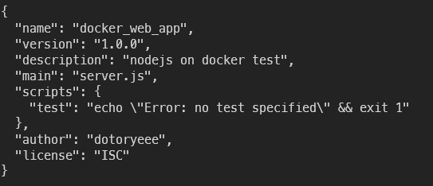

# Docker basics

## 목표

---

1. 도커를 복습 겸 간단하게 한 번 훑어봅니다
2. 간단한 node 백엔드를 작성하고 도커 이미지를 생성합니다
3. Working Directory를 설정합니다
4. node 종속성을 수정해 이미지 빌드 속도를 높여봅니다
5. 개발일을 할 떄 docker volume을 어떻게 활용할 수 있는지 한 번 살펴봅니다
6. compose를 이용해 간단한 페이지를 만들어봅니다

## 파일 준비

---

### Node app

1. node를 초기화 합니다
    
    ```s
    npm init
    ```
    
    
    
2. express 사용을 위해 package.json에 dependency를 추가합니다

    ```json
    "dependencies": {
        "express": "4.17.1"
        },
    ```
    
3. 간단한 Node앱을 준비해줍니다
    
    ```s
    code server.js
    ```

    ```js
    const express = require('express');

    const PORT = 8080;

    const app = express();
    app.get('/', (req, res) => {
        res.send("!docker with node test!")
    });

    app.listen(PORT);

    console.log('Server START')
    ```


### Dockerfile

1. 도커파일 작성을 시작합니다

    ```s
    code Dockerfile
    ```

2. 기본적인 dockerfile틀은 다음과 같습니다
    - node 10버전 사용
        
        alpine 이미지는 경량화된 이미지(5MB)이기 때문에 npm실행을 위한 환경이 갖추어져있지 않으므로 node 베이스 이미지를 사용합니다
        
    - 이미지 로드 전 npm install 명령 실행
        
        package.json에 적혀있는 종속성들을 자동으로 설치해 향후 server.js가 원활하게 동작할 수 있는 환경을 만들어줍니다
        
    - 이미지 로드 후 node server.js 명령 실행

    ```dockerfile
    FROM node:10

    RUN npm install

    CMD ["node", "server.js"]
    ```
    
3. 하지만 이렇게 하면 package.json, server.js 파일이 컨테이너에 포함될 수 없기 떄문에 copy 명령을 추가합니다. 아래 두 개는 같은 명령입니다
    
    ```dockerfile
    FROM node:10

    COPY ./ ./

    RUN npm install
    CMD ["node", "server.js"]
    ```

    ```dockerfile
    FROM node:10

    COPY package.json ./
    COPY server.js ./

    RUN npm install
    CMD ["node", "server.js"]
    ```
    

## Build Image

---

1. (dotoryeee의 first_image)이름으로 이미지 빌드를 실행합니다
    
    ```s
    docker build -t dotoryeee/first_image ./
    ```
        
    
    
2. 이미지가 잘 생성되었습니다
    
    ```s
    docker images
    ```

    
    

## Load Container

---

1. 생성된 이미지로 컨테이너를 실행해봅니다
    
    호스트포트 5000과 컨테이너포트 8080을 매핑합니다

    ```s
    docker run -p 5000:8080 dotoryeee/first_image
    ```
    
2. {DOCKER HOST IP}:8080에 접속하면 서버를 확인할 수 있습니다
    
    
    

## Working Directory 설정

---

1. 현재 이미지의 루트폴더는 너무 어지럽고 lock.json, dockerfile 등 들어오면 안되거나 들어올 필요가 없는 파일까지 포함되어있습니다.  또한 원래 이미지에 있던 파일명과 중복될 경우 기존 파일을 삭제해버리는 경우가 발생할 수도 있습니다
    
    
    
2. 때문에 작업 디렉토리를 별도로 분리하고 이미지를 새로 빌드합니다

    ```dockerfile
    FROM node:10

    WORKDIR /usr/src/app

    COPY ./ ./

    RUN npm install
    CMD ["node", "server.js"]
    ```

    ```s
    docker build -t dotoryeee/first_image ./
    ```
    
3. 이제 작업디렉토리가 변경되어 깔끔해졌습니다.
    
    
    

## NodeJS 재빌드 시 효율 높이기

---

1. 현재 이미지 빌드 순서는 dockerfile을 보면 알 수 있듯이 코드를 가져온 이후(COPY) npm을 이용해 package.json을 다운로드&설치 합니다.
2. 단순히 코드만 업데이트 할 떄, 종속성은 바뀌지 않았음에도 불구하고 npm을 이용해 처음부터 빌드하고 있는 상황입니다
3. 때문에 package.json만 따로 먼저 copy 해서 cache화 작업 후 npm install을 수행합니다
4. 이를 구현하기 위해 dockerfile을 아래와 같이 수정하면 됩니다
    
    ```dockerfile
    FROM node:10
    WORKDIR /usr/src/app

    COPY package.json ./

    RUN npm install
    COPY ./ ./
    CMD ["node", "server.js"]
    ```
    
5. dockerfile 작업 후 최초빌드시 6.7초가 소요되었습니다
    
    
    
6. 이후 server.js에서 한 글자만 수정하고 재빌드시 package.json이 이미 존재하기 때문에
server.js 코드가 변경되었음에도 불구하고 1.8초밖에 소모되지 않는 것을 확인할 수 있습니다
    
    
    

## Docker Volume

---

!!! tip
    💡 권한 에러 발생시 sudo chown -R yourusername:yourusername /path/to/node_modules


1. 볼륨 매핑시 컨테이너 로드 명령은 다음과 같습니다

    ```s
    docker run -p 5000:8080 \
    -v /usr/src/app/node_module \
    -v $(pwd):/use/src/app \
    -d dotoryeee/first_image
    ```

2. 볼륨 매핑(참조) 부분에서 두 줄은 각각 특성이 다릅니다
3. 3번 행은 환경변수에서 pwd(현재 작업중인 디렉터리) 위치를 가져와 컨테이너의 /src/app 폴더에 매핑하지만
4. 2번 행의 node_module폴더는 호스트에 존재하지 않기 때문에 예외로 처리하지 말라는 명령입니다
    
    
    
5. 이렇게 볼륨을 현재 디렉토리에 매핑해주면 코드 변경 시 이미지를 빌드할 필요가 없어집니다

## Docker Compose

---

1. 작업용 디렉터리를 생성하고 노드를 초기화합니다

    ```s
    mkdir compose
    cd compose
    npm init
    ```
    
    
    
2. 종속성에 express와 redis를 추가합니다

    ```s
    code package.json
    ```

    ```json
    "dependencies": {
        "express": "4.17.1"
        "redis" : "3.0.2"
        },
    ```
    
3. 다음과 같이 서버를 작성해줍니다

    ```s
    code server.js
    ```

    ```js
    const express = require("express");
    const redis = require("redis");

    const EXPRESS_PORT = 7070;
    const REDIS_PORT = 6379;

    //redis
    const client = redis.createClient({
        //host값에 도커가 아닌 일반 환경에서는 https://redis-server.com 을 입력
        //compose를 사용할 경우 docker-compose.yml에 명시한 컨테이너 이름을 입력
        host: "redis-server";  
        port: REDIS_PORT;
    })

    client.set("number", 0);

    //express
    app.get('/', (req, res) => {
        client.get("number", (err, Number) => { //에러가 발생하지 않는다면
            //숫자를 1씩 증가
            client.set("number", parseInt(Number) + 1);
            res.send(`현재 새로고침 카운트 : ${Number}`);
        })
    })

    const app = express();
    app.listen(EXPRESS_PORT);
    console.log('server is running');
    ```

4. 현재는 compose를 위한 디렉터리를 따로 만들어 둔 상태이니 전체 파일을 패키징 합니다
        
    ```dockerfile
    FROM node:10

    WORKDIR /usr/src/app

    COPY ./ ./
        
    RUN npm install

    CMD ["node", "server.js"]
    ```


## Docker compose YAML

---

1. 컴포즈시 여러 설정을 해줄 수 있는 YAML 파일입니다
2. 현재 컨테이너는 다음과 같이 별도의 레디스 서버가 필요합니다
    
    컨테이너간 통신을 설정해서 통신을 가능하도록 만들어 줄 필요가 있습니다
    
    
    
3. yaml 파일 작업을 시작합니다
    
    ```
    vi docker-compose.yml
    ```
        
4. 내용은 다음과 같습니다

    ```yaml
    version: "3"       #docker compose의 버전
    services:          #실행하려는 컨테이너 정의
        redis-server:    #컨테이너 이름
        image: "redis" #컨테이너가 사용하는 이미지
        node-app:        #컨테이너 이름
        build: .       #현재 위치에 있는 dockerfile 사용
        ports:         #포트매핑
        - "5000:7070"
    ```
        
5. 컴포즈를 시작합니다

    ```s
    docker-compose up
    ```
    
6. 컨테이너 두 대가 모두 로드되었습니다
    
    
    
7. 서버가 잘 동작합니다
    
    
    
8. 오타로 인해 에러가 발생했다던가 등의 이유로 인해 이미지를 강재로 재빌드 후 컴포즈를 실행하려면 다음과 같이 입력합니다

    ```s
    docker-compose up --build
    ```
        
9. 컨테이너 종료는 Ctrl + C를 입력하면 됩니다
