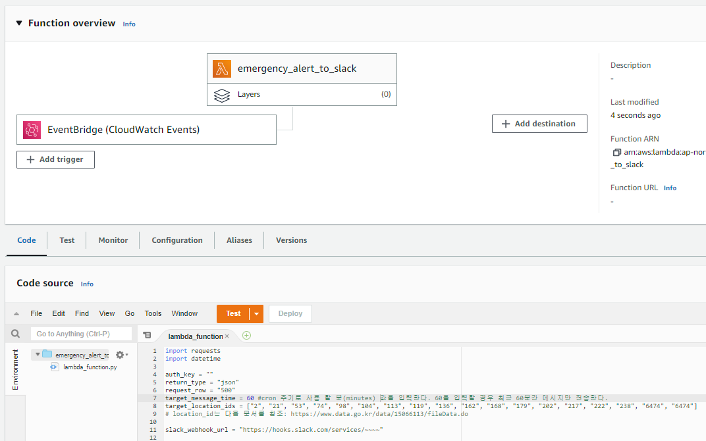
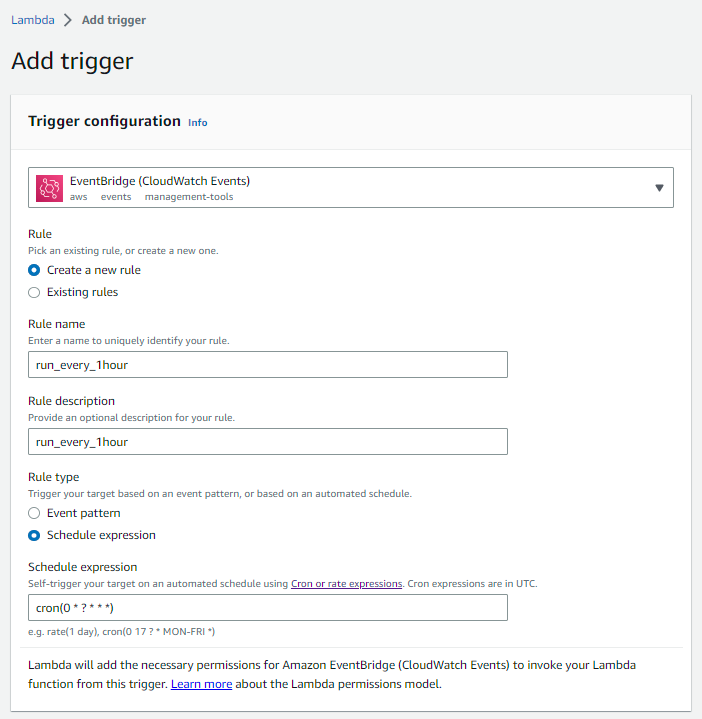
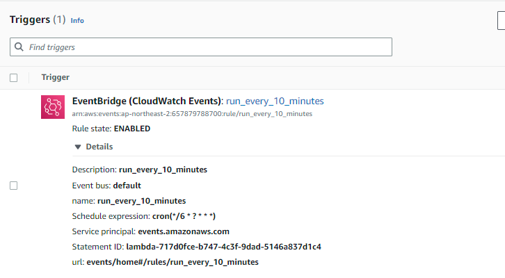
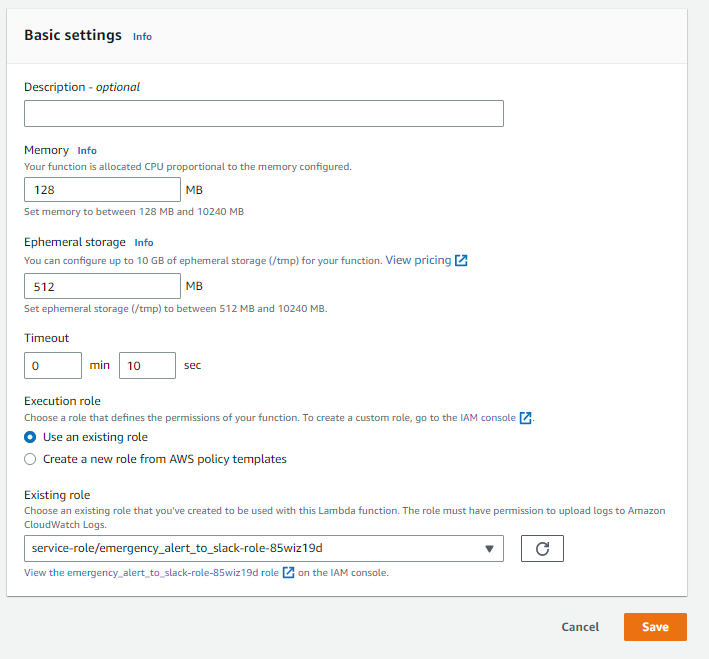

# 재난안전문자 API 활용하기

## 목적
재난문자 발생 시점마다 트래픽이 튀어서 광범위로 발송되는 재난문자 발생 시점 파악이 필요했습니다.
때문에 재난문자 발생 시 Slack으로 알람을 쏴주도록 구성해보았습니다

## 절차
1. 아래 사이트에서 재난문자 발생 내역으 확인할 수 있습니다<br>
   https://www.safekorea.go.kr/idsiSFK/neo/sfk/cs/sfc/dis/disasterMsgList.jsp?menuSeq=679

2. 아래 공공데이터 포털에서 재난문자 API 사용신청 후 인증키를 수령합니다<br>
   https://www.data.go.kr/iim/api/selectAPIAcountView.do

3. API를 호출하고 Slack으로 메세지를 발송해주는 코드를 작성합니다
```python title="emergency_alert_to_slack.py" linenums="1"
import requests
import datetime

auth_key = ""
return_type = "json"
request_row = "500"
target_message_time = 60 #cron 주기로 사용 할 분(minutes) 값을 입력한다. 60을 입력할 경우 최근 60분간 메시지만 전송한다.
target_location_ids = ["2", "21", "53", "74", "98", "104", "113", "119", "136", "162", "168", "179", "202", "217", "222", "238", "6474", "6474"]
# location_id는 다음 문서를 참조: https://www.data.go.kr/data/15066113/fileData.do 

slack_webhook_url = "https://hooks.slack.com/services/~~~~"

def load_messages() -> list: 
    """
    https://www.safekorea.go.kr/idsiSFK/neo/sfk/cs/sfc/dis/disasterMsgList.jsp?menuSeq=679 의 데이터 호출하는 함수
    https://www.data.go.kr/data/3058822/openapi.do API 사용
    auth_key: 이정원 계정의 인증키
    """
    r = requests.get(f'http://apis.data.go.kr/1741000/DisasterMsg3/getDisasterMsg1List?ServiceKey={auth_key}&type={return_type}&numOfRows={request_row}')
    return r.json()["DisasterMsg"][1]["row"]

def time_str_to_obj(time_str: str) -> object:
    """
    string type으로 제공되는 날짜데이터를 datetime object로 변환한다
    """
    time_obj = datetime.datetime.strptime(time_str, "%Y/%m/%d %H:%M:%S") #공공데이터 time format을 datetime object format으로 변환
    return time_obj

def time_kst_to_utc(time_obj: object) -> object:
    """
    KST datetime object를 입력받아 UTC datetime object를 리턴
    """
    time_obj += datetime.timedelta(hours = -9) # KST -> UTC 연산
    return time_obj

def check_message_time(message_time: object) -> bool:
    """
    target_message_time 변수값을 참조하여 지난 몇 분 사이에 생성된 메세지가 맞는지 검증한다 (timeWindow filtering)
    """
    if datetime.datetime.now() - datetime.timedelta(minutes = target_message_time) < message_time:
        return True
    return False

def check_location_id(location_id: str) -> bool:
    """
    location_id가 target_location_ids 리스트 내에 존재하는 경우에만 메세지 발송
    """
    if location_id in target_location_ids:
        return True
    return False

def send_slack_message(message: dict) -> None:
    """
    slack webhook을 이용해 slack channel로 메세시 발신하는 함수
    backslash parsing때문에 코드가 좀 어지럽습니다
    참고: chr92 = backslash
    """
    kst_time = time_str_to_obj(message['create_date'])
    utc_time = time_kst_to_utc(kst_time)

    if check_message_time(kst_time) & check_location_id(message["location_id"]):
        kst_msg = f"KST: {kst_time}"
        utc_msg = f"UTC: {utc_time}"
        location_msg = f"발송지역: {message['location_name']}"
        emergency_msg = message["msg"].replace("\n", "")
        payload={
            "text": f"{kst_msg} | {utc_msg} {chr(92)}n{location_msg} {chr(92)}n {emergency_msg}".replace("\\n", "\n")
        }
        requests.post(slack_webhook_url, json=payload)

def main():
    messages = load_messages()
    for message in messages:
        send_slack_message(message)
    
main()
```

4. AWS Lambda에 함수를 생성하고 코드를 주입합니다
    

5. AWS Lambda를 매 시간마다 실행합니다
    
    

6. API 에러율이 너무 높습니다
    
    
    !!! warning
        희한하게 API 호출 성공률이 낮습니다. 3번 실행하면 2번은 실패?
        때문에 Lambda 설정에서 코드 재실행을 2회까지 허용합니다