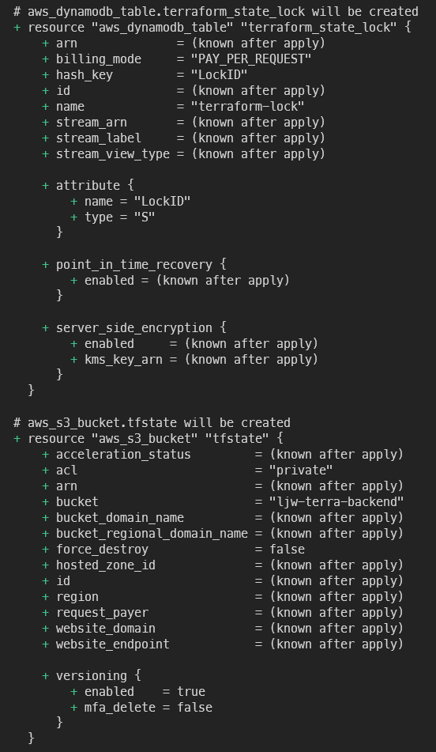

# Terraform Backend


## 목표

---

- Terraform의 Backend 기능을 이용해 state파일을 안전하게 관리해봅니다.
- .tfstate를 로컬이 아닌 S3에 저장하고 DynamoDB를 이용해 파일을 Locking합니다
- Backend를 이용함에 따른 이점
    - Locking
        
        협업시 원격 저장소를 사용하여 여러명이 동시에 같은 state 접근하는것을 막습니다
        
    - Backup
        
        원격저장소에 저장함으로써 데이터 유실을 방지합니다. 특히 S3에 저장하는 방법은 버전관리가 가능한 편리하고 안전한 방법입니다.
        

## Backend 준비

---

1. 작업을 위한 디렉터리를 생성합니다
        
    ``` s
    mkdir init
    cd init
    ```
    
2. 백엔드에 사용할 S3버킷과 DynamoDB 테이블을 생성합니다

    ``` s
    vi init.tf
    ```
        
    ``` terraform title="init.if"
    provider "aws" {
        region = "ap-northeast-2" # Please use the default region ID
        version = "~> 2.49.0" # Please choose any version or delete this line if you want the latest version
    }

    # S3 bucket for backend
    resource "aws_s3_bucket" "tfstate" {
        bucket = "ljw-terra-backend" #Global Unique

        versioning {
        enabled = true # Prevent from deleting tfstate file
        }
    }

    # DynamoDB for terraform state lock
    ######### DO NOT TOUCH #############
    resource "aws_dynamodb_table" "terraform_state_lock" {
        name           = "terraform-lock"
        hash_key       = "LockID"
        billing_mode   = "PAY_PER_REQUEST"

        attribute {
        name = "LockID"
        type = "S"
        }
    }
    ######### DO NOT TOUCH #############
    ```
        
3. plan에 따르면 두 개의 리소스가 생성됨을 안내하고 있습니다
    ```s
    terraform plan
    ```
    
    
    
4. 의도한 바가 맞으니 적용해줍니다
    ```s
    terraform apply
    ```
        
    
    
5. 버킷과 테이블이 잘 생성되었습니다
    
    
    

## Backend 적용

---

1. iam을 제어하는 코드를 백엔드로 관리해봅니다
2. 작업중인 폴더(init)에서 나와서 iam 디렉터리로 이동합니다

    ```s
    cd ../iam
    ```

3. 백엔드로 제어하기 위해 코드를 작성합니다

    ```s
    vi backend.tf
    ```

4. 백엔드로 S3를 사용하고 DynamoDB를 이용해 Lock 할 것을 명시합니다

    ```terraform title="backend.tf"
    terraform {
        backend "s3" {
            bucket         = "ljw-terra-backend"
            key            = "terraform_source/iam/terraform.tfstate"
                        #s3내 경로는 현재 경로와 일치 시키는 것이 관리하기 편리합니다
            region         = "ap-northeast-2"
            encrypt        = true
            dynamodb_table = "terraform-lock"
        }
    }
    ```

5. s3내 경로는 현재 경로와 일치 시키는것이 관리하기 편리합니다
    
    
    
6. 백엔드 설정 후에는 다시 init 하는 과정이 필요합니다

    ```s
    terraform init
    ```
        
    
    
7. 로컬 파일을 S3에 업로드 하는것에 대해 동의여부를 묻습니다. yes
    
    
    
8. 업로드가 완료되면 init을 에러없이 잘 마치게 됩니다
    
    
    
9. 이제 로컬에 있는 tfstate파일들은 쓸모가 없습니다(legacy)
    
    
    
10. 이제 s3에 업로드 된 tfstate파일을 사용하기 떄문입니다
    
    
    
11. 이제 로컬에 tfstate 파일이 없어도 plan이 잘 동작합니다
    
    ```s
    rm -rf terraform.tfstate terraform.tfstate.backup
    terraform plan
    ```
    
    
    
    