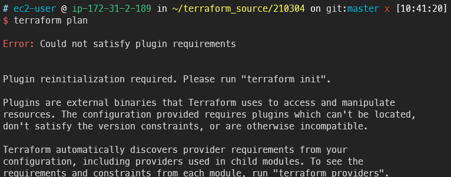

# Terraform deploy VPC and Subnet

## 목표

---

- AWS 서비스의 근간이라고 할 수 있는 VPC부터 IaC를 구현해봅니다
- VPC에 서브넷도 생성해봅니다

## deploy VPC

---

!!! warning
    💡 git 사용시 .terraform 디렉터리를 ignore 처리합니다

1. provider 설정을 분리하여 따로 작성합니다

    ```s
    vi provider.tf
    ```

    ```terraform title="provider.tf"
    provider "aws" {
        region = "ap-northeast-2"
    }
    ```

2. vpc용 테라폼 코드를 작성합니다

    ```s
    vi vpc.tf
    ```

    ```terraform title="vpc.tf"
    resource "aws_vpc" "terra-test" {
            cidr_block = "10.0.0.0/16"
            tags = {
                    Name = "Terraform TEST1"
            }
    }
    ```
    
3. 테라폼 플랜을 실행합니다

    ```s
    terraform plan
    ```
    
4. 당연히 init을 하지 않으면 진행할 수 없습니다
    
    
    
5. 테라폼 시작을 선언합니다

    ```s
    terraform init
    ```
        
6. 테라폼이 AWS를 컨트롤 할 수 있는 플러그인을 다운로드 합니다
    
    
    
7. 다시 plan을 시작합니다

    ```s
    terraform plan
    ```

8. 현재 작성된 테라폼 코드에 따르면 아래와 같이 인프라가 생성된다는 예상 결과를 보여줍니다
    
    
    
9. 본격적으로 AWS에 인프라 생성을 시작합니다

    ```s
    terraform apply
    ```
    
10. 경고창이 뜨면 yes를 입력합니다
    
    
    
11. 인프라 생성에 성공하였고
한 개의 리소스(여기선 terra-test라는 VPC)가 생성되었음을 안내합니다
    
    
    
12. AWS 콘솔에서 해당 VPC와 CIDR을 직접 확인할 수 있습니다
    
    
    

## deploy Subnet

---

1. 이제 서브넷을 추가합니다. 
    
    파일을 따로 분리할 수 있지만 일단 보기 편하게 vpc코드에 이어서 작업합니다
    
    - 서브넷을 생성할 때 VPC를 지정하려면 변수를 넣는 것 처럼 aws_vpc.{NAME}.id 형태로 작성할 수 있습니다
    
    ```s
    vi vpc.tf
    ```

    ```terraform title="vpc.tf"
    resource "aws_vpc" "terra-test" {
            cidr_block = "10.0.0.0/16"

            tags = {
                    Name = "Terraform TEST1"
            }
    }

    resource"aws_subnet" "public01" {
            vpc_id = aws_vpc.terra-test.id
            cidr_block = "10.0.0.0/24"
            availability_zone = "ap-northeast-2a"

            tags = {
                    Name = "terra-public-01-subnet"
            }
    }

    resource "aws_subnet" "private01" {
            vpc_id = aws_vpc.terra-test.id
            cidr_block = "10.0.1.0/24"

            tags = {
                    Name = "terra-private-01-subnet"
            }
    }
    ```
    
1. 테라폼 플랜을 이용해 잘 작성했는지 체크합니다
 
    ```s
    terraform plan
    ```
    
3. 현재 코드에 3개의 리소스(VPC, public subnet, private subnet)이 작성되어있지만
    
    VPC는 아까 만들었기 때문에 2개가 추가된다고 안내하고 있습니다
    
    AZ를 선택하지 않은 서브넷은 아무데나 만들어집니다
    
    
    
4. AWS 인프라에 적용해봅니다
    
    ```s
    terraform apply
    ```

5. 금방 생성됩니다

    
    
6. 콘솔에서 확인해보면 잘 생성된 것을 확인할 수 있습니다
    
    
    
7. 다음 명령을 이용하면 현재 생성된 리스트를 볼 수 있습니다
    
    ```s
    terraform state list
    ```

    
    
