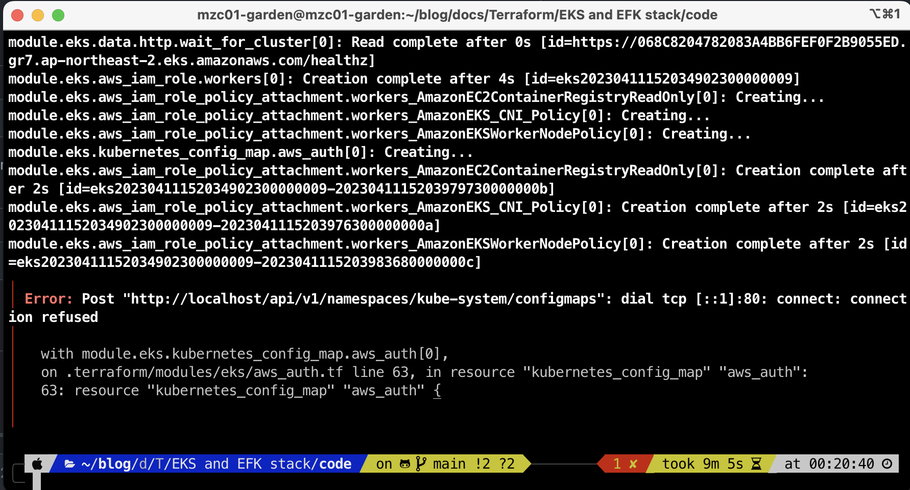

# deploy EKS and EFK

## Error
- 증상
```s
 Error: Post "http://localhost/api/v1/namespaces/kube-system/configmaps": dial tcp [::1]:80: connect: connection refused
│
│   with module.eks.kubernetes_config_map.aws_auth[0],
│   on .terraform/modules/eks/aws_auth.tf line 63, in resource "kubernetes_config_map" "aws_auth":
│   63: resource "kubernetes_config_map" "aws_auth" {
```
- 원인
missing roles/permissions in your aws-auth configmap [참조](https://docs.aws.amazon.com/ko_kr/eks/latest/userguide/add-user-role.html)

