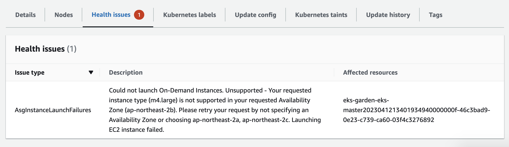
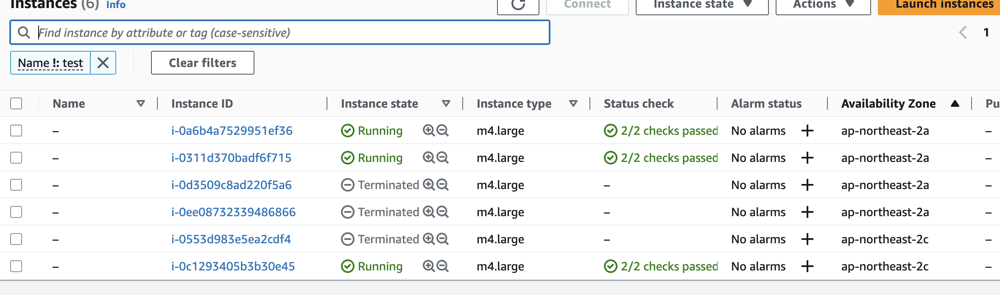

# deploy EKS and EFK

## 주의할 점
1. node instance type을 명시하지 않을경우 m4.large가 provision된다
2. 각 AZ에서 사용자가 요청한 인스턴스타입을 지원하지않는 경우, 해당 인스턴스타입을 지원하는 타 AZ에 추가 provisioning하여 desired capacity를 맞추려 한다. Seoul지역 b-AZ에서 m4.large 인스턴스를 지원하지 않아 b-AZ의 할당량이 a-AZ와 c-AZ에 배포되었다.
  
  
3. 아래 에러를 해결하기 위해 kubernetes.tf 파일을 추가하였다
  ```s
  Error: Post "http://localhost/api/v1/namespaces/kube-system/configmaps": dial tcp [::1]:80: connect: connection refused
  ```
4. 


## EKS클러스터 배포 Terraform 코드

```terraform title="provider.tf"
provider "aws" {
  region = "ap-northeast-2"
}

terraform {
  required_providers {
    aws = {
      source  = "hashicorp/aws"
      version = "~> 3.0"
    }
  }
}
```

```terraform title="vpc.tf"
module "vpc" {
  source  = "terraform-aws-modules/vpc/aws"
  version = "3.0.0"

  name = "eks-vpc"
  cidr = "10.0.0.0/16"

  azs             = ["ap-northeast-2a", "ap-northeast-2b", "ap-northeast-2c"]
  private_subnets = ["10.0.1.0/24", "10.0.2.0/24", "10.0.3.0/24"]
  public_subnets  = ["10.0.101.0/24", "10.0.102.0/24", "10.0.103.0/24"]

  enable_nat_gateway = true
  single_nat_gateway  = true

  tags = {
    Terraform = "true"
    Project   = "EKS"
  }
}
```

```terraform title="eks.tf"
module "eks" {
  source  = "terraform-aws-modules/eks/aws"
  version = "17.0.0"

  cluster_name = "garden-eks"
  cluster_version = 1.26
  subnets      = module.vpc.private_subnets

  tags = {
    Terraform = "true"
    Project   = "EKS"
  }

  vpc_id = module.vpc.vpc_id

  node_groups_defaults = {
    ami_type  = "AL2_x86_64"
    disk_size = 30
    instance_type = "t3.micro" 
  }

  node_groups = {
    master = {
      desired_capacity = 1
      max_capacity     = 3
      min_capacity     = 1
    }
    data = {
      desired_capacity = 3
      max_capacity     = 3
      min_capacity     = 3
    }
  }
}
```

```terraform title="kubernetes.tf"
/*
https://github.com/terraform-aws-modules/terraform-aws-eks/issues/2009
The following 2 data resources are used get around the fact that we have to wait
for the EKS cluster to be initialised before we can attempt to authenticate.
*/

data "aws_eks_cluster" "default" {
  name = module.eks.cluster_id
}

data "aws_eks_cluster_auth" "default" {
  name = module.eks.cluster_id
}

provider "kubernetes" {
  host                   = data.aws_eks_cluster.default.endpoint
  cluster_ca_certificate = base64decode(data.aws_eks_cluster.default.certificate_authority[0].data)
  token                  = data.aws_eks_cluster_auth.default.token
}
```


## Error
- 증상
```s
 Error: Post "http://localhost/api/v1/namespaces/kube-system/configmaps": dial tcp [::1]:80: connect: connection refused
│
│   with module.eks.kubernetes_config_map.aws_auth[0],
│   on .terraform/modules/eks/aws_auth.tf line 63, in resource "kubernetes_config_map" "aws_auth":
│   63: resource "kubernetes_config_map" "aws_auth" {
```
- 원인
missing roles/permissions in your aws-auth configmap [참조](https://docs.aws.amazon.com/ko_kr/eks/latest/userguide/add-user-role.html)


