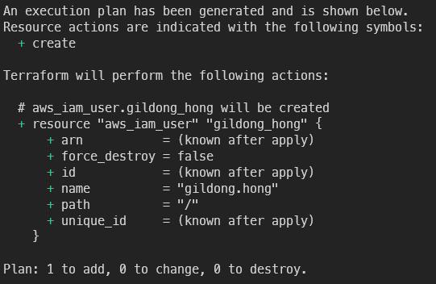

# Terraform AWS IAM

## IAM User

---

1. IAM 작업 디렉터리를 생성합니다

    ```s
    mkdir iam
    cd iam
    ```
    
2. 이제 자연스럽게 provider를 먼저 생성합니다
    
    다만 IAM서비스는 리전에 종속되는 서비스가 아닌 만큼 아무 리전이나 지정해도 됩니다

    ```s
    vi provider.tf
    ```

    ```terraform title="provider.tf"
    provider "aws"{
            region = "ap-northeast-2"
    }
    ```
    
3. IAM을 코딩하기 위한 파일을 생성합니다
    
    ```s
    vi iam.tf
    ```
    
4. gildong.hong 유저를 생성하는 코드를 작성했습니다

    ```terraform title="iam.tf"
    resource "aws_iam_user" "gildong_hong" {
            name = "gildong.hong"
    }
    ```

5. 테라폼 사용을 선언합니다

    ```s
    terraform init
    ```
    
6. plan을 실행하면 문제가 없음을 확인할 수 있습니다

    ```s
    terraform plan
    ```

    
    
7. 유저가 잘 생성되었다고 합니다
    
    
    
8. IAM 콘솔에서 생성된 유저를 확인할 수 있습니다
    
    
    
9. 하지만 현재 홍길동 유저는 패스워드가 없기 때문에 콘솔에 접속할 수 없습니다
비밀번호와 MFA는 콘솔 또는 AWS CLI를 통해 직접 설정해야 합니다
테라폼을 이용해 비밀번호를 생성할 수도 있지만 그렇게되면 코드에 패스워드를 넣어야해서 보안이 매우 취약해집니다
    
    [IAM 사용자의 초기 암호 설정](https://docs.aws.amazon.com/ko_kr/cli/latest/userguide/cli-services-iam-set-pw.html)
    

## IAM Group

---

1. 순서는 그룹 생성 → 멤버십 생성 → '멤버십을 그룹에 연결' 입니다
2. 그룹 생성 코드 작성을 시작합니다
    
    ```s
    vi user_group.tf
    ```

3. 코드 내용을 다음처럼 필수요소만 넣어줍니다
    
    ```terraform title="user_group.tf"
    resource "aws_iam_group" "test_group"{
            name = "terra_group"
    }
    ```

4. plan해보고 문제 없으면 바로 apply 합니다
    
    
    
    ```s
    terraform plan
    terraform apply
    ```

5. 에러없이 잘 생성되었습니다
    
    
    
6. 콘솔에서도 방금 만든 따끈한 그룹을 찾을 수 있습니다
    
    
    
7. 이번엔 그룹에 유저를 추가해봅니다

    ```s
    vi user_group.tf
    ```
    
8. 코드는 다음과 같은 형태가 됩니다
        
    ```terraform title="user_group.tf"
    resource "aws_iam_group" "test_group"{
            name = "terra_group"
    }

    resource "aws_iam_group_membership" "terra_group"{
            name = aws_iam_group.test_group.name

            users = [
                    aws_iam_user.gildong_hong.name
            ]

            group = aws_iam_group.test_group.name
    }
    ```
    
9. plan에 문제가 없으니 바로 apply 합니다
    
    
    
10. 그룹 멤버십이 잘 적용되었습니다
    
    
    
11. 홍길동이 그룹에 잘 가입되었습니다
    
    
    

## IAM Role

---

1. 역할생성은 다음 순서로 진행됩니다
    - 역할 생성 → 정책 생성 → 역할과 정책 매핑
    - 총 3개의 리소스로 이뤄집니다
2. 'hello' 이름을 가지는 역할생성을 시작합니다

    ```
    vi iam_role_hello.tf
    ```

3. 역할 설정 코드는 권한 정책이 포함됩니다
    
    ```terraform title="iam_role_hello.tf"
    resource "aws_iam_role" "hello" {
            name                    = "hello-iam-role"
            path                    = "/"
            assume_role_policy      = <<EOF
    {
            "Version" : "2012-10-17",
            "Statement" : [
            {
            "Sid" : "",
            "Effect" : "Allow",
            "Principal" : {
                    "Service" : "ec2.amazonaws.com"
            },
            "Action" : "sts:AssumeRole"
            }
            ]
    }
    EOF
    }
    ```

4. plan은 성공적으로 마쳤습니다
    
    
    
5. 바로 apply 진행합니다

    ```s
    terraform apply
    ```

6. 역할이 잘 생성되었습니다
    
    
    
7. 콘솔에서 역할에 권한이 부여된 것을 확인할 수 있습니다
    
    
    
8. edit trust relationship을 클릭하면 정책을 JSON으로 확인할 수 있습니다
    
    
    
9. 이번에는 Permission을 추가해봅니다

    ```s
    vi iam_role_hello.tf
    ```
    
10. 다음 내용을 추가합니다
    
    정책을 만든 후 Role에 매핑하는 구조가 됩니다

    ```terraform title="iam_role_hello.tf"
    resource "aws_iam_role_policy" "hello_s3"{
        name   = "hello-s3-download"
        role   = aws_iam_role.hello.id
        policy = <<EOF
    {
        "Statement" : [
            {
                "Sid" : "AllowAppArtifactsReadAccess",
                "Action" : [
                    "s3:GetObject"
                ],
                "Resource" : [
                "*"
                ],
                "Effect" : "Allow"
            }
            ]
    }
    EOF
    }

    resource "aws_iam_instance_profile" "hello"{
            name = "hello-profile"
            role = aws_iam_role.hello.name
    }
    ```
    
11. plan에서 정책이 잘 추가되면 apply 진행합니다
    
    
    
12. 권한이 잘 붙은것을 콘솔에서 확인할 수 있습니다
    
    
    
13. Iam_instance_profile 리소스는 다음 역할을 수행합니다
    
    !!! tip
        💡 IAM 역할을 위한 컨테이너로 인스턴스 시작시 EC2에 역할 정보 전달에 사용한다
        EC2에 IAM Role을 할당하려면 이 리소스가 필요한, 테라폼만의 특징입니다


## IAM Policy

---

1. AWS가 제공하는 Policy가 매우 많지만, 그래도 Customer가 직접 컨트롤 하는 것이 타이트한 권한 관리가 가능하기 때문에 이를 권장합니다
2. 따라서 이번엔 홍길동 유저에게 Customer Managed 권한을 부여해봅니다

    ```
    vi iam.tf
    ```

3. 다음 코드를 추가합니다
    
    IAM user에 할당할 super-admin이라는 policy를 추가했습니다

    ```terraform title="iam.tf"
    resource "aws_iam_user_policy" "art_devops_black" {
        name  = "super-admin"
        user  = aws_iam_user.gildong_hong.name

        policy = <<EOF
    {
        "Version": "2012-10-17",
        "Statement": [
            {
                "Effect": "Allow",
                "Action": [
                    "*"
                ],
                "Resource": [
                    "*"
                ]
            }
        ]
    }
    EOF
    }
    ```

4. 테라폼에서 plan은 좋은 습관입니다
    
    
    
5. 이상 없으면 바로 적용해봅니다
    
    ```s
    terraform apply
    ```
        
6. 홍길동에게 super-admin 정책이 잘 붙었습니다
    
    
    
7. 그룹정책을 설정할 때는 aws iam user policy 대신 aws_iam_group_policy를 설정합니다
    
    ```s
    aws_iam_group_policy
    ```
    

## EC2-Role

---

1. EC2에 키를 직접 보관하는것을 보안상 좋지 않기 때문에 EC2에 역할을 할당해 쓰는것이 권장됩니다
2. 다음 명령을 쓰면 AK, SK가 그대로 노출되는것을 볼 수 있습니다
        
    ```s
    cat ~/.aws/credentials
    ```

3. 따라서 이 값을 모두 삭제하고

    ```s
    rm -rf ~/.aws/credentials
    ```

4. 권한이 잘 제거되었습니다
    
    
    
5. ec2 콘솔에서 역할 설정을 클릭합니다
    
    
    
6. 아까 만든 hello profile을 적용합니다
    
    
    
7. 이로써 인스턴스에 키를 보관하지 않고 안전하게 권한이 잘 부여되었습니다
    
    
    
- 디렉터리 내 현재까지 작성된 모든 리소스를 보고 싶으면 다음 명령으로 조회할 수 있습니다

    ```s
    terraform state list
    ```


## Link

---

- 반드시 읽어볼 것

[정책 평가 로직](https://docs.aws.amazon.com/ko_kr/IAM/latest/UserGuide/reference_policies_evaluation-logic.html)

