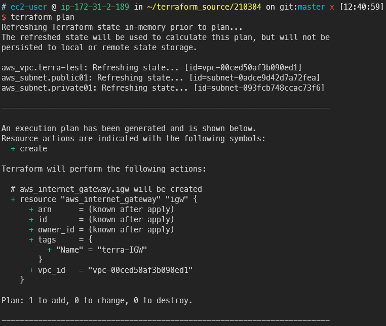

# Terraform deploy VPC

## 목표

---

- 서브넷이 public인지 private인지 결정하는 것은 IGW유무입니다
- terraform을 이용해 IGW와 NAT Gateway를 생성봅니다
- 네트워크 트래픽의 Destination을 알려주는, 이정표 역할을 하는 라우팅 테이블을 작성합니다
- 라우트테이블은 생성 후 association(=매핑)을 진행합니다. Terraform으로 이를 구현해봅니다

## deploy IGW, NAT

---

1. 이전에 작성했던 vpc.tf에 이어서 작업합니다
    
    ```s
    vi vpc.tf
    ```

    ```terraform title="vpc.tf" linenums="1"
    resource "aws_internet_gateway" "igw" {
    vpc_id = aws_vpc.terra-test.id

    tags = {
        Name = "terra-IGW"
    }
    }
    ```
    
2. 작성했으면 플랜 명령으로 확인합니다
    
    ```s
    terraform plan
    ```
    
3. 플랜으로 확인한 예상작업이 의도한대로 IGW를 추가합니다
    
    
    
4. 인프라에 적용합니다

    ```s
    terraform apply
    ```
    
5. 이어서 NAT Gateway를 한 개 작성합니다
    
    NAT Gateway는 EIP가 필요하기 때문에 반드시 같이 작성합니다
    
    NAT Gateway는 public 서브넷에 존재해야 함을 생각하고 작성합니다

    ```s
    vi VPC.tf
    ```

    ```terraform title="vpc.tf" linenums="1"
    resource "aws_eip" "terraEIP" {
    vpc = true

    lifecycle {
        create_before_destroy = true
    }
    }

    resource "aws_nat_gateway" "nat" {
    allocation_id = aws_eip.terraEIP.id

    subnet_id = aws_subnet.private01.id

    tags = {
        Name = "terra_NAT"
    }
    }
    ```

6. terraform plan을 이용하면 이번에도 잘 작성되었습니다
    
    
    
7. 바로 적용합니다. 다만 NAT Gateway 생성은 다른 리소스에 비해 많은 시간이 소모됩니다

    ```s
    terraform apply
    ```
    
    
    
8. NAT Gateway가 잘 생성된 것을 콘솔에서도 확인할 수 있습니다
    
    
    
9. NAT Gateway는 존재만으로도 비용이 발생하기 떄문에 사용하지 않으면 바로 삭제합니다
10. 테라폼에서 생성한 인프라를 전부 날리는 명령어는 다음과 같습니다

    ```s
    terraform destroy
    ```
    
11. NAT Gateway만 삭제하려는 경우 NAT Gateway를 주석처리하고 업데이트 하면 됩니다

    ```s
    terraform apply
    ```
    

## build Route-table

---

1. 바로 코드 수정에 들어갑니다

    ```s
    vi vpc.tf
    ```

2. 두 개의 라우팅 테이블을 작성합니다

    ```terraform title="vpc.tf" linenums="1"
    resource "aws_route_table" "public"{
    vpc_id = aws_vpc.terra-test.id

    tags = {
        Name = "terra_public_rt"
    }
    }

    resource "aws_route_table" "private"{
    vpc_id = aws_vpc.terra-test.id

    tags = {
        Name = "terra_private_rt"
    }
    }
    ```

    
    
3. plan 해보고 문제 없으면 바로 생성합니다

    ```s
    terraform apply
    ```

4. 잘 생성되었습니다
    
    
    

## Association

---

1. 이제 어소시에이션을 시작합니다

    ```s
    vi vpc.tf
    ```

2. 어소시에이션을 작성합니다
    
서브넷id와 라우팅테이블id가 필요합니다

    ```terraform title="vpc.tf" linenums="1"
    resource "aws_route_table_association" "public_association"{
    subnet_id = aws_subnet.public01.id
    route_table_id = aws_route_table.public.id
    }

    resource "aws_route_table_association" "private_association" {
    subnet_id = aws_subnet.private01.id
    route_table_id = aws_route_table.private.id
    }
    ```

3. plan에 문제가 없으면 바로 생성을 시작합니다
    
    
    
4. 생성쓰

    ```s
    terraform apply
    ```

5. 라우팅테이블이 서브넷에 각각 알맞게 매핑되었습니다
    
    
    
    
    

## make Routing Rule

---

1. 일단 여기다 그냥 작성합니다

    ```s
    vi vpc.tf
    ```

2. 퍼블릭용 라우팅테이블 내에서 라우팅을 선언할 수도 있습니다(inner rule)

    ```terraform title="vpc.tf" linenums="1"
    route { 
    cidr_block = "0.0.0.0/0"
    gateway_id = aws_internet_gateway.igw.id
    }
    ```

    
    
3. 콘솔에서 Public Routing table에 IGW가 연결된 것을 확인할 수 있습니다
    
이제 public subnet은 인터넷 사용이 가능해졌습니다


4. 이번엔 inner rule이 아닌 바깥에서 rule을 생성합니다

    ```s
    vi vpc.tf
    ```

5. 다음과 같이 private route table에 NAT 게이트웨이를 부착합니다

    ```terraform title="vpc.tf" linenums="1"
    resource "aws_route" "private_nat" {
    route_table_id = aws_route_table.private.id
    destination_cidr_block = "0.0.0.0/0"
    nat_gateway_id = aws_nat_gateway.nat.id
    }
    ```

6. plan후 잘 작성되었으면 바로 apply 합니다
    
    
    
7. private route table에 NAT 게이트웨이가 잘 붙었습니다
    
    
    
