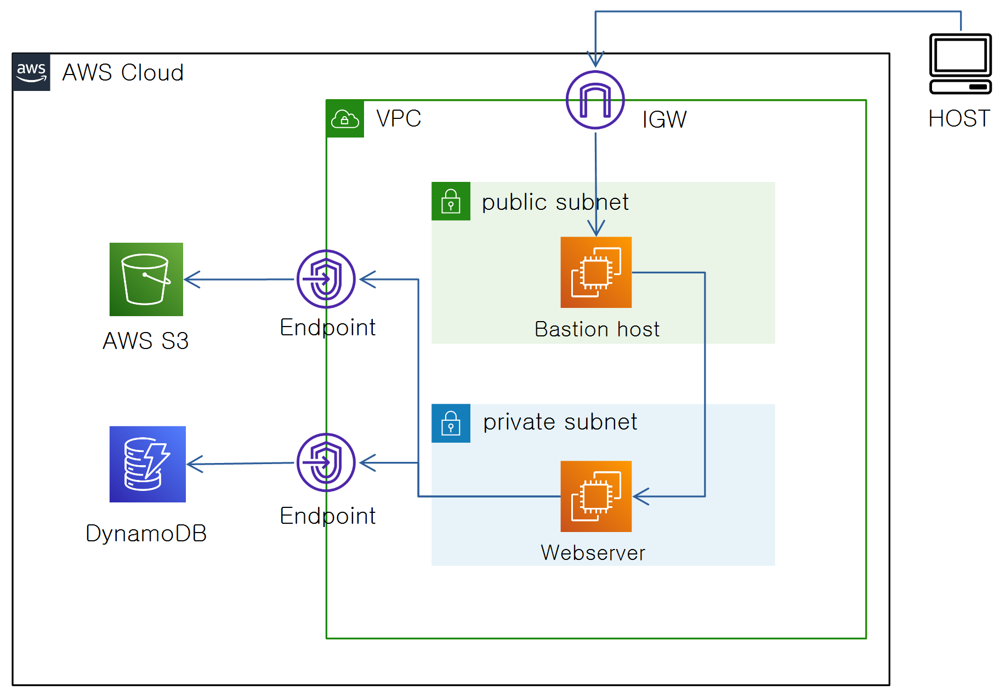

# VPC Endpoint with Role


## 목표

---

- Bastion Host를 이용한 Private Network의 웹 서버 접속
- Endpoint를 이용해 게이트웨이 없이 VPC에서 S3, DynamoDB 접속
- Credential이 아닌 Role을 이용한 권한적용으로 보안성 확보

## 구성도

---



## 실습

---

1. AWS IAM에서 CLI용 계정 생성
    
    
    
    권한은 아무것도 주지 않았습니다
    
2. 계정 설정에서 Access Key를 생성합니다
    
    
    
3. 생성된 Access Key 와 Secret access key를 잘 보관합니다
    
    
    
4. Bastion Host 에 SSH 접속
    
    
    
5. SSH를 한 번 더 사용하여 Private 네트워크에 있는 웹 서버에 접속합니다
    
    
    
6. 다음 명령을 사용해 AWS Boto가 정상 작동하는 것을 확인합니다

    ```s
    aws --version // aws boto 버전 확인
    ```
    
    
    
7. 다음 명령을 사용해 aws CLI에 로그인 할 계정 정보를 입력합니다
    
    앞서 3번에서 생성된 키값과 리전을 입력해줍니다. 서울 리전은 ap-northeast-2입니다.
    
    Output format은 JSON 입력하였습니다

    ```s
    aws configure
    ```
    
    
    
8. 라우팅 경로가 없어 접속이 불가능 한 상태입니다
    
    
    
9. 웹 서버 서브넷의 라우팅 상태입니다. 연결된 게이트웨이가 없어 현재 텅텅 비어있습니다.
    
    
    
10. VPC에 S3와 DynamoDB로 향하는 Endpoint를 각각 생성해줍니다
    
    
    
    Name tag : EP-for-S3
    
    
    
    Name tag : EP-for-DynamoDB
    
11. private 서브넷의 Route Table을 확인하면 엔드포인트 2개가 연결된 것을 확인할 수 있습니다
    
    
    
12. S3 ↔ VPC ↔ DynamoDB간의 연결이 완료되었으니 
    
    다음 명령을 사용해 권한 부족으로 S3, DynamoDB 접속이 거부되는 것을 확인합니다

    ```s
    aws s3 ls // S3 목록 보기
    aws dynamodb list-tables // DynamoDB 목록 보기
    ```

    
    
13. AWS IAM → Roles 에서 새로운 Role 을 생성합니다
    
    현재 Bastion Host는 AWS EC2 Instance 이므로 아래와 같이 설정합니다
    
    
    
14. S3와 DynamoDB Full Access 권한을 부여합니다
    
    
    
    
    
15. 최종적으로 아래와 같은 설정이 됩니다
    
    
    
16. EC2 인스턴스 Actions에서 Role Modify에 진입합니다
    
    
    
17. 방금 만든 역할을 선택해주면 됩니다
    
    
    
18. SSH로 돌아와보면 웹 서버는 여전히 권한이 없습니다. 
    
    
    
19. 권한 우선순위는 Credential이 Role보다 높기 떄문에
    
    웹 서버 Credential을 지워서 Role을 적용합니다

```
rm ~/.aws/credentials
```
    
    
    
20. 다시 시도해보면 S3와 DynamoDB에 접속을 성공하게 됩니다.
    
    
    
21. 메타데이터 확인을 통해 Role설정을 조회할 수 있습니다
    
    
    
22. 다음 명령으로 S3 버킷도 만들어 봅니다
    
    ```s
    aws s3 mb s3://mybucket
    ```

23. 다음 명령으로 DynamoDB 테이블도 만들어 봅니다

    ```s
    aws dynamodb create-table \
        --table-name Music \
        --attribute-definitions \
            AttributeName=Artist,AttributeType=S \
            AttributeName=SongTitle,AttributeType=S \
        --key-schema \
            AttributeName=Artist,KeyType=HASH \
            AttributeName=SongTitle,KeyType=RANGE \
        --billing-mode PAY_PER_REQUEST \
        --stream-specification StreamEnabled=true,StreamViewType=NEW_AND_OLD_IMAGES \
        --region us-east-2
    ```

    [자습서: 전역 테이블 생성](https://docs.aws.amazon.com/ko_kr/amazondynamodb/latest/developerguide/V2globaltables.tutorial.html)
    
