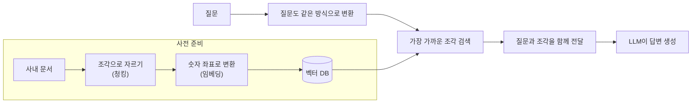
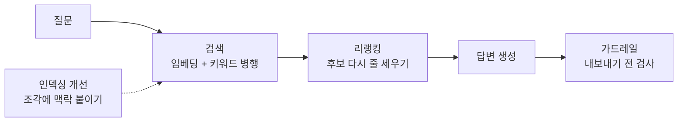
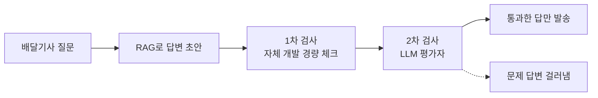
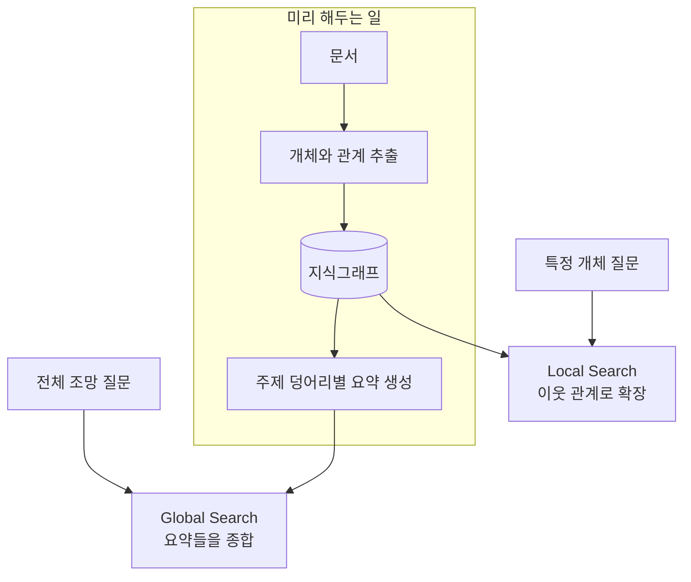
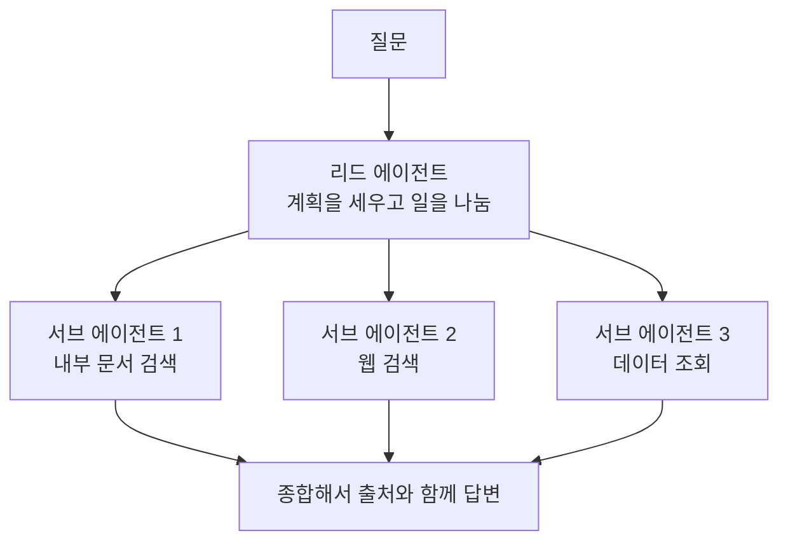
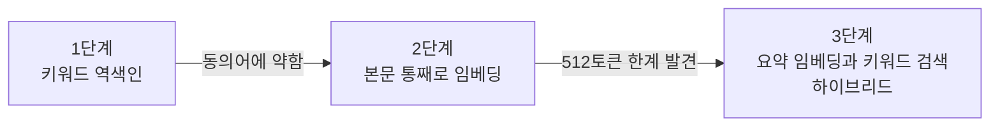
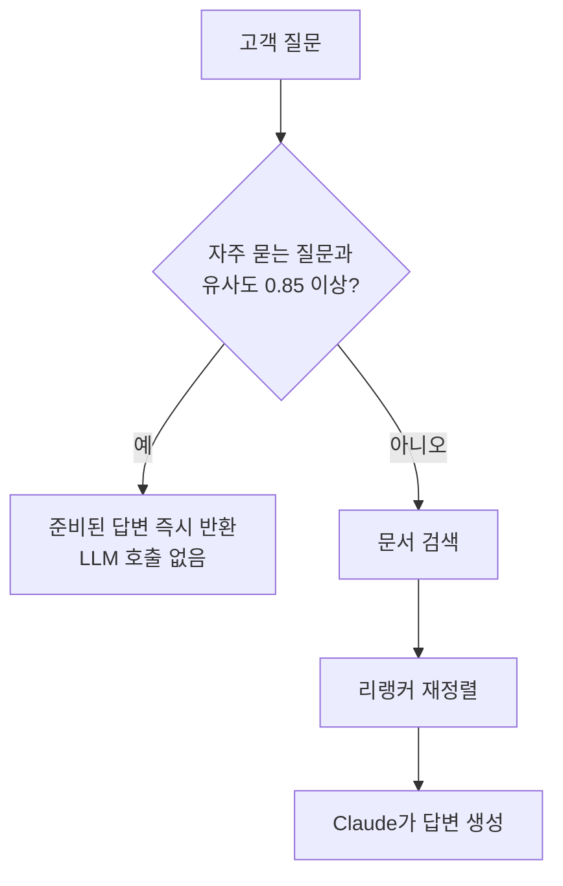
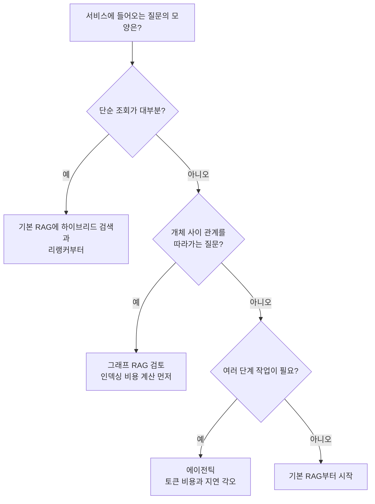

# RAG 공부 기록: 기업들이 실제로 쓰는 것만 모았다

회사 문서를 챗GPT에게 물어보면 왜 엉뚱한 답이 나올까. LLM은 학습 때 본 것만 알고, 우리 회사 위키 같은 건 본 적이 없기 때문이다. 모른다고 하면 차라리 나은데, 그럴듯하게 지어내기까지 한다. 이걸 환각이라고 부른다.

그래서 나온 방법이 RAG다. Retrieval Augmented Generation. 답하기 전에 관련 자료를 먼저 찾아와서 모델 손에 쥐여주는 방식이다. 암기 시험을 오픈북 시험으로 바꾼다고 생각하면 된다.

공부를 시작해 보니 종류가 끝이 없었다. 논문까지 전부 따라가는 건 무리라서 기준을 하나 세웠다. 기업이 실제 서비스에 붙이고 결과를 공개한 것만 본다. 이 글은 그 기록이다.

<!-- more -->

!!! note "읽기 전에"
    본문에 링크한 자료는 전부 원문을 직접 열어 수치까지 대조하고 실었다. 원문이 목표치나 예상치로만 밝힌 숫자는 여기서도 그렇게 적었고, 판매사 자료는 판매사 자료라고 밝혔다.

## RAG의 기본 구조부터

용어부터 정리하고 시작하는 게 나았다. 문서를 통째로 모델에 넣을 수 없으니 조각으로 자른다. 이게 청킹이다. 각 조각은 임베딩이라는 과정을 거쳐 숫자 좌표로 바뀌는데, 비슷한 뜻의 문장일수록 좌표가 가깝게 배치된다. 이 좌표들을 모아두고 가까운 것을 빨리 찾아주는 창고가 벡터 DB다. 질문이 들어오면 질문도 같은 방식으로 좌표로 바꾸고, 가장 가까운 조각 몇 개를 찾아 질문과 함께 모델에게 건넨다.

이 구조 그대로 서비스를 만든 회사가 실제로 있다. [우아한형제들 테크교육개발팀은 DB, 구글 드라이브, 구글 캘린더에 흩어진 교육 운영 정보를 한 번에 찾으려고 이 뼈대의 검색봇을 만들었고, 이미 운영 중이던 Redis를 벡터 창고로 재활용했다](https://techblog.woowahan.com/25900/). [SK하이닉스 연구 조직도 OpenSearch를 벡터 DB로 쓰는 같은 골격으로 플랫폼을 구축했다](https://aws.amazon.com/ko/blogs/tech/sk-hynix-rag-platfrom-analysis-evaluation/).

여기까지가 교과서다. 문제는 이 기본형만으로는 부족하다는 걸 회사들이 하나같이 겪었다는 점이다.

## 회사들이 기본형에 덧붙인 것들

사례를 읽을수록 패턴이 보였다. 다들 같은 지점에서 넘어졌고, 넘어진 자리에 비슷한 보강재를 댔다.

### 검색을 두 종류로 한다

임베딩 검색은 뜻이 비슷한 걸 잘 찾지만, 정확한 코드명이나 약어에는 의외로 약하다. 그래서 단어가 그대로 겹치는 문서를 찾는 고전 키워드 검색(BM25 같은)을 나란히 돌리고 결과를 합친다. 하이브리드 검색이라고 부른다.

[우버는 사내 온콜 챗봇 Genie의 답변 품질을 올리면서 벡터 검색 옆에 BM25 검색기를 추가로 붙였고](https://www.uber.com/en-CA/blog/enhanced-agentic-rag/), [드롭박스도 통합 검색 제품 Dash를 어휘 기반 검색과 임베딩 리랭커의 조합으로 만들었다](https://dropbox.tech/machine-learning/building-dash-rag-multi-step-ai-agents-business-users). 국내에서는 컬리가 같은 결론에 도달했는데, 그 과정이 재미있어서 아래 국내 사례에서 따로 적었다.

### 찾은 다음 다시 줄 세운다

검색은 후보를 넉넉히 뽑는 단계고, 그중 진짜 쓸 만한 걸 고르는 건 별도 단계로 두는 게 낫더라는 이야기다. 이 재정렬을 리랭킹이라고 한다.

[에어비앤비는 전화 상담에서 질문 하나에 도움말 문서를 60ms 안에 최대 30건 뽑은 뒤, LLM으로 다시 줄 세워 최상위 문서를 안내한다. 이 시스템을 포함한 개편으로 음성 인식 단어 오류율이 33%에서 약 10%로 내려갔다](https://airbnb.tech/ai-ml/listening-learning-and-helping-at-scale-how-machine-learning-transforms-airbnbs-voice-support-experience/).

### 조각에 맥락을 붙인다

문서를 조각으로 자르면 맥락이 사라진다. "이 조항은 전항의 예외로 한다"라는 조각만 보면 무슨 조항인지 알 길이 없다.

[앤트로픽은 각 조각 앞에 문서 전체에서 이 조각이 어떤 위치인지 설명하는 50~100토큰짜리 문장을 모델로 생성해 붙였다. 이것만으로 상위 20개 검색 실패율이 5.7%에서 3.7%로 35% 줄었고, 키워드 검색까지 결합하면 49%, 리랭킹까지 더하면 67%까지 줄었다](https://www.anthropic.com/engineering/contextual-retrieval). [같은 글에는 자료 전체가 20만 토큰이 안 되면 RAG를 만들지 말고 통째로 프롬프트에 넣어 캐싱하라는 조언도 있다](https://www.anthropic.com/engineering/contextual-retrieval). 작은 규모에서는 검색 시스템 자체가 과투자라는 뜻이라 기억에 남았다. [우아한형제들도 검색 전략으로 이 문맥적 임베딩을 골랐다](https://techblog.woowahan.com/25900/).

### 내보내기 전에 검사한다

정확도를 아무리 올려도 틀린 답은 나온다. 잘 만든 회사들은 생성보다 검사에 공을 들이고 있었다.

[도어대시는 배달기사 지원 챗봇에 자체 개발한 경량 검사와 LLM 평가자로 이어지는 2단계 가드레일을 달고, 검색 정확도와 응답 정확도 등 5개 축으로 품질을 평가한다. 이 장치로 환각을 90%, 심각한 규정 위반 답변을 99% 줄였고 매일 수천 명의 배달기사를 자동 응대한다](https://careersatdoordash.com/blog/large-language-modules-based-dasher-support-automation/).

### 검색 모델 자체를 다시 만든다

여기서 더 나가는 회사도 있다. [깃허브는 Copilot의 코드 검색용 임베딩 모델을 새로 학습시키면서, 비슷해 보이지만 틀린 코드를 일부러 훈련에 섞는 방법을 썼다. 검색 품질이 37.6% 오르고 C# 개발자의 코드 수락률이 110.7% 뛰었는데, 인덱스 메모리는 약 8분의 1로 줄었다](https://github.blog/news-insights/product-news/copilot-new-embedding-model-vs-code/). [핀테크 회사 램프는 산업분류 코드 추천을 임베딩으로 후보를 뽑고 LLM이 고르는 구조로 다시 짰고, 검색 단계 최적화만으로 정답 포함률이 최대 60% 올랐다고 밝혔다](https://builders.ramp.com/post/industry_classification).

## 관계를 묻는 질문에는 그래프

기본형이 유독 못 하는 질문 유형이 있다. "A 거래처 담당자가 속한 팀의 결재 규정은?"처럼 몇 다리를 건너야 답이 나오는 질문이다. 조각 유사도 검색은 다리를 건너지 못한다. 이런 걸 멀티홉 질문이라고 부른다.

그래서 문서에서 개체(사람, 회사, 제품)와 관계(소속, 거래, 참조)를 뽑아 점과 선의 그물로 만들어 두는 접근이 나왔다. 지식그래프다.

[마이크로소프트가 공개한 GraphRAG가 대표 주자다. 문서에서 그래프를 뽑고 주제 덩어리별 요약을 만들어 두는데, 자료 전체를 조망하는 질문은 요약을 종합하는 Global Search로, 특정 개체 질문은 이웃 관계를 따라가는 Local Search로 처리한다](https://microsoft.github.io/graphrag/). [연구 블로그에서는 답변의 포괄성과 다양성에서 기본 RAG를 일관되게 앞섰다고 보고했다](https://www.microsoft.com/en-us/research/blog/graphrag-unlocking-llm-discovery-on-narrative-private-data/).

실제 서비스에 넣어 숫자를 공개한 곳도 있다. [링크드인은 고객지원 티켓을 트리 구조로 풀어 지식그래프로 엮었고, 약 6개월 운영에서 검색이 정답을 위에 올리는 지표(MRR)가 77.6% 좋아지고 문제 해결 시간 중앙값이 28.6% 줄었다고 공개했다](https://arxiv.org/abs/2404.17723). [중국 앤트그룹은 그래프를 결합한 자체 프레임워크 KAG를 전자정부와 헬스케어 QA 실서비스에 적용했다고 밝혔다](https://arxiv.org/abs/2409.13731).

물론 공짜가 아니다. [GraphRAG 공식 저장소에는 1,000페이지 PDF를 인덱싱하는 데 약 120달러가 들었다는 실사용 보고가 올라와 있고](https://github.com/microsoft/graphrag/discussions/440), [한 외부 분석 블로그는 벡터 임베딩으로 5달러도 안 드는 자료가 그래프 파이프라인에서는 50~200달러가 든다고 추정했다](https://www.paperclipped.de/en/blog/graph-rag-production/). 문서에서 개체와 관계를 뽑는 일 자체를 전부 LLM이 하기 때문이다.

효과가 극적으로 갈리는 지점도 확인돼 있다. [그래프 DB를 파는 FalkorDB의 블로그는 Diffbot 벤치마크를 인용해, 질문에 등장하는 개체가 5개를 넘으면 그래프 없는 시스템의 정확도가 0%까지 떨어지는 반면 그래프 쪽은 10개 이상에서도 버텼고, LLM 단독 16.7% 대 그래프 결합 56.2%였다고 전한다](https://www.falkordb.com/blog/graphrag-accuracy-diffbot-falkordb/). 파는 쪽 자료라는 건 감안하고 봐야 한다. 그래도 관계가 얽힌 질문일수록 그래프가 유리하다는 방향 자체는 다른 사례들과 어긋나지 않았다.

## 검색까지 맡기는 에이전틱

여기까지는 사람이 설계한 순서대로 돌아가는 파이프라인이다. 그 순서 자체를 모델에게 맡기면 어떻게 될까. 스스로 계획을 세우고 필요한 도구를 골라 쓰는 LLM을 에이전트라고 부르는데, 검색을 에이전트에게 맡긴 게 에이전틱 RAG다.

[우버 Genie가 이 방향으로 갔다. 검색 전에 질문을 다듬고 문서를 고르는 에이전트 단계를 두고 워크플로를 LangGraph로 짰더니, 수용 가능한 답변이 27% 늘고 부정확한 조언이 60% 줄었다](https://www.uber.com/en-CA/blog/enhanced-agentic-rag/). [드롭박스는 역할을 나눴다. 단순 조회는 RAG가 맡고, 여러 단계가 필요한 작업만 에이전트가 맡는다. 그 결과 질의의 95% 이상이 2초 안에 끝난다](https://dropbox.tech/machine-learning/building-dash-rag-multi-step-ai-agents-business-users).

이 방향의 끝에 있는 게 요즘의 딥 리서치 제품들이다. [OpenAI의 Deep Research는 강화학습으로 모델이 다단계 리서치를 스스로 계획하고 실행하도록 만들었고](https://openai.com/index/introducing-deep-research/), [앤트로픽의 Research 기능은 리드 에이전트가 계획을 세우고 서브 에이전트 여럿을 병렬로 부리는 구조다. 내부 평가에서 단일 에이전트보다 90.2% 나은 성능을 냈지만, 토큰 소모가 일반 채팅의 약 15배였다. 단일 에이전트도 약 4배다](https://www.anthropic.com/engineering/multi-agent-research-system).

성능과 비용이 같이 뛴다. 좋은 게 아니라 트레이드오프다.

## 국내 사례를 자세히

한국 회사들의 기록이 특히 도움이 됐다. 시행착오를 순서대로 적어줘서다.

### 컬리, 두 번 갈아엎은 이야기

[컬리는 배송 물류 도메인 지식 검색을 세 번 만들었다](https://helloworld.kurly.com/blog/2026-delivery-domain-rag/). 처음엔 키워드 역색인. 동의어를 못 잡았다. 다음엔 본문을 통째로 임베딩했는데, 여기서 함정이 나온다. [쓰던 임베딩 모델(multilingual-e5-small)의 입력 한도가 512토큰이라 긴 문서는 뒷부분이 잘려나가고 있었다](https://helloworld.kurly.com/blog/2026-delivery-domain-rag/). [최종안은 문서를 짧게 요약해 임베딩하고, 정확한 약어나 식별자는 본문 전체 키워드 검색(SQLite FTS5)으로 잡는 하이브리드였다](https://helloworld.kurly.com/blog/2026-delivery-domain-rag/).

임베딩 모델에도 입력 한도가 있다는 걸 나는 이 글에서 처음 알았다. 넣으면 다 되는 줄 알았지.

### 카사코리아, 즉답 지름길

[부동산 조각투자 플랫폼 카사코리아는 고객 문의 챗봇을 Bedrock의 Claude Sonnet, Titan 임베딩, LangGraph 워크플로, 전용 리랭커로 구성했다. 자주 묻는 질문과 유사도가 0.85를 넘으면 LLM을 부르지 않고 준비된 답을 즉시 반환하는 지름길이 있다](https://aws.amazon.com/ko/blogs/tech/kasakorea-agentic-cs-chatbot/).

[다만 공개된 수치, 응답 정확도 약 95% 이상과 문의 약 80% 자동 응답, 평균 3초, 상담팀 업무 30% 이상 절감은 파일럿 테스트 기반의 예상 효과다. 글 작성 시점엔 정식 서비스 적용 전이었다](https://aws.amazon.com/ko/blogs/tech/kasakorea-agentic-cs-chatbot/). 예상치와 실측치를 구분해 읽는 습관이 여기서 생겼다.

### SK하이닉스, RAG의 청구서

[SK하이닉스 연구 조직의 실험은 RAG가 성능을 공짜로 주지 않는다는 걸 숫자로 보여준다. 검색 단계가 끼는 만큼 첫 글자가 나오기까지의 시간이 일반 LLM 서빙보다 30~40% 길어졌다](https://aws.amazon.com/ko/blogs/tech/sk-hynix-rag-platfrom-analysis-evaluation/). [검색 데이터가 메모리에 없으면 0.088초 걸리던 검색이 122.06초, 약 1,300배로 느려졌고, 동시 사용자가 늘 때 검색 응답 시간 상승폭(38배)이 LLM 상승폭(15배)보다 컸다](https://aws.amazon.com/ko/blogs/tech/sk-hynix-rag-platfrom-analysis-evaluation/). 병목은 생성이 아니라 검색에서 먼저 온다.

### 우아한형제들, 목표부터 세우기

[우아한형제들 검색봇의 목표 지표는 정보 찾는 시간 5분을 30초로, 시스템 세 번 열던 걸 한 번으로 줄이는 것이었다](https://techblog.woowahan.com/25900/). 달성했다는 후기가 아니라 설계 시점의 목표라는 점은 짚어둔다. 그래도 RAG 도입의 기대 효과를 이렇게 업무 시간으로 환산해 두는 방식 자체가 배울 점이었다.

### 토스, RAG를 접은 이야기

실패담이 제일 배울 게 많았다. [토스 보안기술팀은 코드 취약점 분석 자동화에 코드를 임베딩해 검색하는 RAG를 먼저 시도했다. 그런데 코드 간 연관관계를 제대로 파악하기 어려웠고, 존재하지 않는 취약점을 만들어내는 환각도 잦았다](https://toss.tech/article/vulnerability-analysis-automation-1). [결국 미리 임베딩해 두는 방식을 버리고, 구문 트리 분석(tree-sitter), 정의 위치 인덱스(ctags), 고속 텍스트 검색(ripgrep)으로 에이전트가 그때그때 코드를 뒤지는 MCP 방식으로 갈아탔다](https://toss.tech/article/vulnerability-analysis-automation-1).

코드는 함수끼리 촘촘하게 얽혀 있어서 조각으로 자르는 순간 의미가 깨진다. RAG가 만능이 아니라 자료의 성질을 타는 도구라는 걸 이 사례가 제일 선명하게 보여줬다.

## 그래서 뭘 쓰면 되나

사례들을 겹쳐 보니 선택 기준이 대략 이렇게 정리됐다.

[단순 조회가 대부분이면 기본 RAG로 충분하고 복잡한 작업만 에이전트로 넘긴다는 드롭박스의 역할 분담](https://dropbox.tech/machine-learning/building-dash-rag-multi-step-ai-agents-business-users)이 출발점으로 제일 실용적이었다. [관계가 얽힌 질문이 많으면 링크드인처럼 그래프를 검토하되](https://arxiv.org/abs/2404.17723) [인덱싱 비용 청구서를 먼저 계산하고](https://github.com/microsoft/graphrag/discussions/440), [에이전틱은 앤트로픽이 밝힌 대로 토큰이 채팅의 15배까지 뛴다는 걸 알고 들어가야 한다](https://www.anthropic.com/engineering/multi-agent-research-system). [붙이기 전에 검색 지연이라는 기본 비용부터 재보라는 게 SK하이닉스 실험의 교훈이고](https://aws.amazon.com/ko/blogs/tech/sk-hynix-rag-platfrom-analysis-evaluation/), [자료가 코드처럼 관계 덩어리라면 토스처럼 RAG 아닌 길이 답일 수도 있다](https://toss.tech/article/vulnerability-analysis-automation-1).

## 공부하고 남은 것

세 가지가 남았다.

다들 결국 검색 품질과 싸우고 있었다. 생성 모델을 바꾸는 이야기보다 검색을 고치는 이야기가 압도적으로 많다. 그리고 잘 하는 회사일수록 답변 만들기보다 답변 검사에 돈을 쓰고 있었다. 도어대시의 가드레일이 그랬다. 마지막으로, 기술 선택을 정하는 건 유행이 아니라 들어오는 질문의 모양이었다.

다음엔 이 구조를 직접 만들어 보면서 막히는 지점을 기록할 생각이다.

## 참고 자료

해외 사례: [링크드인](https://arxiv.org/abs/2404.17723) · [도어대시](https://careersatdoordash.com/blog/large-language-modules-based-dasher-support-automation/) · [우버](https://www.uber.com/en-CA/blog/enhanced-agentic-rag/) · [에어비앤비](https://airbnb.tech/ai-ml/listening-learning-and-helping-at-scale-how-machine-learning-transforms-airbnbs-voice-support-experience/) · [드롭박스](https://dropbox.tech/machine-learning/building-dash-rag-multi-step-ai-agents-business-users) · [램프](https://builders.ramp.com/post/industry_classification) · [깃허브](https://github.blog/news-insights/product-news/copilot-new-embedding-model-vs-code/)

국내 사례: [우아한형제들](https://techblog.woowahan.com/25900/) · [컬리](https://helloworld.kurly.com/blog/2026-delivery-domain-rag/) · [카사코리아](https://aws.amazon.com/ko/blogs/tech/kasakorea-agentic-cs-chatbot/) · [SK하이닉스](https://aws.amazon.com/ko/blogs/tech/sk-hynix-rag-platfrom-analysis-evaluation/) · [토스](https://toss.tech/article/vulnerability-analysis-automation-1)

기술 자료: [앤트로픽 Contextual Retrieval](https://www.anthropic.com/engineering/contextual-retrieval) · [앤트로픽 멀티에이전트 시스템](https://www.anthropic.com/engineering/multi-agent-research-system) · [OpenAI Deep Research](https://openai.com/index/introducing-deep-research/) · [마이크로소프트 GraphRAG 문서](https://microsoft.github.io/graphrag/) · [GraphRAG 저장소](https://github.com/microsoft/graphrag) · [GraphRAG 연구 블로그](https://www.microsoft.com/en-us/research/blog/graphrag-unlocking-llm-discovery-on-narrative-private-data/) · [앤트그룹 KAG](https://arxiv.org/abs/2409.13731) · [GraphRAG 비용 분석 블로그](https://www.paperclipped.de/en/blog/graph-rag-production/) · [FalkorDB 벤치마크 블로그(판매사 자료)](https://www.falkordb.com/blog/graphrag-accuracy-diffbot-falkordb/)
