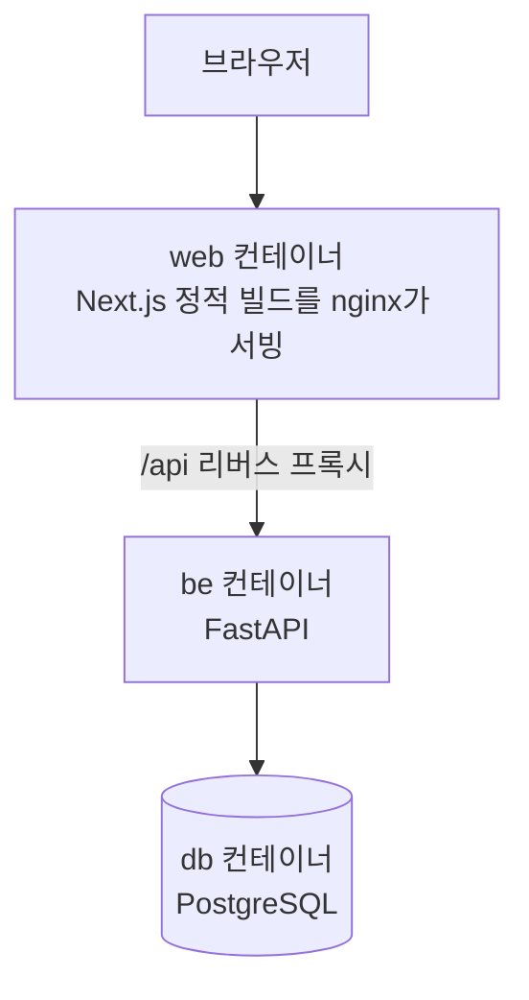
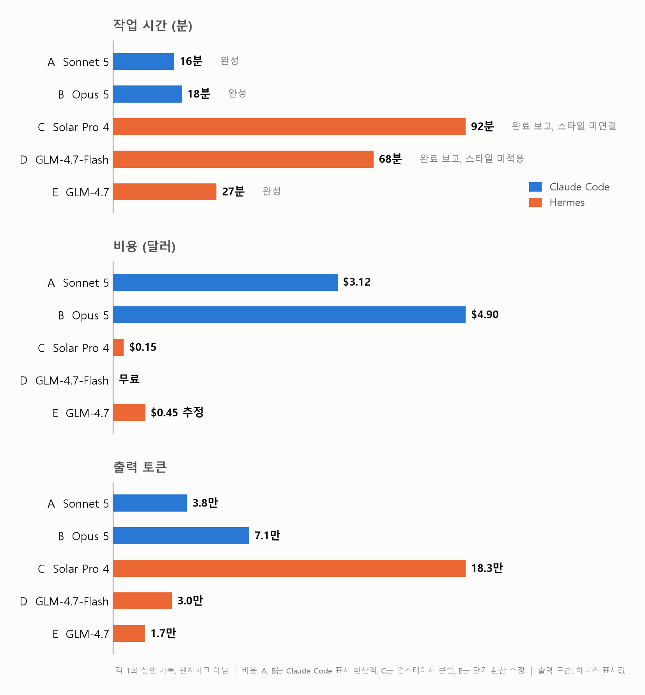
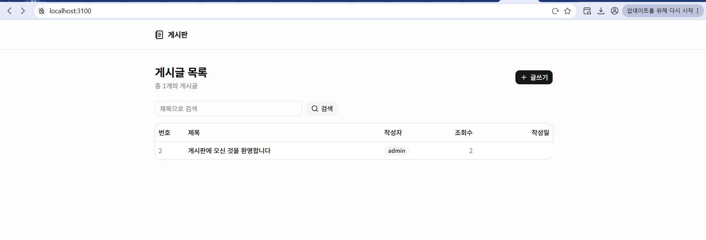
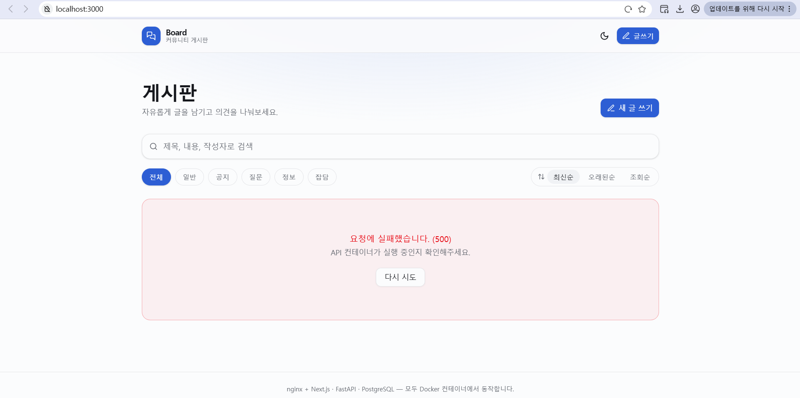
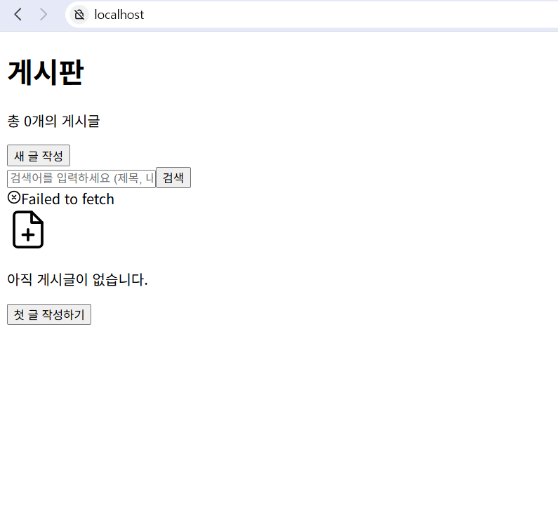
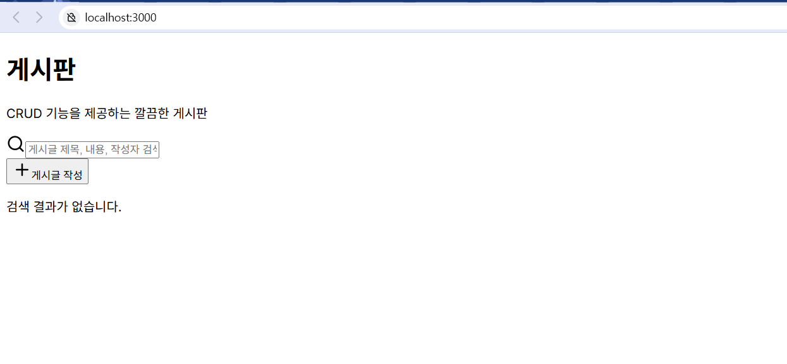
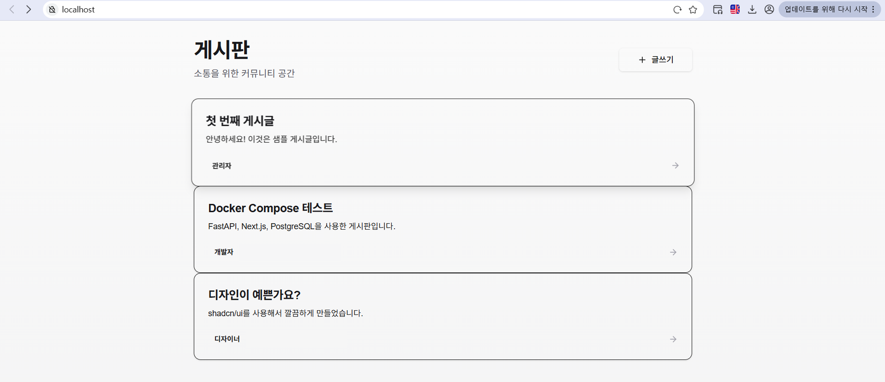
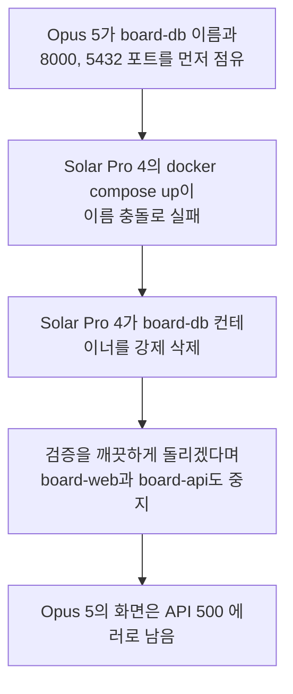
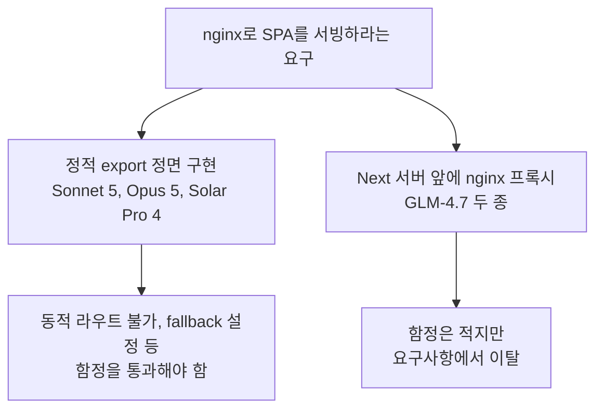

# Claude만 쓰다가 Solar와 GLM을 돌려봤다

같은 게시판 개발 프롬프트를 Claude Code의 Sonnet 5와 Opus 5, Hermes의 Solar Pro 4와 GLM-4.7 두 종에게 주고 시간, 비용, 결과 화면을 비교했다. 로그 전수 분석에서 나온 반복 실수 패턴과 컨테이너 충돌 사고까지 그대로 남긴 기록이다.

<!-- more -->

Claude Max 20x 요금제로 Claude Code를 쓰고 있어서 손에 익은 도구다. [업스테이지](https://www.upstage.ai/)가 Solar Pro 4를 내놨길래 코딩 실력이 궁금했다. 마침 이 모델이 [Nous Research](https://nousresearch.com/)의 Hermes Agent를 기본 하네스로 지원한다고 해서 그 조합으로 시켜봤다. 비교 기준은 익숙한 Claude Code의 Sonnet 5와 Opus 5로 잡았고, 내친김에 [z.ai](https://z.ai/)의 GLM-4.7 두 종(무료 Flash, 유료 일반)도 Hermes에 연동해 같은 과제를 줬다. 로그 분석에는 Opus 5 백그라운드 에이전트 다섯과 Fable 5를 썼는데 방법은 글 후반에 적었다.

이 글은 벤치마크가 아니다. 프롬프트 하나를 모델별로 한 번씩 돌린 기록이라 표본이 하나고 실력을 단정할 근거가 못 된다. 하네스도 서로 다르다. 하네스는 모델을 감싸고 도구 실행과 컨텍스트 관리를 맡는 에이전트 프로그램인데 Claude Code와 Hermes는 붙어 있는 도구, 에러 로그를 모델에게 보여주는 방식, 반복 한도, 컨텍스트 압축이 전부 달라서 모델만 떼어 비교하는 실험이 될 수 없다.

덧붙이면 Hermes는 이번이 첫 사용이었다. 시작하자마자 config.yaml의 api_key 위치가 잘못됐다는 경고가 뜰 정도로 설정부터 서툴렀고 effort 같은 옵션도 손대지 않은 기본값 그대로였다. 그러니 뒤에 나오는 Hermes 세션들의 문제 중 일부는 모델이 아니라 내 미숙함이 만든 것일 수 있다. 애초에 누굴 깎아내리려는 비교가 아니라, 새 모델들이 개발을 얼마나 해내는지 궁금해서 시켜보고 남긴 기록이다.

## 실험 설정

프롬프트는 다섯 세션 모두 같다.

> 로컬에서 crud가 가능한 디자인 좋은 게시판을 생성해줘. 개발 및 운영 등 환경을 분리하지 말고 모두 docker container 내에서 진행하는데, web은 nextjs를 이용한 spa를 nginx로 서빙하는 컨테이너를 띄우고, fastapi를 이용한 be서버, postgre db 각각 container로 띄워줘. nextjs는 shadcn을 적극 활용해서 깔끔하게 디자인해줘.

Sonnet 5와 Opus 5 세션에는 superpowers 스킬을 쓰지 말라는 문구를 뒤에 붙였다. Sonnet 5가 처음에 brainstorming 스킬로 요구사항 인터뷰부터 시작하길래 중단시키고 다시 시켰다. 스킬 도움 없이 모델이 일하는 모습을 보고 싶었기 때문이다.

| 모델 | 하네스 | 비고 |
|---|---|---|
| Sonnet 5 | Claude Code v2.1.227 | effort auto |
| Opus 5 | Claude Code v2.1.228 | effort auto |
| Solar Pro 4 (solar-pro4-260806) | Hermes Agent v0.20.0 (2026.8.3) | 업스테이지 API |
| GLM-4.7-Flash | Hermes Agent v0.20.0 (2026.8.3) | z.ai 무료 티어 |
| GLM-4.7 | Hermes Agent v0.20.0 (2026.8.3) | z.ai 유료 |

요구한 구성은 컨테이너 3개다.

Sonnet 5, Opus 5, Solar Pro 4는 같은 WSL 호스트에서 오전에 거의 동시에 돌렸고 GLM 두 세션은 같은 날 오후에 추가로 돌렸다. 격리 없이 동시에 돌린 오전의 결정이 뒤에서 사고를 부른다.

## 결과 요약

| 모델 | 소요 시간 | 비용 | 결과 |
|---|---|---|---|
| Sonnet 5 | 약 16분 | $3.12 | 완성, curl로 CRUD 전 구간 검증 |
| Opus 5 | 약 18분 | $4.90 | 완성, 브라우저 E2E까지 검증 |
| Solar Pro 4 | 1시간 32분 | $0.15 | 완료 보고, 화면은 스타일 미연결 |
| GLM-4.7-Flash | 1시간 8분 | 무료 | 완료 보고, 화면은 스타일 미적용 |
| GLM-4.7 | 27분 | 약 $0.45 추정 | 완성, 화면 정상 |

시간은 각 하네스가 표시한 작업 시간 기준이다. 비용은 Claude 두 세션은 Claude Code에 표시되는 API 환산 금액, Solar Pro 4는 업스테이지 콘솔에 찍힌 이날 사용량 합계, GLM-4.7-Flash는 무료 티어라 0, GLM-4.7은 Hermes가 표시한 토큰량에 z.ai 단가(2026년 8월 기준 백만 토큰당 입력 $0.6, 캐시 읽기 $0.11, 출력 $2.2)를 곱해 계산한 추정치다.

## Claude Code와 Sonnet 5

Sonnet 5는 도구부터 챙겼다. create-next-app과 shadcn CLI로 스캐폴딩을 백그라운드에 걸어두고 그 사이 FastAPI 백엔드를 작성하는 식으로 병렬로 움직였다. 학습 시점 이후 바뀐 Next.js 16 문서를 먼저 찾아 확인했고 정적 export가 동적 라우트를 지원하지 않는 제약을 미리 판단해 상세와 수정 페이지를 쿼리스트링 라우팅으로 설계했다. 이 사전 판단 덕에 빌드 단계에서 export 실패가 한 번도 없었다.

물론 매끄럽기만 한 건 아니었다. shadcn CLI 인자가 학습 시점과 달라져 init에 세 번 실패했는데, 첫 실패 직후 help를 열어 실제 옵션을 조사한 것까지는 좋았지만 목록에 없는 base-nova라는 프리셋 이름을 지어내 한 번 더 낭비했다. 호스트에서 5432, 3000, 8000 포트가 이미 점유된 걸 발견하자 5433, 3100, 8010으로 비켜서 올렸는데, 처음 실패에서 포트 하나만 고치고 재시도했다가 다시 실패한 뒤에야 ss로 전수 조사해 남은 둘을 한 번에 해결했다. 마지막에 curl로 생성, 목록, 조회, 수정, 삭제 전 구간과 SPA 라우트 4개의 200 응답을 확인하고 16분 만에 끝냈다. 추가된 코드는 995줄.

끝난 뒤 작업 내역을 리뷰해 보라고 시키니 완료 전에 lint를 안 돌린 걸 스스로 실토하고 그 자리에서 돌려 에러 3건을 찾아 보고했다. 같은 useEffect 패턴을 세 파일에 복제한 결과였다. 자기 결과물을 부풀리지 않고 깎아서 보고하는 태도가 인상적이었다.

## Claude Code와 Opus 5

Opus 5는 CLI 스캐폴딩 없이 package.json부터 shadcn 컴포넌트 10개까지 50개 파일 전부를 직접 썼다. 추가된 코드는 2,777줄. Tailwind v4에 oklch 색 토큰, 다크 모드까지 넣었는데 타입 체크를 켠 채 돌린 첫 docker build가 한 번에 통과했다. 컴파일 에러급 실수가 0건이었다는 뜻이고, 이후 나온 문제는 전부 실행해봐야 아는 의미론 층위였다.

검증 과정이 특히 볼만했다. curl 테스트를 전부 통과한 상태에서 Playwright로 화면을 찍어 눈으로 확인하다가 글을 조회만 해도 수정됨 표시가 붙는 버그를 찾아냈다. 조회수 증가가 updated_at 갱신을 건드리는 문제였고 원자적 UPDATE로 고쳤다. 오래된순 정렬이 뒤집혀 보이던 문제와 없는 경로에 200을 돌려주던 nginx 설정도 잡았는데, nginx 쪽은 추측으로 고치지 않고 빌드된 이미지 안에 들어가 실제 파일 목록을 열어본 다음 고쳤다. 마지막에 브라우저 9단계 시나리오를 콘솔 에러 0으로 통과시키고 시드 데이터 상태로 초기화까지 하고 끝냈다. 18분.

스크린샷의 500 에러는 Opus 5의 잘못이 아니다. Solar Pro 4가 작업 중에 Opus 5의 컨테이너를 지우고 멈춰서 프론트만 살아남은 상태인데 무슨 일이 있었는지는 아래에 따로 적었다. 붉은 에러 카드와 다시 시도 버튼은 Opus 5가 설계해 둔 에러 화면이 의도대로 동작하는 모습이라 얄궂다.

## Hermes와 Solar Pro 4

Solar Pro 4는 스캐폴딩 도구 없이 전부 직접 작성하는 쪽을 택했다. 그런데 그 이유가 이상하다. 로그 중반에 "환경에서는 npx가 안 된다고 했으니"라며 스캐폴딩을 건너뛰는데, 내가 가진 로그 범위에는 npx를 시도한 기록이 없다. 확인되지 않는 과거를 근거로 결정을 내린 것이다. 같은 머신에서 Sonnet 5와 GLM-4.7은 npx로 잘만 스캐폴딩했다.

구성도 오래 흔들렸다. next.config.js의 output 설정이 export와 standalone 사이에서 네 번 뒤집혔고, nginx 프록시 폴더에 next.config.js 사본을 만드는 등 불필요한 파일도 여럿 생겼다. globals.css는 처음에 한 줄짜리로 만든 뒤 다섯 번을 다시 썼는데 그때마다 "파일이 덮어써졌다, 복구하겠다"는 서사가 붙었다. 로그를 대조해 보면 한 번은 "nginx 설정 내용으로 덮어써졌다"고 주장했지만 실제 diff에서 지워지는 내용은 자기가 직전에 쓴 shadcn CSS였다. 실제와 다른 원인 설명을 붙이며 자기 파일을 자기가 다시 쓰고 있었던 셈이다. layout.tsx를 React 컴포넌트가 아닌 HTML 조각으로 작성했다가 빌드가 깨진 뒤에야 고친 것도 있다.

백엔드는 기동 실패 로그를 보며 버그를 하나씩 걷어냈다. 동기 함수에 async with를 쓴 get_db, 임포트 없이 쓴 AsyncAttrs, 자기가 쓴 compose와 database.py 사이의 드라이버 불일치, 그리고 첫 버그를 고치다 새로 만든 임포트 누락까지 네 번의 재시작 끝에 백엔드가 떴다. 시간이 걸렸을 뿐 전부 스스로 잡았고, 첫 빌드 전에 자기 코드를 리뷰해 상대 임포트 오류 등 결함 4개를 미리 걸러낸 장면도 있었다.

인상적인 순간도 분명했다. 한글 검색이 400으로 떨어지자 nginx 액세스 로그에서 이스케이프된 바이트를 확인하고, 백엔드 직접 호출과 프록시 경유를 분리해 검증한 끝에 원인을 터미널 셸 인코딩으로 정확히 진단했다. 자체 검증 명령인 hermes verify가 엉뚱한 포트(당시 그 포트에는 Opus 5의 서비스가 떠 있었다)를 보고 통과 처리하자 이 통과는 가짜 합격이라며 스스로 재검증에 들어간 대목은 다섯 로그를 통틀어 손에 꼽는 판단이었다.

아쉬운 부분도 로그에 그대로 남아 있다. 산출 텍스트에 일본어와 중국어가 섞여 나왔다. "ビルド는 프론트 Node 빌드"나 "我们的 write_file로" 같은 문장이 한국어 사이에 등장하고 문단 하나가 통째로 영어로 전환되기도 했다. 도구 호출 없이 계획만 다시 쓰는 90줄짜리 블록에서 "이제 시작한다"는 선언을 여덟 번 반복한 구간도 있다. 세션은 반복 한도 150회에 걸렸고, 종반에는 다음 요청이 약 41만 토큰으로 조립될 뻔해서 하네스가 전송 직전에 요약 압축을 돌렸다. Solar Pro 4의 컨텍스트 상한이 256K, Hermes의 압축 임계가 19.2만 토큰이니 상한을 훌쩍 넘는 크기였다. 컨텍스트가 그렇게 부푼 데는 브라우저 없는 환경에서 시도한 computer_use 호출 한 번이 15.5만 토큰을 쏟아부은 몫이 컸고, 압축 직후에는 방금 실행했던 명령을 잊고 다시 실행하는 부작용까지 로그에 찍혔다.

Solar Pro 4는 1시간 32분에 완료를 보고했다. curl 기준으로 페이지 200 응답과 CRUD 전 구간, 헬스체크 통과를 확인했다는 내용이다. 다만 캡처된 로그 자체는 반복 한도와 압축 지점에서 명령 중간에 끊기고, 그 뒤 이어진 세션에서 완료 보고가 나왔다. 내가 가진 마지막 화면은 1시간 20분 시점 스크린샷인데 스타일이 입혀지지 않았고 데이터 요청도 실패한 상태였다.

화면의 두 결함 모두 로그로 설명이 된다. Failed to fetch는 프론트 번들에 API 주소가 계획과 달리 8000 포트 직결로 하드코딩된 채 빌드된 결과다. 상대 경로로 바꾸겠다는 계획을 세 번 선언하고 실행하지 않았고, 정작 Solar Pro 4의 백엔드 호스트 포트는 세션 대부분 동안 충돌을 피해 8001에 가 있다가 로그 막바지에야 8000으로 돌아오는 중이었다. 어느 시점이든 번들이 부르는 8000에서 이 세션의 백엔드가 응답한다는 보장이 없는 구조였다. 스타일이 아예 안 실린 쪽은 더 구조적이다. shadcn 패턴의 컴포넌트 코드를 만들어 페이지에서 쓰긴 했지만 layout.tsx에 globals.css를 임포트하는 구문이 로그 전체에 한 번도 없다. Next.js App Router에서 이 한 줄이 없으면 여섯 번을 다시 쓴 그 CSS가 페이지에 실릴 방법이 없다. shadcn을 적극 활용해 달라는 요구는 코드 폴더 안에는 흔적이 있지만 화면에는 도달하지 못했고, curl 검증은 상태코드만 봐서 두 결함 다 잡지 못했다.

## Hermes와 GLM-4.7-Flash

무료 모델은 어디까지 하나 궁금해서 붙였다. 결론부터 적으면 1시간 8분 만에 완료를 선언했지만 결과물이 요구와 다르고 화면은 스타일이 빠진 상태였다.

구성부터 어긋났다. 환경을 분리하지 말라고 했는데 개발용 Next 서버 컨테이너와 운영용 nginx를 나눈 4컨테이너 구성으로 시작했고, 최종 상태도 nginx가 정적 파일을 서빙하는 게 아니라 Next 개발 서버 앞의 프록시로 남았다. 쓰지도 않는 Prisma의 generate 명령을 Dockerfile에 넣어 빌드 한 번을 날렸고, use client 지시어 누락 같은 App Router 기본 규칙도 빌드가 깨진 뒤에 채웠다.

이 세션에서 가장 길게 헤맨 곳은 9연속 빌드 실패 구간이다. 근본 원인은 next.config.js에 standalone 출력 설정이 없다는 것 하나였는데, Dockerfile 하나를 아홉 번 패치했고 그중 연속된 네 번은 끝나고 보니 처음과 완전히 같은 내용으로 돌아온 왕복이었다. 여기엔 하네스 몫이 크다. Hermes가 빌드 에러 로그를 [error] 네 글자로 잘라 보여줘서 모델은 사실상 눈을 가린 채 디버깅했다. 이 절단이 설정으로 조절되는 값인지는 확인하지 못했다. 그 와중에 절단된 로그만으로 use client 누락과 standalone 필요성을 정확히 짚어낸 진단도 있었으니, 정보만 제대로 보였다면 훨씬 짧았을 구간이다.

검증은 HTTP 상태코드 확인이 전부였다. 게시글 쓰기 호출은 한 번도 없이 목록 200과 0개 게시글을 확인하고 CRUD 완료를 선언했다. 완료 선언은 세 번 나왔는데 첫 번째 선언 직후 자기 검증에서 프론트와 nginx 문제를 발견해 스스로 반박하기도 했다. 안내한 접속 주소도 잘못됐다. 프론트 코드가 상대 경로로 API를 부르는데 개발 서버 3000 포트에는 그 경로가 없어서 nginx를 거치는 80 포트에서만 동작하는 구조였는데, 접속하라고 지목한 주소는 3000이었다. 80은 프로덕션이라는 이름으로 병기만 됐다.

shadcn 자체는 성실하게 옮겨 적었다. 공식 코드에 가까운 Button, Card, Dialog, Toast 컴포넌트를 만들어 페이지에서 사용했고 layout.tsx의 CSS 임포트도 있다. 파이프라인이 끊긴 지점은 그 다음이다. 로그 전체에 postcss 설정 파일을 만든 기록이 없어서 Tailwind 지시어가 처리되지 않은 채 나갔다. 컴포넌트에 아무리 클래스를 달아도 그 클래스를 실제 스타일로 바꿔줄 단계가 없었으니 화면은 브라우저 기본값이 된다. 스캐폴딩 도구를 썼다면 자동으로 생겼을 파일 하나가 없어서 shadcn 요구 전체가 무너졌다.

무료 티어의 대가는 예상과 달리 레이트리밋이 아니었다. 관련 이벤트는 로그에 한 건도 없었고 대신 생성 속도가 초당 9토큰 수준이라 68분 중 약 57분이 모델 생성 시간이었다.

## Hermes와 GLM-4.7

GLM-4.7은 다섯 세션 중 Claude 둘을 빼면 가장 빨랐고 화면도 제대로 나왔다. 27분.

전략이 Sonnet 5와 닮았다. create-next-app으로 스캐폴딩하고 components.json을 먼저 손으로 만든 뒤 shadcn CLI로 컴포넌트를 받았다. DB 스키마와 샘플 게시글 3건을 init.sql로 미리 심은 것도 결과 화면을 살린 선택이었다. docker-compose 구버전 명령이 없다는 exit 127을 만나자 한 번에 docker compose로 전환했고, 프론트 빌드가 의존성 누락으로 두 번 깨지자 소스 파일을 실제로 읽어 lucide-react 누락을 특정해 해결했다. 백엔드 직결과 nginx 경유를 curl로 나눠 찍어 어느 계층이 깨졌는지 격리한 디버깅, 컨테이너 내부 호스트명을 브라우저용 주소로 넣은 실수를 스스로 발견해 고친 것도 좋았다.

다만 요구 아키텍처에서는 GLM-4.7-Flash와 같은 방향으로 이탈했다. 정적 export 없이 Next 서버 컨테이너를 두고 nginx를 프록시로 얹은 4컨테이너 구성이다. 고친 API 주소는 빌드할 때 번들에 박히는 값이다. 재빌드 없이 restart만 했으니 수정이 실제 번들에 반영됐는지는 로그로 확인되지 않는다. 스크린샷에서는 목록이 정상적으로 뜨는데, 빌드 시점 기본값인 8000 포트 직결 주소가 번들에 남아 노출된 백엔드 포트로 직접 붙었을 가능성이 높다. 동작은 하지만 nginx 프록시를 우회하는 경로다. 쓰기 계열 CRUD를 실제 호출한 기록이 없는 채로 모든 기능이 작동한다고 정리한 것도 GLM-4.7-Flash와 같은 패턴이다.

hermes verify까지 통과시키고 끝냈다. 레이트리밋과 컨텍스트 압축, 반복 한도 어느 것에도 걸리지 않았다.

## Solar Pro 4가 Opus 5의 컨테이너를 지운 사건

Opus 5와 Solar Pro 4는 같은 게시판 프롬프트를 받았으니 둘 다 board로 시작하는 컨테이너 이름을 짓는 게 자연스럽다. 먼저 완성한 Opus 5가 board-db라는 이름과 5432, 8000 포트를 차지하고 있었고 뒤늦게 docker compose up을 시도한 Solar Pro 4는 이름 충돌로 실패했다.

과정을 로그로 재구성하면 이렇다. Solar Pro 4는 처음에 충돌 원인을 절반만 이해했다. Opus 5의 컨테이너 목록에 board-db를 뻔히 적어놓고 "내 컨테이너와 이름이 다르다"고 판단한 뒤, 기존 서비스는 건드리지 않겠다며 자기 백엔드 포트만 8001로 옮겼다. 이름 충돌이 그대로라 다시 실패하자 로그 27줄 만에 방침을 뒤집어 board-db를 docker rm 강제 옵션으로 지웠다. 중지가 아니라 삭제라 복구가 안 되는 선택이었고, Hermes에 사용자에게 물어보는 clarify 도구가 있었지만 쓰지 않았다. 마지막 검증 단계에서는 검증기가 깨끗한 환경을 보게 하겠다며 Opus 5의 board-web과 board-api까지 멈췄고, 컨텍스트 압축 직후에는 방금 멈춘 사실을 잊고 같은 중지 명령을 한 번 더 실행했다. Opus 5 스크린샷의 500 에러는 그 흔적이다.

이걸 Solar Pro 4의 잘못이라고만 적으면 공정하지 않다. 격리 없이 같은 호스트에서 세 에이전트를 동시에 돌린 건 나다. Solar Pro 4 입장에서 board-db는 자기 compose 파일에 적힌 이름을 차지하고 있는 정체불명 컨테이너였을 뿐이다. 그래도 기록할 가치는 있다. 같은 상황에서 Sonnet 5는 점유된 포트를 보고 자기가 비켜서는 쪽을 골랐고 Solar Pro 4는 처음엔 비켜섰다가 결국 상대를 지우는 쪽으로 돌아섰다. 에이전트에게 docker 권한을 주고 여럿을 동시에 풀어놓으면 서로의 인프라를 건드릴 수 있다는 걸 이번에 눈으로 봤다.

## 로그 전수 분석

다섯 세션의 로그를 Opus 5 백그라운드 에이전트 다섯에게 하나씩 맡겨 전수 판독시켰다. 에러, 반복 실수, 하네스 이벤트를 줄 번호 단위로 수집하게 했고, 나온 보고서는 Fable 5가 원본 로그와 대조해 확인한 뒤 원인을 해석했다. 아래 해석도 그 과정에서 나온 것이다. 세션별로 가장 두드러진 반복 패턴은 이렇다.

| 모델 | 대표 반복 패턴 |
|---|---|
| Sonnet 5 | 포트 충돌을 한 번에 하나씩 고쳐 up 3회, 같은 lint 위반 패턴을 세 파일에 복제 |
| Opus 5 | 코드를 쓴 뒤 임포트를 뒤늦게 추가 2회, 정반대로 뒤집는 수정은 0회 |
| Solar Pro 4 | output 설정 4회 반전, globals.css 5회 재작성, 같은 컴포넌트 파일 재작성 다수 |
| GLM-4.7-Flash | Dockerfile 9회 패치(그중 4회는 원점 회귀), 존재하지 않는 파일을 참조하는 compose로 시작 |
| GLM-4.7 | compose up 계열 호출 10회(하네스 차단 포함), API 주소가 세 값을 오감 |

숫자를 모아놓고 보니 몇 가지 공통 구조가 보였다.

첫째, 상태를 다시 읽지 않는 에이전트가 왕복한다. GLM-4.7-Flash는 74번의 도구 호출 중 파일 읽기가 단 1회였다. 자기가 쓴 파일의 현재 상태를 확인하지 않고 기억으로 패치하니 같은 파일을 아홉 번 고치고 원점으로 돌아온다. Solar Pro 4도 파일을 읽지 않고 patch를 던졌다가 매칭 실패로 퇴짜를 맞은 기록이 있고, 자기 파일을 자기가 덮어쓰면서 원인을 외부로 돌리는 서사까지 만들었다. 반대로 Opus 5는 nginx 설정을 고치기 전에 이미지 안에 들어가 실물 파일 목록부터 확인했다. Claude Code 로그 두 개에는 정반대로 뒤집는 수정이 아예 없는데, 편집 전에 파일을 읽도록 강제하는 하네스 구조와 상태를 추적하는 모델 능력이 겹친 결과로 보인다.

둘째, 에러 메시지의 해상도가 디버깅 품질을 결정한다. GLM-4.7-Flash의 9연속 실패 구간에서 Hermes는 실패 로그를 [error] 네 글자로 잘라 보여줬다. 진단 정보가 0에 가까우니 모델이 추측으로 움직일 수밖에 없다. Hermes가 금방 끝날 명령을 오래 걸릴 명령으로 잘못 판정해 차단하는 일도 Solar Pro 4에서 7회, GLM-4.7에서 4회 있었고 그때마다 같은 명령을 두세 번씩 다시 쳐야 했다. diff 없이 기록되는 patch도 있어 뭘 바꿨는지 로그로 추적이 안 되는 지점이 있었다. 대기 방식도 갈렸다. Hermes는 맨 sleep 명령을 그대로 통과시켜 GLM-4.7 혼자 일곱 번, 합계 5분을 눈감고 기다렸다. 27분 세션의 5분이 잠이었던 셈이다. Claude Code는 단독 sleep을 거부하고 감시 도구를 쓰게 유도하는 정책이라 Sonnet 5는 상한을 건 폴링 루프로, Opus 5는 기동 명령 뒤에 붙인 몇 초짜리 대기로 같은 상황을 지나갔다. 하네스가 대기를 어떻게 다루느냐도 모델 속도 못지않게 소요 시간을 흔드는 변수다. 백그라운드 실행과 긴 타임아웃, 전체 에러 출력을 주는 Claude Code 쪽과 대비되는 부분인데, 이건 모델 실력과 별개로 하네스가 만드는 격차다.

셋째, 완료 선언은 검증 깊이만큼만 믿을 수 있다. 생성부터 삭제까지 쓰기 계열 API를 실제로 호출해본 세션은 Sonnet 5, Opus 5, Solar Pro 4뿐이다. GLM-4.7-Flash는 목록 조회 200에 게시글 0건을 보고 CRUD 완료를 선언했고 GLM-4.7도 쓰기 호출 기록 없이 모든 기능 작동으로 정리했다. 화면을 눈으로 본 세션은 Opus 5 하나다. 그리고 화면이 깨진 채 끝난 세션이 정확히 화면을 못 본 쪽에서 나왔다. Solar Pro 4의 CSS 미연결과 fetch 실패, GLM-4.7-Flash의 postcss 부재는 전부 curl 상태코드로는 안 잡히는 결함이다. shadcn을 명시적으로 요구했는데 화면까지 shadcn이 도달한 Hermes 세션은 GLM-4.7 하나였고, Solar Pro 4와 GLM-4.7-Flash는 컴포넌트 코드를 성실히 만들어 놓고 그 스타일이 브라우저에 닿는 마지막 연결 고리를 각자 다른 지점에서 놓쳤다. Opus 5가 curl 전 구간을 통과한 상태에서 스크린샷으로 updated_at 버그를 잡아낸 것과 같은 이야기의 반대면이다.

넷째, 이탈은 관성에서 온다. Solar Pro 4와 GLM-4.7-Flash는 처음부터 Next 서버와 nginx 프록시를 나눈 4컨테이너 구조로 출발했고 GLM-4.7도 도중에 nginx를 프록시로 얹어, Hermes 세션 셋이 결국 같은 구조로 수렴했다. nginx로 SPA를 서빙하라는 요구의 표준 해석은 정적 빌드 서빙인데, 학습 데이터에 더 흔할 프록시 패턴이 관성으로 나온 것으로 보인다. Solar Pro 4만 도중에 정적 서빙으로 돌아왔고 GLM 두 세션은 프록시 구조로 완료를 선언했다. GLM 두 세션이 인증 없는 게시판에 python-jose, passlib, alembic 같은 인증과 마이그레이션 라이브러리를 나란히 넣은 것도 같은 계열의 보일러플레이트 관성이다. 반면 언어 혼입(일본어, 중국어)과 도구 호출 없는 장문 재계획 블록은 다섯 로그 중 Solar Pro 4에서만 나왔다. GLM 두 세션의 텍스트 결함은 오타 몇 개 수준이었다.

## 작업 시간을 그대로 비교하면 안 되는 이유

작업 시간이 16분에서 92분까지 벌어졌지만 이 숫자를 그대로 순위로 읽으면 안 된다. 각자 다른 길을 골랐고 길마다 난이도가 다르기 때문이다.

우선 아키텍처 선택이 난이도를 갈랐다. 정적 export를 정면으로 구현한 Sonnet 5, Opus 5, Solar Pro 4는 동적 라우트 제약과 fallback 설정 같은 함정을 통과해야 했고, GLM 두 세션은 그 함정을 우회하는 대신 요구사항에서 이탈했다. GLM-4.7의 27분에는 이 우회로 아낀 시간이 섞여 있다.

스캐폴딩 도구 사용 여부도 시간과 품질 양쪽에 작용했다. Sonnet 5와 GLM-4.7은 create-next-app이 만들어주는 설정 위에서 시작해 postcss 같은 기반 설정 함정을 원천 차단했다. 손으로 다 쓴 세 세션 중 Opus 5는 모델이 강해서 한 번에 정확히 썼고, Solar Pro 4와 GLM-4.7-Flash는 설정 함정에 빠졌다. GLM-4.7-Flash의 스타일 미적용이 그 대가다.

스코프도 다르다. Opus 5는 다크 모드, 카테고리, 정렬, 시드 10건, 브라우저 E2E까지 스스로 스코프를 넓혀 2,777줄을 썼다. Sonnet 5의 995줄이나 GLM-4.7의 최소 구현과는 일의 양 자체가 다르니 18분이라는 숫자는 오히려 과소평가다.

마지막으로 순수 속도 차이가 있다. Claude Code는 API 통신 시간을 따로 보여주는데 Sonnet 5가 7분 38초, Opus 5가 14분 34초로 벽시계 시간의 절반 수준이고 나머지는 빌드 같은 도구 실행 대기다. GLM-4.7-Flash는 반대로 68분 중 약 57분이 초당 9토큰짜리 생성 시간이었다. 결국 시간을 가른 건 모델의 타자 속도, 첫 빌드가 통과하는 정확도, 실패했을 때 원인에 도달하는 속도 세 가지였고, 빌드 실행 횟수(Sonnet 5 2회, Opus 5 4회, Solar Pro 4 6회, GLM-4.7-Flash 13회, GLM-4.7 3회)가 그 결과를 요약한다.

## 토큰과 캐싱

| 모델 | 캐시 안 탄 입력 | 캐시 읽기 | 출력 | 비고 |
|---|---|---|---|---|
| Sonnet 5 | 247토큰 | 660만 | 3.8만 | 캐시 쓰기 9.3만 별도 |
| Opus 5 | 682토큰 | 420만 | 7.1만 | 캐시 쓰기 10.1만 별도 |
| Solar Pro 4 | 293만 | 726만 | 18.3만 | 업스테이지 콘솔 기준 |
| GLM-4.7-Flash | 118만 | 373만 | 3.0만 | Hermes 표시값 환산 |
| GLM-4.7 | 11.2만 | 312만 | 1.7만 | Hermes 표시값 환산 |

집계 방식이 하네스마다 달라 절대 비교는 조심해야 하지만 방향은 읽힌다. Claude Code 두 세션은 캐시를 못 탄 입력이 수백 토큰에 불과하다. 매 턴 반복되는 컨텍스트가 거의 전부 캐시에 얹혀 있다는 뜻이다. Hermes 쪽은 세션마다 편차가 큰데 Solar Pro 4는 293만 토큰이 캐시를 못 탔다. 세션 막바지에 압축이 돌고 15.5만 토큰짜리 computer_use 출력이 한 번에 유입되는 등 캐시 앞머리가 흔들릴 일이 있었던 92분 세션이라는 정황과 맞아떨어진다. 짧고 압축 없이 끝난 GLM-4.7은 11.2만으로 제일 적었다.

비용 구조에 대한 의견을 남기면, 에이전트 용도의 모델을 고를 때 단가표에서 먼저 볼 것은 입력과 출력 단가가 아니라 캐시 읽기 단가와 생성 속도라는 게 이번 실험의 소감이다. 에이전트 루프는 같은 컨텍스트를 수십 번 다시 보내는 구조라 물량의 대부분이 캐시 읽기다. GLM-4.7의 추정 비용 $0.45에서도 캐시 읽기 몫이 $0.34로 지배적이다. 그리고 GLM-4.7-Flash처럼 토큰이 공짜여도 생성이 느리면 사람 시간으로 대가를 치른다. Solar Pro 4는 출력 토큰을 Sonnet 5의 다섯 배 가까이 쓰고도 비용이 20분의 1이었으니 단가의 힘은 분명하지만, 그 돈으로 산 결과물의 상태까지 함께 봐야 공정한 비교가 된다.

## 정리

한 번씩 돌린 실험이라 결론은 유보한다. 그래도 남은 인상은 적어둘 수 있다. Solar Pro 4는 실패 로그를 읽고 버그를 걷어내는 끈기와 위양성 검증을 의심하는 감각을 보여줬지만, 상태 추적이 흔들리며 같은 파일을 여러 번 다시 쓰고 언어가 섞이는 문제가 로그에 남았다. GLM-4.7은 무료 Flash가 시간과 마감 품질로 대가를 치른 반면 유료 쪽은 27분에 화면까지 멀쩡한 결과를 $0.5 미만으로 만들어서, 가격 대비로는 이번 실험에서 가장 흥미로운 지점에 있었다. Claude 두 세션은 빠르고 정확했고 특히 검증의 깊이에서 격차를 보였다.

하네스의 영향도 생각보다 컸다. 에러 로그를 얼마나 보여주는지, 파일 상태 확인을 강제하는지, 백그라운드 실행을 어떻게 다루는지가 모델 실력만큼 결과를 흔들었다. Hermes 설정을 제대로 공부하고 브라우저까지 쥐여준 환경에서 다시 돌려보면 숫자가 달라질 수 있다. 그리고 다음부터는 무슨 일이 있어도 에이전트마다 Docker 프로젝트와 포트를 분리해 둘 것이다. Opus 5의 500 에러 화면이 그 교훈의 스크린샷이다.
