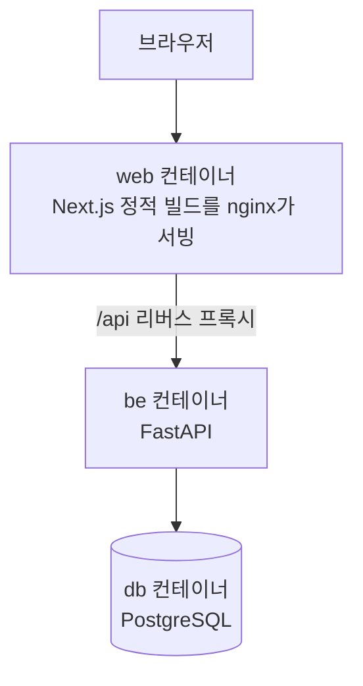
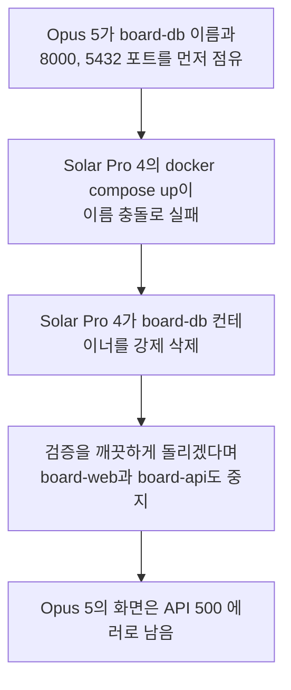
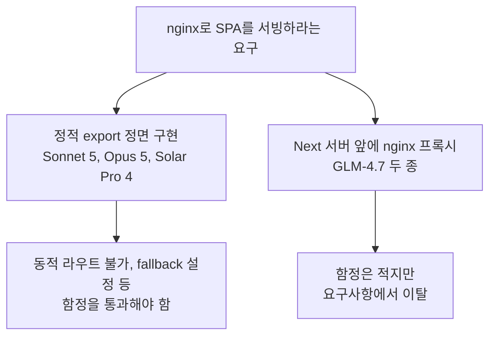

# Claude만 쓰다가 Solar와 GLM을 돌려봤다

같은 게시판 개발 프롬프트를 Claude Code의 Sonnet 5와 Opus 5, Hermes의 Solar Pro 4와 GLM-4.7 두 종에게 주고 시간, 비용, 결과 화면을 비교했다.

<!-- more -->

Claude Code는 Claude Max 20x 요금제를 쓰고 있어서 손에 익은 도구다. [업스테이지](https://www.upstage.ai/)가 Solar Pro 4를 내놨길래 코딩 실력이 궁금했다. 마침 이 모델이 [Nous Research](https://nousresearch.com/)의 Hermes Agent를 기본 하네스로 지원한다고 해서 그 조합으로 시켜봤다. 비교 기준은 익숙한 Claude Code의 Sonnet 5와 Opus 5로 잡았고 내친김에 [z.ai](https://z.ai/)의 GLM-4.7 두 종(무료 Flash, 유료 일반)도 Hermes에 연동해 같은 과제를 줬다. 로그 분석에는 Fable 5를 썼다.

이 글은 벤치마크가 아니다. 프롬프트 하나를 모델별로 한 번씩 돌린 기록이라 표본이 하나고 하네스도 서로 달라서 모델만 떼어 비교하는 실험이 될 수 없다. 덧붙이면 Hermes는 이번이 첫 사용이었다. 시작하자마자 config.yaml의 api_key 위치가 잘못됐다는 경고가 뜰 정도로 설정부터 서툴렀고 effort 같은 옵션도 손대지 않은 기본값 그대로였다. 그러니 뒤에 나오는 Hermes 세션들의 문제 중 일부는 모델이 아니라 내 미숙함이 만든 것일 수 있다. 애초에 누굴 깎아내리려는 비교가 아니라, 새 모델들이 개발을 얼마나 해내는지 궁금해서 시켜보고 남긴 기록이다.

## 실험 설정

프롬프트는 다섯 세션 모두 같다. Claude 두 세션에는 superpowers 스킬을 쓰지 말라는 문구를 덧붙여 스킬 도움 없이 모델만 보게 했다.

> 로컬에서 crud가 가능한 디자인 좋은 게시판을 생성해줘. 개발 및 운영 등 환경을 분리하지 말고 모두 docker container 내에서 진행하는데, web은 nextjs를 이용한 spa를 nginx로 서빙하는 컨테이너를 띄우고, fastapi를 이용한 be서버, postgre db 각각 container로 띄워줘. nextjs는 shadcn을 적극 활용해서 깔끔하게 디자인해줘.

| 모델 | 하네스 | 비고 |
|---|---|---|
| Sonnet 5 | Claude Code v2.1.227 | effort auto |
| Opus 5 | Claude Code v2.1.228 | effort auto |
| Solar Pro 4 (solar-pro4-260806) | Hermes Agent v0.20.0 (2026.8.3) | 업스테이지 API |
| GLM-4.7-Flash | Hermes Agent v0.20.0 (2026.8.3) | z.ai 무료 티어 |
| GLM-4.7 | Hermes Agent v0.20.0 (2026.8.3) | z.ai 유료 |

요구한 구성은 컨테이너 3개다.

Sonnet 5, Opus 5, Solar Pro 4는 같은 WSL 호스트에서 오전에 거의 동시에 돌렸고 GLM 두 세션은 같은 날 오후에 추가로 돌렸다. 각 개발환경간 격리 없이 동시에 돌린 오전의 결정이 뒤에서 문제를 일으켰다.

## 결과 요약

| 모델 | 소요 시간 | 비용 | 결과 |
|---|---|---|---|
| Sonnet 5 | 약 16분 | $3.12 | 완성, curl로 CRUD 전 구간 검증 |
| Opus 5 | 약 18분 | $4.90 | 완성, 브라우저 E2E까지 검증 |
| Solar Pro 4 | 1시간 32분 | $0.15 | 완료 보고, 화면은 스타일 미연결 |
| GLM-4.7-Flash | 1시간 8분 | 무료 | 완료 보고, 화면은 스타일 미적용 |
| GLM-4.7 | 27분 | 약 $0.45 추정 | 완성, 화면 정상 |

시간은 각 하네스가 표시한 작업 시간 기준이다. 비용은 Claude 두 세션은 Claude Code에 표시되는 API 환산 금액, Solar Pro 4는 업스테이지 콘솔에 찍힌 이날 사용량 합계, GLM-4.7-Flash는 무료 티어라 0, GLM-4.7은 Hermes가 표시한 토큰량에 z.ai 단가(2026년 8월 기준 백만 토큰당 입력 $0.6, 캐시 읽기 $0.11, 출력 $2.2)를 곱해 계산한 추정치다.

## Claude Code와 Sonnet 5

Sonnet 5는 도구부터 챙겼다. create-next-app과 shadcn CLI로 스캐폴딩을 백그라운드에 걸어두고 그 사이 백엔드를 병렬로 작성했고, 학습 시점 이후 바뀐 Next.js 16 문서를 먼저 확인한 뒤 정적 export의 동적 라우트 제약을 미리 계산해 라우팅을 설계했다. 점유된 포트를 만나자 자기가 비켜서는 쪽을 골랐고 curl로 CRUD 전 구간을 검증한 뒤 16분, 995줄로 끝냈다.

끝나고 작업 리뷰를 시키니 완료 전에 lint를 안 돌린 걸 스스로 실토하고 그 자리에서 돌려 에러 3건을 보고했다. 자기 결과물을 부풀리지 않는 태도가 인상적이었다.

## Claude Code와 Opus 5

Opus 5는 CLI 스캐폴딩 없이 50개 파일 2,777줄을 직접 썼는데 타입 체크를 켠 첫 docker build가 한 번에 통과했다. 가장 볼만한 건 검증이었다. curl 테스트를 전부 통과한 상태에서 Playwright로 화면을 찍어보다가 글을 조회만 해도 수정됨 표시가 붙는 버그를 눈으로 잡아냈고, 브라우저 9단계 시나리오를 콘솔 에러 0으로 통과시킨 뒤 시드 상태로 초기화까지 하고 18분에 끝냈다.

스크린샷의 500 에러는 Opus 5의 버그가 아니다. Solar Pro 4가 작업 중에 Opus 5의 컨테이너를 지우고 멈춘 흔적인데 경위는 아래에 따로 적었다.

## Hermes와 Solar Pro 4

Solar Pro 4는 1시간 32분에 완료를 보고했지만 아쉬운 장면이 많았다. 스캐폴딩을 건너뛰며 댄 이유가 로그에 존재하지 않는 과거("환경에서는 npx가 안 된다고 했으니")였고, next.config.js의 output 설정을 네 번 뒤집고 globals.css를 다섯 번 다시 쓰는 동안 실제와 다른 원인 서사("nginx 설정으로 덮어써졌다")까지 만들었다. 산출 텍스트에는 일본어와 중국어가 섞여 나왔다("ビルド는 프론트 Node 빌드", "我们的 write_file로"). 세션은 반복 한도 150회에 걸렸고 종반에는 요청이 약 41만 토큰까지 부풀어 하네스가 전송 직전에 요약 압축을 돌렸는데, 압축 직후 방금 실행한 명령을 잊고 다시 실행하는 부작용까지 로그에 찍혔다.

잘한 장면도 분명했다. 로그를 읽어 백엔드 기동을 막던 버그 네 개를 전부 스스로 잡았고, 자체 검증 명령인 hermes verify가 엉뚱한 포트를 보고 통과 처리하자 가짜 합격이라며 재검증에 들어간 대목은 다섯 로그를 통틀어 손에 꼽는 판단이었다.

다만 화면은 실패로 남았다. layout.tsx에 globals.css를 임포트하는 구문이 로그 전체에 한 번도 없어 그렇게 공들여 다시 쓴 shadcn 스타일이 페이지에 실릴 수 없는 구조였고, API 주소도 8000 포트 직결로 하드코딩된 채 빌드돼 데이터 요청이 실패했다. curl 상태코드 검증으로는 둘 다 잡히지 않았다.

## Hermes와 GLM-4.7-Flash

무료 모델은 어디까지 하나 궁금해서 붙였다. 1시간 8분 만에 완료를 선언했지만 요구한 3컨테이너 대신 개발용 Next 서버와 nginx 프록시를 나눈 4컨테이너로 갔고 화면은 스타일이 빠진 채 남았다. postcss 설정 파일을 만든 기록이 로그에 없어 Tailwind가 처리되지 않은 결과인데, 스캐폴딩 도구를 썼다면 자동으로 생겼을 파일 하나가 없어서 shadcn 요구 전체가 무너진 셈이다.

가장 길게 헤맨 9연속 빌드 실패 구간은 하네스 몫이 컸다. Hermes가 에러 로그를 [error] 네 글자로 잘라 보여줘 모델이 눈을 가린 채 디버깅했고, Dockerfile을 아홉 번 패치하다 그중 네 번은 처음과 같은 내용으로 돌아오는 왕복이었다. 무료의 대가는 레이트리밋이 아니라 속도였다. 생성이 초당 9토큰 수준이라 68분 중 약 57분이 모델 생성 시간이었다.

## Hermes와 GLM-4.7

GLM-4.7은 Claude 둘을 빼면 가장 빨랐고 화면도 제대로 나왔다. 27분. Sonnet 5처럼 create-next-app과 shadcn CLI를 활용한 전략이 주효했고 빌드 실패도 소스 파일을 직접 읽어 스스로 해결했다.

아쉬운 점은 둘이다. Flash와 같은 4컨테이너 프록시 구조로 요구 아키텍처에서 이탈했고, 쓰기 계열 CRUD를 실제 호출한 기록 없이 모든 기능이 작동한다고 정리했다. 그래도 추정 비용 $0.45로 화면까지 멀쩡한 결과를 만든 가격 대비는 다섯 세션 중 가장 흥미로웠다.

## Solar Pro 4가 Opus 5의 컨테이너를 지운 사건

Opus 5와 Solar Pro 4는 같은 프롬프트를 받았으니 둘 다 board로 시작하는 컨테이너 이름을 짓는 게 자연스럽다. 먼저 완성한 Opus 5가 board-db라는 이름과 포트를 차지하고 있었고 뒤늦게 올라온 Solar Pro 4는 이름 충돌로 실패했다.

Solar Pro 4는 처음엔 기존 서비스를 건드리지 않겠다며 자기 포트만 옮겼지만 충돌이 반복되자 방침을 뒤집어 board-db를 강제 삭제했다. 중지가 아니라 복구가 안 되는 삭제였고 사용자에게 물어보는 clarify 도구가 있었지만 쓰지 않았다. 마지막 검증 단계에서는 Opus 5의 나머지 컨테이너까지 멈췄다. 물론 격리 없이 세 에이전트를 같은 호스트에 풀어놓은 건 나다. 그래도 같은 상황에서 Sonnet 5는 비켜서는 쪽을 골랐고 Solar Pro 4는 상대를 지우는 쪽으로 돌아섰다는 대비는 기록할 가치가 있다. 에이전트에게 docker 권한을 주고 여럿을 동시에 돌리면 서로의 인프라를 건드릴 수 있다는 걸 눈으로 봤다.

## 로그 전수 분석

다섯 세션의 로그는 Opus 5 백그라운드 에이전트 다섯이 나눠 판독했고 나온 보고서는 Fable 5가 원본과 대조해 확인했다. 세션별 대표 반복 패턴은 이렇다.

| 모델 | 대표 반복 패턴 |
|---|---|
| Sonnet 5 | 포트 충돌을 한 번에 하나씩 고쳐 up 3회, 같은 lint 위반 패턴을 세 파일에 복제 |
| Opus 5 | 코드를 쓴 뒤 임포트를 뒤늦게 추가 2회, 정반대로 뒤집는 수정은 0회 |
| Solar Pro 4 | output 설정 4회 반전, globals.css 5회 재작성, 같은 컴포넌트 파일 재작성 다수 |
| GLM-4.7-Flash | Dockerfile 9회 패치(그중 4회는 원점 회귀), 존재하지 않는 파일을 참조하는 compose로 시작 |
| GLM-4.7 | compose up 계열 호출 10회(하네스 차단 포함), API 주소가 세 값을 오감 |

패턴을 겹쳐 보면 결국 네 가지 이야기로 모인다.

첫째, 상태를 다시 읽지 않는 에이전트가 왕복한다. GLM-4.7-Flash는 도구 호출 74번 중 파일 읽기가 1회뿐이었고 그 결과가 아홉 번 고치고 원점으로 돌아온 Dockerfile이다. 편집 전에 파일 읽기를 강제하는 Claude Code 두 로그에는 뒤집는 수정이 없었다.

둘째, 에러 메시지의 해상도가 디버깅 품질을 결정한다. 에러를 [error] 네 글자로 잘라 보여주는 하네스에서는 어떤 모델이든 추측으로 움직일 수밖에 없고, 맨 sleep을 그대로 통과시키는 하네스에서는 GLM-4.7이 27분 중 5분을 잠으로 보냈다.

셋째, 완료 선언은 검증 깊이만큼만 믿을 수 있다. 화면이 깨진 채 끝난 세션은 정확히 화면을 못 본 쪽에서 나왔고, shadcn이 화면까지 도달한 Hermes 세션은 GLM-4.7 하나였다.

넷째, 요구사항을 벗어날 때는 자기에게 익숙한 쪽으로 벗어난다. Hermes 세션 셋이 전부 요구받은 정적 서빙 대신 학습 데이터에 흔했을 프록시 구조로 수렴했다. 언어 혼입과 장문 재계획 블록은 다섯 로그 중 Solar Pro 4에서만 나왔다.

## 작업 시간을 그대로 비교하면 안 되는 이유

작업 시간이 16분에서 92분까지 벌어졌지만 그대로 순위로 읽으면 안 된다. 정적 export를 정면으로 구현한 셋과 프록시로 우회한 GLM 둘은 난이도 자체가 달랐고, 스캐폴딩 도구를 쓴 Sonnet 5와 GLM-4.7은 설정 함정을 원천 차단한 반면 손으로 다 쓴 세 세션 중 Opus 5만 무사히 통과했다. Opus 5의 2,777줄은 다크 모드와 E2E까지 스스로 스코프를 넓힌 결과라 18분이 오히려 과소평가고, GLM-4.7-Flash의 68분은 대부분 초당 9토큰짜리 생성 시간이었다. 결국 시간을 가른 건 모델의 타자 속도, 첫 빌드가 통과하는 정확도, 실패 원인에 도달하는 속도였고 빌드 실행 횟수(Sonnet 5 2회, Opus 5 4회, Solar Pro 4 6회, GLM-4.7-Flash 13회, GLM-4.7 3회)가 그 결과를 요약한다.

## 토큰과 캐싱

| 모델 | 캐시 안 탄 입력 | 캐시 읽기 | 출력 | 비고 |
|---|---|---|---|---|
| Sonnet 5 | 247토큰 | 660만 | 3.8만 | 캐시 쓰기 9.3만 별도 |
| Opus 5 | 682토큰 | 420만 | 7.1만 | 캐시 쓰기 10.1만 별도 |
| Solar Pro 4 | 293만 | 726만 | 18.3만 | 업스테이지 콘솔 기준 |
| GLM-4.7-Flash | 118만 | 373만 | 3.0만 | Hermes 표시값 환산 |
| GLM-4.7 | 11.2만 | 312만 | 1.7만 | Hermes 표시값 환산 |

Claude Code 두 세션은 캐시를 못 탄 입력이 수백 토큰뿐일 만큼 프롬프트 캐싱이 정리되어 있고, 92분간 압축과 15.5만 토큰짜리 computer_use 유입을 겪은 Solar Pro 4는 293만 토큰이 캐시를 못 탔다. 에이전트 루프는 같은 컨텍스트를 수십 번 다시 보내는 구조라 물량 대부분이 캐시 읽기다. GLM-4.7의 추정 비용 $0.45에서도 캐시 읽기 몫이 $0.34로 지배적이었다. 에이전트용 모델을 고를 때 단가표에서 먼저 볼 것은 입력과 출력 단가가 아니라 캐시 읽기 단가와 생성 속도라는 게 이번 실험의 소감이다. GLM-4.7-Flash처럼 토큰이 무료여도 생성이 느리면 결국 기다리는 사람의 시간이 비용이 된다.

## 정리

한 번씩만 돌려본 실험이라 단정은 못 한다. 그래도 인상은 남는다. Solar Pro 4는 스스로 버그를 잡는 끈기는 있었지만 같은 파일을 몇 번씩 다시 쓰고 한국어에 다른 언어가 섞였다. 무료 GLM-4.7-Flash는 느리고 마감이 어설펐던 반면 유료 GLM-4.7은 30분 안에 멀쩡한 화면을 $0.5 미만으로 만들어 가성비가 제일 좋았다. Claude 둘은 빠르고 정확했고 검증도 가장 깊었다.

하네스의 영향도 생각보다 컸다. 에러 로그를 얼마나 보여주는지, 파일 상태 확인을 강제하는지, 대기와 백그라운드 실행을 어떻게 다루는지가 모델 실력만큼 결과를 흔들었다. Hermes 설정을 제대로 공부하고 브라우저까지 쥐여준 환경에서 다시 돌려보면 숫자가 달라질 수 있다. 그리고 다음부터는 무슨 일이 있어도 에이전트마다 Docker 프로젝트와 포트를 분리해 둘 것이다.
