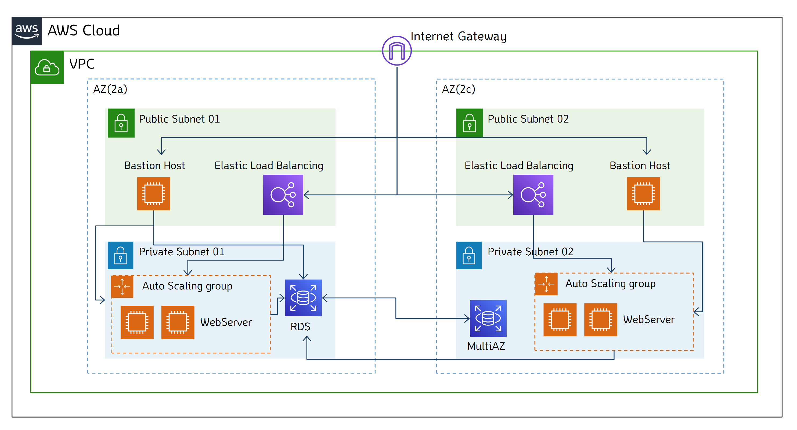
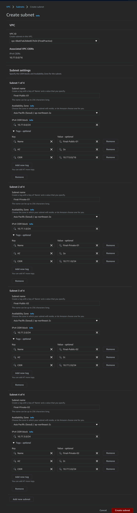

# 3-Tier 기본 인프라 구성

## 개념도

---



## TODO

---

- [x]  VPC생성
- [x]  서브넷생성(public X 2, private X 2)
- [x]  public서버에 각각 bastion host 인스턴스 생성
- [x]  ELB생성후 Auto Scaling 연계 → 웹 서버 인스턴스 자동생성(2~6개)
- [x]  HOST → WebServer 접속 확인
- [x]  RDS DB생성(MySQL)
- [x]  HOST → Bastion Host → DB 접속 확인하기
- [x]  MySQL Workbench 연결 (SSH 터널링) (SQL IDE)
- [x]  Jetbrains DataGrip 연결  (SSH 터널링) (SQL IDE)
<!-- more -->
## VPC

---

1. VPC 생성
    
    
    
2. 서브넷 생성(public 2ea, private 2ea)
    
    
    
3. 서브넷 확인
    
    
    
4. 퍼블릭서브넷의 public-IP 자동할당 사용
    
    
    
    
    
    → 퍼블릭서브넷(총 2개)에 모두 적용
    
5. 라우팅테이블 생성
    
    
    
    
    
    
    
    → VPC당 IGW는 1개 이므로 public route table은 1개, private route table은 2개 생성
    
6.  IGW 생성
    
    
    
7.  IGW를 VPC에 attach
    
    
    
8. Final-Public-RT의 라우트 설정
    
    
    
9. private서브넷에는 NAT gateway 생성 후 할당(요금 발생으로 인해 실습X)
10. 라우팅테이블을 서브넷에 연결
    
    
    
    
    
    → Final-Public-02도 마찬가지로 Final-Public-RT에 연결
    
    → Final-Private-01, Final-Private-02 은 각각 Final-Private-01-RT, Final-Private-02-RT 연결
    

## EC2 Instance

---

1. SSH접속을 위한 Key pair 생성
    
    
    
    → putty 쓰려면 ppk선택(범용성이 떨어져 권장하지 않음)
    
2. Bastion Host 용 SG(보안그룹) 생성
    
    
    
3. Bastion Host Instance 생성 * 2ea
    
    
    
    
    
    
    
    
    
    
    
    
    
    → VPC, Subnet, SG 만 알맞게 조절
    
4. 이전에 생성한 키페어 선택
    
    
    
5. 같은 작업을 반복하여 Bastion-Host(2c) 생성

## Bastion Host 접속

---

1. Bastion Host(2a)의 public IP 할당을 확인
    
    
    
2. 터미널 열어서 키페어파일 위치로 이동 후 다음 명령을 이용하여 접속
    
    ```
    ssh -i FINAL-KEY.pem [ec2-user@13.125.83.172](mailto:ec2-user@13.125.83.172)
    ```
    
3. SSH 최초 접속시 hash 값 확인 → yes 입력
4. 접속 확인(bastion host 정상작동)
    
    
    

## ELB 만들기

---

1. LoadBalancer(internet Facing)를 위한 SG(보안그룹)을 생성해줍니다
    
    
    
    → internetFacing이기 때문에 모든 포트를 오픈해줍니다
    
2. WebServer를 위한 SG를 생성합니다.
    
    
    
    → 보안그룹체이닝을 이용하여 ELB에게만 HTTP포트를 오픈해줍니다
    
3. 좌측 메뉴의 Load Balancing → Target Groups에서 새로운 Target Group을 생성합니다
    
    
    
    → VPC만 설정하고 다른 부분은 기본값으로 진행합니다
    
4. 일단 인스턴스 추가 없이 생성합니다
    
    
    
5. Load Balancing → Load Balancers에서 새 LB를 생성합니다
    
    
    
6. Internet-Facing LB 이므로 퍼블릭서브넷에 생성해줍니다
    
    
    
7. 이전에 생성해둔 LB용 SG를 선택합니다
    
    
    
8. Target Group도 사전에 만들어둔 TG-21-01-12를 선택합니다
    
    
    

## Auto Scaling

---

1. EC2 좌측 메뉴 Auto Scaling → Launch Configuration 에서 새로 작성합니다
    
    
    
2. 이름을 할당하고 AMI를 선택해줍니다. 미리 만들어둔 AMI가 없으면 새로 만들면 됩니다
    
    
    
    → 웹 서버용 SG를 선택하고 키페어도 연결해줍니다
    
3. 좌측메뉴 Auto Scaling Groups을 진입하고 Create Auto Scaling Group을 클릭합니다
    
    
    
4. 오토스케일러 이름을 할당하고 Launch Configuration을 선택해줍니다.
    
    
    
    → 목록에 안 보이면 밑줄 친 부분을 누르면 됩니다
    
5. 오토스케일을 적용할 서브넷(private)을 선택합니다
    
    
    
6.  이 전에 만들어둔 로드밸런서를 사용합니다
    
    
    
7. 목표, 최소, 최대 인스턴스 개수와 스케일링 정책을 작성합니다
    
    
    
8. 스케일러에 의해 시작된 인스턴스에 붙일 태그를 작성합니다
    
    
    
9. EC2 인스턴스에 들어가보면 2-4의 목표값인 '2개'만큼 인스턴스가 실행되어있습니다
    
    
    
10. ELB의 DNS 주소를 찾아봅니다
    
    
    
11. 해당 DNS주소에 접속하면 웹서버로 진입할 수 있습니다
12. 사전에 생성해둔 서버 화면이 표시됩니다.
    
    
    
    → 화면에선 AZ 메타정보(2a)를 확인해볼 수 있습니다
    
13. 라운드로빈 방식의 LB이기 때문에 접속을 할 때 마다 서버가 변경됩니다.
    
    새로고침을 하면 다른 AZ(2c)의 웹서버에 접속된 걸 확인할 수 있습니다.
    
    
    

## Bastion Host → 웹 서버 접속

---

1. SSH로 Bastion host에 접속합니다
    
    
    
2. PEM키 파일을 Bastion 에 다운로드합니다
    
    단순 실습을 위해 AWS S3에 업로드 후 wget을 이용하여 다운로드 하였습니다
    
    나중에 현장에서 이렇게 일 하면 안됩니다
    
    
    
3. Webserver SG에 bastion host 를 위한 SSH 포트를 개방합니다
    
    체이닝된 source SG는 FINAL-SG-Bastion입니다
    
    
    
4. 스케일러에 의해 생성된 서버의 내부 IP를 찾습니다
    
    
    
5. Bastion의 터미널에 다음과 같은 명령으로 Webserver에 접속합니다
    
    ```
    ssh -i FINAL-KEY.pem ec2-user@10.77.3.93
    ```
    
6. 다음 에러 발생시 chmod를 적용합니다
    
    
    
    ```
    chmod 400 FINAL-KEY.pem
    ```
    
7. 재접속 하면 정상적으로 WebServer에 연결된 것을 볼 수 있습니다
    
    
    

## RDS(MySQL)

---

1. DB서버를 위한 SG를 생성합니다
    
    BastionHost와 WebServer에서 3306포트를 접속할 수 있도록 SG체이닝을 넣어줍니다
    
    
    
2. AWS RDS페이지에서 DB에 사용할 서브넷 설정을 생성합니다.
    
    DB는 private 서브넷에 상주하는 것을 생각하고 알맞게 체크하면 됩니다.
    
    
    
3. AWS RDS페이지에서 Create database를 선택합니다
    
    
    
4. MySQL을 선택합니다
    
    학습용이니 하단의 Free Tier제한 옵션도 선택해줍니다
    
    
    
5. subnet, SG를 잘 선택해주고 DB관련한 값을 알맞게 적어줍니다
    
    /* 
    
    DB식별자 : dbdb(x) → mydb
    
    Master User : DBadmin
    
    Password : DB-password
    
    DatabaseName : lab
    
    */
    
    
    
    
    
    
    

## DB동작 확인

---

1. SSH를 이용해 Bastion Host에 접속합니다.
    
    
    
2. 다음 명령을 이용해 Bastion Host에 MySQL을 설치합니다
    
    ```
    sudo yum -y install mysql
    ```
    
3. 서버접속을 위해 다음 명령을 이용해 MySQL 을 사용합니다
    
    ```
    mysql -h {DNS} -P {PORT} -u {USER} -p
                             ↓(예시)
    mysql -h mydb.cnr20hoyd3cu.ap-northeast-2.rds.amazonaws.com -P 3306 -u DBadmin -p
    ```
    
4. 'MySQL>' 이 뜨면 접속 성공한 것입니다
    
    
    

## MySQL workbench

---

1. MySQL Workbench 다운로드 & 실행
    
    [MySQL :: Download MySQL Workbench](https://dev.mysql.com/downloads/workbench/)
    
2.  Basiton Host 사용시 아래와 같이 입력
    
    
    
3. 올바르게 작성된 예시
    
    
    
4. OK누르면 비밀번호 입력창이 뜹니다
    
    
    
5. 접속 완료하였습니다
    
    
    

## Jetbrains DataGrip

---

1. DataGrip을 실행합니다
    
    
    
2. MySQL 연결을 새로 만듭니다
    
    
    
3. SSH를 선택하고 터널링 설정을 엽니다
    
    
    
4. BastionHost의 정보를 입력해줍니다
    
    
    
5. General로 돌아와서 host, port, User, password 입력합니다
    
    
    
6. 접속에 성공하였습니다
    
    
    
