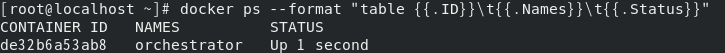

# Failover for HA

## 목표

---

- 오케스트레이터를 이용한 HA 구현
- 오케스트레이터 GUI도구를 이용한 쉬운 이해
- Master가 다운되면 자동으로 Fail-Over 동작
- 인위적으로 마스터를 다운시켜서 동작 확인
- 사람의 개입 없이 자동으로 FailOver가 이뤄지도록 자동화를 구현
<!-- more -->
## 오케스트레이터 세팅

### 오케스트레이터 컨테이너 로드

---

1. 오케스트레이터 컨테이너를 로드합니다(openarkcode/orchestrator)
    
    이전에 생성한 mybridge에 연결하며 호스트포트 3000에 매핑합니다
        
    ```s
    docker run -i -t --name orchestrator -h orchestrator --net mybridge --net-alias=orchestrator -p 3000:3000 -d openarkcode/orchestrator:latest
    ```
    
2. 컨테이너가 잘 로드되었는지 확인합니다
    
    ```s
    docker ps --format "table {{.ID}}\t{{.Names}}\t{{.Status}}"
    ```
    
    
    

### 오케스트레이터를 위한 DB 설정

---

1. 이전의 작업을 이어서 하기 위해 DB컨테이너를 재시작 합니다
    
    컨테이너(도커 호스트)를 종료하지 않았다면 생략합니다
    
    ```s
    docker start db001 db002 db003
    ```
    
2. db001 SQL DB에 접속합니다
    
    ```s
    docker exec -it -uroot db001 /bin/bash
    mysql -uroot -p
    ```
    
3. 오케스트레이터를 위한 MySQL 유저 생성합니다
        
    ```sql
    CREATE USER orc_client_user@'172.%' IDENTIFIED BY 'orc_client_password';
    ```
        
4. 필요한 권한을 부여합니다 1
    
    ```sql
    GRANT SUPER, PROCESS, REPLICATION SLAVE, RELOAD ON *.* TO orc_client_user@'172.%';
    ```
    
5. 필요한 권한을 부여합니다 2
        
    ```sql
    GRANT SELECT ON mysql.slave_master_info TO orc_client_user@'172.%';
    ```
        
6. 웹브라우저에서 호스트의 3000번 포트에 연결하여 오케스트레이터 GUI에 접속합니다
    
    ```s
    http://{DOCKER HOST IP}:3000
    //EC2 인스턴스를 사용하는 경우 네트워크 인바운드에 3000번 포트를 열어줘야합니다
    ```
    

### 오케스트레이터 설정

---

1. 오케스트레이터에 컨테이너를 추가하기 위해 Clusters → Discover로 진입합니다
    
    
    
2. 컨테이너의 이름과 (호스트)포트 번호를 등록합니다
    
    
    
3. 오케스트레이터가 db001을 찾는데 성공했습니다
    
    
    
4. Dashboard에서 db001 컨테이너의 ID를 눌러 진입합니다
    
    
    
5. 오케스트레이터가 SLAVE로 연결된 DB까지 잘 찾았습니다
    
    
    
    마스터와 슬레이브가 연결될 때 까지 시간이 조금 걸릴 수 있습니다 
    
6. 이때 컨테이너 ID가 아닌 별칭으로 콘솔을 제어하고 싶으면 컨테이너를 생성할 때 -h 옵션으로 hostname을 부여하면 됩니다

## HA(고가용성) 테스트

---

1. 장애상황을 만들기 위해 마스터DB 컨테이너(db001)을 정지합니다
        
    ```s
    docker stop db001
    ```
        
2. 컨테이너가 정지되었습니다
    
    
    
3. 오케스트레이터가 db001에 접속 불가능해진것을 확인했고, Recover가 필요함을 안내합니다
    
    
    
4. Recover(복구) 메뉴에서 db002를 선택합니다
    
    
    
5. 장애가 발생한 db001은 클러스터에서 격리되고
    
    
    
6. db002가 Master로 승격되었으며, db003은 Slave로써 db002를 Master 바라보고 있습니다
    
    
    
7. 마스터가 된 db002는 ReadOnly 값이 OFF 된 것을 콘솔에서 확인할 수 있습니다
    
    
    
8. 터미널에서 직접 확인해볼수도 있습니다
    
    db002 SQL DB에 접속합니다
        
    ```s
    docker exec -it -uroot db002 /bin/bash
    mysql -uroot -p
    ```
    
9. slave 상태조회 명령을 실행합니다
        
    ```s
    show slave status \G
    ```
    
10. 현재 Slave 상태가 아니기 때문에 empty set을 리턴합니다
    
    
    

## Fail-Over 이후 복구

---

1. 기존에 Master였던 db001 컨테이너를 다시 구동합니다
        
    ```s
    docker start db001
    ```
        
2. 컨테이너가 접속 가능한 상태이지만 여전히 클러스터에서 분리되어 있습니다
    
    
    
3. db001 컨테이너의 MySQL에 접속합니다
    
    ```s
    docker exec -it -uroot db001 /bin/bash
    mysql -uroot -p
    ```
        
4. db001을 slave로 동작시키기 위해 read_only로 설정합니다

    ```sql
    set global read_only=1;
    ```
        
5. db002 MASTER를 바라보도록 설정합니다
    
    ```sql
    CHANGE MASTER TO MASTER_HOST='db002', MASTER_USER='repl', MASTER_PASSWORD='repl', MASTER_AUTO_POSITION=1;
    ```
    
6. slave로써의 동작을 시작합니다

    ```sql
    start slave;
    ```
    
7. slave 상태를 확인합니다
    
    ```sql
    show slave status \G
    ```
    
8. db001이 db002를 마스터로 바라보고 있습니다
    
    
    
9. 콘솔에서 db002가 Master로써 동작하는 것을 확인할 수 있습니다
    
    
    
10. 페일오버가 발생했음을 확인하기 위해  콘솔에서 페일오버 내역을  Acknowledge 처리합니다
    
    
    
    ack등 코멘트를 입력해서 확인
    

## AUTO Fail-Over

---

1. 오케스트레이터 컨테이너에 접속합니다

    ```s
    docker exec -it orchestrator /bin/bash
    ```

2. 오케스트레이터 설정 파일을 수정합니다
    
    ```s
    vi /etc/orchestrator.conf.json
    ```
        
3. JSON에 다음 값을 수정 합니다. db001, db002간의 Failover만 테스트 하기 위해 db003이 마스터로 승격되는 일이 발생하지 않도록 제외해둡니다.
    
    이대로 구현되면 db001 ↔ db002 간에 장애 발생시 번갈아가며 Master로 승격됩니다
    
    ```conf
    "RecoverMasterClusterFilters":[
    "*"
    ],
    "PromotionIgnoreHostnameFilters":[
    "db003"
    ]
    ```
        
4. 오케스트레이터 컨테이너를 재시작 합니다
    
    ```s
    docker restart orchestrator
    ```
    
5. Auto Failover가 잘 설정되면 하트 표시에 불이 들어옵니다
    
    
    
6. db002 컨테이너를 중지하여 Fail-Over를 테스트합니다

    ```s
    docker stop db002
    ```
    
7. 별 다른 작업을 하지 않아도 db002가 클러스터에서 분리되었습니다
    
    
    
8. 옆집 클러스터에서 db001이 마스터로 잘 살고 있습니다
    
    
    
9. 페일오버가 잘 실행되었으면 복구를 위해 db002를 다시 로드합니다
    
    ```s
    docker start db002
    ```
    
10. db002의 MySQL서버에 접속합니다
    
    ```s
    docker exec -it -uroot db002 /bin/bash
    mysql -uroot -p
    ```
    
11. db001을 마스터로 바라보도록 db002를 slave로 설정합니다
    
    ```sql
    CHANGE MASTER TO MASTER_HOST='db001', MASTER_USER='repl', MASTER_PASSWORD='repl', MASTER_AUTO_POSITION=1;
    START SLAVE;
    ```
    
12. 이처럼 GUI 콘솔을 이용하면 변화를 쉽게 알 수 있습니다
    
    
    
    