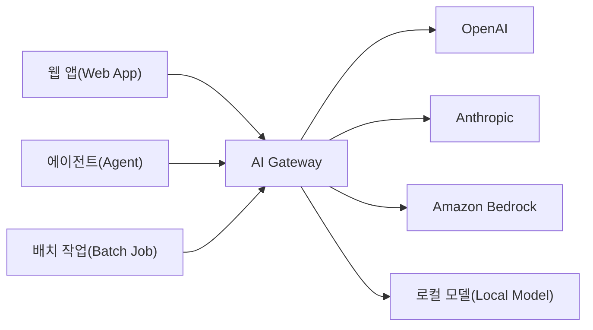
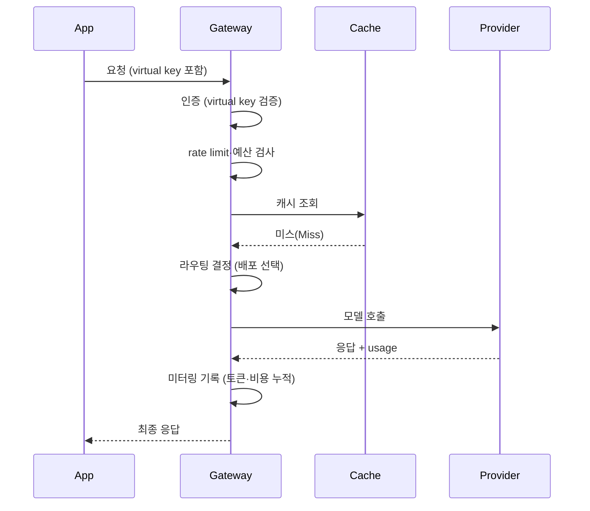

# AI Gateway 정리

<!-- more -->

## AI Gateway란
AI Gateway란 애플리케이션과 여러 LLM 프로바이더 사이에서 LLM 트래픽을 단일 API로 중계하고 통제하는 게이트웨이 계층

- 위치: 앱과 OpenAI·Anthropic·Bedrock 등 모델 프로바이더 사이의 중간 계층
- 인터페이스: 프로바이더별 SDK를 OpenAI 호환 단일 API로 통일
- 역할: 라우팅·캐싱·폴백·과금·가드레일·관측을 한 곳에서 집행
- 성격: 앱 코드 변경 없이 모델·프로바이더를 교체 가능한 제어 계층(Control Plane)
- 별칭: LLM Gateway, LLM Proxy, LLM Router로도 불림

---

## API Gateway와의 차이
API Gateway는 요청(Request) 단위의 마이크로서비스 트래픽을, AI Gateway는 토큰(Token) 단위의 LLM 트래픽을 다루는 것이 핵심 차이

| 비교 항목 | API Gateway | AI Gateway |
|-----------|-------------|------------|
| 과금·미터링 단위 | 요청 수 기준 | 토큰 사용량 기준 |
| 라우팅 기준 | URL 경로·HTTP 메서드 | 모델·비용·지연(Latency) 기반 동적 라우팅 |
| 캐싱 | 정확 일치(Exact Match) 캐시 | 의미 기반(Semantic) 캐시 |
| 스트리밍 | 일반 응답 프록시 | SSE(Server-Sent Events) 스트리밍 네이티브 |
| 가드레일 | WAF 수준의 요청 필터링 | 프롬프트 인젝션·PII 등 콘텐츠 계층 필터링 |
| 폴백 | 일반적으로 미제공 | 프로바이더 간 자동 폴백(429 → 타 프로바이더 재시도) |
| 관측성 | 요청 수·상태 코드·지연 | 토큰·비용·모델별 사용량 분석 |

---

## 필요한 이유
- 프로바이더 종속 제거: 멀티 프로바이더를 단일 API로 추상화해 특정 벤더 종속(Lock-in) 회피
- API 키 중앙 관리: 실제 키는 게이트웨이가 보관하고 앱에는 가상 키(Virtual Key)만 발급해 유출 방지
- 비용 통제: 팀·사용자·모델별 토큰 사용량 추적과 예산(Budget) 한도 집행
- 장애 폴백: 프로바이더 장애·429 발생 시 다른 모델로 자동 전환해 가용성 확보
- 관측성 확보: 요청·응답 로그, 지연, 토큰 비용을 한 곳에서 추적

---

## 구조



- 좌측: 여러 앱·에이전트가 프로바이더별 SDK 대신 게이트웨이 단일 엔드포인트로 요청
- 중앙: AI Gateway가 라우팅·캐싱·폴백·가드레일·과금을 일괄 처리
- 우측: 상용 프로바이더와 사내 로컬 모델을 동일한 인터페이스로 연결

---

## 동작 방식

### 요청 처리 파이프라인



- 인증 → 예산·rate limit 검사 → 캐시 조회 → 라우팅 → 호출 → 미터링 순으로 통과하는 단방향 파이프라인
- 캐시 히트(Hit) 시 라우팅·프로바이더 호출을 건너뛰고 즉시 응답 → 해당 요청의 토큰 비용 0

### 미터링(Metering)
- 비스트리밍: 프로바이더 응답의 usage 필드에서 입력·출력 토큰 수 확보
- 스트리밍: 종료 청크의 usage로 집계하거나, 미제공 시 tokenizer(tiktoken 등)로 추정
- 비용 산출: 토큰 수 × 모델별 단가표(입력·출력 1K 토큰당 요금)로 요청별 비용 계산
- 누적: 키(Key)·팀(Team)·모델 차원으로 DB에 spend 적재
- 환류: 누적값이 예산 한도·rate limit 초과 판정의 근거로 재사용됨

### 로드밸런싱
- 동일 모델의 여러 배포(키·리전·프로바이더)를 하나의 모델 그룹(Model Group)으로 묶음
- rate limit(RPM/TPM) 여유가 남은 배포를 우선 선택해 throttling 회피

| 전략 | 설명 |
|------|------|
| 가중치 라운드로빈 | 배포별 weight·RPM/TPM 비율에 따른 확률적 분산 |
| 최소 지연(Latency-based) | 최근 응답 지연이 가장 낮은 배포 선택 |
| 사용량 기반(Usage-based) | 실시간 TPM/RPM 소비량이 가장 적은 배포 선택 |

### 폴백 판정
- 일시적 오류(429·5xx·타임아웃): 동일 배포에서 지정 횟수만큼 재시도 → 소진 시 폴백 체인의 다음 모델로 전환
- 비일시적 오류(컨텍스트 윈도우 초과 등): 재시도 무의미 → 즉시 폴백
- 폴백 체인의 다음 모델도 실패하면 순서대로 후속 후보로 계속 이동

### 캐시 조회
- exact: 요청을 정규화·해시해 완전 일치 항목이 있으면 히트
- semantic: 프롬프트 임베딩의 코사인 유사도가 임계값(similarity threshold) 이상이면 히트
- exact 우선 조회 → 미스 시 semantic 조회 순으로 판정

---

## 핵심 기능 정리

| 기능 | 설명 |
|------|------|
| 통합 API | 프로바이더별 API를 OpenAI 호환 단일 스키마로 정규화 |
| 모델 라우팅 | 비용·지연·품질 기준으로 요청을 적절한 모델로 분배 |
| 폴백·재시도 | 프로바이더 오류·throttling 시 다른 모델로 자동 전환 |
| 로드 밸런싱 | 여러 키·리전에 요청을 분산해 rate limit 회피 |
| 시맨틱 캐싱 | 의미가 같은 프롬프트의 응답을 재사용해 토큰 비용 절감 |
| 가상 키 | 실제 키를 숨기고 앱별 발급·회수 가능한 대체 키 제공 |
| 비용·예산 관리 | 팀·모델별 토큰 비용 추적과 예산 한도 초과 차단 |
| 가드레일 | 프롬프트 인젝션·PII·유해 콘텐츠 입출력 필터링 |
| 관측성 | 요청·응답 로그, 지연, 토큰·비용 메트릭 수집 |

---

## 솔루션 비교
셀프호스팅 운영 부담을 기준으로 대표 5개 AI Gateway 솔루션을 배포 형태·핵심 기능·라이선스 관점에서 비교

|솔루션|배포 형태 / 라이선스|라우팅·폴백|캐싱|가드레일|관측성|비고|
|------|------------------|---------|-----|-------|------|-----|
|LiteLLM|셀프호스팅(Docker·Helm). MIT 오픈소스, Enterprise 유료 티어(SSO·RBAC·감사 로그).|지원. 폴백 체인·num_retries·다중 키 로드밸런싱.|Exact·Semantic 모두 지원.|지원. hook 플러그인·외부 가드레일 연동.|지원. 토큰·비용 추적, 로그, Admin UI.|OpenAI 호환 단일 API, 100+ 프로바이더. k8s는 Helm 차트로 배포.|
|Kong AI Gateway|셀프호스팅(Kong Gateway 플러그인)·Konnect SaaS. Gateway는 Apache 2.0, 고급 AI 기능은 Enterprise 유료.|지원. AI Proxy Advanced의 다중 LB 알고리즘·재시도·폴백(고급은 Enterprise).|Semantic 캐시(Enterprise).|지원. AI Prompt Guard(OSS), PII 마스킹·시맨틱 가드레일(Enterprise).|지원. 토큰·지연·비용, OpenTelemetry.|기존 Kong 운영 조직에 적합. 기능별 플러그인 조합. KIC로 k8s 연동.|
|Portkey|셀프호스팅·관리형 SaaS. MIT 오픈소스(2026년 거버넌스·관측 기능까지 오픈소스화).|지원. 가중치 로드밸런싱·조건부 라우팅·폴백·자동 재시도.|Simple·Semantic 모두 지원.|지원. 50+ 가드레일 플러그인.|지원. 요청·비용·지연 대시보드.|1,600+ LLM. 가드레일 통합이 강점. Docker·k8s 셀프호스팅.|
|Cloudflare AI Gateway|완전 관리형(셀프호스팅 없음). 상용, 무료 티어 + 유료.|지원. Dynamic Routing·자동 폴백.|Exact 캐시.|지원. 콘텐츠 모더레이션·DLP.|지원. Analytics·로깅.|프로바이더 앞단 프록시. 인프라 운영 부담 없음. k8s 무관.|
|Envoy AI Gateway|셀프호스팅(Kubernetes). Apache 2.0 오픈소스.|지원. 통합 모델 카탈로그·자동 failover.|미지원.|코어 미제공(상용 애드온으로 보강).|지원. OpenTelemetry·OpenInference 트레이싱.|Gateway API·Inference Extension 기반 k8s 네이티브. Envoy Gateway 확장.|

### 선택 가이드

|상황|추천|사유|
|----|----|----|
|빠른 셀프호스팅 시작|LiteLLM|Docker 한 방 기동, OpenAI 호환, MIT. 폴백·키 관리 즉시 사용.|
|기존 Kong 운영 조직|Kong AI Gateway|이미 쓰는 API 플랫폼에 AI 플러그인만 추가. 학습 곡선 최소.|
|가드레일·거버넌스 중심|Portkey|다수 가드레일 내장, 완전 오픈소스, 1,600+ LLM 커버.|
|운영 부담 최소 완전 관리형|Cloudflare AI Gateway|프로바이더 앞단에 얹기만 하면 됨. 서버·업그레이드 관리 불필요.|
|Kubernetes 네이티브|Envoy AI Gateway|Gateway API 표준 기반, Apache 2.0, 기존 Envoy 운영과 통합.|

---

## 가드레일
가드레일(Guardrail)이란 게이트웨이 계층에서 LLM 입출력을 검사하고 정책 위반 시 차단·마스킹하는 콘텐츠 통제 계층

### 위협 모델 정리
게이트웨이가 막아야 할 대상은 앱이 아니라 프롬프트·응답에 실린 콘텐츠

|위협|설명|게이트웨이 대응|
|----|----|--------------|
|프롬프트 인젝션(Prompt Injection)|사용자 입력에 지시문을 섞어 시스템 프롬프트를 무력화|pre-call 입력 검사, 패턴·인젝션 분류기|
|탈옥(Jailbreak)|역할극·인코딩으로 안전 정책을 우회|입력 검사 + 전용 탈옥 분류기(Prompt Shields류)|
|PII 유출 (입력)|사용자가 개인정보를 프롬프트에 그대로 포함|pre-call 입력 마스킹·차단|
|PII 유출 (출력)|모델 응답에 개인정보·학습 데이터가 노출|post-call 출력 마스킹·차단|
|유해 콘텐츠|혐오·폭력·성적 응답 생성|콘텐츠 모더레이션 분류로 차단|
|시스템 프롬프트 유출|추출 공격으로 내부 지침·규칙이 노출|출력 검사로 지침 문자열 차단|
|과금 남용|가상 키 유출로 토큰을 과소비|가상 키·rate limit·예산 한도로 별도 통제|

- 입력·출력은 서로 다른 위협 → 한쪽 훅만으로는 절반만 방어
- 인젝션·탈옥·유출은 경계가 겹침 → 단일 분류기보다 다층 배치가 현실적

### 가드레일 동작 위치
LiteLLM은 요청 파이프라인의 위치별로 훅을 걸 수 있음

- pre-call: LLM 호출 전 입력을 검사해 프로바이더 도달 전에 차단·마스킹으로 개입
- post-call: 응답 수신 후 입력과 출력을 함께 검사해 유출·유해 응답을 최종 차단
- during-call: LLM 호출과 병렬로 입력만 검사, 추가 지연을 줄이는 용도(블로킹 아님)
- logging-only: 요청 흐름은 그대로 두고 로그에만 마스킹 적용

탐지 후 처리 방식은 세 가지로 갈림

|모드|동작|적합|
|----|----|----|
|차단(Block)|정책 위반 시 요청·응답 자체를 4xx로 거부|인젝션·금칙 주제|
|마스킹(Mask)|탐지 구간만 placeholder로 치환하고 통과|PII 처리|
|로깅(Logging)|흐름 변경 없이 탐지 사실만 기록|정책 튜닝·관측|

### 구현 방식 비교
정확도와 비용은 대체로 같은 방향으로 올라감

|방식|동작|장점|단점·비용|
|----|----|----|--------|
|정규식·휴리스틱|고정 패턴·키워드 매칭|빠름, 무료, 외부 의존성 없음|문맥을 못 봐 오탐·미탐이 큼|
|PII 탐지 엔진 (Presidio)|NER·정규식·체크섬 조합, 신뢰도 점수 산출|MIT 오픈소스, 셀프호스팅, 다국어 지원|별도 서비스 운영 부담, 완전 탐지 보장 없음|
|LLM 판정 (LLM Judge)|별도 LLM이 입출력을 정책 기준으로 평가|문맥 이해, 자연어로 유연한 정책 표현|검사 호출마다 토큰 비용·지연 가산|
|벤더 관리형|Bedrock Guardrails·Azure AI Content Safety·Lakera 등 관리형 API|운영 부담 없음, 정책 세트·분류기 완비|텍스트 단위 종량 과금, 외부 전송 발생|

- Presidio는 무료 OSS로, Analyzer가 엔티티 위치·유형·신뢰도를 반환하고 Anonymizer가 치환
- Bedrock Guardrails는 정책별 종량 과금 → 콘텐츠 필터·민감정보 필터는 유료, 단어·정규식 기반 필터는 무료
- Azure AI Content Safety는 혐오·성적·폭력·자해 4개 범주 + 인젝션 탐지(Prompt Shields), 텍스트 레코드 단위 과금
- 벤더 가드레일 대부분은 유료 관리형 → 오픈소스 코어와 경계 확인 필요

### LiteLLM 설정 예시
게이트웨이의 litellm_config.yaml에 guardrails 블록을 추가하는 형태. 설정 형태는 다음과 같음(공식 문서 기준)

```yaml title="litellm_config.yaml"
guardrails:
  - guardrail_name: "pii-input-mask"       # 입력 PII 처리
    litellm_params:
      guardrail: presidio                  # Presidio 엔진 연동(별도 컨테이너 기동)
      mode: "pre_call"                      # LLM 호출 전 입력 검사
      presidio_score_thresholds:
        ALL: 0.7                            # 신뢰도 0.7 미만 탐지는 무시
      pii_entities_config:
        EMAIL_ADDRESS: "MASK"               # 이메일은 마스킹 후 통과
        CREDIT_CARD: "BLOCK"                # 카드번호는 요청 자체를 차단

  - guardrail_name: "pii-output-check"      # 출력 검사
    litellm_params:
      guardrail: presidio
      mode: "post_call"                     # 응답 수신 후 입력+출력 검사
      default_on: true                      # 모든 요청에 자동 적용
```

- mode는 배열도 허용 → `mode: [pre_call, post_call]`로 입출력 동시 검사
- guardrail 값을 aporia·bedrock·lakera 등으로 바꾸면 벤더 가드레일로 교체됨
- MASK는 `<CREDIT_CARD>` 형태 placeholder로 치환, BLOCK은 요청을 거부

### 운영 주의
- 오탐↔미탐 트레이드오프: 신뢰도 임계값을 낮추면 오탐↑, 높이면 미탐↑ → 도메인별 튜닝 필요
- 지연 추가: pre-call·post-call은 요청 경로에 직렬로 붙어 응답 지연↑, during-call 병렬화로 완화
- 가드레일 자체 비용: LLM 판정·벤더 가드레일은 검사 호출이 곧 과금이라 원 호출 비용에 가산됨
- 감사 로그: 차단·마스킹 이벤트를 별도 로그로 남겨 정책 튜닝과 규정 준수 근거로 활용
- 단일 가드레일로는 완전 차단이 불가능해 입출력 양방향에 서로 다른 방식을 겹쳐 배치하는 편이 현실적

---

### 참고
- LiteLLM으로 게이트웨이를 세워 라우팅·폴백·캐시·예산을 실측한 실습: [LiteLLM으로 AI Gateway 구축과 운영](ai_gateway_litellm.md)
- Kong AI Gateway 공식 문서: https://developer.konghq.com/ai-gateway/
- Cloudflare AI Gateway Features: https://developers.cloudflare.com/ai-gateway/features/
- Envoy AI Gateway 공식 문서: https://aigateway.envoyproxy.io/docs/
- LiteLLM Guardrails Quick Start: https://docs.litellm.ai/docs/proxy/guardrails/quick_start
- Microsoft Presidio 공식 문서: https://microsoft.github.io/presidio/
- Amazon Bedrock Guardrails 문서: https://docs.aws.amazon.com/bedrock/latest/userguide/guardrails-how.html

---

## 결론
- AI Gateway는 앱과 여러 LLM 프로바이더 사이의 단일 제어 계층으로 요청이 아닌 토큰 기준으로 트래픽을 통제
- 라우팅·캐싱·폴백·미터링·가드레일·관측을 한 곳에 모아 벤더 종속 제거·비용 통제·가용성·안전을 동시 확보
- 솔루션은 셀프호스팅 유연성(LiteLLM·Portkey), 관리형 편의(Cloudflare), k8s 표준(Envoy), 기존 API 플랫폼 재활용(Kong)으로 갈림
- 가드레일은 pre-call·post-call 양방향에 서로 다른 방식을 겹쳐야 완전에 근접
- API Gateway는 "요청을 나르는 문", AI Gateway는 "토큰을 지키는 문"이라고 이해하면 됌
