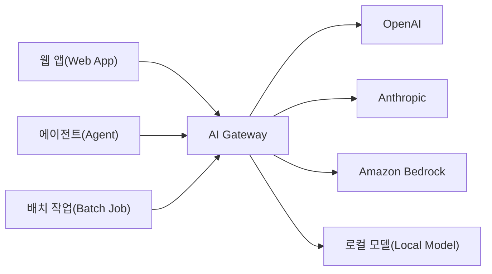

# AI Gateway란

<!-- more -->

## AI Gateway란
AI Gateway란 애플리케이션과 여러 LLM 프로바이더 사이에서 LLM 트래픽을 단일 API로 중계하고 통제하는 게이트웨이 계층

- 위치: 앱과 OpenAI·Anthropic·Bedrock 등 모델 프로바이더 사이의 중간 계층
- 인터페이스: 프로바이더별 SDK를 OpenAI 호환 단일 API로 통일
- 역할: 라우팅·캐싱·폴백·과금·가드레일·관측을 한 곳에서 집행
- 성격: 앱 코드 변경 없이 모델·프로바이더를 교체 가능한 제어 계층(Control Plane)
- 별칭: LLM Gateway, LLM Proxy, LLM Router로도 불림

---

## API Gateway와의 차이
API Gateway는 요청(Request) 단위의 마이크로서비스 트래픽을, AI Gateway는 토큰(Token) 단위의 LLM 트래픽을 다루는 것이 핵심 차이

| 비교 항목 | API Gateway | AI Gateway |
|-----------|-------------|------------|
| 과금·미터링 단위 | 요청(Request) 수 기준 | 토큰(Token) 사용량 기준 |
| 라우팅 기준 | URL 경로·HTTP 메서드 | 모델·비용·지연(Latency) 기반 동적 라우팅 |
| 캐싱 | 정확 일치(Exact Match) 캐시 | 의미 기반(Semantic) 캐시 |
| 스트리밍 | 일반 응답 프록시 | SSE(Server-Sent Events) 스트리밍 네이티브 |
| 가드레일 | WAF 수준의 요청 필터링 | 프롬프트 인젝션·PII 등 콘텐츠 계층 필터링 |
| 폴백 | 일반적으로 미제공 | 프로바이더 간 자동 폴백(429 → 타 프로바이더 재시도) |
| 관측성 | 요청 수·상태 코드·지연 | 토큰·비용·모델별 사용량 분석 |

---

## 필요한 이유
- 프로바이더 종속 제거: 멀티 프로바이더를 단일 API로 추상화해 특정 벤더 종속(Lock-in) 회피
- API 키 중앙 관리: 실제 키는 게이트웨이가 보관하고 앱에는 가상 키(Virtual Key)만 발급해 유출 방지
- 비용 통제: 팀·사용자·모델별 토큰 사용량 추적과 예산(Budget) 한도 집행
- 장애 폴백: 프로바이더 장애·429 발생 시 다른 모델로 자동 전환해 가용성 확보
- 관측성 확보: 요청·응답 로그, 지연, 토큰 비용을 한 곳에서 추적

---

## 구조

- 좌측: 여러 앱·에이전트가 프로바이더별 SDK 대신 게이트웨이 단일 엔드포인트로 요청
- 중앙: AI Gateway가 라우팅·캐싱·폴백·가드레일·과금을 일괄 처리
- 우측: 상용 프로바이더와 사내 로컬 모델을 동일한 인터페이스로 연결

---

## 핵심 기능 정리

| 기능 | 설명 |
|------|------|
| 통합 API(Unified API) | 프로바이더별 API를 OpenAI 호환 단일 스키마로 정규화 |
| 모델 라우팅 | 비용·지연·품질 기준으로 요청을 적절한 모델로 분배 |
| 폴백·재시도(Fallback) | 프로바이더 오류·throttling 시 다른 모델로 자동 전환 |
| 로드 밸런싱 | 여러 키·리전에 요청을 분산해 rate limit 회피 |
| 시맨틱 캐싱(Semantic Cache) | 의미가 같은 프롬프트의 응답을 재사용해 토큰 비용 절감 |
| 가상 키(Virtual Key) | 실제 키를 숨기고 앱별 발급·회수 가능한 대체 키 제공 |
| 비용·예산 관리 | 팀·모델별 토큰 비용 추적과 예산 한도 초과 차단 |
| 가드레일(Guardrail) | 프롬프트 인젝션·PII·유해 콘텐츠 입출력 필터링 |
| 관측성(Observability) | 요청·응답 로그, 지연, 토큰·비용 메트릭 수집 |

---

## 대표 솔루션
- LiteLLM: 오픈소스 셀프 호스팅형, 100여 개 프로바이더를 OpenAI 호환 엔드포인트로 래핑
- Kong AI Gateway: 기존 Kong API 관리 플랫폼에 LLM 라우팅·PII 마스킹 플러그인 결합
- Portkey: 거버넌스·가드레일·관측에 특화된 AI 운영 플랫폼 내장형 게이트웨이
- Cloudflare AI Gateway: 완전 관리형(Managed), 캐싱·분석을 프로바이더 앞단에 추가
- Envoy AI Gateway: Envoy·Kubernetes 프리미티브 기반의 클라우드 네이티브 게이트웨이

각 솔루션의 아키텍처·기능·운영 부담 상세 비교는 연재 후속 편에서 정리 예정.

---

## 결론
- AI Gateway는 앱과 여러 LLM 프로바이더 사이의 단일 제어 계층
- 요청이 아닌 토큰 기준으로 트래픽을 다루며 라우팅·캐싱·폴백·가드레일·관측을 통합
- 멀티 프로바이더 환경에서 벤더 종속 제거·비용 통제·가용성 확보의 최소 단위 인프라
- 다음 편에서는 LiteLLM으로 게이트웨이를 직접 구축하는 실습 예정
- API Gateway는 "요청을 나르는 문", AI Gateway는 "토큰을 지키는 문"이라고 이해하면 됌
