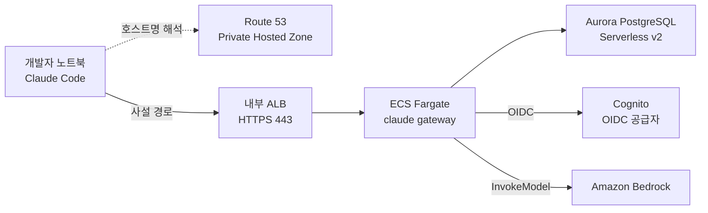

# 사내 Claude Code 게이트웨이 Claude Apps Gateway 구축 정리

개발자에게 API 키를 나눠주지 않고 Claude Code를 사내에 배포하는 자체 호스팅 게이트웨이를 정리했다. 사설 네트워크만 허용하는 제약에서 파생되는 AWS 구성과 배포 절차를 다룬다.

<!-- more -->

## Claude Apps Gateway란
Claude Apps Gateway란 Claude Code의 로그인과 추론 요청을 사내에서 중계해 개발자에게 자격 증명을 넘기지 않고 모델을 쓰게 하는 자체 호스팅 서버

- 목적: AWS 키도 Anthropic 키도 개발자 노트북에 두지 않음
- 인증: Cognito를 OIDC 공급자로 삼아 사내 계정으로 로그인
- 추론: 게이트웨이가 ECS 태스크 역할로 Amazon Bedrock 호출
- 배치: 사설 네트워크에서만 도달 가능한 위치에 둠
- 형태: 게이트웨이 전용 설치본이 따로 없음 → 노트북에서 Claude Code를 띄우는 claude 명령을 서버 모드로 실행하는 방식

AWS가 공개한 [claude-apps-gateway-on-aws](https://github.com/aws-samples/sample-apj-sup-sa/tree/main/ai-coding-assistants/claude-apps-gateway-on-aws) 샘플이 이 게이트웨이를 CDK 한 스택으로 올리는 구성. 이하 정리는 그 스택 기준.

### AI Gateway와의 위치 구분
이름이 비슷하지만 [AI Gateway 정리](ai_gateway.md)에서 다룬 계층과는 맡는 일이 다름

- AI Gateway: 여러 프로바이더의 LLM 트래픽을 토큰 단위로 통제하는 범용 계층
- Claude Apps Gateway: Claude Code 한 제품의 신원·정책·자격 증명을 다루는 제어 계층
- 겹치는 부분은 모델 호출 중계뿐이고, 라우팅·시맨틱 캐싱·멀티 프로바이더 폴백은 범위 밖

---

## 사설 네트워크 제약
로그인할 때 Claude Code가 게이트웨이 주소를 DNS로 조회하고 돌아온 IP를 살펴봄. 전부 사설 대역이면 통과, 공인 IP가 하나라도 섞여 있으면 그 주소를 게이트웨이로 인정하지 않고 로그인을 중단함. 아래 AWS 구성이 이런 모양인 이유도 대부분 이 검사 하나를 통과시키기 위한 것.

사설로 인정되는 IP 대역은 다음과 같음.

- RFC 1918 사설 대역
- link-local
- CGNAT `100.64.0.0/10`
- IPv6 ULA `fc00::/7`
- loopback

검사하는 이유는 게이트웨이의 권한 때문. 신뢰된 게이트웨이는 개발자 머신에서 명령을 실행하는 managed settings를 내려보낼 수 있어서, 아무 호스트나 게이트웨이로 지정하지 못하게 사설 주소로 묶어 둔 것.

| 제약 | 귀결 |
|------|------|
| 호스트명이 사설 IP로만 해석돼야 함 | ALB를 internal로 생성 |
| 퍼블릭 DNS에 게이트웨이 이름이 있으면 안 됨 | Route 53 Private Hosted Zone에 레코드 배치 |
| 공인 IP 노출 금지 | CloudFront를 로그인 경로에서 배제 |
| 개발자가 VPC 안쪽에 닿아야 함 | Client VPN·Direct Connect·ZTNA·사내 개발용 VM 중 하나 필요 |

- 이 검사는 직접 호스팅하는 게이트웨이에 적용됨
- 사설 경로 확보는 스택 밖의 일이라 별도로 준비해야 함

---

## 아키텍처



### 배포 리소스

| 리소스 | 용도 |
|--------|------|
| VPC (2 AZ, NAT 1개) | 퍼블릭·애플리케이션·격리 DB 3계층 서브넷 |
| 내부 ALB (HTTPS 443) | ACM 인증서로 TLS 종료. 허용 CIDR에서만 443 수신 |
| ECS Fargate | claude gateway 실행. ARM64, 512 CPU / 1024 MiB |
| Aurora PostgreSQL Serverless v2 | 디바이스 플로우·세션·rate limit 상태 보관. 0.5~2 ACU, 백업 7일 |
| Cognito User Pool + 앱 클라이언트 | OIDC 공급자. 셀프 가입 비활성, 이메일 로그인 |
| ACM 인증서 | 퍼블릭 호스팅 영역에서 DNS 검증 후 ALB에 연결 |
| Secrets Manager 3종 | DB 자격 증명, JWT 시크릿 48자, Cognito 클라이언트 시크릿 |
| Route 53 Private Hosted Zone | 게이트웨이 FQDN 이름으로 영역 생성, 영역 apex에 ALB alias |
| CloudWatch Logs + 알람 | 로그 1개월 보존, unhealthy host 알람 |

- 게이트웨이가 PostgreSQL 14 이상을 요구해서 상태 저장소로 Aurora PostgreSQL을 씀
- Client VPN, Route 53 Resolver 엔드포인트, Cognito 사용자 계정은 스택이 만들지 않음

---

## 요청 경로
1. 개발자가 Claude Code에서 로그인을 실행하면 Private Hosted Zone이 게이트웨이 이름을 내부 ALB의 사설 IP로 해석
2. 내부 ALB가 443에서 TLS를 종료하고 게이트웨이 태스크의 8080으로 전달
3. 게이트웨이가 Cognito 상대로 OIDC authorization code 흐름을 수행하고, 허용 목록에 있는 이메일 도메인만 통과
4. 발급된 토큰과 세션·rate limit 상태를 Aurora에 기록
5. 이후 추론 요청은 게이트웨이가 받아 ECS 태스크 역할로 Bedrock에 전달
6. 개발자 쪽에는 세션만 남고 AWS 키나 Anthropic 키는 전달되지 않음

- 자격 증명이 사라지는 지점은 5번 → 모델 호출 권한이 태스크 역할에만 있어 노트북에는 정적 키가 필요 없음
- 헬스체크는 두 갈래로, 타깃 그룹은 `/readyz`를 보고 컨테이너는 `/healthz`를 봄

---

## 네트워크 격리
계층마다 보안 그룹을 따로 둬서 각 구간이 한 방향으로만 열림

| 계층 | 서브넷 유형 | 배치 | 인그레스 허용 |
|------|-----------|------|-------------|
| 퍼블릭 | `PUBLIC` | NAT Gateway | 없음 |
| 애플리케이션 | `PRIVATE_WITH_EGRESS` | 내부 ALB, Fargate 태스크 | 443은 허용 CIDR에서, 8080은 ALB 보안 그룹에서만 |
| 데이터베이스 | `PRIVATE_ISOLATED` | Aurora | 5432를 태스크 보안 그룹에서만 |

- NAT가 필요한 이유는 이미지 받기, OIDC 디스커버리, Bedrock 호출의 아웃바운드 경로
- Aurora는 격리 서브넷에 있어 게이트웨이 태스크 외에는 경로 자체가 없음

---

## 설정 값
배포 전 `cdk.context.json`에 채우는 값 중 설계 결정이 걸린 것

| 컨텍스트 키 | 의미 |
|-----------|------|
| `gatewayHost` | 사설 게이트웨이 FQDN. ACM 인증서 주체와 동일 |
| `hostedZoneName` | ACM DNS 검증에만 쓰는 퍼블릭 영역 이름. 사설 DNS와 별개 |
| `allowedClientCidrs` | 내부 ALB 443에 닿을 수 있는 CIDR |
| `allowedEmailDomains` | 게이트웨이가 받아들일 Cognito 이메일 도메인 |
| `cognitoDomainPrefix` | Cognito 호스팅 도메인 접두사. 리전 안에서 전역 고유 |
| `bedrockRegion` | 추론을 보낼 리전 |
| `claudeVersion` | 이미지에 넣을 Claude Code 버전 고정값 |
| `desiredCount` / `natGateways` | Fargate 태스크 수와 NAT Gateway 수 |

- ACM은 인증서를 내주기 전에 도메인 소유자가 맞는지 확인하려고 검증용 DNS 레코드를 인터넷에서 조회함 → `hostedZoneName`에 해당하는 퍼블릭 영역이 없으면 발급이 막힘
- 퍼블릭에 올라가는 것은 그 검증용 레코드뿐이고, 게이트웨이 이름 자체는 퍼블릭에 노출되지 않음
- 사설 DNS는 `gatewayHost` 이름으로만 영역을 만들어 나머지 사내 도메인은 퍼블릭 해석을 유지

---

## 배포 절차
1. `cdk.context.json.example`을 복사해 위 컨텍스트 값을 채움
2. 바이너리 준비 스크립트로 linux-arm64 네이티브 바이너리를 받아 `docker/claude`에 배치. GPG 서명과 SHA256를 검증하는 단계라 건너뛰면 안 됨
3. 빌드와 테스트를 거쳐 부트스트랩 후 배포. 첫 배포는 ACM이 DNS 검증을 마칠 때까지 몇 분 멈춤
4. Cognito에 첫 사용자를 만들고 스택 출력의 게이트웨이 URL을 개발자 managed settings에 반영

```s
cp cdk.context.json.example cdk.context.json
npm run prepare:claude -- 2.1.195
npm install
npm run build && npm test
npm run cdk -- bootstrap aws://ACCOUNT_ID/us-east-1
npm run cdk -- deploy
```

- 전제 조건은 Node.js와 npm, ARM64 이미지 빌드용 Docker, AWS CLI 자격 증명, 바이너리 검증용 curl과 gpg
- 게이트웨이 서버와 개발자 머신 양쪽 모두 Claude Code 2.1.195 이상이어야 함
- Bedrock에서 쓰려는 Claude 모델의 접근 권한을 미리 활성화해 둘 것

---

## 개발자 연결
개발자가 직접 붙일 방법은 없고, 관리자가 배포한 managed settings가 로그인 대상을 지정함

- 로그인 화면에 게이트웨이 선택지 자체가 없음 → 개발자 개인 설정 파일에 URL을 적어도 무시됨
- 관리자가 MDM이나 디스크 배포로 각 머신에 설정 파일을 내려보내야 함

| OS | 경로 |
|----|------|
| macOS | `/Library/Application Support/ClaudeCode/managed-settings.json` |
| Linux / WSL | `/etc/claude-code/managed-settings.json` |
| Windows | `C:\Program Files\ClaudeCode\managed-settings.json` |

```json title="managed-settings.json"
{
  "forceLoginMethod": "gateway",
  "forceLoginGatewayUrl": "https://claude-gateway.corp.example.com"
}
```

- 두 키가 다 있어야 로그인 화면이 게이트웨이 항목으로 바로 열리고 URL이 채워짐
- `forceLoginMethod`만 두고 URL을 빼면 관리자에게 문의하라는 안내에서 멈춤
- Claude Desktop이 띄우는 세션에도 정책을 물려주려면 `parentSettingsBehavior`를 merge로 추가

설정 파일이 깔린 뒤 개발자가 하는 일은 다음과 같음.

1. VPN 등 사설 경로에 접속해 게이트웨이 이름이 사설 IP로 풀리는 상태를 만듦
2. Claude Code에서 로그인 실행. 채워진 URL을 확인하고 진행
3. 첫 연결에서 게이트웨이 TLS 인증서 지문을 관리자가 공지한 값과 대조
4. 브라우저로 사내 계정 로그인. claude.ai 계정·API 키·구독 모두 불필요

- 인증서 지문은 SHA-256 앞 16자리를 소문자 16진수로 표시 → 인증서를 교체하면 전원에게 다시 뜨므로 계획된 작업으로 다룰 것
- 적용 여부는 `/status`의 관리 설정 항목이나 `claude doctor`로 확인
- 로그인 후 모델 목록은 그 개발자에게 허용된 범위만 표시됨

---

## 운영 주의
- 태스크 역할 권한은 `bedrock:InvokeModel`과 `bedrock:InvokeModelWithResponseStream`을 `anthropic.*` 계열 ARN으로 한정 → 게이트웨이가 다른 모델이나 다른 API로 새지 않음
- managed settings는 기동 시 적용되고 이후 1시간 주기로 갱신되므로, 게이트웨이 URL을 바꾸면 개발자 쪽에도 반영됨
- 개발자 머신이 사내 프록시로 HTTPS를 보낸다면 프록시 호스트도 사설로 해석돼야 함
- 스택을 지워도 Client VPN과 개발자 머신의 managed settings 파일은 남으니 따로 정리
- NAT Gateway·ALB·Aurora는 유휴 상태에서도 과금되는 리소스라 상시 비용을 감안할 것
- 샘플은 us-east-1 기준이라 다른 리전은 Bedrock 모델 가용성과 설정 블록을 다시 봐야 함

---

## 결론
- Claude Apps Gateway는 개발자에게 키를 주지 않고 Claude Code를 쓰게 하는 자체 호스팅 중계 서버
- 구성의 모양은 로그인 시 호스트명이 사설 주소로만 해석돼야 한다는 제약에서 파생됨
- 그래서 내부 ALB와 Private Hosted Zone이 쓰이고 CloudFront와 퍼블릭 DNS가 배제됨
- 자격 증명은 ECS 태스크 역할 한 곳에만 남고 노트북에는 세션만 남음
- 상시 과금 리소스가 적지 않으므로 대상 인원과 사설 경로를 먼저 정한 뒤 올릴 것
