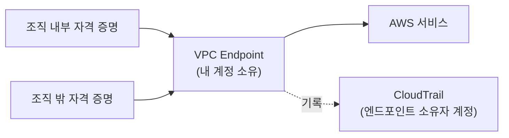

# CloudTrail 네트워크 활동 이벤트 정리

<!-- more -->

## 네트워크 활동 이벤트란
네트워크 활동 이벤트(Network Activity Events)란 VPC 엔드포인트를 통과한 AWS API 호출을 엔드포인트 소유자 계정에 기록하는 CloudTrail 이벤트 유형

- 기록 주체: 호출한 계정이 아니라 VPC 엔드포인트를 소유한 계정
- 포착 범위: 사설 VPC에서 엔드포인트를 거쳐 AWS 서비스로 나간 호출
- 목적: 조직 밖 자격 증명이 내 엔드포인트를 경유하려는 시도 탐지
- 기본값: 미기록 → `eventSource`별로 명시 설정해야 함
- 과금: 기록한 건수만큼 청구 → 관리 이벤트처럼 계정당 한 벌을 공짜로 받는 무료분이 없음



CloudTrail은 원래 API 호출을 그 자격 증명을 가진 계정 쪽에 기록함. 남의 계정 자격 증명으로 내 VPC 엔드포인트를 지나 S3를 호출하면 그 기록은 상대 계정 트레일에 남고, 정작 통로를 내준 내 계정에서는 아무것도 안 보임. 네트워크 활동 이벤트는 이 기준을 뒤집어 엔드포인트를 소유한 쪽에도 같은 호출을 남기는 유형.

- 남는 정보: 호출자 ARN, 이벤트명, 통과한 엔드포인트 ID, 접근 거부 여부
- 데이터 경계(Data Perimeter)란 내 조직의 자격 증명이 내 네트워크를 거쳐 내 리소스에만 닿도록 묶는 설계
- 이 설계에서 정작 봐야 할 것은 남의 자격 증명이 내 네트워크를 경유하는 경우인데, 관리·데이터 이벤트로는 상대 계정에만 기록이 남아 확인이 안 됨

---

## 엔드포인트 정책과의 역할 구분
VPC 엔드포인트 정책과 네트워크 활동 이벤트는 대체재가 아니라 차단과 기록으로 나뉨

| 구분 | VPC 엔드포인트 정책 | 네트워크 활동 이벤트 |
|------|--------------------|--------------------|
| 역할 | 조건에 안 맞는 호출을 거부 | 엔드포인트를 지난 호출을 기록 |
| 개입 시점 | 요청을 처리하기 전 차단 | 허용·거부 결과와 함께 기록 |
| 남는 것 | 거부 결과만, 시도 내역은 미보존 | 호출자·이벤트명·엔드포인트 ID |
| 조직 밖 자격 증명 | `aws:PrincipalOrgID` 조건으로 차단 가능 | 누가 몇 번 시도했는지 식별 가능 |
| 비용 | 없음 | 기록 건수 기준 과금 |

- 정책만 걸면 막히기는 하나 누가 두드렸는지 남지 않음 → 침해 조사 시 근거 부재
- 두 가지를 같이 써서 정책으로 막고 이벤트로 시도를 남기는 구성이 일반적

---

## 이벤트 유형 비교
CloudTrail 이벤트는 세 유형으로 나뉘고, 네트워크 활동 이벤트만 엔드포인트 경유 트래픽을 다룸

| 비교 항목 | 관리 이벤트 | 데이터 이벤트 | 네트워크 활동 이벤트 |
|-----------|------------|--------------|--------------------|
| `eventCategory` | `Management` | `Data` | `NetworkActivity` |
| 기록 대상 | 리소스 제어 평면 작업 | 리소스 내부 데이터 작업 | VPC 엔드포인트 경유 호출 |
| 기본 기록 | 기록됨 | 미기록 | 미기록 |
| 트레일 전달 요금 | 첫 사본 무료, 추가 사본 100,000건당 $2.00 | 100,000건당 $0.10 | 100,000건당 $0.10 |

- 요금은 트레일이 S3로 전달하는 이벤트 기준, 이벤트 데이터 스토어(CloudTrail Lake)는 수집 용량(GB) 기준의 별도 체계
- 네트워크 활동 이벤트를 이벤트 데이터 스토어에 담으려면 CloudTrail events 타입이어야 함

---

## 고급 이벤트 선택기 필드
네트워크 활동 이벤트는 고급 이벤트 선택기(Advanced Event Selector)로만 설정 가능

| 필드 | 필수 | 사용 가능 연산자 | 설명 |
|------|------|----------------|------|
| `eventCategory` | 필수 | `Equals`만 | 값은 `NetworkActivity` 고정 |
| `eventSource` | 필수 | `Equals`만 | `s3.amazonaws.com`, `kms.amazonaws.com` 등. 현재 70여 개 |
| `eventName` | 선택 | 전체 | 예: `CreateKey`, `ListKeys` |
| `errorCode` | 선택 | `Equals`만 | 유효값은 `VpceAccessDenied` 하나뿐 |
| `vpcEndpointId` | 선택 | 전체 | 호출이 통과한 엔드포인트 식별 |
| `userIdentity.arn` | 선택 | 전체 | 호출한 IAM 자격 증명. 트레일 전용 |

- `eventSource`가 `Equals`만 받으므로 여러 서비스를 담으려면 선택기를 서비스별로 따로 만들어야 함
- S3는 지원하되 Multi-Region Access Points 경유 호출은 미지원

---

## userIdentity.arn 필터
호출한 IAM 자격 증명에 따라 기록 여부가 갈림. 네트워크 활동 이벤트 지원은 2026년 7월 추가됐고, 데이터 이벤트와 관리 이벤트에서도 쓰이는 필드

- 활용: 신뢰하는 IAM 역할 집합에 없는 자격 증명의 `VpceAccessDenied`만 남기는 구성
- 효과: 승인된 주체의 성공 호출까지 전부 기록하는 비용 없이 유출 시도만 포착
- 조합: `eventName`·`vpcEndpointId`와 함께 걸어 기록 범위를 좁힐 수 있음

### 이벤트 유형별 지원 범위
같은 `userIdentity.arn`인데 이벤트 유형마다 쓸 수 있는 곳이 다름

| 이벤트 유형 | 트레일 | 이벤트 데이터 스토어 |
|------------|-------|--------------------|
| 관리 이벤트 | ❌ | ✅ |
| 데이터 이벤트 | ✅ | ✅ |
| 네트워크 활동 이벤트 | ✅ | ❌ |

- 관리 이벤트의 트레일 선택기가 받는 필드는 `eventCategory`·`eventSource`·`readOnly` 세 개뿐 → `eventName`·`eventType`·`sessionCredentialFromConsole`도 이벤트 데이터 스토어에서만 사용 가능
- 네트워크 활동 이벤트는 방향이 반대라 이벤트 데이터 스토어에서 자격 증명 필터를 못 씀
- CloudTrail Lake로 감사를 통합하려던 설계라면 이 지점에서 트레일을 따로 남겨야 함

### 설정 예시
신뢰 역할을 뺀 나머지 자격 증명의 S3 접근 거부만 기록하는 선택기

```s
aws cloudtrail put-event-selectors \
  --trail-name dotoryeee-audit-trail \
  --region ap-northeast-2 \
  --advanced-event-selectors '[
    {
      "Name": "Log untrusted VpceAccessDenied for S3",
      "FieldSelectors": [
        { "Field": "eventCategory", "Equals": ["NetworkActivity"] },
        { "Field": "eventSource", "Equals": ["s3.amazonaws.com"] },
        { "Field": "errorCode", "Equals": ["VpceAccessDenied"] },
        { "Field": "userIdentity.arn", "NotStartsWith": ["arn:aws:sts::111122223333:assumed-role/dotoryeee-app-role"] }
      ]
    }
  ]'
```

- 설정 확인은 `aws cloudtrail get-event-selectors --trail-name dotoryeee-audit-trail`
- 이벤트 데이터 스토어는 `create-event-data-store` 또는 `update-event-data-store`를 쓰되 `userIdentity.arn`은 제외해야 함

---

## 조건 평가 규칙
한 필드에 조건을 여러 개 걸면 연산자 성격에 따라 결합 방식이 갈림

| 연산자 그룹 | 연산자 | 결합 |
|------------|-------|------|
| SELECT | `Equals`, `StartsWith`, `EndsWith` | 서로 OR. 하나만 맞아도 통과 |
| DESELECT | `NotEquals`, `NotStartsWith`, `NotEndsWith` | 서로 AND. 하나만 걸려도 제외 |

- 두 그룹은 AND로 묶임 → DESELECT에 걸리면 SELECT를 만족해도 전달되지 않음
- 와일드카드 `*`는 미지원 → 여러 값을 한 조건으로 잡으려면 접두·접미 연산자를 씀
- 한 트레일 또는 이벤트 데이터 스토어의 모든 조건에 쓴 값의 합계는 500개까지

---

## 기록된 이벤트 확인
기록만 켜두면 쌓이기만 하므로 소비 경로를 같이 설계해야 함

- 트레일 대상은 S3 버킷 → Athena로 `VpceAccessDenied` 발생 건수를 집계
- 이벤트 데이터 스토어에 담았다면 CloudTrail Lake의 SQL로 조회
- 조회 시 유용한 필드는 `userIdentity.arn`, `vpcEndpointId`, `eventName`, `sourceIPAddress`
- 네트워크 활동 이벤트는 CloudWatch Logs 전달 대상이 아님 → 지표 필터·알람으로 바로 잇는 경로는 없음

---

## 운영 주의
- 트레일에 고급 이벤트 선택기를 적용하면 기존 기본 이벤트 선택기가 덮어써짐 → 데이터 이벤트 설정을 먼저 옮겨 적어야 함
- 트레일은 기본 선택기와 고급 선택기를 같이 쓸 수 없음
- 서비스마다 선택기를 따로 만들어야 하니 대상이 늘면 선택기 목록 관리가 필요
- 기록 범위를 좁히지 않고 켜면 정상 트래픽까지 전부 과금 대상
- `errorCode` 유효값과 `eventSource` 목록은 계속 늘어나는 값이라 설정 전 현행 문서 확인 권장

---

## 결론
- 네트워크 활동 이벤트는 VPC 엔드포인트를 지난 호출을 소유자 계정에 남기는 유형으로, 조직 밖 자격 증명의 접근 시도를 보는 경로
- 엔드포인트 정책이 차단을 맡고 이 이벤트가 시도 기록을 맡는 구성이 실용적
- `userIdentity.arn` 필터로 신뢰 역할을 제외하면 거부 이벤트만 남겨 비용과 노이즈를 함께 줄일 수 있음
- 같은 필드인데 관리 이벤트는 이벤트 데이터 스토어에서만, 네트워크 활동 이벤트는 트레일에서만 동작하므로 감사 저장소를 고르기 전에 확인할 것
