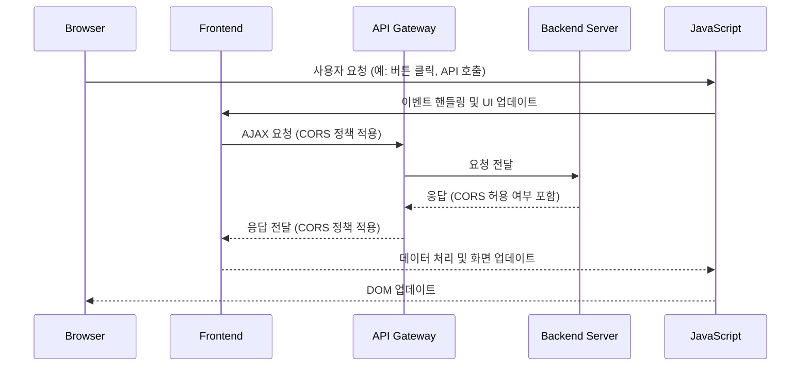
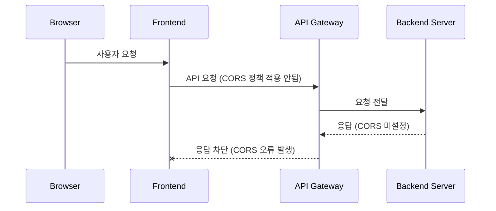
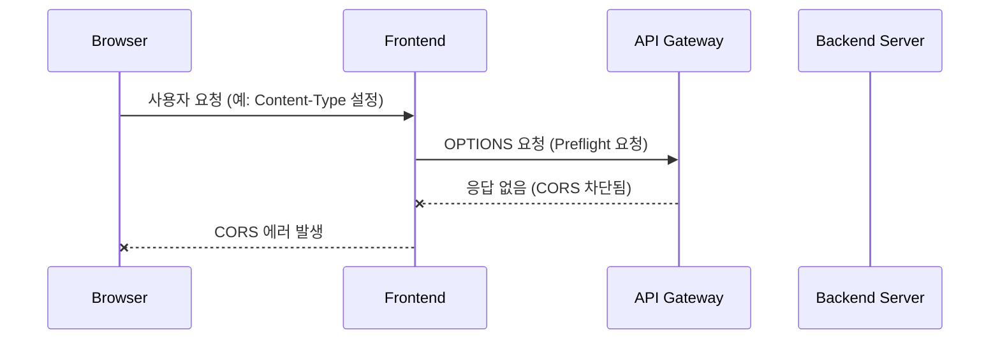
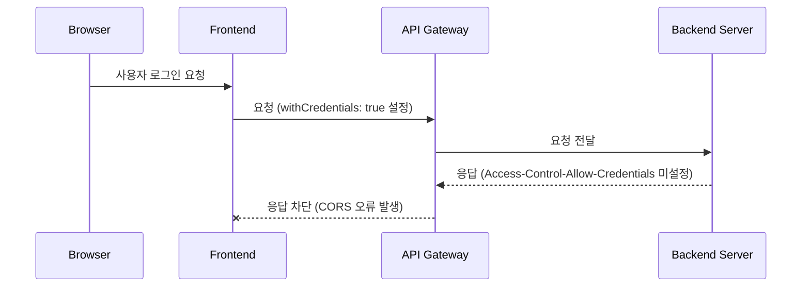
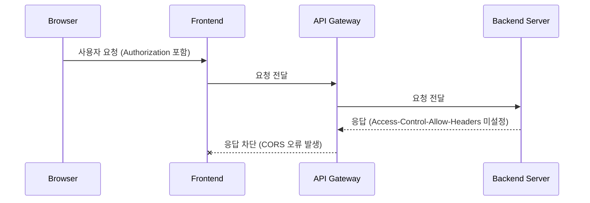
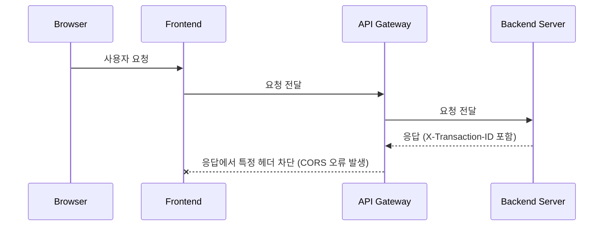

# CORS 정리

<!-- more -->

## CORS 에러 발생 시나리오

### 단순 요청 차단

- 원인: 
서버에서 CORS 관련 응답 헤더(Access-Control-Allow-Origin)를 설정하지 않음

- 해결 방법: 
서버에서 Access-Control-Allow-Origin 헤더를 올바르게 설정 (* 또는 특정 도메인 지정)

### 프리플라이트 요청 차단

- 원인: 
브라우저가 CORS 정책에 따라 OPTIONS 요청을 보내지만, 서버에서 이에 대한 응답을 제공하지 않음 
API Gateway가 OPTIONS 요청을 처리하지 않도록 설정됨

- 해결 방법: 
서버에서 OPTIONS 요청에 대한 응답을 허용하고 Access-Control-Allow-Methods 헤더를 추가 
API Gateway에서 OPTIONS 요청을 허용하고 응답 반환

### Credential 포함 요청 차단

- 원인: 
클라이언트에서 withCredentials: true를 설정하여 쿠키 또는 인증 정보를 포함했지만, 서버에서 Access-Control-Allow-Credentials: true를 설정하지 않음

- 해결 방법: 
서버에서 Access-Control-Allow-Credentials: true 설정 
Access-Control-Allow-Origin을 *이 아닌 특정 도메인으로 설정 (예: https://example.com)

### 요청 헤더 제한

- 원인: 
클라이언트 요청에 Authorization 같은 추가 헤더가 포함되었지만, 서버에서 해당 헤더를 허용하지 않음

- 해결 방법: 
서버에서 Access-Control-Allow-Headers에 필요한 헤더 추가 (예: Access-Control-Allow-Headers: Authorization, Content-Type)

### 응답 헤더 차단

- 원인: 
서버 응답에 X-Transaction-ID 같은 사용자 지정 헤더가 포함되었지만, 서버에서 해당 헤더를 Access-Control-Expose-Headers에 추가하지 않음

- 해결 방법: 
Access-Control-Expose-Headers: X-Transaction-ID 설정하여 브라우저가 해당 헤더를 읽을 수 있도록 허용

## CORS 관련 헤더 정리

| 헤더 | 역할 | 설정 방법 | 비고 |
|------|------|------|------|
| Access-Control-Allow-Origin | 허용할 출처(도메인) 설정 | `Access-Control-Allow-Origin: https://example.com` | `*` 사용 시 Credential 포함 요청 불가능 |
| Access-Control-Allow-Methods | 허용할 HTTP 메서드 지정 | `Access-Control-Allow-Methods: GET, POST, PUT, DELETE` | 반드시 프리플라이트 응답에 포함해야 함 |
| Access-Control-Allow-Headers | 허용할 요청 헤더 지정 | `Access-Control-Allow-Headers: Content-Type, Authorization` | `Content-Type`을 `application/json`으로 설정하려면 필요 |
| Access-Control-Allow-Credentials | 쿠키 포함 요청 허용 | `Access-Control-Allow-Credentials: true` | `Access-Control-Allow-Origin: *`과 함께 사용 불가 |
| Access-Control-Expose-Headers | 클라이언트에서 접근할 수 있는 응답 헤더 | `Access-Control-Expose-Headers: X-Custom-Header` | 기본적으로 브라우저에서 일부 헤더만 접근 가능 |
