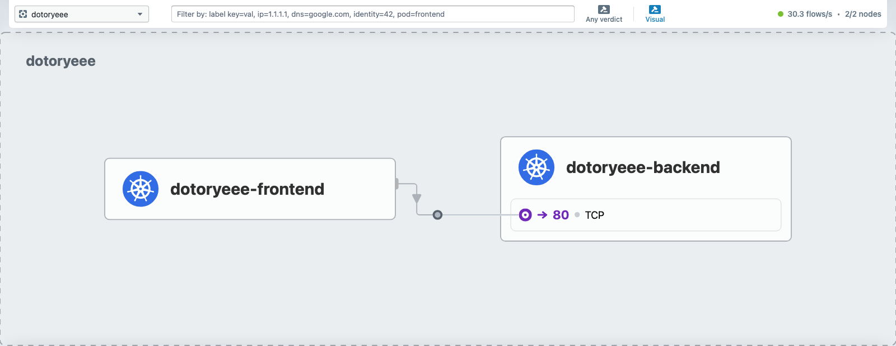
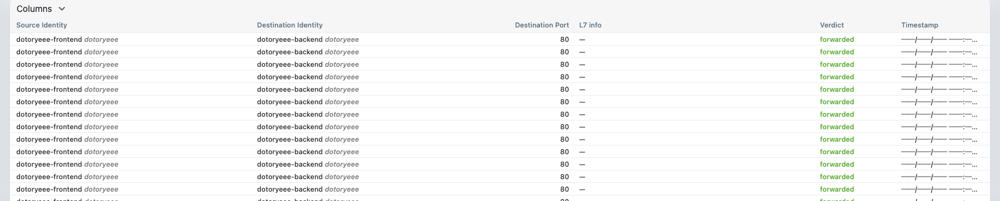

# bpftrace와 Cilium으로 eBPF 실습

<!-- more -->

## 목표

---

- eBPF를 로컬에서 직접 만져보고 커널 추적과 서비스 네트워킹을 실측한다
- bpftrace로 시스템 콜을 시스템 전체에서 추적하고, 같은 워크로드를 strace로 추적했을 때와 오버헤드를 수치로 비교한다
- kind 클러스터에 Cilium을 kube-proxy replacement 모드로 올려 kube-proxy 없이 서비스가 동작함을 확인하고, Hubble로 흐름을 관측한다

!!! tip
    💡 전 과정을 로컬 Docker와 kind 위에서 돌려 클라우드 비용이 들지 않는다

## eBPF와 추적 도구

---

eBPF(extended Berkeley Packet Filter)란 커널을 다시 컴파일하거나 모듈을 올리지 않고, 검증기를 통과한 샌드박스 프로그램을 커널 이벤트에 붙여 실행하는 기술이다. 시스템 콜 진입, 네트워크 패킷 처리, 함수 진입 같은 지점에 프로그램을 걸어 데이터를 뽑아낸다.

- bpftrace: eBPF를 원라이너로 쓰게 해주는 추적 언어. awk 문법과 비슷하고, 커널 추적 도구의 진입점으로 좋다
- Cilium: eBPF로 파드 네트워킹과 서비스 로드밸런싱을 처리하는 CNI. kube-proxy를 대체할 수 있다
- Hubble: Cilium이 커널에서 본 흐름을 그대로 관측하는 도구. 별도 사이드카 없이 L3/L4 흐름이 보인다

strace도 시스템 콜을 보여주지만 동작 원리가 다르다. strace는 ptrace로 대상 프로세스를 시스템 콜마다 멈춰 세우고 값을 읽는다. eBPF는 커널 안에서 이벤트를 집계해 결과만 사용자 공간으로 넘긴다. 붙인 프로세스만 보는 strace와 달리 bpftrace는 시스템 전체를 필터로 훑는다. 이 차이가 뒤의 오버헤드 실측에서 그대로 드러난다.

## 실습 환경

---

macOS의 Docker Desktop은 리눅스 VM 위에서 컨테이너를 돌린다. 그 VM 커널이 BTF를 제공하면 커널 헤더 없이도 CO-RE 방식으로 bpftrace가 붙는다. 먼저 커널 버전과 BTF 유무를 확인한다.

```s
docker run --rm alpine uname -sr
Linux 6.12.76-linuxkit

docker run --rm --privileged -v /sys/kernel:/sys/kernel:ro alpine ls -la /sys/kernel/btf/vmlinux
-r--r--r-- 1 root root 6367769 /sys/kernel/btf/vmlinux
```

vmlinux BTF가 있으므로 헤더 설치 없이 진행할 수 있다. bpftrace는 ubuntu:24.04에 apt로 설치한 뒤 이미지로 굳혀 재사용한다. 설치되는 버전은 bpftrace v0.20.2다.

```s
docker run -d --name ebpf-build ubuntu:24.04 sleep 600
docker exec ebpf-build bash -c 'apt-get update && apt-get install -y bpftrace'
docker commit ebpf-build ebpf-bpftrace:local
docker rm -f ebpf-build
```

이 이미지를 privileged, pid=host로 실행하고 debugfs와 BTF를 마운트하면 VM 커널의 시스템 콜을 추적할 수 있다.

!!! warning
    💡 pid=host로 실행하면 bpftrace가 VM 커널의 모든 프로세스를 본다

## bpftrace 기초 원라이너

---

1. 시스템 전체 execve를 추적한다. 어떤 프로세스가 무슨 프로그램을 실행하는지 실시간으로 흐른다. 다른 컨테이너에서 date, ls를 반복 실행하는 부하를 걸어두고 잡아본다

    ```s
    docker run --rm --privileged --pid=host \
      -v /sys/kernel/debug:/sys/kernel/debug:rw -v /sys/kernel/btf:/sys/kernel/btf:ro \
      ebpf-bpftrace:local bpftrace -e '
    tracepoint:syscalls:sys_enter_execve {
      printf("%-8d %-16s %s\n", pid, comm, str(args->filename));
    }'
    ```

    ```s
    Attaching 1 probe...
    53401    sh               /bin/date
    53402    sh               /bin/ls
    53403    sh               /usr/bin/head
    ```

2. 특정 파일을 여는 순간만 감시한다. openat 진입에서 파일명이 /etc/hosts, /etc/resolv.conf 인 경우만 필터링한다

    ```s
    bpftrace -e '
    tracepoint:syscalls:sys_enter_openat
    /str(args->filename) == "/etc/hosts" || str(args->filename) == "/etc/resolv.conf"/ {
      printf("%-16s opened %s\n", comm, str(args->filename));
    }'
    ```

    ```s
    cat              opened /etc/hosts
    cat              opened /etc/resolv.conf
    python3          opened /etc/hosts
    cat              opened /etc/hosts
    ```

    부하로 돌린 cat 말고도 python3가 /etc/hosts를 여는 게 섞여 나온다. 호스트 커널을 공유하는 다른 컨테이너의 프로세스까지 한 자리에서 보이는 것이 시스템 전체 추적의 특징이다.

3. read 시스템 콜 지연을 히스토그램으로 집계한다. 진입 시각을 tid별로 저장하고 종료 시각과의 차이를 hist에 넣는다. dd로 1바이트 read를 대량 발생시키며 측정한다

    ```s
    bpftrace -e '
    tracepoint:syscalls:sys_enter_read /comm=="dd"/ { @start[tid] = nsecs; }
    tracepoint:syscalls:sys_exit_read /@start[tid]/ {
      @read_ns = hist(nsecs - @start[tid]);
      delete(@start[tid]);
    }'
    ```

    ```s
    @read_ns:
    [64, 128)         261516 |@@@@@@@@@                                           |
    [128, 256)       1387081 |@@@@@@@@@@@@@@@@@@@@@@@@@@@@@@@@@@@@@@@@@@@@@@@@@@@@@|
    [256, 512)            79 |                                                    |
    [4K, 8K)             138 |                                                    |
    ```

    read 대부분이 128나노초에서 256나노초 사이에 끝난다. 이런 분포는 strace로는 얻기 어렵다. 값을 재는 행위 자체가 대상 프로세스를 느리게 만들기 때문이다. 그 오버헤드를 다음 절에서 직접 잰다.

## strace vs eBPF 오버헤드 실측

---

이 글의 핵심이다. 같은 워크로드를 세 가지 상태에서 실행해 소요 시간을 비교한다. 워크로드는 1바이트 read와 write를 40만번 반복하는 dd다.

```s
dd if=/dev/zero of=/dev/null bs=1 count=200000   # read 20만 + write 20만 = 시스템 콜 40만회
```

1. 아무 추적 없이 그냥 실행한다. 5회 반복해도 편차가 거의 없다

    ```s
    TIMEFORMAT='%R'; time dd if=/dev/zero of=/dev/null bs=1 count=200000
    0.077
    0.077
    0.078
    ```

2. strace로 read, write를 추적하며 실행한다. 출력은 버리고 시간만 잰다

    ```s
    time strace -f -e trace=read,write -o /dev/null dd if=/dev/zero of=/dev/null bs=1 count=200000
    28.343
    28.546
    28.354
    ```

3. bpftrace로 dd의 read, write를 시스템 전체에서 집계하는 상태로 붙여둔 채 같은 dd를 실행한다

    ```s
    time dd if=/dev/zero of=/dev/null bs=1 count=200000
    0.087
    0.088
    0.089
    ```

    붙여둔 bpftrace가 추적 창 동안 dd의 read, write를 실제로 집계했는지 카운터로 확인한다. 프로브가 워크로드 내내 살아 있었다는 증거다

    ```s
    @reads: 693892
    @writes: 694332
    ```

세 결과를 정리하면 다음과 같다.

| 상태 | 소요 시간 | 기준 대비 | 시스템 콜당 추가 비용 |
|---|---|---|---|
| 그냥 실행 | 0.077초 | 1배 | 0 |
| strace 추적 | 약 28.4초 | 약 369배 | 약 70μs |
| bpftrace 추적 | 약 0.088초 | 약 1.14배 | 약 27ns |

- strace는 40만회 실행이 0.077초에서 28.4초로 늘어난다. ptrace가 시스템 콜마다 프로세스를 멈추고 사용자 공간으로 두 번 넘나들기 때문
- bpftrace는 0.077초에서 0.088초로 14%만 늘어난다. 커널 안에서 맵만 갱신하고 프로세스는 멈추지 않기 때문
- 시스템 콜당 추가 비용은 strace가 약 70μs, bpftrace가 약 27ns로 약 2600배 차이

!!! warning
    💡 이 수치는 macOS 위 리눅스 VM 환경이라 ptrace 컨텍스트 스위치 비용이 베어메탈보다 크게 잡힌다

절대 배수는 환경을 탄다. 베어메탈 리눅스에서는 strace 오버헤드가 이보다 작게 나온다. 하지만 방향과 자릿수는 어디서 재도 같다. 프로세스를 멈춰 세우는 방식과 커널에서 집계하는 방식의 차이가 두세 자릿수 배수로 벌어진다. 프로덕션에서 상시 켜둘 추적을 고를 때 이 차이가 판단 근거가 된다.

## kind에 Cilium 올리기

---

Cilium은 서비스 로드밸런싱을 iptables 대신 eBPF로 처리한다. kube-proxy replacement 모드로 올리면 kube-proxy 자체를 배포하지 않는다. 먼저 kube-proxy와 기본 CNI를 끈 kind 클러스터를 만든다.

```s
vi kind-cilium.yaml
```

```yaml title="kind-cilium.yaml"
kind: Cluster
apiVersion: kind.x-k8s.io/v1alpha4
name: dotoryeee-cilium
networking:
  disableDefaultCNI: true      # 기본 CNI(kindnet) 비활성 -> Cilium이 담당
  kubeProxyMode: "none"        # kube-proxy 자체를 배포하지 않음
nodes:
  - role: control-plane
  - role: worker
```

```s
kind create cluster --config kind-cilium.yaml
```

CNI가 없어 노드는 아직 NotReady다. 이어서 Cilium을 kubeProxyReplacement 모드로 설치한다. kube-proxy가 없으니 Cilium이 API 서버 주소를 직접 알아야 한다. 제어 노드 컨테이너의 IP를 넘긴다.

```s
API_IP=$(docker inspect dotoryeee-cilium-control-plane -f '{{.NetworkSettings.Networks.kind.IPAddress}}')
cilium install --version 1.19.5 \
  --set kubeProxyReplacement=true \
  --set k8sServiceHost=$API_IP \
  --set k8sServicePort=6443
```

```s
ℹ️  Cilium will fully replace all functionalities of kube-proxy
```

설치가 끝나면 상태와 모드를 확인한다. kube-proxy 데몬셋이 아예 없어야 하고, KubeProxyReplacement가 True여야 한다.

```s
kubectl -n kube-system get ds kube-proxy
Error from server (NotFound): daemonsets.apps "kube-proxy" not found

kubectl -n kube-system exec <cilium-pod> -c cilium-agent -- cilium-dbg status | grep KubeProxyReplacement
KubeProxyReplacement:    True   [eth0 172.19.0.3 (Direct Routing)]

kubectl get nodes
NAME                             STATUS   ROLES           VERSION
dotoryeee-cilium-control-plane   Ready    control-plane   v1.36.1
dotoryeee-cilium-worker          Ready    <none>          v1.36.1
```

kube-proxy 파드는 없고 노드는 Ready다. 서비스 로드밸런싱을 Cilium이 eBPF로 떠맡았다.

## kube-proxy 없이 서비스 동작 확인

---

dotoryeee 네임스페이스에 백엔드(nginx)와 프론트엔드(curl 반복)를 배포한다. 프론트엔드가 ClusterIP 서비스를 통해 백엔드를 계속 호출한다.

```s
kubectl apply -f demo-app.yaml
kubectl -n dotoryeee get svc dotoryeee-backend
NAME                TYPE        CLUSTER-IP     PORT(S)   AGE
dotoryeee-backend   ClusterIP   10.96.225.41   80/TCP    12s
```

kube-proxy가 없는데도 ClusterIP 도메인으로 호출이 된다.

```s
kubectl -n dotoryeee exec <frontend-pod> -- \
  sh -c 'for i in 1 2 3; do curl -s -o /dev/null -w "call $i -> HTTP %{http_code}\n" \
  http://dotoryeee-backend.dotoryeee.svc.cluster.local; done'
call 1 -> HTTP 200
call 2 -> HTTP 200
call 3 -> HTTP 200
```

이 매핑은 iptables가 아니라 Cilium의 eBPF 서비스 맵에 들어 있다. cilium-dbg로 서비스 목록을 보면 ClusterIP가 백엔드 파드로 프로그래밍돼 있다.

```s
kubectl -n kube-system exec <cilium-pod> -c cilium-agent -- cilium-dbg service list
ID   Frontend               Service Type   Backend
6    10.96.225.41:80/TCP    ClusterIP      1 => 10.244.1.234:80/TCP (active)
```

### iptables 규칙 수 비교

같은 데모 앱을 kube-proxy가 있는 기본 kind 클러스터에도 올려 노드에서 iptables-save로 규칙을 세어보면 차이가 분명하다. kube-proxy는 서비스마다 KUBE-SVC 체인, 엔드포인트마다 KUBE-SEP 체인을 iptables에 깐다. Cilium replacement 노드에는 그런 체인이 하나도 없다.

| 항목 | kube-proxy 노드 | Cilium(kubeProxyReplacement) 노드 |
|---|---|---|
| iptables 전체 규칙(-A) | 67 | 42 |
| KUBE-* 체인 | 30 | 0 |
| KUBE-SVC 서비스 체인 | 5 | 0 |
| KUBE-SEP 엔드포인트 체인 | 8 | 0 |
| 서비스 IP iptables 규칙 | KUBE-SERVICES에 존재 | 없음(eBPF 맵) |
| CILIUM-* 체인 | 0 | 10 |

kube-proxy 노드에서 서비스 IP를 grep하면 KUBE-SERVICES에서 KUBE-SVC 체인으로 점프하는 규칙이 잡힌다.

```s
# kube-proxy 노드
iptables-save | grep 10.96.218.179
-A KUBE-SERVICES -d 10.96.218.179/32 -p tcp --dport 80 -j KUBE-SVC-KDFSL4OQJO7CGXMY

# Cilium 노드
iptables-save | grep 10.96.225.41
(출력 없음)
```

- kube-proxy 방식은 서비스와 엔드포인트가 늘수록 iptables 체인이 선형으로 늘고, 패킷마다 규칙을 순차 탐색한다
- Cilium replacement는 서비스 IP에 iptables 규칙을 두지 않고 eBPF 해시 맵에서 조회한다. 규칙 수가 서비스 개수에 따라 붇지 않는다

## Hubble로 흐름 관측

---

Hubble을 켜면 Cilium이 커널에서 본 흐름을 그대로 볼 수 있다. UI까지 함께 켠다.

```s
cilium hubble enable --ui
```

CLI로 dotoryeee 네임스페이스 흐름을 뽑아본다. 릴레이를 포트포워딩한 뒤 hubble observe로 조회한다.

```s
cilium hubble port-forward &
hubble observe --namespace dotoryeee --last 8 -o compact
```

```s
dotoryeee/dotoryeee-frontend:49624 -> kube-system/coredns:53 to-endpoint FORWARDED (UDP)
dotoryeee/dotoryeee-frontend:43436 -> dotoryeee/dotoryeee-backend:80 to-endpoint FORWARDED (TCP Flags: SYN)
dotoryeee/dotoryeee-frontend:43436 <- dotoryeee/dotoryeee-backend:80 to-endpoint FORWARDED (TCP Flags: SYN, ACK)
dotoryeee/dotoryeee-frontend:43436 -> dotoryeee/dotoryeee-backend:80 to-endpoint FORWARDED (TCP Flags: ACK, PSH)
dotoryeee/dotoryeee-frontend:43436 -> dotoryeee/dotoryeee-backend:80 to-endpoint FORWARDED (TCP Flags: ACK, FIN)
```

프론트엔드가 먼저 CoreDNS로 이름을 풀고, 그다음 백엔드 80포트로 SYN, ACK, PSH, FIN까지 TCP 핸드셰이크 전체를 마치는 흐름이 그대로 잡힌다. 사이드카 없이 커널에서 본 값이다.

UI는 hubble-ui 서비스를 포트포워딩해 브라우저로 연다.

```s
kubectl -n kube-system port-forward svc/hubble-ui 12000:80
```

네임스페이스로 dotoryeee를 고르면 서비스 맵이 그려진다. dotoryeee-frontend에서 dotoryeee-backend 80포트로 가는 화살표가 실시간으로 갱신된다.



아래 흐름 테이블에는 출발지, 목적지, 포트, 판정이 줄줄이 쌓인다. dotoryeee-frontend에서 dotoryeee-backend로 가는 80포트 흐름이 전부 forwarded로 찍힌다.



## 정리

---

실습이 끝나면 kind 클러스터와 임시 컨테이너, 빌드한 이미지를 지운다.

```s
kind delete cluster --name dotoryeee-cilium
docker rm -f ebpf-work 2>/dev/null
docker rmi ebpf-bpftrace:local
```

세 실험이 한 방향을 가리킨다. strace는 40만회 시스템 콜을 0.077초에서 28.4초로 늘렸고, bpftrace는 0.088초에 그쳤다. 같은 관측을 하는데 이벤트당 비용이 약 2600배 차이 났다. Cilium은 kube-proxy가 서비스마다 깔던 iptables 체인을 0개로 만들고 eBPF 맵으로 대신했다. Hubble은 그 커널 처리 결과를 사이드카 없이 흐름으로 보여줬다. 커널을 건드리지 않고 커널을 관측하고 바꾸는 것, 그게 eBPF가 하는 일이다.
