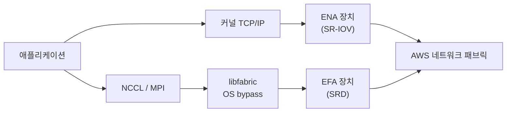

# AWS 고성능 네트워킹 정리

<!-- more -->

## AWS 고성능 네트워킹이란
AWS 고성능 네트워킹이란 EC2 인스턴스 간 통신에서 대역폭↑·PPS↑·지연↓을 얻기 위해 Nitro 기반 향상된 네트워킹(Enhanced Networking)과 그 위의 ENA·ENA Express·EFA를 묶은 스택

가상화 계층이 패킷마다 개입하던 초기 EC2 네트워킹으로는 분산 학습·HPC·고PPS 워크로드를 감당하지 못해 하드웨어 오프로드로 옮겨감.

- 향상된 네트워킹은 SR-IOV(Single Root I/O Virtualization)로 장치를 인스턴스에 직접 노출 → 하이퍼바이저 개입 없이 NIC 접근
- 공식 표현으로 대역폭↑·PPS↑·지연↓을 제공하고 추가 요금 없음
- 계층은 셋: 범용 ENA, TCP/UDP 꼬리 지연을 잡는 ENA Express, OS bypass의 EFA

---

## EC2 네트워크 스택의 진화
초기 Xen 에뮬레이션에서 SR-IOV를 거쳐 Nitro 전용 카드가 네트워크를 전담하는 구조로 넘어옴

| 구분 | 방식 | 드라이버 | 대역폭 |
|------|------|----------|--------|
| 초기 EC2 | Xen 하이퍼바이저의 소프트웨어 에뮬레이션 NIC | 가상 드라이버 | 낮음, 패킷마다 CPU 개입 |
| 향상된 네트워킹 1세대 | SR-IOV로 Intel 82599 VF를 인스턴스에 노출 | ixgbevf | 최대 10Gbps |
| Nitro 기반 | 전용 Nitro 카드가 네트워크 전담, SR-IOV로 ENA 노출 | ena | 타입별 최대 600Gbps |

- Intel 82599 VF는 C3·C4·D2·I2·M4·R3 등 구형 인스턴스 계열에 한정
- 모든 Nitro 기반 인스턴스는 ENA로 향상된 네트워킹 사용 → 일부 구형 Xen 계열(H1·I3·G3·P3·R4 등)도 ENA 지원
- SR-IOV·VF의 동작 원리와 다른 NIC 가상화 방식은 [NIC 가상화와 커널 바이패스 정리](nic_virtualization.md)에서 다룸

---

## ENA란
ENA(Elastic Network Adapter)란 Nitro 카드가 NIC 기능을 전담하고 SR-IOV로 인스턴스에 노출하는 향상된 네트워킹 어댑터

| 항목 | 설명 |
|------|------|
| 노출 방식 | Nitro 카드가 NIC 기능 전담, SR-IOV VF로 ENA 장치를 인스턴스에 직접 노출 |
| 대역폭 | 인스턴스 타입별 상이, 최대 600Gbps(c8gn, 네트워크 카드 2장 합산) |
| 큐 | 멀티큐 구조, 큐 수는 2의 거듭제곱(1·2·4·8·16·32 등), ENI당 큐 수는 vCPU 수를 넘지 못함 |
| 적용 범위 | 모든 Nitro 기반 인스턴스가 ENA 사용 |
| 비용 | 추가 요금 없음 |

### 멀티큐와 RSS
고PPS 워크로드는 큐를 여러 개 두어 여러 vCPU로 처리를 분산하며, 플로 분배는 RSS가 담당

- RSS(Receive Side Scaling)는 수신 패킷의 플로 튜플을 해시해 여러 수신 큐로 분배 → 큐마다 다른 vCPU가 처리
- 네트워크 집약 워크로드는 큐 수를 늘려 PPS를 끌어올림 → CPU 집약 워크로드는 적은 큐로 충분
- 큐 배치는 인스턴스 타입·크기별 정적 한도가 기본이고, 지원 타입은 ENI 간 동적 재배치 가능

---

## ENA Express란
ENA Express란 SRD(Scalable Reliable Datagram) 프로토콜을 TCP/UDP 아래에 깔아 단일 플로 대역폭과 꼬리 지연을 개선하는 기능

| 항목 | 내용 |
|------|------|
| 기반 프로토콜 | SRD, 동적 라우팅으로 처리량↑·꼬리 지연↓ |
| 단일 플로 대역폭 | 5Gbps → 최대 25Gbps (인스턴스 총 한도 내) |
| 꼬리 지연 | TCP 대비 p99 최대 50%↓, p99.9 최대 85%↓ |
| 동작 | 플로 패킷을 여러 AWS 경로로 스프레이, 혼잡 감지 시 분배 재조정, 수신단 재정렬 |
| 투명성 | TCP·UDP에 무수정 적용 |
| 통신 범위 | 같은 AZ, 또는 같은 리전 내 AZ 간 |

- 재정렬과 대부분의 재전송을 네트워크 계층이 처리 → 애플리케이션 계층 부담↓
- 12.5Gbps 상한 인스턴스라면 단일 플로도 12.5Gbps까지 → 25Gbps는 총 한도가 받쳐줄 때
- 인스턴스 상한이 뒤에서 곱해지는 구조라 SRD가 대역폭 자체를 새로 만들어주는 것은 아님

### 적용 조건

- 송수신 양쪽 모두 지원 인스턴스 타입이어야 함
- 양쪽 모두 ENA Express를 활성화해야 함 → 한쪽이라도 미설정이면 표준 ENA로 폴백
- 같은 리전이어야 하고 경로에 미들웨어 박스가 없어야 함
- SRD 헤더가 붙어 MTU를 낮춰야 함 → TCP는 MSS 자동 클램프, UDP는 별도 하향 필요
- Local Zone에서는 ENA Express 트래픽 사용 불가

---

## EFA란
EFA(Elastic Fabric Adapter)란 OS 커널을 우회(OS bypass)해 libfabric으로 인스턴스 간 통신을 가속하는 네트워크 장치로, AI·ML·HPC 노드 간 통신용

| 항목 | 설명 |
|------|------|
| 우회 방식 | libfabric API가 커널을 건너뛰고 EFA 장치에 직접 패킷 적재 |
| 전송 | SRD 기반, 혼잡 제어와 대부분의 재전송을 장치에서 처리 |
| 인터페이스 | NCCL·NIXL(AI/ML), Open MPI 4.1+·Intel MPI 2019 Update 5+(HPC) |
| RDMA | Nitro v4 이상에서 RDMA read 전 지원, RDMA write 대부분 지원 |
| GPUDirect RDMA | 지원, NIC가 GPU 메모리에 직접 DMA (P4d부터) |
| 비용 | 추가 요금 없음 |

- 일반 경로는 애플리케이션이 커널 TCP/IP와 ENA 드라이버를 거침 → EFA는 libfabric으로 커널을 건너뜀
- MPI·NCCL이 libfabric API에 직접 붙음 → 오버헤드↓로 분산 학습·HPC가 더 효율적으로 동작
- GPUDirect RDMA와 결합하면 GPU 메모리를 시스템 메모리 복사 없이 NIC가 직접 전송

---

## ENA와 EFA의 관계
EFA 기본형(EFA with ENA)은 ENA 장치 위에 OS bypass용 EFA 장치를 더한 형태로 붙음

| 인터페이스 | IP 네트워킹 | OS bypass(EFA 장치) | 비고 |
|------------|-------------|---------------------|------|
| ENA | 지원 | 미지원 | 모든 Nitro 인스턴스 기본, 일반 VPC 통신 |
| EFA with ENA | 지원 | 지원 | ENA 장치와 EFA 장치를 동시 생성 |
| EFA-only | 미지원 | 지원 | EFA 장치만, 기본 인터페이스로 사용 불가 |

- EFA with ENA는 ENA의 IP 네트워킹을 그대로 쓰면서 EFA 장치가 저지연 전송을 얹음 → EFA에 ENA 기능이 포함된 셈
- EFA-only는 IP 주소를 받지 못하고 기본 네트워크 인터페이스로 못 씀 → 다중 카드 인스턴스의 보조 인터페이스 용도
- 두 방식 모두 ENI 부착 한도를 소모

---

## SRD가 기존 RDMA 전송과 다른 점
SRD란 AWS가 자사 데이터센터에 맞춰 설계한 신뢰성 전송 프로토콜로, 순서 보장을 포기하고 다중 경로 스프레이로 처리량과 꼬리 지연을 잡는 방식

RDMA·InfiniBand·RoCEv2 원리는 [InfiniBand vs RoCEv2 차이점 정리](gpu_04.md)에서 다뤘고, 여기서는 SRD와의 차이만 짚음.

- RDMA는 원격 메모리를 상대 CPU·커널 개입 없이 NIC가 직접 읽고 쓰는 전송 → 커널 바이패스·zero-copy로 마이크로초대 지연
- 온프레는 InfiniBand(전용 패브릭)나 RoCEv2(무손실 이더넷)로 이를 구현 → 순서 보장과 무손실이 전제
- SRD는 이 전제를 뒤집어 손실·순서를 프로토콜과 상위 계층에서 흡수하는 설계

| 항목 | 전통 RDMA(IB RC·RoCEv2) | SRD |
|------|--------------------------|-----|
| 패킷 순서 | 순서 보장 | 순서 비보장, 상위 계층이 재정렬 |
| 경로 | 단일 경로 위주 | 다중 경로 스프레이(ECMP) |
| 손실 대응 | 무손실 패브릭 전제(credit·PFC) | 프로토콜이 재전송 처리, 무손실 불필요 |
| 혼잡 제어 | DCQCN 등 별도 튜닝 | 프로토콜 내장, 경로 재분배로 회피 |
| 운영 주체 | 사용자가 패브릭 무손실 구성 | AWS가 패브릭 운영 |

- 순서를 보장하면 head-of-line blocking이 생김 → SRD는 재정렬을 메시지 의미를 아는 상위 계층에 맡겨 회피
- 재전송이 패브릭의 무손실 보장이 아니라 프로토콜 책임 → 표준 이더넷 위에서 동작 가능

---

## placement group과 네트워크 지연
placement group이란 상호 의존 인스턴스의 물리 배치를 제어해 지연·처리량·장애 상관을 조정하는 배치 전략

| 전략 | 배치 | 용도 |
|------|------|------|
| Cluster | 단일 AZ 안에 인스턴스를 근접 배치 | 저지연 노드 간 통신(HPC) |
| Partition | 논리 파티션으로 나눠 하드웨어 비공유 | Hadoop·Cassandra·Kafka 등 대규모 분산 |
| Spread | 서로 다른 하드웨어에 소수 분산 | 상관 장애 최소화 |

- EFA·ENA Express는 같은 AZ 안에서 지연이 가장 낮음 → cluster placement group으로 근접 배치하면 물리 거리↓
- EFA 인스턴스는 cluster placement group 배치가 권장(필수는 아님) → 단일 AZ 저지연 그룹으로 묶임

---

## 온프레 RDMA와의 대비
온프레는 전용 패브릭과 무손실 설정을 사용자가 직접 운영하고, AWS는 표준 패브릭 위에서 SRD로 대체

| 비교 항목 | 온프레 InfiniBand·RoCEv2 | AWS EFA(SRD) |
|-----------|--------------------------|--------------|
| 패브릭 | 전용 IB 패브릭 또는 무손실 이더넷 | 표준 AWS 이더넷 패브릭 |
| 무손실 요구 | 필요(credit 또는 PFC·ECN) | 불필요, 프로토콜이 손실 흡수 |
| 순서 보장 | 보장(RC) | 비보장, 스프레이 후 재정렬 |
| 운영 주체 | 사용자가 스위치·NIC 무손실 설정 | AWS가 패브릭 운영, 사용자는 EFA만 활성화 |
| 확장 | fat-tree를 직접 설계 | cluster placement group으로 위임 |

---

## 선택 기준

| 상황 | 추천 | 추천 사유 |
|------|------|-----------|
| 일반 웹·API·범용 워크로드 | ENA | Nitro 기본, 타입별 최대 600Gbps에 추가 비용 없음 |
| 지연 민감한 TCP/UDP, 같은 리전 | ENA Express | SRD 멀티패스로 꼬리 지연↓, 앱 무수정 |
| 분산 학습·HPC 노드 간 통신 | EFA | OS bypass·SRD·GPUDirect RDMA로 노드 간 병목 완화 |
| 고PPS인데 비혼잡 시 최저 지연 우선 | 표준 ENA | ENA Express는 비혼잡 시 중앙값 지연이 소폭↑ |

---

## 함정

- EFA OS bypass 트래픽은 AZ·VPC를 넘지 못함 → 같은 AZ 안이어야 하고(2024년부터 같은 AZ 내 서브넷 간은 가능), EFA 트래픽 자체는 라우팅 불가
- EFA는 보안그룹이 자기 자신을 참조해 인바운드·아웃바운드 전체를 허용해야 OS bypass 통신이 됨 → 일반 IP 규칙만으로는 안 됨
- ENA Express는 모든 인스턴스·경로에서 켜지지 않음 → 양쪽 다 지원 타입이고 양쪽 다 활성화해야 SRD 사용
- 설정이 한쪽만 어긋나도 그 프로토콜만 폴백 → 한쪽이 UDP를 비활성화하면 UDP만 표준 전송으로 내려감
- ENA Express는 비혼잡 구간에서 중앙값 지연이 수십 마이크로초 늘 수 있음 → 무조건 켜는 게 답은 아님

---

## 결론

- 스택은 층위가 다름 → 범용은 ENA, 같은 리전 TCP/UDP 꼬리 지연은 ENA Express, 노드 간 HPC는 EFA
- EFA는 ENA를 대체하지 않고 그 위에 OS bypass를 얹은 형태 → EFA with ENA는 IP 네트워킹과 저지연 전송을 함께 가짐
- SRD는 순서 보장과 무손실을 포기하는 대신 표준 패브릭 위에서 멀티패스로 지연을 잡는 선택 → "무손실을 깔 것이냐, 손실을 흡수할 것이냐"가 온프레 RDMA와 갈리는 지점
