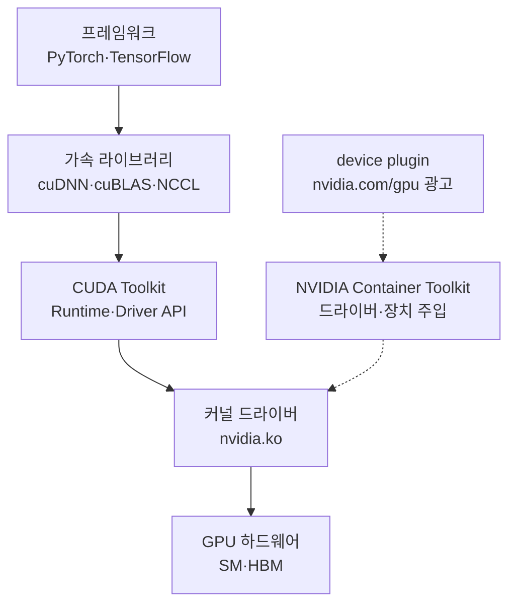

# GPU 서버 기초 정리

<!-- more -->

## GPU 서버란
GPU 서버란 대규모 병렬 산술을 처리하는 데이터센터 GPU를 한 대에 여러 장 얹어 학습·추론 같은 가속 워크로드를 돌리는 서버

모델 크기가 단일 GPU 메모리를 넘어서면서 여러 GPU를 고속으로 묶는 서버 단위 설계가 필요해짐

- CPU만으로는 행렬 연산 처리량이 부족 → 병렬 코어가 수천 개인 GPU로 오프로드
- 모델·배치가 커지면 한 장의 VRAM으로 부족 → 여러 GPU에 나눠 싣고 GPU 간 통신으로 합침
- GPU 간 통신이 병목 → PCIe보다 빠른 전용 인터커넥트(NVLink)로 연결
- 전력·발열이 일반 서버보다 훨씬 큼 → 냉각·전원 설계가 서버 형태를 가름

---

## CPU vs GPU 구조
CPU는 소수의 큰 코어로 순차 로직을 빠르게 처리하고, GPU는 작은 코어를 수천 개 두어 같은 연산을 대량으로 병렬 처리하는 구조

| 비교 항목 | CPU | GPU |
|-----------|-----|-----|
| 코어 성격 | 소수의 대형 코어, 고클럭·복잡한 제어부 | 다수의 소형 연산 코어 |
| 코어 수 규모 | 수개~수십개 | 수천개(A100은 CUDA 코어 6,912개) |
| 실행 모델 | 코어별 독립 스레드 | SIMT, warp 단위 동일 명령 실행 |
| 최적 작업 | 분기 많은 순차 로직, 낮은 지연 | 대규모 병렬 산술(행렬 연산) |
| 면적 배분 | 캐시·제어부에 크게 투자 | 연산 유닛에 집중, 캐시·제어부 작음 |
| 주 메모리 | DDR, 대용량·상대적 저대역폭 | HBM, 고대역폭 |

### SM과 SIMT

- GPU의 연산 코어는 SM(Streaming Multiprocessor)이라는 묶음으로 구성됨 → A100은 108개 SM, SM당 FP32 CUDA 코어 64개
- H100 SXM은 132개 SM, SM당 128개 → 풀 다이 144개 SM 중 수율을 위해 일부만 활성화하는 방식
- SIMT(Single Instruction, Multiple Threads)는 32개 스레드를 묶은 warp가 하나의 명령을 함께 실행하는 모델
- warp 안에서 스레드 분기(if/else)가 갈리면 각 경로를 순차 실행 → 분기 발산(divergence)이 병렬 효율을 떨어뜨림
- 그래서 GPU는 조건 분기 많은 로직보다 같은 연산을 대량 반복하는 작업에 유리

---

## VRAM과 HBM
VRAM은 GPU 패키지에 붙은 전용 메모리를 가리키고, 데이터센터 GPU는 그 구현으로 HBM(High Bandwidth Memory)을 씀

- HBM은 메모리 다이를 수직 적층해 실리콘 인터포저로 GPU 옆에 근접 배치 → 배선이 짧고 넓어 대역폭이 큼
- 대역폭이 학습 속도를 좌우 → 행렬 연산은 연산량보다 메모리에서 데이터를 얼마나 빨리 공급하느냐에 자주 묶임
- 세대가 오를수록 스택 용량·속도가 오르며, 같은 GPU도 폼팩터에 따라 HBM 세대가 갈림

| 세대 | 대표 적용 GPU | 비고 |
|------|---------------|------|
| HBM2 | A100 40GB | 1,555GB/s |
| HBM2e | A100 80GB, H100 PCIe | HBM2 개량, 스택 용량·속도↑ |
| HBM3 | H100 SXM | 3.35TB/s로 대역폭 대폭 상승 |
| HBM3e | B200, H200 | 스택당 용량·속도 추가 상승 |

---

## PCIe 카드 vs SXM 모듈
같은 세대 GPU라도 표준 슬롯에 꽂는 PCIe 카드와 전용 소켓에 직결하는 SXM 모듈은 전력·대역폭·냉각·GPU 간 연결이 크게 다름

| 항목 | PCIe 카드 | SXM 모듈 |
|------|-----------|----------|
| 장착 | 표준 PCIe 슬롯 | 전용 소켓(베이스보드 직결) |
| 최대 전력(H100 기준) | 300~350W | 700W |
| GPU 간 연결 | PCIe 경유, 선택적 NVLink 브리지(쌍 단위) | NVLink + NVSwitch 전이중 메시 |
| NVLink 대역폭(H100) | 브리지 600GB/s, 2장 연결에 한정 | 900GB/s 풀 연결 |
| 메모리·대역폭(H100) | 80GB HBM2e, 약 2TB/s | 80GB HBM3, 3.35TB/s |
| 냉각 | 카드 단위 공랭 | 베이스보드 통합 냉각(고밀도 공랭·수랭) |
| 확장 방식 | 서버당 소수, 혼합·교체 유연 | 8장 단위 베이스보드 고정 구성 |

- PCIe 카드는 일반 서버에 몇 장 얹는 유연한 구성 → 도입이 쉽고 GPU 종류를 섞기 좋음
- SXM은 높은 전력 한도와 NVSwitch 전이중 연결이 필요한 대규모 학습용 → 8장이 한 몸처럼 통신
- PCIe에서 NVLink 브리지는 인접 2장만 이어줌 → 8장 전체를 all-to-all로 묶는 건 SXM+NVSwitch 구성에서만 가능

---

## 서버 형태
GPU 서버는 표준 서버에 PCIe 카드를 얹는 형태부터 SXM 베이스보드를 통합한 완제품까지 나뉘며, GPU 간 연결 방식과 커스터마이즈 자유도가 다름

| 형태 | 구성 | GPU 연결 | 특징 |
|------|------|----------|------|
| 일반 PCIe 서버 | 표준 서버에 PCIe GPU 장착 | PCIe, 선택적 NVLink 브리지 | 소수 GPU, 구성 유연, 도입 쉬움 |
| HGX 베이스보드 | 8-GPU SXM 베이스보드를 OEM 서버에 탑재 | NVLink + NVSwitch 전이중 | OEM이 CPU·스토리지·네트워크 커스터마이즈 |
| DGX 완제품 | NVIDIA가 설계·통합한 완제품 | HGX 베이스보드 + NVSwitch | 검증된 단일 구성, 소프트웨어·지원 번들 |

- HGX는 NVIDIA가 제공하는 8-GPU SXM 베이스보드 → OEM이 이 위에 서버를 설계해 판매
- DGX는 그 베이스보드를 NVIDIA가 직접 완제품 서버로 통합한 것 → 구성 선택폭 대신 검증·지원을 취함
- HGX H100 8-GPU 베이스보드는 총 640GB(80GB×8) GPU 메모리, DGX H100도 동일
- DGX B200은 8장 합쳐 1,440GB(180GB×8) → 세대가 오르며 장당·서버당 메모리가 늘어남

---

## 소프트웨어 스택
GPU 워크로드는 커널 드라이버부터 프레임워크까지 계층으로 쌓이며, 컨테이너에서는 드라이버 주입과 스케줄러 연동이 별도 경로로 붙음

| 계층 | 구성 요소 | 역할 |
|------|-----------|------|
| 커널 드라이버 | NVIDIA 드라이버(nvidia.ko) | GPU 장치 노출(/dev/nvidia*), 커널·유저 통신 |
| CUDA Toolkit | nvcc, CUDA Runtime·Driver API | 커널 컴파일·실행, GPU 프로그래밍 인터페이스 |
| 가속 라이브러리 | cuDNN, cuBLAS, NCCL, TensorRT | 딥러닝 연산·선형대수, 다중 GPU 통신, 추론 최적화 |
| 프레임워크 | PyTorch, TensorFlow | 모델 정의·학습, 하위 라이브러리 호출 |

컨테이너에서 GPU를 쓰려면 별도 두 조각이 붙음

| 구성 요소 | 역할 |
|-----------|------|
| NVIDIA Container Toolkit | 컨테이너에 호스트 드라이버·장치를 주입, 이미지엔 CUDA 런타임만 담음 |
| NVIDIA device plugin | 노드의 GPU를 nvidia.com/gpu 리소스로 광고해 파드에 할당 |

- 드라이버는 호스트에, CUDA 런타임은 컨테이너 이미지에 위치 → 둘의 버전 호환을 맞춰야 함
- 쿠버네티스는 GPU를 기본 인식하지 못함 → device plugin이 리소스로 등록해야 스케줄러가 배정
- 후속 표준으로 DRA(Dynamic Resource Allocation)가 v1.34에서 GA → NVIDIA도 GPU Operator에 DRA 드라이버를 제공하나 아직은 device plugin이 기본
- GPU Operator는 드라이버·Container Toolkit·device plugin·모니터링을 묶어 설치하는 운영 도구

---

## 데이터센터 GPU 세대
세대가 오를수록 SM 수·메모리 용량·대역폭·NVLink 대역폭·전력이 함께 오름

| 항목 | A100 | H100 | B200 |
|------|------|------|------|
| 아키텍처 | Ampere | Hopper | Blackwell |
| SM 수 | 108 | 132(SXM) | 듀얼 다이 구성 |
| 메모리(SXM) | 80GB HBM2e | 80GB HBM3 | 180GB HBM3e |
| 메모리 대역폭 | 약 2TB/s(2,039GB/s) | 3.35TB/s | 약 8TB/s |
| NVLink 세대·대역폭 | 3세대, 600GB/s | 4세대, 900GB/s | 5세대, 1.8TB/s |
| 최대 TDP(SXM) | 400W | 700W | 1000W |

- A100 40GB SXM은 HBM2에 1,555GB/s → 같은 A100이라도 80GB(HBM2e)는 2,039GB/s로 다름
- H100 PCIe는 80GB HBM2e에 약 2TB/s → 같은 H100이라도 SXM(HBM3, 3.35TB/s)과 대역폭 차이가 큼
- B200은 두 다이를 NV-HBI로 묶어 단일 GPU로 동작하는 듀얼 다이 → 장당 메모리·대역폭·전력이 이전 세대를 크게 넘어섬
- 세대 비교의 핵심은 연산 수치보다 메모리 용량·대역폭·GPU 간 대역폭 → 큰 모델일수록 이쪽이 병목

---

## nvidia-smi 주요 필드
nvidia-smi는 드라이버가 노출하는 GPU 상태를 요약해 보여주는 CLI로, 필드마다 측정 대상이 달라 해석에 주의가 필요함

| 필드 | 의미 |
|------|------|
| GPU-Util(utilization.gpu) | 최근 샘플 구간에서 커널이 하나 이상 실행된 시간 비율 |
| Memory-Usage(memory.used/total) | 할당된 VRAM 용량과 총량(MiB) |
| utilization.memory | 메모리 컨트롤러가 읽기·쓰기로 바빴던 시간 비율(대역폭 수치 아님) |
| Pwr:Usage/Cap | 현재 소비 전력 / 전력 한도(W) |
| Temp | GPU 코어 온도 |
| Compute M. | 컴퓨트 모드(Default·Exclusive Process·Prohibited) |
| MIG M. | MIG(Multi-Instance GPU) 분할 활성 여부 |
| Processes | GPU를 점유한 프로세스와 컨텍스트별 VRAM |

---

## utilization.gpu의 함정
GPU-Util 100%는 "커널이 쉬지 않고 돌았다"는 뜻이지 연산 유닛이 꽉 찼다는 뜻이 아님

- NVML 정의 자체가 "샘플 구간 중 커널이 실행된 시간 비율" → 시간축 지표이지 용량축 지표가 아님
- SM 하나만 쓰는 커널도 그 시간 동안 GPU-Util 100%로 표시 → 나머지 SM이 전부 놀아도 수치는 같음
- 즉 utilization은 "언제 바빴나", saturation은 "얼마나 채웠나" → nvidia-smi는 앞쪽만 보여줌
- 학습이 느린데 GPU-Util만 높으면 데이터 로딩·소형 배치·커널 실행 오버헤드로 SM이 노는 경우가 흔함
- 실제 연산 포화도는 DCGM(Data Center GPU Manager)의 SM occupancy·텐서 코어 활성률·메모리 대역폭 사용률로 확인
- 세밀한 병목은 Nsight 계열 프로파일러로 커널별 점유를 봐야 함 → nvidia-smi 한 줄로 판단하지 말 것

---

## 결론

- CPU는 소수 대형 코어, GPU는 SM에 묶인 수천 개 소형 코어로 warp 단위 SIMT 병렬 처리 → 작업 성격이 다름
- 같은 세대라도 PCIe 카드와 SXM 모듈은 전력·대역폭·NVLink·냉각이 갈리고, 서버는 PCIe 서버·HGX·DGX로 나뉨
- GPU-Util은 "바쁜 시간 비율"일 뿐 연산 포화도가 아님 → 실제 활용도는 DCGM·프로파일러로 확인할 것
