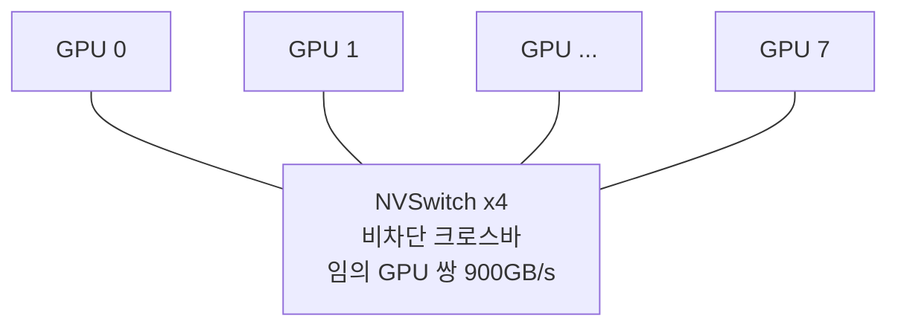

# NVLink와 노드 안 GPU 연결 정리

<!-- more -->

## 노드 안 GPU 연결이란
노드 안 GPU 연결이란 한 서버 안의 여러 GPU를 고속 경로로 이어 서로의 메모리를 직접 주고받게 만드는 인터커넥트 구조

모델·배치 크기가 GPU 한 장 메모리를 넘어서면서, 여러 GPU가 한 노드 안에서 파라미터·활성값을 초당 수백GB로 교환해야 하는 상황이 상시가 됨.

- 경로는 두 갈래로 나뉨: 호스트·I/O 연결용 PCIe, GPU간 고속 연결용 NVLink
- GPU간 통신량은 GPU 수와 모델 크기에 비례 → PCIe 한 갈래로 감당하기 어려워짐
- NVLink는 GPU를 직접 잇는 별도 경로 → PCIe 병목을 우회

---

## PCIe만으로 부족한 이유
집합 통신(Collective Communication)이란 all-reduce·all-gather처럼 여러 GPU가 동시에 데이터를 교환·집계하는 통신 패턴

- 분산 학습은 스텝마다 그래디언트를 all-reduce로 합산 → GPU 수가 늘수록 동시 교환량이 급증
- PCIe는 CPU 루트 컴플렉스를 정점으로 하는 트리 구조 → 여러 GPU가 동시에 최대 대역폭을 내지 못함
- PCIe Gen4 x16은 양방향 약 64GB/s, Gen5 x16은 약 128GB/s → 8장이 동시에 쓰면 호스트 브리지가 병목
- H100의 NVLink 900GB/s는 PCIe Gen5 x16의 7배 이상 (NVIDIA 공식 표기)
- 그래서 GPU간 대량 교환은 NVLink로 내리고, PCIe는 CPU·NIC·스토리지 연결에 남김

---

## NVLink 세대별 대역폭
NVLink란 GPU를 직접 잇는 NVIDIA의 GPU간 인터커넥트로, 세대마다 링크 수와 대역폭이 커져 옴

| 세대 | 아키텍처(GPU) | GPU당 링크 수 | GPU당 총 대역폭 | 비고 |
|------|---------------|----------------|------------------|------|
| 1세대 | Pascal(P100) | 4 | 160GB/s | 링크당 각 방향 20GB/s |
| 2세대 | Volta(V100) | 6 | 300GB/s | 링크당 각 방향 25GB/s |
| 3세대 | Ampere(A100) | 12 | 600GB/s | PCIe Gen4 대비 약 10배 |
| 4세대 | Hopper(H100) | 18 | 900GB/s | |
| 5세대 | Blackwell(B200·GB200) | 18 | 1,800GB/s | 링크당 대역폭 2배 |
| 6세대 | Rubin | 36 | 3,600GB/s | 발표된 차기 플랫폼 |

- 대역폭 수치는 양방향(bidirectional) 합산 기준 → 각 방향은 절반
- 링크 수 x 링크당 대역폭 = GPU당 총 대역폭 → V100은 6링크 x 50GB/s = 300GB/s
- 4세대와 5세대는 링크 수가 18로 같음 → 대역폭 2배는 링크당 속도가 두 배로 오른 결과
- 총 대역폭은 세대뿐 아니라 링크 수까지 맞아야 실제로 나옴 → 같은 세대라도 제품·연결 방식에 따라 링크 수가 다를 수 있음

---

## NVLink 브리지와 NVSwitch
2GPU는 브리지로 직접 잇고, 다GPU는 전용 스위치 칩(NVSwitch)으로 교환 연결함

| 항목 | NVLink 브리지 | NVSwitch |
|------|---------------|----------|
| 연결 대상 | 2GPU | 다수 GPU(베이스보드·랙) |
| 방식 | 두 GPU의 NVLink 포트를 직접 연결 | 전용 스위치 칩이 모든 GPU를 교환 연결 |
| 토폴로지 | 1대1 | all-to-all(비차단) |
| 임의 쌍 대역폭 | 두 GPU 사이에 놓인 링크 수만큼 | 임의 GPU 쌍이 GPU당 전체 NVLink 대역폭 |
| 확장 | 2GPU 고정 | 8·72 GPU 도메인 |
| 대표 사례 | 워크스테이션 2GPU | HGX·DGX 베이스보드, GB200 NVL72 |

- 브리지는 두 GPU만 잇는 물리 연결 → 3장 이상을 서로 전부 잇는 데는 쓸 수 없음
- NVSwitch는 크로스바 스위치 칩 → 어느 GPU든 다른 GPU와 동시에 최대 속도로 통신 가능
- NVSwitch 세대는 NVLink 세대에 맞춰 올라감 → H100 베이스보드는 3세대 NVSwitch 사용

| NVLink Switch | GPU 도메인 | 임의 쌍 대역폭 | 총 집계 대역폭 |
|----------------|-----------|-----------------|------------------|
| NVLink 4 Switch | 8 GPU | 900GB/s | 7.2TB/s |
| NVLink 5 Switch | 72 GPU(NVL72) | 1,800GB/s | 130TB/s |
| NVLink 6 Switch | 72 GPU(NVL72) | 3,600GB/s | 260TB/s |

---

## HGX 베이스보드 all-to-all 토폴로지
HGX 베이스보드란 GPU 8장과 NVSwitch 칩을 한 보드에 얹어 노드 하나 안에서 all-to-all로 묶은 서버 모듈

- HGX H100 8-GPU 베이스보드는 3세대 NVSwitch 4개로 8장을 all-to-all 연결 (NVIDIA H100 아키텍처 문서 기준)
- 각 GPU의 18개 NVLink가 4개 스위치에 분산 → 임의 GPU 쌍이 900GB/s로 동시에 통신
- 보드 전체 집계 대역폭은 7.2TB/s → 8장 x 900GB/s
- HGX B200(Blackwell) 베이스보드는 NVLink 5 Switch로 집계 14.4TB/s → 8장 x 1,800GB/s
- all-to-all은 어느 한 쌍이 바쁘다고 다른 쌍이 느려지지 않는 비차단(non-blocking) 구조

---

## GPUDirect P2P
GPUDirect P2P(Peer-to-Peer)란 한 GPU가 다른 GPU의 메모리를 CPU·시스템 메모리를 거치지 않고 직접 읽고 쓰는 기능

| 모드 | 동작 |
|------|------|
| Direct Access | 한 GPU가 다른 GPU 메모리를 load/store로 직접 접근, 대상 GPU L2에 캐시 |
| Direct Transfers | `cudaMemcpy()`가 GPU 메모리 간 DMA 복사를 개시 |

- CUDA 드라이버가 기본 지원 → 경로는 NVLink 또는 PCIe
- NVLink 경로면 CPU와 시스템 메모리를 우회 → 대역폭↑, 지연↓
- P2P 가능 여부는 GPU간 물리 토폴로지에 달림 → 같은 노드라도 연결이 없으면 복사가 PCIe·호스트를 경유
- NVSwitch 시스템은 파티션에 속한 GPU끼리 P2P 허용 → 파티션 구성은 Fabric Manager가 담당

---

## Fabric Manager
Fabric Manager(FM)란 NVSwitch 메모리 패브릭을 구성하고 상주하며 링크를 감시하는 NVIDIA 데몬

| 역할 | 설명 |
|------|------|
| 라우팅 구성 | NVSwitch 포트 간 라우팅과 GPU 포트 매핑 설정 |
| NVLink 학습 | NVSwitch↔GPU, NVSwitch↔NVSwitch 링크 초기화(구세대 시스템) |
| GPU 초기화 협조 | GPU 드라이버와 협조해 GPU를 패브릭에 등록 |
| 파티션 구성 | NVLink P2P가 허용되는 GPU 집합(파티션) 관리 |
| 상주 감시 | 부팅 후 데몬으로 남아 링크 상태·잡 수명주기 감시 |

- FM이 부팅 시점에 패브릭을 구성해야 GPU가 NVLink P2P 기능을 얻음 → 등록 실패한 GPU는 P2P 없이 단독으로만 사용됨
- NVSwitch 시스템에서 FM 미기동·초기화 실패 시 CUDA 초기화가 `cudaErrorSystemNotReady`로 실패
- FM과 드라이버 버전이 어긋나면 호환성 검사에서 중단 → 패브릭이 형성되지 않아 신규 CUDA 잡이 같은 오류로 실패

!!! warning
    NVSwitch가 있는 단일 노드 서버(HGX·DGX)에서 GPU는 보이는데 CUDA만 실패하면 Fabric Manager 상태부터 확인. 드라이버는 정상이라도 FM이 죽어 있으면 패브릭이 서지 않아 멀티 GPU 잡이 시작되지 않음. NVL72 같은 멀티 노드 랙은 패브릭 관리가 NVLink 스위치 트레이 쪽에서 돌고 노드 간 P2P에는 IMEX 서비스가 따로 필요 → 노드의 FM 상태 확인만으로는 부족.

---

## NVLink-C2C와 랙스케일 NVLink
같은 NVLink 계열이지만 용도가 갈리는 두 확장이 있음: 슈퍼칩 안 CPU-GPU를 잇는 C2C와 랙 전체를 한 도메인으로 묶는 랙스케일

- NVLink-C2C(Chip-to-Chip)는 Grace CPU와 Hopper·Blackwell GPU를 한 모듈(슈퍼칩)로 잇는 메모리 일관성 칩간 인터커넥트
- C2C 대역폭은 900GB/s → PCIe Gen5 x16의 약 7배, CPU·GPU가 서로 메모리를 캐시라인 단위로 접근
- 랙스케일 NVLink는 GB200 NVL72에서 Grace CPU 36개·Blackwell GPU 72개를 한 랙에 담고, GPU 72개를 하나의 NVLink 도메인으로 묶음
- NVL72는 72 GPU를 단일 거대 GPU처럼 다루며 총 130TB/s의 NVLink 대역폭 제공(5세대 NVLink)
- 베이스보드 안 스위칭(NVSwitch)이 NVLink Switch 트레이와 랙 백플레인으로 확장된 형태

---

## nvidia-smi topo -m로 토폴로지 확인
`nvidia-smi topo -m`은 GPU·NIC 사이의 연결 경로를 매트릭스로 보여 주며, 셀 기호로 어떤 경로를 거치는지 나타냄

| 기호 | 의미 | 상대 속도 |
|------|------|-----------|
| `X` | 자기 자신 | 해당 없음 |
| `NV#` | 묶인 NVLink #개를 경유 | 가장 빠름 |
| `PIX` | 단일 PCIe 브리지 경유 | 빠름 |
| `PXB` | 다중 PCIe 브리지 경유(호스트 브리지 미경유) | 중간 |
| `PHB` | PCIe 호스트 브리지(CPU) 경유 | 중간 |
| `NODE` | 같은 NUMA 노드 안 호스트 브리지 간 연결 경유 | 느림 |
| `SYS` | NUMA 노드 간 SMP 연결(QPI·UPI) 경유, 소켓 교차 | 가장 느림 |

- 두 GPU 셀에 `NV#`가 찍히면 NVLink 직결 → P2P가 최고 속도 경로로 붙음
- `PIX`~`SYS`는 PCIe·소켓을 거치는 경로 → NVLink 없이 붙은 쌍
- `#`가 클수록 두 GPU를 잇는 NVLink 수가 많음 → 예: `NV18`은 링크 18개 전부로 묶인 상태
- 이 매트릭스로 어느 쌍이 NVLink로 붙었는지 먼저 파악한 뒤 배치·통신 그룹을 설계

---

## 함정: NVLink는 케이블 하나가 아님
NVLink라는 이름은 GPU간 통신 프로토콜과 그 위에 얹히는 제품군을 함께 가리킴

- NVLink는 GPU간 통신 프로토콜(링크 계층)의 이름 → 물리 구현은 연결 규모에 따라 여러 제품으로 갈림
- 2GPU는 NVLink 브리지, 다GPU는 NVSwitch, 랙은 NVLink Switch 트레이와 백플레인으로 나뉨
- NVLink-C2C는 이름은 같지만 CPU-GPU 패키지 내부 인터커넥트라 쓰임새가 다름
- "NVLink 지원"이라는 표기만 보고 브리지 하나로 8GPU를 all-to-all로 묶을 수 있다고 오해하기 쉬움 → 다GPU all-to-all은 NVSwitch가 필수
- 세대(4·5·6)와 링크 수, NVSwitch 유무가 함께 맞아야 표에 적힌 대역폭이 실제로 나옴

---

## 결론
- 노드 안 GPU 연결은 PCIe(호스트·I/O)와 NVLink(GPU간 고속)로 이원화됨 → 집합 통신은 NVLink로 내려야 병목이 풀림
- 2GPU는 NVLink 브리지, 다GPU는 NVSwitch all-to-all, 랙은 NVL72 랙스케일 도메인으로 규모마다 제품이 다름
- NVSwitch 시스템은 Fabric Manager가 패브릭을 세워야 CUDA가 뜸 → GPU가 보여도 FM이 죽으면 멀티 GPU 잡은 실패
- NVLink는 "케이블"이 아니라 "프로토콜 + 브리지 + 스위치 제품군"으로 읽을 것
