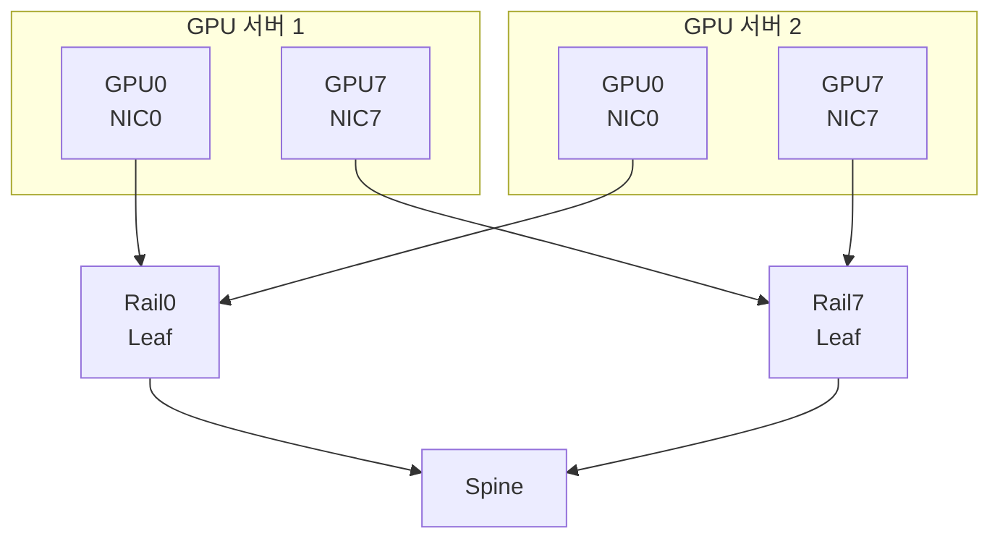

# InfiniBand vs RoCEv2 차이점 정리

<!-- more -->

## 노드 간 GPU 통신이란
노드 간 GPU 통신(Inter-node GPU Communication)이란 서로 다른 서버에 꽂힌 GPU들이 네트워크를 건너 그래디언트·텐서를 주고받는 것

모델·데이터가 한 노드 GPU 메모리에 안 담기면서 노드를 넘는 통신이 학습 병목으로 올라옴.

- 노드 안은 NVLink·NVSwitch로 GPU끼리 직접 연결 → 노드 밖은 NIC와 스위치 패브릭을 거침
- 분산 학습의 all-reduce는 매 스텝 그래디언트를 전 GPU가 교환 → 통신 지연이 곧 GPU 유휴 시간
- 일반 TCP/IP는 커널 처리·메모리 복사·CPU 개입이 커서 이 트래픽엔 부적합
- 그래서 노드 간 GPU 패브릭은 RDMA 계열이 표준

---

## RDMA가 필요한 이유
RDMA(Remote Direct Memory Access)란 원격 노드의 메모리를 상대 CPU·커널 개입 없이 NIC가 직접 읽고 쓰는 전송 방식

| 항목 | TCP/IP | RDMA |
|------|--------|------|
| 데이터 경로 | 커널 네트워크 스택 경유 | 유저 공간에서 NIC 큐에 직접 |
| 메모리 복사 | 커널 버퍼 복사 발생 | zero-copy, 앱 버퍼에서 바로 DMA |
| CPU 개입 | 패킷마다 CPU 처리 | NIC가 전송 담당, CPU 거의 무개입 |
| 지연 | 스택·복사로 높음 | 마이크로초대 |

- 커널 바이패스: 유저 공간이 시스템콜 없이 NIC 큐에 직접 명령을 올림 → 컨텍스트 스위치 제거
- zero-copy: 애플리케이션 버퍼를 NIC가 직접 DMA → 커널 버퍼로의 복사 단계 생략
- 낮은 CPU 개입: 전송을 NIC가 처리 → CPU는 GPU 연산·스케줄링에 집중
- RDMA를 실어 나르는 방식이 세 갈래 → InfiniBand(전용 패브릭), RoCEv2(이더넷 위), iWARP(TCP 위)

---

## InfiniBand란
InfiniBand란 IBTA(InfiniBand Trade Association)가 정의한 HPC·AI용 전용 인터커넥트로, 링크·전송·관리 계층을 자체 규격으로 갖춘 non-Ethernet 패브릭

- 이더넷이 아니라 별도 물리·프로토콜 스택 → 전용 HCA와 전용 스위치로 서브넷을 구성
- 링크 레벨에서 credit 기반 흐름 제어로 기본 무손실 → 수신 측이 버퍼 여유(credit)를 알린 만큼만 송신
- 버퍼가 넘치지 않아 혼잡으로 인한 패킷 드롭이 구조적으로 없음 → 이더넷의 재전송 비용이 애초에 없음

### 구성 요소

| 구성 요소 | 역할 |
|-----------|------|
| HCA (Host Channel Adapter) | 서버에 꽂히는 어댑터. 시스템 메모리와 IB 패브릭을 잇고 DMA 엔진·주소 변환 내장 |
| Switch | IB 패킷을 포트 간 전달. 라우팅 테이블은 Subnet Manager가 설정 |
| Subnet Manager (SM) | 서브넷 전체를 구성·관리하는 소프트웨어. HCA·스위치 초기화, 라우팅·QoS 설정, 서브넷당 활성 1개 |
| 링크/케이블 | 4x lane 묶음이 표준 서버 포트 폭. DAC·AOC·광 트랜시버로 연결 |

### 속도 등급
세대마다 lane당 속도가 2배씩 오르며, 표준 서버 포트는 4x lane 묶음

| 세대 | lane당 | 4x 포트 | 인코딩 |
|------|--------|---------|--------|
| EDR | 25Gb/s | 100Gb/s | NRZ, 64b/66b |
| HDR | 50Gb/s | 200Gb/s | PAM4, 256b/257b |
| NDR | 100Gb/s | 400Gb/s | PAM4, 256b/257b |
| XDR | 200Gb/s | 800Gb/s | PAM4, 256b/257b |

- 표는 4x 기준 → 1x·2x·8x 구성도 규격에 있으나 서버 포트는 관행상 4x
- 64b/66b(부호화 오버헤드 약 3%)는 EDR까지 → HDR부터 PAM4 신호에 256b/257b 인코딩
- XDR은 2025년 Quantum-X800 스위치·ConnectX-8 NIC로 상용 진입

---

## RoCEv2란
RoCEv2(RDMA over Converged Ethernet v2)란 RDMA를 UDP/IP에 실어 일반 이더넷·IP 패브릭 위에서 돌리는 방식

- RDMA 페이로드를 UDP 데이터그램에 캡슐화 → IANA가 예약한 UDP 목적지 포트 4791로 식별
- L3 라우팅 가능 → 이더타입 기반 L2 전용인 RoCEv1과 달리 서브넷을 넘어감
- 물리 매체가 이더넷 → 기존 이더넷 스위치·NIC·운영 도구를 재사용
- 단 RDMA는 패킷 손실에 취약 → 이더넷을 무손실로 만드는 설정이 전제

### 무손실 이더넷 3요소
RoCEv2 성능은 패킷 드롭 제로에 의존하며, 손실 방지는 세 기법의 조합으로 달성

| 기법 | 계층 | 역할 |
|------|------|------|
| PFC (Priority Flow Control, 802.1Qbb) | L2 | 혼잡 시 홉 단위로 특정 우선순위 트래픽을 일시 정지(pause) |
| ECN (Explicit Congestion Notification) | L3 | 큐 적체 시 스위치가 패킷에 혼잡 표시(마킹) |
| DCQCN (Data Center Quantized Congestion Notification) | 종단 | ECN 마킹을 받은 송신자가 전송률을 낮추는 종단 혼잡 제어 |

- PFC는 홉 단위 즉각 정지로 드롭을 막음 → 잘못 쓰면 혼잡 전파·데드락 위험
- ECN과 DCQCN은 송신원에서 속도를 줄이는 근본 제어 → PFC 발동 빈도를 낮춤
- 세 기법을 스위치·NIC 전 구간에 일관 설정해야 함 → 한 홉이라도 빠지면 드롭 발생

---

## GPUDirect RDMA
GPUDirect RDMA란 NIC가 시스템 메모리를 거치지 않고 GPU 디바이스 메모리에 직접 DMA하는 기술

- 일반 경로: GPU 메모리 → 시스템 메모리로 복사(바운스 버퍼) → NIC → 네트워크
- GPUDirect 경로: NIC가 GPU 메모리를 직접 읽어 전송 → 시스템 메모리 복사 단계 삭제
- GPU 가상주소를 물리주소로 변환해 NIC에 등록 → GPU 드라이버와 RDMA 드라이버가 협업(nvidia_p2p_get_pages, ibv_reg_mr)
- ConnectX·BlueField 계열 NIC에서 InfiniBand·RoCE 모두 지원 → 패브릭 종류와 무관하게 적용
- 노드 밖 all-reduce에서 CPU 개입·복사가 사라짐 → 통신 지연·CPU 부하↓

---

## rail-optimized 토폴로지
rail-optimized란 GPU마다 전용 NIC와 전용 레일(rail) 스위치를 두어, 같은 레일끼리 최단 경로로 잇는 fat-tree 구성

- 노드마다 GPU 8개·NIC 8개 → GPU k의 NIC는 레일 k의 leaf 스위치에만 연결
- 같은 leaf에 물린 노드끼리는 같은 레일 GPU가 한 홉으로 도달 → 레일 내 all-reduce 트래픽이 spine을 안 거침
- 서버 안에서는 NVSwitch로 어느 NIC든 접근 → 자기 레일이 아닌 목적지도 노드 내부에서 우회
- fat-tree는 leaf-spine 다단으로 상·하향 대역폭을 맞춘 non-blocking 구성 → 임의 노드쌍 동시 통신에도 대역폭 보장
- NVIDIA 레퍼런스에서 SU(Scalable Unit)는 GPU 노드 32대 단위 → 64포트 NDR leaf가 하향 32포트(노드)·상향 32포트(spine)로 non-blocking

---

## InfiniBand vs RoCEv2 비교

| 비교 항목 | InfiniBand | RoCEv2 |
|-----------|-----------|--------|
| 패브릭 | 전용 non-Ethernet(HCA·IB 스위치·SM) | 일반 이더넷/IP 위 |
| 무손실 방식 | credit 기반 링크 흐름 제어로 기본 무손실 | PFC+ECN+DCQCN을 별도 설정 |
| 라우팅·관리 | Subnet Manager가 중앙 집중 | 표준 L3 라우팅, IP 운영 그대로 |
| 운영 난도 | SM·전용 장비 학습 필요, 무손실은 내장 | 장비는 익숙하나 무손실 튜닝이 까다로움 |
| 기존 이더넷 재사용 | 불가, 전용 HCA·스위치 필요 | 가능, 기존 이더넷 자산 활용 |
| 생태계 | NVIDIA Quantum 중심의 HPC 표준 | 다중 벤더 이더넷, Ultra Ethernet 진영 확대 |
| 초기 비용 | 전용 장비로 높음 | 범용 이더넷으로 낮음 |

- Ultra Ethernet Consortium은 2023년 결성 → 2025년 6월 Ultra Ethernet 1.0 규격 공개로 이더넷 진영의 RDMA 표준화가 진행 중
- 두 방식 모두 GPUDirect RDMA를 지원 → NIC가 InfiniBand든 RoCE든 GPU 메모리 직접 DMA는 동일하게 가능

---

## 함정

- RoCEv2를 "이더넷이니 그냥 꽂으면 된다"고 붙이면 성능이 급락함 → PFC·ECN·DCQCN 중 한 구간이라도 빠지면 드롭과 RDMA 재전송으로 처리량이 무너짐
- PFC를 과하게 걸면 혼잡이 상류로 번지고 데드락 위험 → 근본 제어인 ECN·DCQCN 튜닝과 함께 잡아야 함
- InfiniBand는 이더넷이 아님 → HCA·IB 스위치·케이블이 전용이라 이더넷 장비로 IB 패브릭을 짤 수 없음
- IP·VLAN·이더넷 스위치 운영 지식은 IB에 그대로 통하지 않음 → SM·전용 도구 학습이 별도로 필요
- 속도 등급을 "그 세대의 절대 대역폭"으로 오해 → HDR·NDR·XDR 수치는 4x 포트 기준이라 1x·2x 구성에서는 그만큼 나눠 계산해야 함

---

## 선택 기준

| 상황 | 추천 | 추천 사유 |
|------|------|------|
| 대규모 학습 클러스터, 최저 지연·확정적 무손실 | InfiniBand | credit 기반 무손실 내장, HPC 검증된 fat-tree |
| 기존 이더넷 자산·운영 인력을 재사용 | RoCEv2 | 전용 패브릭 없이 익숙한 이더넷으로 구축 |
| 단일 벤더 종속을 피하고 싶음 | RoCEv2 | 다중 벤더 이더넷·Ultra Ethernet 선택지 |
| 무손실 튜닝 인력이 부족 | InfiniBand | 무손실이 링크 계층에 내장, SM이 라우팅 자동화 |
| 초기 도입 비용을 낮추고 점진 확장 | RoCEv2 | 범용 이더넷으로 진입 비용↓ |
| 노드 내 8-GPU·8-NIC로 all-reduce 최적화 | 공통 | rail-optimized fat-tree + GPUDirect RDMA |

---

## 결론

- 노드 간 GPU 통신은 커널 바이패스·zero-copy·낮은 CPU 개입을 주는 RDMA가 전제 → 그 위에서 InfiniBand와 RoCEv2가 갈림
- InfiniBand는 무손실이 링크 계층에 내장, RoCEv2는 PFC·ECN·DCQCN으로 무손실을 만들어 쓰는 이더넷
- 선택은 성능·확정성이면 InfiniBand, 이더넷 재사용·벤더 유연성이면 RoCEv2 → "무손실이 공짜냐 튜닝이냐"가 갈림길
