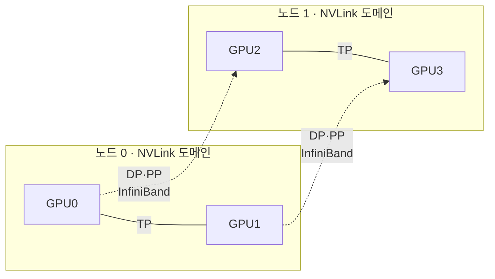

# 분산 학습 병렬화와 집합 통신 정리

<!-- more -->

## 집합 통신이란
집합 통신(Collective Communication)이란 여러 GPU(rank)가 한꺼번에 참여해 데이터를 모으거나 줄이거나 나눠 갖는 통신 패턴

분산 학습에서 GPU 수를 늘려도 통신이 연산을 못 따라가면 통신이 병목이 됨.

- 각 GPU가 계산한 그래디언트를 매 스텝 합쳐야 다음 스텝으로 진행됨 → 통신이 끝날 때까지 연산이 멈춤
- 모델·배치가 커지면 GPU당 연산은 쪼개지지만 동기화할 데이터 총량은 줄지 않음
- GPU 연산 속도 증가폭이 노드 간 네트워크 대역폭 증가폭보다 큼 → 규모가 커질수록 통신 비중↑
- point-to-point로 N개 GPU를 순진하게 다 이으면 특정 링크에 트래픽이 몰림 → 집합 통신 알고리즘으로 부하를 흩어야 함

---

## collective 연산
분산 학습 프레임워크가 쓰는 집합 통신은 몇 가지 표준 연산의 조합이며, 각각 데이터가 모이는 방향과 결과 분포가 다름

| 연산 | 동작 | 결과 분포 | 주 사용처 |
|------|------|-----------|-----------|
| AllReduce | 전 rank 입력을 reduce(합 등)해 동일 결과를 모두에게 배포 | 전 rank 동일 | DP 그래디언트 동기화 |
| AllGather | 각 rank의 조각을 모아 `k*N` 버퍼로 전 rank에 배포 | 전 rank 동일 | ZeRO·FSDP 파라미터 수집, TP 출력 결합 |
| ReduceScatter | reduce 후 rank별로 균등 분할해 각자 `1/N`만 수신 | rank별 부분 | ZeRO 그래디언트 분할 |
| Broadcast | root 1개의 버퍼를 전 rank로 복사 | 전 rank 동일 | 초기 가중치·설정 배포 |
| All-to-All | 각 rank가 모든 rank에 서로 다른 조각을 전송 | rank별 재배치 | MoE 토큰 라우팅 |

- ReduceScatter 뒤에 AllGather를 이으면 AllReduce와 같음 → Ring AllReduce가 이 두 단계로 구현됨
- Reduce 뒤에 Broadcast를 이어도 AllReduce와 결과가 같음
- All-to-All은 NCCL에서 그룹화된 Send/Recv(`ncclGroupStart`~`ncclGroupEnd`)로 구성 가능 → 각 rank가 모든 peer에 다른 조각을 뿌리는 재분배 패턴

---

## Ring AllReduce와 Tree
Ring AllReduce란 GPU를 논리적 링으로 이어 이웃에게만 조각을 넘기며 ReduceScatter와 AllGather 두 단계로 전체 합을 맞추는 알고리즘

한 GPU에 그래디언트를 다 모아 합치는 방식은 그 GPU의 링크가 병목이 되므로 부하 분산이 필요해짐.

- ReduceScatter 단계 `N-1` 스텝 + AllGather 단계 `N-1` 스텝 = 총 `2(N-1)` 스텝
- 각 GPU가 매 스텝 `K/N` 바이트를 주고받음 → GPU당 총 전송량 `2(N-1)K/N` (K는 텐서 크기)
- 이 전송량은 GPU 수 N이 늘어도 거의 일정 → 대역폭 관점에서 최적(bandwidth-optimal), 큰 텐서에 유리
- 약점은 스텝 수가 N에 비례한다는 점 → GPU가 많아지면 지연(latency)이 선형으로 증가

Tree AllReduce는 reduce·broadcast를 트리 구조로 묶어 지연을 줄인 대안임.

| 알고리즘 | 스텝·지연 | 대역폭 | 유리한 상황 |
|----------|-----------|--------|-------------|
| Ring | `2(N-1)`, N에 비례 | 최적(`2(N-1)K/N`) | 큰 텐서, 노드 수 적음 |
| Tree | `O(log N)` | 이론상 Ring 동급, 큰 메시지 실효는 불리 | 작은 메시지, 노드 수 많음 |

- 큰 텐서는 링크를 꽉 채우는 Ring이, 작은 메시지는 왕복 수가 적은 Tree가 유리
- 둘은 대체재가 아니라 메시지 크기·규모에 따라 갈아 끼우는 선택지 → 이 선택을 사람이 아니라 NCCL이 함

---

## NCCL의 역할
NCCL(NVIDIA Collective Communications Library)이란 다중 GPU·다중 노드 사이 집합 통신을 하드웨어 토폴로지에 맞춰 구현하는 NVIDIA 라이브러리

- PCIe·NVLink 그래프와 NIC를 탐지해 어느 GPU가 직결이고 어디서 스위치·네트워크를 넘는지 모델링
- rank 쌍마다 가장 빠른 경로를 고름 → 노드 안은 NVLink P2P, 노드 간은 InfiniBand + GPUDirect RDMA
- 메시지 크기로 Ring/Tree를 자동 선택 → 큰 텐서는 Ring, 작은 메시지는 Tree
- PyTorch DDP·FSDP, DeepSpeed, Megatron 등이 내부에서 NCCL을 호출 → 사용자는 알고리즘을 직접 짜지 않음
- `NCCL_ALGO`로 알고리즘 강제, `NCCL_DEBUG`로 선택 결과 확인 가능

| 구간 | 선택 경로 |
|------|-----------|
| 같은 노드, NVLink 존재 | NVLink P2P |
| 같은 노드, PCIe만 | PCIe / 공유 메모리 |
| 노드 간 | InfiniBand·RoCE + GPUDirect RDMA |

---

## 병렬화 전략 비교
분산 학습 병렬화란 모델·데이터·연산을 여러 GPU에 나눠 단일 GPU의 메모리·연산 한계를 넘는 방법

모델·배치가 한 GPU에 안 들어가면서 방식별로 통신 특성이 크게 갈림.

| 전략 | 나누는 대상 | 주 통신 | 통신 빈도·양 | 특징 |
|------|-------------|---------|--------------|------|
| Data Parallelism (DP) | 배치(데이터) | 그래디언트 AllReduce | 스텝당 1회, 모델 크기 | 모델 전체 복제, 가장 단순 |
| Tensor Parallelism (TP) | 레이어 내부 행렬 | 활성값 AllReduce | 레이어마다, 최다 | 통신량 최대, NVLink 사실상 필수 |
| Pipeline Parallelism (PP) | 레이어를 스테이지로 | 인접 스테이지 P2P | 스테이지 경계, 소량 | 버블(bubble) 발생 |
| Expert Parallelism (EP) | MoE 전문가 | All-to-All 라우팅 | MoE 레이어마다, 토큰량 의존 | 전문가만 분산 |

- DP는 그래디언트 AllReduce가 backward 계산과 시간상 겹쳐짐 → 느린 링크도 어느 정도 감내
- TP는 self-attention·MLP 블록마다 AllReduce가 걸림 → 단순 transformer 레이어 기준 forward 2회·backward 2회
- TP의 AllReduce는 활성값을 합치는 것이라 레이어 임계 경로에 놓임 → 통신 지연이 곧 학습 속도
- PP 버블은 앞 스테이지가 채워지고 뒤 스테이지가 비는 구간의 유휴 → 마이크로배치를 늘리고 1F1B로 축소
- 1F1B는 스테이지가 forward 직후 대응 backward를 실행하는 스케줄 → 버블은 그대로지만 활성값 메모리↓
- EP는 게이팅(gating)이 토큰을 전문가로 보내고 결과를 되받는 두 번의 All-to-All → 전문가가 노드를 넘으면 비쌈

---

## ZeRO와 FSDP
ZeRO(Zero Redundancy Optimizer)란 DP에서 GPU마다 중복 저장하던 옵티마이저 상태·그래디언트·파라미터를 rank들에 분할해 메모리 중복을 없애는 기법

순수 DP는 모델 상태를 전 GPU가 통째로 복제하므로 큰 모델에서 메모리가 먼저 한계에 부딪힘.

| 단계 | 추가로 분할하는 대상 | 누적 분할 범위 | 통신 변화 |
|------|----------------------|----------------|-----------|
| Stage 1 | 옵티마이저 상태 | 옵티마이저 상태 | 통신 패턴 변화 거의 없음 |
| Stage 2 | 그래디언트 | 옵티마이저 상태 + 그래디언트 | 그래디언트를 ReduceScatter로 분할 |
| Stage 3 | 파라미터 | 셋 전부 | 레이어마다 파라미터 AllGather 추가 |

- Stage 1은 변경이 가장 작고 옵티마이저 상태부터 줄임 → DP가 옵티마이저 상태 때문에 터질 때의 첫 선택
- Stage 3는 GPU마다 파라미터의 `1/N`만 보유 → forward·backward 직전 해당 레이어를 AllGather로 모으고 쓴 뒤 버림
- Stage 3의 메모리 절감은 DP 차수에 선형 비례 → 64 GPU면 약 64배 절감, 대신 레이어마다 AllGather 부담
- 절감이 클수록 통신이 늘어남 → Stage 3는 고대역폭 인터커넥트가 성능에 결정적

FSDP(Fully Sharded Data Parallel)는 PyTorch가 같은 아이디어를 구현한 것으로, FULL_SHARD 설정이 ZeRO Stage 3와 구조상 동일함.

- 래핑 단위(보통 레이어)마다 forward 전 AllGather로 전체 파라미터를 모으고 실행 후 폐기, backward는 그래디언트를 ReduceScatter
- rank당 메모리가 `O(P)`에서 `O(P/N)`으로 감소 → 대가는 패스마다 래핑 단위 1회의 추가 AllGather

| 방식 | 파라미터 | 그래디언트 | 옵티마이저 상태 |
|------|----------|----------|-----------------|
| 순수 DP(DDP) | 복제 | 복제(AllReduce) | 복제 |
| ZeRO Stage 1 | 복제 | 복제 | 분할 |
| ZeRO Stage 2 | 복제 | 분할 | 분할 |
| ZeRO Stage 3 / FSDP FULL_SHARD | 분할 | 분할 | 분할 |

---

## 병렬화와 링크 매핑
각 병렬화가 어떤 통신을 얼마나 자주 하느냐에 따라 타야 할 링크가 갈림

| 병렬화 | 통신 패턴 | 빈도 | 볼륨 | 적합 링크 |
|--------|-----------|------|------|-----------|
| TP | 활성값 AllReduce | 레이어마다(임계 경로) | 최다 | 노드 안 NVLink |
| EP | All-to-All 라우팅 | MoE 레이어마다 | 토큰량 의존 | 노드 안 NVLink 우선 |
| ZeRO-3 / FSDP | 파라미터 AllGather + 그래디언트 ReduceScatter | 레이어마다 | 큼 | NVLink 유리, 노드 간도 동작 |
| DP | 그래디언트 AllReduce | 스텝당 1회 | 모델 크기, backward와 겹침 | 노드 간 네트워크 감내 |
| PP | 인접 스테이지 P2P | 스테이지 경계 | 소량 | 노드 간 네트워크 감내 |

- 노드 안 NVLink는 GPU당 900GB/s(4세대 Hopper)에서 1,800GB/s(5세대 Blackwell) 수준
- 노드 간 InfiniBand는 포트당 HDR 200Gb/s, NDR 400Gb/s, XDR 800Gb/s
- 단위가 하나는 바이트(GB/s), 하나는 비트(Gb/s)임에 주의 → 900GB/s는 7,200Gb/s이므로 절대값 격차가 링크 선택을 가름
- 그래서 통신이 잦고 임계 경로에 있는 병렬화를 노드 안에, 드물고 겹칠 수 있는 병렬화를 노드 간에 배치

---

## 함정: 병렬화를 섞을 때
여러 병렬화를 함께 쓰는 3D parallelism(TP+PP+DP 조합)에서는 각 축을 어느 링크에 놓느냐가 성능을 가름

직관적으로는 그래디언트 전체를 합치는 DP가 가장 무거워 보여 NVLink를 줘야 할 것 같지만 반대임.

- TP는 레이어마다 활성값 AllReduce를 임계 경로에서 수행 → 통신 지연이 곧 스텝 지연, 가장 빠른 NVLink가 필요
- 그래서 TP 차수를 노드 안 GPU 수에 맞춤 → 노드당 GPU 8개면 TP 차수 8을 한 노드 안에 가둠
- DP의 그래디언트 AllReduce는 스텝당 1회 + backward 계산과 겹쳐 숨길 수 있음 → 느린 노드 간 네트워크로도 감내
- PP는 인접 스테이지 사이 소량 P2P만 오감 → 노드 간에 두어도 부담이 작음
- 오해 교정: 부담을 정하는 것은 총 볼륨이 아니라 빈도와 임계 경로 포함 여부 → 볼륨이 커도 드물고 겹칠 수 있으면 느린 링크로 충분

---

## 결론
- 분산 학습의 병목은 연산보다 통신인 경우가 많음 → 병렬화 선택은 곧 통신 패턴 선택
- Ring은 대역폭, Tree는 지연에 유리하고 NCCL이 토폴로지·메시지 크기로 자동 선택
- 통신량이 큰 것과 부담이 큰 것은 다름 → 배치의 기본값은 "TP는 노드 안 NVLink, DP는 노드 간 네트워크"
