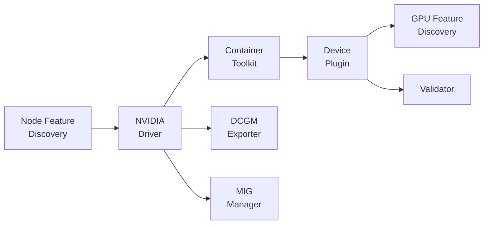

# 쿠버네티스 GPU 스케줄링 정리

<!-- more -->

## 쿠버네티스 GPU 스케줄링이란
쿠버네티스 GPU 스케줄링이란 device plugin이 확장 리소스로 광고한 GPU를 kube-scheduler가 파드에 배치하고, 필요하면 분할·격리·큐잉까지 얹는 배치 체계

GPU가 CPU·메모리와 달리 파드 간 공유·오버커밋이 기본 불가능한 정수 리소스여서, 값비싼 카드를 놀리지 않게 배치·분할·모니터링하는 별도 계층이 필요해짐.

- kube-scheduler는 CPU·메모리·확장 리소스의 "개수"만 봄 → GPU 모델·VRAM 용량·카드 간 토폴로지는 스케줄링 입력이 아님
- GPU는 device plugin이 확장 리소스로 광고해야 비로소 스케줄러에 보임 → 플러그인이 없으면 노드에 GPU가 꽂혀 있어도 nvidia.com/gpu는 0
- 확장 리소스는 정수·비오버커밋 → CPU식 공유·초과 배치가 원천 차단됨

---

## device plugin 동작
device plugin이란 kubelet에 특정 하드웨어를 확장 리소스로 등록하고 컨테이너에 할당하는 gRPC 서비스

- 플러그인이 /var/lib/kubelet/device-plugins/<name>.sock 에 gRPC 서버를 띄운 뒤 kubelet.sock 으로 Register 호출
- 등록 시 ResourceName을 nvidia.com/gpu 로 광고 → kubelet이 노드 status에 확장 리소스로 반영
- 파드는 resources.limits.nvidia.com/gpu 로 요청 → 스케줄러는 이 값을 정수 리소스로만 취급해 개수만 보고 배치
- 실제 디바이스 마운트·환경변수 주입은 컨테이너 생성 시점의 Allocate 응답으로 처리

| 메서드 | 역할 |
|--------|------|
| Register | 소켓 경로·API 버전·ResourceName(nvidia.com/gpu)을 kubelet에 등록 |
| ListAndWatch | 관리 중인 디바이스 목록과 헬스를 스트림으로 보고, 상태 변화 시 갱신 |
| Allocate | 컨테이너 생성 시 호출, 디바이스 마운트·env·라이브러리 경로 주입 |
| GetPreferredAllocation | 가용 디바이스 중 우선 할당 후보 반환(GPU 토폴로지 고려) |
| GetDevicePluginOptions | kubelet과의 통신 옵션 반환 |

!!! warning
    nvidia.com/gpu는 확장 리소스여서 requests와 limits를 다르게 지정할 수 없음. limits만 적으면 requests가 같은 값으로 채워지지만, limits 없이 requests만 적는 것은 불가. 정수만 허용하며 오버커밋 불가. CPU처럼 requests를 낮게 잡아 버스트를 노리는 배치 전략은 GPU엔 통하지 않음.

---

## GPU Operator 구성요소
GPU Operator란 드라이버부터 모니터링까지 GPU 노드에 필요한 소프트웨어 스택 전체를 오퍼레이터 패턴으로 자동 설치·관리하는 배포체

노드마다 드라이버·런타임·플러그인을 손으로 맞추면 버전 어긋남과 오류가 잦아, 한 벌로 묶어 선언적으로 굴리려는 목적.

| 구성요소 | 역할 |
|----------|------|
| Node Feature Discovery(NFD) | 노드 하드웨어·PCI 정보를 라벨링, GPU 노드 식별의 전제 |
| NVIDIA Driver | 커널 모듈·CUDA 런타임을 컨테이너로 설치해 OS와 GPU를 연결 |
| Container Toolkit | 컨테이너 런타임이 GPU 디바이스를 컨테이너에 노출하도록 설정 |
| GPU Feature Discovery(GFD) | GPU 모델·메모리·MIG 프로파일을 노드 라벨로 노출 |
| Device Plugin | nvidia.com/gpu 리소스를 kubelet에 등록·할당 |
| DCGM / DCGM Exporter | GPU 텔레메트리 수집, Prometheus 포맷으로 /metrics 노출 |
| MIG Manager | 노드의 MIG 파티션을 선언적으로 생성·변경 |
| Driver Manager | 드라이버 업그레이드 시 파드 축출·롤아웃 관리 |
| Operator Validator | 각 구성요소 정상 여부를 검증하는 init 게이트 |

구성요소는 앞 단계가 준비돼야 다음이 뜨는 의존 사슬로 묶임.

- 드라이버 파드가 죽으면 하위 구성요소가 전부 Init에서 멈춤 → 드라이버 문제 하나가 "전부 고장"처럼 보이는 이유
- 각 단계는 앞 단계 헬스를 기다리는 init 컨테이너를 둠 → 장애 지점 추적은 사슬의 위에서 아래로

---

## GPU 분할과 공유
nvidia.com/gpu는 정수 단위라, GPU 하나를 여러 파드가 나눠 쓰려면 device plugin 위에 별도 분할·공유 기술을 얹어야 함

| 방식 | 격리 수준 | 메모리 분리 | 노출 방식 |
|------|-----------|-------------|-----------|
| time-slicing | 없음(시간 분할) | 없음 | replicas 수만큼 nvidia.com/gpu 증식 |
| MPS | 약함(장애 격리 없음) | 클라이언트당 균등 한도 | replicas 수만큼 증식, 커널 동시 실행(MIG 병용 불가) |
| MIG | 하드웨어 격리 | 있음 | 전략별로 nvidia.com/gpu 또는 프로파일 리소스로 노출 |

### time-slicing
time-slicing이란 한 GPU에 replicas를 정의해 여러 파드가 시간을 번갈아 점유하도록 오버서브스크립션하는 방식

- 스케줄러엔 replicas 수만큼 nvidia.com/gpu가 있는 것처럼 보임 → 물리 GPU는 1장, 파드는 시분할로 교차 실행
- 메모리·장애 격리가 없음 → 한 파드의 OOM이나 오류가 같은 GPU의 다른 파드로 파급
- 지원 리소스는 nvidia.com/gpu와 mixed MIG 전략에서 나오는 리소스 유형뿐
- 격리가 필요 없는 추론·개발 워크로드의 밀도를 올리는 용도, 학습 격리에는 부적합

### MIG
MIG(Multi-Instance GPU)란 GPU를 하드웨어 수준에서 여러 인스턴스로 물리 분할해 메모리·연산·캐시를 격리하는 기술

MIG 전략은 device plugin이 파티션을 리소스로 어떻게 노출하는지를 정함.

| 전략 | 노출 리소스 | 특징 |
|------|-------------|------|
| single | nvidia.com/gpu | 노드 내 모든 인스턴스가 동일 프로파일, 스케줄러 관점은 일반 GPU와 동일 |
| mixed | nvidia.com/mig-1g.5gb 등 | 프로파일별 리소스명으로 분리 노출, 한 노드에 이종 프로파일 공존 가능 |

A100 40GB 기준 프로파일. 한 GPU를 최대 7개 인스턴스까지 나눌 수 있음.

| 프로파일 | 메모리 | 컴퓨트 슬라이스 | 최대 인스턴스 |
|----------|--------|-----------------|---------------|
| 1g.5gb | 5GB | 1 | 7 |
| 2g.10gb | 10GB | 2 | 3 |
| 3g.20gb | 20GB | 3 | 2 |
| 4g.20gb | 20GB | 4 | 1 |
| 7g.40gb | 40GB | 7 | 1 |

- 프로파일은 메모리·컴퓨트가 함께 묶임 → 1g.5gb 7개, 2g.10gb 3개처럼 조합 개수가 정해져 있음
- time-slicing과 달리 인스턴스 간 메모리·장애가 분리됨 → 멀티테넌트·SLA 워크로드에 적합
- mixed 전략은 time-slicing과도 조합 가능 → 특정 프로파일(예: nvidia.com/mig-1g.5gb)에 다시 replicas를 걸 수 있음

---

## DRA (Dynamic Resource Allocation)
DRA란 파드가 정수 개수 대신 ResourceClaim으로 "어떤 속성의 GPU를" 요청하게 해, 스케줄러가 디바이스 속성까지 보고 매칭하게 하는 프레임워크

개수만 아는 확장 리소스로는 모델·메모리·MIG 프로파일을 지정할 수 없어, 속성 기반 요청을 표준 API로 끌어올린 것.

| 버전 | 성숙도 |
|------|--------|
| v1.32 | 구조화 파라미터(structured parameters) 기반 DRA가 beta 진입 |
| v1.33 | beta 유지, 드라이버 소유 ResourceClaim 상태 등 확장 |
| v1.34 | 핵심 DRA가 GA, resource.k8s.io/v1 안정화, 기본 활성화 |

- 드라이버가 ResourceSlice로 노드의 가용 디바이스·속성을 광고 → 스케줄러가 ResourceClaim과 매칭
- DeviceClass가 클레임의 템플릿, ResourceClaim이 실제 요청 단위 → 파드는 클레임을 참조해 디바이스를 받음
- v1.34부터 API 기본값이 안정 v1 → beta 시절의 명시적 opt-in 없이 켜져 있음
- device plugin을 대체하는 것이 아니라 한 클러스터에서 병행 가능 → 기존 nvidia.com/gpu 워크로드는 그대로 동작

---

## gang scheduling
gang scheduling이란 잡을 구성하는 여러 파드를 원자적으로(all-or-nothing) 배치해, 일부만 뜨는 상태를 막는 스케줄링 방식

- 분산 학습은 N개 파드가 동시에 떠야 통신 링을 형성 → 일부만 배치되면 나머지 GPU를 점유한 채 무한 대기(부분 배치 데드락)
- 기본 kube-scheduler는 파드 단위 배치 → 잡 전체를 한 덩어리로 다루는 개념이 없음
- 점유된 GPU가 다른 잡까지 막아 클러스터 전체 처리량이 떨어짐 → 부분 배치는 비용·신뢰성 양쪽의 위험

| 항목 | Kueue | Volcano |
|------|-------|---------|
| 스케줄링 방식 | 기본 kube-scheduler 유지, 잡을 suspend·queue·admit | 자체 스케줄러가 PodGroup 단위로 배치(schedulerName 지정) |
| gang scheduling | waitForPodsReady로 all-or-nothing 근사(타임아웃 시 축출·재큐잉) | PodGroup all-or-nothing 지원 |
| 주 역할 | 팀·네임스페이스별 쿼터와 큐 거버넌스 | 분산 잡의 원자적 배치·플레이스먼트 |
| 배치 방식 | 승인된 잡을 기본 스케줄러가 배치 | 자체 스케줄러가 직접 배치 |

- 둘을 겹쳐 쓸 수 있음 → Kueue가 상위에서 쿼터·승인, Volcano가 하위에서 gang 배치
- 소규모 단일 잡이면 Volcano 하나로 충분, 팀별 쿼터 경쟁이 생기면 Kueue를 얹음

---

## DCGM 기반 모니터링
DCGM Exporter가 GPU 텔레메트리를 Prometheus 포맷으로 노출하며, /metrics 엔드포인트에서 필드별 게이지로 수집됨

| 필드 | 의미 | 단위 |
|------|------|------|
| DCGM_FI_DEV_GPU_UTIL | GPU 사용률 | % |
| DCGM_FI_DEV_MEM_COPY_UTIL | 메모리 사용률 | % |
| DCGM_FI_DEV_FB_USED | 프레임버퍼(VRAM) 사용량 | MiB |
| DCGM_FI_DEV_FB_FREE | 프레임버퍼 여유 | MiB |
| DCGM_FI_DEV_POWER_USAGE | 전력 소모 | W |
| DCGM_FI_DEV_GPU_TEMP | GPU 온도 | C |
| DCGM_FI_DEV_SM_CLOCK | SM 클럭 주파수 | MHz |
| DCGM_FI_PROF_GR_ENGINE_ACTIVE | 그래픽스 엔진이 활성인 시간 비율 | ratio |
| DCGM_FI_PROF_PIPE_TENSOR_ACTIVE | 텐서(HMMA) 파이프가 활성인 사이클 비율 | ratio |
| DCGM_FI_PROF_DRAM_ACTIVE | 디바이스 메모리 인터페이스가 활성인 사이클 비율 | ratio |
| DCGM_FI_DEV_XID_ERRORS | 마지막으로 발생한 XID 에러 값 | - |

- DCGM_FI_DEV_GPU_UTIL은 커널 실행 여부 기반이라 실제 연산 점유율과 다를 수 있음 → 학습 효율은 PROF 계열(GR_ENGINE_ACTIVE·PIPE_TENSOR_ACTIVE)로 교차 확인
- VRAM은 DCGM_FI_DEV_FB_USED로 봄 → GPU_UTIL이 높아도 FB가 남으면 배치 밀도를 더 올릴 여지
- XID_ERRORS는 하드웨어·드라이버 이상 신호 → 값이 뜨면 노드 격리·교체 판단의 근거
- 텐서 파이프 활성 비율이 낮으면 데이터 로더·전처리 병목 의심 → GPU가 아니라 입력 파이프라인 점검

---

## 결론

- GPU는 확장 리소스라 개수만 스케줄링에 들어옴 → 모델·메모리·토폴로지를 쓰려면 DRA 같은 속성 기반 표현이 필요
- 한 GPU를 쪼개려면 time-slicing(격리 없음)과 MIG(하드웨어 격리)를 워크로드 격리 요구에 맞춰 나눠 씀
- 분산 학습은 부분 배치 데드락이 실질 위험 → gang 배치는 Volcano, 팀 쿼터는 Kueue로 층을 나눔
- 사용률은 "GPU_UTIL 한 지표"가 아니라 "PROF 계열과 VRAM을 함께" 볼 것
