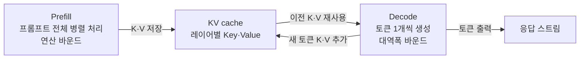

# LLM 추론 서빙 정리

<!-- more -->

## LLM 추론 서빙이란
LLM 추론 서빙(Inference Serving)이란 학습이 끝난 언어 모델을 올려두고 사용자 요청을 받아 토큰을 생성해 응답하는 실시간 처리 체계

학습은 한 번이지만 추론은 서비스 내내 돌기 때문에 서빙 단계의 자원 효율이 전체 GPU 비용을 좌우함.

- 요청이 실시간으로 도착 → 배치가 고정되지 않고 매 순간 바뀜
- 응답이 자기회귀(Autoregressive) 생성 → 토큰을 한 개씩 순차로 뽑음
- 병목이 단계마다 다름 → 연산 성능만 올려서는 풀리지 않는 문제
- 여러 프로바이더·모델을 앞단에서 통제하는 계층은 [AI Gateway 정리](ai_gateway.md)에서 별도로 다룸

---

## 학습과 추론의 자원 특성 차이
같은 모델이라도 학습과 추론은 연산 패턴·메모리 구성·지연 요구가 다름

| 구분 | 학습(Training) | 추론(Inference) |
|------|----------------|-----------------|
| 연산 방향 | forward + backward, 그래디언트 계산 | forward만 |
| 메모리 점유 | 가중치 + 그래디언트 + 옵티마이저 상태 + 활성화 | 가중치 + KV cache |
| 배치 | 큰 배치를 고정해 처리 | 요청이 실시간 도착, 가변 배치 |
| 주 병목 | 대체로 연산(FLOPs) | 단계별로 갈림(prefill 연산, decode 대역폭) |
| 지연 요구 | 배치 처리라 지연에 둔감 | 사용자 대면, 첫 토큰·토큰 간 지연 민감 |
| 정밀도 | BF16/FP16(+FP8) | FP16/BF16 + 양자화(INT4·INT8·FP8) 적극 |

- 추론에선 그래디언트·옵티마이저 상태가 사라짐 → 메모리 대부분이 가중치와 KV cache로 재편됨
- 학습은 처리량만 맞추면 되지만 추론은 처리량과 지연을 동시에 맞춰야 함

---

## prefill과 decode 2단계
추론 한 번은 프롬프트를 한꺼번에 처리하는 prefill과 토큰을 하나씩 뽑는 decode 두 단계로 나뉨



| 단계 | 처리 대상 | 연산 성격 | 병목 | 영향 지표 |
|------|-----------|-----------|------|-----------|
| Prefill | 프롬프트 전체 토큰을 병렬 처리 | 행렬×행렬(GEMM) | 연산 바운드(Compute-bound) | TTFT(첫 토큰 지연) |
| Decode | 토큰을 1개씩 자기회귀 생성 | 행렬×벡터 | 메모리 대역폭 바운드(Bandwidth-bound) | TPOT(토큰 간 지연) |

- prefill은 프롬프트 토큰이 서로를 참조 → 어텐션 연산량이 시퀀스 길이 제곱으로 늘어 텐서 코어를 포화시킴
- decode는 스텝마다 토큰 1개만 생성 → 연산량은 작지만 가중치와 KV cache를 매 스텝 메모리에서 다시 읽어옴
- 한 요청 안에서 병목이 prefill(연산)→decode(대역폭)로 바뀜 → 두 단계를 같은 잣대로 최적화하면 한쪽이 손해
- 최근 서빙은 두 단계를 서로 다른 GPU에 나누기도 함(Prefill-Decode Disaggregation)

---

## KV cache란
KV cache란 이미 계산한 토큰들의 Key·Value 텐서를 저장해 decode 단계에서 재사용하는 캐시

self-attention은 새 토큰마다 앞선 모든 토큰의 K·V가 필요함. 매번 다시 계산하지 않으려고 저장해두는 것이 KV cache임.

- 없으면 decode 스텝마다 전체 시퀀스의 K·V를 재계산 → 길이 제곱의 낭비
- 있으면 이전 K·V를 재사용하고 새 토큰의 K·V만 덧붙임 → decode가 대역폭 바운드가 되는 직접 원인
- 시퀀스가 길어지고 동시 요청이 늘수록 선형으로 커짐 → 가중치와 함께 VRAM을 양분하는 두 축

### 크기 계산식
KV cache 크기는 레이어 수·KV 헤드 수·헤드 차원·시퀀스 길이·정밀도로 결정됨

```
KV cache 바이트 = 2 × 레이어 수 × KV 헤드 수 × 헤드 차원 × 시퀀스 길이 × 정밀도 바이트
```

- 앞의 2 = Key와 Value 두 텐서
- KV 헤드 수는 GQA(Grouped Query Attention)면 어텐션 헤드보다 적음 → Llama 3.1 8B는 헤드 32개 중 KV 헤드 8개라 KV가 1/4로 줄어듦
- 정밀도 바이트: FP16/BF16이면 2, FP8/INT8이면 1
- 배치까지 넣으면 위 값에 동시 시퀀스 수를 곱함

!!! notice
    GQA를 쓰지 않는 MHA(Multi-Head Attention) 모델은 KV 헤드가 어텐션 헤드와 같음. 같은 규모라도 KV cache가 몇 배로 커지므로 위 식의 KV 헤드 수를 모델 config에서 반드시 확인.

---

## 필요 VRAM 어림 계산
필요 VRAM은 가중치와 KV cache, 오버헤드를 더해 어림함

```
필요 VRAM ≈ 가중치(파라미터 수 × 정밀도 바이트) + KV cache(토큰당 크기 × 총 토큰 수) + 오버헤드
```

공개 스펙으로 두 모델을 대입하면 규모 감이 잡힘(BF16, GQA KV 헤드 8, 헤드 차원 128 기준).

| 항목 | Llama 3.1 8B | Llama 3.1 70B |
|------|--------------|---------------|
| 레이어 수 | 32 | 80 |
| 어텐션 헤드 / KV 헤드 | 32 / 8 | 64 / 8 |
| 가중치 VRAM(BF16) | 약 16GB | 약 140GB |
| KV cache / 토큰 | 128KiB (2×32×8×128×2) | 320KiB (2×80×8×128×2) |
| KV cache / 시퀀스(8,192토큰) | 1GiB | 2.5GiB |

- 8B를 BF16로 올리면 가중치만 약 16GB → 24GB GPU면 KV·오버헤드에 약 8GB 남음
- 그 8GB로 8,192토큰 시퀀스를 담으면 이론상 8개, 오버헤드(활성화·CUDA 컨텍스트·단편화)를 빼면 그보다 적음
- 70B는 가중치만 140GB → 80GB GPU 한 장에 안 들어가 텐서 병렬(다중 GPU)이 전제
- 컨텍스트를 최대 131,072토큰까지 키우면 시퀀스 하나의 KV가 8B에서 16GiB → 긴 컨텍스트는 가중치보다 KV가 VRAM을 지배
- 양자화로 가중치를 줄여도(INT4면 약 1/4) KV cache는 별도로 남음 → KV 정밀도·PagedAttention이 같이 필요

---

## continuous batching
continuous batching이란 배치를 요청 단위가 아니라 생성 스텝(iteration) 단위로 갱신하는 스케줄링

정적 배칭은 배치 안 모든 요청이 끝날 때까지 기다림. 길이가 제각각인 LLM 요청에선 짧은 요청이 긴 요청을 기다리며 GPU가 노는 손해가 큼.

| 구분 | 정적 배칭(Static) | continuous batching |
|------|-------------------|---------------------|
| 배치 갱신 | 배치 전체 완료 후 | 매 생성 스텝마다 |
| 완료된 요청 | 남은 요청을 기다림 | 즉시 빠지고 대기 요청이 자리 채움 |
| GPU 유휴 | 짧은 요청이 긴 요청 대기(head-of-line) | 빈 슬롯을 바로 회수 |
| TTFT | 배치가 찰 때까지 지연 | 도착 즉시 합류 |

- 완료된 시퀀스 자리에 대기 요청을 끼워 넣음 → 같은 지연에서 처리량이 정적 배칭 대비 크게 오름
- iteration-level scheduling(Orca에서 제안)이 원리 → vLLM·TensorRT-LLM·SGLang 등 현행 엔진의 기본 동작
- PagedAttention과 결합해야 실효 → 요청이 수시로 들고 나며 생기는 KV cache 단편화를 페이징으로 흡수

---

## PagedAttention
PagedAttention이란 KV cache를 고정 크기 블록으로 나눠 OS 가상 메모리의 페이징처럼 관리하는 기법(vLLM에서 제안)

시퀀스마다 최대 길이만큼 연속 메모리를 미리 잡던 방식은 실제 안 쓴 공간과 조각난 틈으로 KV cache 상당량을 낭비함.

- KV cache를 고정 크기 블록(vLLM 기본 16토큰)으로 분할 → 물리적으로 연속이 아니어도 됨
- 블록 테이블이 논리 블록↔물리 블록을 매핑 → 모델은 연속으로 보지만 실제로는 흩어져 저장
- 최대 길이를 미리 잡지 않음 → 외부 단편화 제거, 내부 단편화는 블록 크기로 상한
- 같은 프리픽스(공용 시스템 프롬프트 등)면 블록을 공유 → 여러 요청이 물리 블록 하나를 참조
- vLLM 논문 기준 기존 시스템의 KV 낭비(60~80%)를 크게 줄여 처리량 2~4배

---

## 양자화 개요
양자화(Quantization)란 가중치·활성화를 낮은 비트로 표현해 VRAM과 메모리 대역폭 부담을 줄이는 기법

decode가 대역폭 바운드라 가중치를 작게 만들면 스텝마다 읽는 양이 줄어 지연·처리량이 함께 개선됨.

| 방식 | 비트 | 대상 | 특징 |
|------|------|------|------|
| FP8(E4M3/E5M2) | 8 | 가중치+활성화 | Hopper·Ada 세대 텐서 코어 네이티브, 큰 모델에서 정확도 안정적 |
| INT8(SmoothQuant·LLM.int8) | 8 | 가중치+활성화 | 활성화 outlier 처리가 관건, W8A8 구성 |
| GPTQ | 3~4 | 가중치 전용 | Hessian 기반 오차 보정 PTQ, 소형 모델 4bit에서 정확도 하락 주의 |
| AWQ | 4 | 가중치 전용 | 활성화 크기로 중요 가중치 보호, weight-only에서 GPTQ보다 정확도 우위 경향 |
| GGUF K-quant | 2~6 | 가중치 전용 | llama.cpp 포맷, 비트 폭 선택 폭 넓음 |

- weight-only(GPTQ·AWQ·GGUF)는 가중치만 낮추고 계산은 FP16 → 대역폭·용량 절감이 주 목적
- FP8·INT8은 활성화까지 낮춰 연산도 가속 → 대신 활성화 outlier로 정확도 관리가 까다로움
- FP8은 16bit 대비 메모리·대역폭 약 2배 절감 → Hopper 이후 하드웨어에서 특히 유리
- KV cache도 FP8·INT8로 양자화 가능 → 가중치와 별개로 KV 용량을 추가로 줄임

---

## 서빙 엔진 비교
엔진마다 KV 관리·런타임 구조·하드웨어 지원이 달라 워크로드에 맞춰 고름

| 엔진 | 개발 | 강점 | 적합 상황 |
|------|------|------|-----------|
| vLLM | 오픈소스(PagedAttention 원조) | 범용 기본값, 폭넓은 하드웨어(CUDA·ROCm·TPU·Gaudi·CPU) | 프로덕션 기본 서빙 |
| TensorRT-LLM | NVIDIA | PyTorch 네이티브 런타임 기반, NVIDIA에서 최고 처리량 | NVIDIA 전용 극한 최적화 |
| SGLang | 오픈소스 | RadixAttention으로 prefix KV 재사용 | 멀티턴·프리픽스 재사용 큰 워크로드 |
| llama.cpp | 오픈소스(ggml) | GGUF, CPU·Apple Silicon(Metal) 1급 지원 | 로컬·온디바이스·맥 |

- vLLM은 하드웨어 지원이 넓고 PagedAttention·continuous batching이 기본 → 고민 없이 시작하기 좋은 기본값
- TensorRT-LLM은 지금은 PyTorch 네이티브 런타임이 기본(구 TensorRT 엔진 컴파일 방식은 레거시) → NVIDIA 하드웨어에 고정해 최고 성능을 뽑을 때
- SGLang은 프리픽스가 겹치는 워크로드(공용 시스템 프롬프트·멀티턴 대화)에서 KV 재사용 이득이 큼
- llama.cpp는 GPU 없이 CPU·통합 메모리로 로컬 실행 → 온디바이스·맥 환경 로컬 추론에 적합

---

## 처리량 vs 지연
서빙 최적화는 처리량(throughput)과 지연(latency)을 동시에 극대화할 수 없는 트레이드오프

| 지표 | 의미 | 좌우 요인 |
|------|------|-----------|
| TTFT(Time To First Token) | 요청 후 첫 토큰까지 지연 | prefill 단계, 프롬프트 길이 |
| TPOT(Time Per Output Token) | 토큰 간 지연 | decode 단계, 메모리 대역폭 |
| Throughput | 초당 총 생성 토큰 수 | 배치 크기·동시성 |
| Goodput | SLO를 만족한 요청만 센 처리량 | 위 지표의 균형 |

- 배치를 키우면 GPU 활용·처리량↑ → 대신 각 요청의 TPOT·대기 지연↑
- 지연을 줄이려 배치를 작게 하면 GPU가 놀아 처리량↓
- 그래서 배치 상한·목표 SLO를 정해두고 그 안에서 처리량을 최대화하는 식으로 균형
- prefill 지연(TTFT)과 decode 지연(TPOT)은 원인이 달라 따로 튜닝 → chunked prefill·prefill-decode 분리 등이 그 도구

---

## 함정: 낮은 연산 활용률이 여유가 아님
decode 단계는 연산이 아니라 메모리 대역폭에 묶여 있어 사용률 지표만 보면 자원을 오판함

- decode는 스텝마다 가중치·KV cache를 반복 스트리밍 → 연산 유닛이 놀아도 메모리 대역폭은 포화 상태일 수 있음
- 이때 연산 활용률(달성 FLOPs·텐서 코어 기준)이 낮게 나옴 → 여유로 보고 배치를 더 키우면 대역폭 한계라 처리량은 안 오르고 지연만 늘어남
- 진짜 병목은 연산 활용률이 아니라 메모리 대역폭 사용률로 봐야 함 → decode 위주 워크로드는 연산 코어보다 대역폭이 먼저 바닥남
- prefill은 반대로 연산 바운드라 연산 활용률이 높게 나옴 → 같은 GPU라도 단계에 따라 지표 해석이 달라짐
- 그래서 대역폭 절감 수단(양자화·KV 압축)이 decode 처리량에 직접 효과 → 코어를 더 꽂는 것보다 우선

| 지표 | nvidia-smi 필드 | 의미 |
|------|-----------------|------|
| GPU 사용률 | GPU-Util | 최근 구간에 커널이 하나라도 돈 시간 비율, 연산·대역폭 포화도와 무관 |
| 메모리 점유 | Memory-Usage | VRAM 사용량, 대역폭 사용률과 다름 |

- 기본 nvidia-smi의 GPU-Util은 커널이 돈 시간 비율일 뿐이라 대역폭에 묶인 decode 중에도 100% 가깝게 찍힘 → 대역폭·연산 활용률은 DCGM·Nsight 같은 도구로 별도 측정

---

## 결론
- 추론은 prefill(연산 바운드)과 decode(대역폭 바운드) 두 성격이 한 요청에 섞여 있어 단일 잣대 최적화가 안 됨
- VRAM은 가중치와 KV cache가 양분 → 긴 컨텍스트·많은 동시 요청일수록 KV가 지배, PagedAttention·양자화로 관리
- decode 병목은 GPU 코어 사용률이 아니라 메모리 대역폭 → 처리량은 "코어 추가"보다 "읽을 양 줄이기"로 개선
