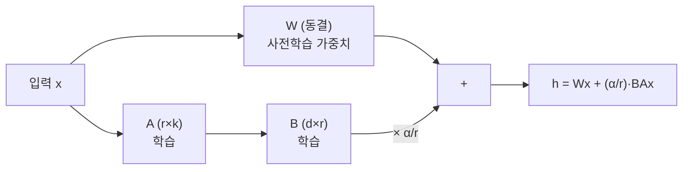

# LLM 파인튜닝 정리

<!-- more -->

## 파인튜닝이란
파인튜닝(Fine-Tuning)이란 사전학습된 언어 모델의 가중치를 특정 작업·도메인 데이터로 다시 학습시켜 모델의 행동을 바꾸는 방법

프롬프트·RAG로 원하는 형식·어투·도메인 반응을 못 얻을 때 마지막으로 꺼내는 수단임.

- 프롬프트 엔지니어링: 가중치는 그대로 두고 입력만 조정 → 가장 싸지만 모델이 못 하는 걸 시키진 못함
- RAG(Retrieval-Augmented Generation): 외부 문서를 검색해 프롬프트에 붙임 → 최신·사내 지식 주입엔 강하지만 말투·출력 형식은 못 바꿈
- 파인튜닝: 가중치 자체를 갱신 → 형식·스타일·도메인 어투를 모델에 각인, 대신 데이터·장비·시간 부담이 큼

---

## Full Fine-Tuning의 VRAM 구조
full fine-tuning이란 모델의 모든 파라미터를 학습 대상으로 두고 갱신하는 방식

학습 메모리는 가중치 하나로 끝나지 않고 그래디언트·옵티마이저 상태가 파라미터마다 따라붙어 몇 배로 불어남.

혼합 정밀도(mixed precision) AdamW 기준, 파라미터 1개당 점유는 다음과 같음(활성화 제외).

| 구성 요소 | 정밀도 | 파라미터당 바이트 | 역할 |
|-----------|--------|-------------------|------|
| 가중치(fp16 사본) | fp16 | 2B | forward/backward 계산용 |
| 가중치(fp32 마스터) | fp32 | 4B | 안정적 갱신용 주 사본 |
| 그래디언트 | fp32 | 4B | backward에서 파라미터마다 계산 |
| 옵티마이저 상태(momentum) | fp32 | 4B | AdamW 1차 모먼트 |
| 옵티마이저 상태(variance) | fp32 | 4B | AdamW 2차 모먼트 |
| 합계 | | 18B | 활성화 별도 |

- AdamW는 파라미터마다 모먼트·분산 2개를 fp32로 들고 있음 → 옵티마이저 상태만 8B/param
- 순수 추론이 가중치 2B/param(fp16)만 필요한 것과 달리 학습은 약 18B/param → 같은 모델도 학습이 9배가량 무거움
- 대략 18B/param이면 7B 모델은 활성화를 빼고도 약 126GB → 80GB GPU 한 장에 안 들어감
- 활성화(activation)는 배치·시퀀스 길이·레이어 수에 비례해 별도로 쌓임 → 모델이 올라가도 배치·시퀀스로 OOM 가능
- bitsandbytes의 양자화 Adam을 쓰면 옵티마이저 상태를 8B→2B/param로 낮춤

!!! notice
    18B/param은 활성화를 제외한 값. 긴 시퀀스·큰 배치에선 활성화가 여기에 더 얹혀 실제 소요는 더 커짐.

---

## PEFT
PEFT(Parameter-Efficient Fine-Tuning)란 사전학습 가중치는 동결하고 소수의 새 파라미터만 학습해 full fine-tuning의 메모리·저장 부담을 줄이는 접근

full은 갱신·저장할 파라미터가 전부라 GPU도 무겁고 산출물도 무거움. 작업마다 모델 전체를 복제해야 함.

- 원본 가중치를 동결 → 그래디언트·옵티마이저 상태가 학습 대상(소수)만큼만 발생 → VRAM 급감
- 산출물이 작음 → 작업마다 전체 모델이 아니라 작은 어댑터만 저장·교체
- 대표 계열: LoRA·QLoRA(저랭크 분해), Adapter, Prefix/Prompt Tuning 등
- 원본을 안 건드리므로 기존 능력을 크게 잊는 위험도 상대적으로 작음

---

## LoRA
LoRA(Low-Rank Adaptation)란 원본 가중치를 동결하고 각 레이어에 학습 가능한 저랭크 분해 행렬을 끼워 넣어 업데이트만 학습하는 PEFT 기법(Hu et al. 2021)

가중치 업데이트 ΔW를 큰 행렬 그대로 학습하지 않고 작은 두 행렬의 곱 BA로 근사하는 것이 핵심.



- W' = W + ΔW = W + BA, 여기서 A는 r×k, B는 d×r, r ≪ min(d,k)
- 학습 대상은 A·B뿐 → 원본 W는 동결 → 그래디언트·옵티마이저 상태가 A·B 크기로만 발생
- ΔW를 α/r로 스케일 → 논문은 α를 처음 시도한 r 값으로 고정하고 따로 튜닝하지 않음
- 추론 시 BA를 W에 병합 가능 → 별도 어댑터 계산이 없어 추가 추론 지연 0(adapter 계열과의 차이)

논문에서 확인된 수치는 다음과 같음.

- GPT-3 175B를 Adam으로 full fine-tuning할 때 대비 학습 파라미터 10,000배 감소, GPU 메모리 요구 3배 감소
- rank는 1·2·4·8·64로 실험 → Wq·Wv에선 아주 작은 rank(심지어 1)로도 경쟁력
- 대상 모듈은 어텐션의 Wq·Wk·Wv·Wo 중 Wq·Wv를 함께 적용한 구성이 최고 성능

| 항목 | 의미 | 비고 |
|------|------|------|
| rank(r) | 저랭크 분해의 랭크 | 클수록 표현력·파라미터↑, 논문은 1~64 실험, 작은 값도 경쟁력 |
| alpha(α) | ΔW 스케일 계수(α/r) | 학습률 튜닝과 유사, 논문은 처음 시도한 r 값으로 고정 |
| 대상 모듈 | LoRA를 끼울 가중치 | 어텐션 Wq·Wv가 기본, Wq·Wv 병용이 최고 성능 |
| dropout | 어댑터 정규화 | 과적합 완화용 |

---

## QLoRA
QLoRA란 사전학습 모델을 4bit로 양자화해 동결하고 그 위에서 LoRA 어댑터만 학습하는 기법(Dettmers et al. 2023)

LoRA로 학습 파라미터는 줄었지만 동결된 원본 가중치 자체가 여전히 VRAM을 차지함. 원본을 4bit로 눌러 그 부담까지 줄이는 것이 목적임.

- 동결된 4bit 양자화 모델을 통과해 LoRA 어댑터로 그래디언트를 역전파 → 원본은 안 바뀌고 어댑터만 학습
- 4bit NormalFloat(NF4): 정규분포 가중치에 정보이론적으로 최적인 4bit 데이터 타입
- Double Quantization: 양자화 상수까지 다시 양자화해 평균 메모리 추가 절감
- Paged Optimizers: 학습 중 발생하는 메모리 스파이크를 페이징으로 흡수
- 결과: 65B 모델을 단일 48GB GPU에서 파인튜닝하며 16bit full fine-tuning 성능 유지
- 이 방식으로 학습한 Guanaco는 단일 GPU 24시간 학습으로 Vicuna 벤치마크에서 ChatGPT 성능의 99.3% 도달

---

## 방식 비교
학습 대상·원본 처리·산출물이 갈리며, 아래로 갈수록 VRAM은 줄고 병합 절차는 늘어남

| 비교 항목 | Full Fine-Tuning | LoRA | QLoRA |
|-----------|------------------|------|-------|
| 학습 대상 | 전체 파라미터 | 저랭크 어댑터(A·B) | 저랭크 어댑터(A·B) |
| 원본 가중치 | 갱신 | 동결(16bit) | 동결(4bit 양자화) |
| VRAM | 가장 큼(≈18B/param) | 크게 감소 | 가장 작음 |
| 산출물 | 전체 모델 사본 | 작은 어댑터 파일 | 작은 어댑터 파일 |
| 품질 상한 | 가장 높음 | full에 근접 | 논문 기준 16bit full 성능 유지 |
| 병합 | 해당 없음(원본 자체) | 가능(추론 지연 0) | 가능(원본을 역양자화해 병합) |
| 대표 근거 | 기준선 | 학습 파라미터 10,000배↓·메모리 3배↓ | 65B를 48GB 한 장에서 학습 |

- 소형 모델에 직접 LoRA를 붙여 학습·병합해보는 과정은 [로컬 LoRA 파인튜닝 실습](gpu_lora_lab.md)에서 다룸
- GPU 예산이 빠듯하고 원본이 크면 QLoRA가 사실상 기본값 → 어댑터만 갈아 끼우며 작업별로 재사용

---

## 학습 파이프라인
모델 한 대가 완성되기까지는 사전학습으로 언어 능력을 얻고, SFT로 지시를 따르게 하고, 선호 정렬로 사람 기호에 맞추는 단계를 거침

| 단계 | 목적 | 데이터 | 방법 |
|------|------|--------|------|
| 사전학습(Pre-training) | 대규모 코퍼스로 언어·지식 습득 | 웹·문서 대규모 텍스트 | next-token prediction(자기지도) |
| SFT(Supervised Fine-Tuning) | 지시를 따르는 형식 학습 | instruction-response 쌍 | 지도 학습(정답 응답 모방) |
| 선호 정렬(Preference Alignment) | 사람이 선호하는 응답으로 조정 | 선호 쌍(chosen/rejected) | RLHF 또는 DPO |

선호 정렬은 보상을 다루는 방식에 따라 둘로 갈림.

| 방식 | 구성 | 특징 |
|------|------|------|
| RLHF | 보상 모델을 학습한 뒤 PPO로 정책을 강화학습 | 별도 보상 모델 필요, 단계가 복잡하고 불안정 여지 |
| DPO(Direct Preference Optimization) | 보상 모델 없이 선호 데이터로 정책을 직접 최적화 | 단순 분류 손실 하나로 학습해 안정적·경량, 요약·단일 턴 대화 품질은 PPO 기반 RLHF와 동등 이상(Rafailov et al. 2023) |

- 흔히 말하는 파인튜닝은 대개 SFT 단계 → instruction 데이터로 형식·어투를 각인
- LoRA·QLoRA는 SFT·DPO 어느 단계든 적용 가능 → 소수 파라미터만 학습하는 원리는 동일

---

## 데이터 형식
instruction 튜닝 데이터는 한 줄에 예시 하나를 담는 JSONL로, 지시·입력·응답을 필드로 나눠 표현

```json
{"instruction": "다음 문장을 존댓말로 바꿔라.", "input": "밥 먹었어?", "output": "식사하셨어요?"}
{"instruction": "아래 로그에서 종료 원인을 한 줄로 요약해라.", "input": "State: Terminated Reason: OOMKilled", "output": "메모리 한도 초과로 컨테이너가 종료됨."}
```

- Alpaca 형식: instruction·input·output 3필드 → input이 없는 지시는 빈 문자열로 둠
- chat 형식: messages 배열에 role(system/user/assistant)별로 담음 → 멀티턴·채팅 모델 학습에 사용
- 학습 시 지시·입력 부분은 loss에서 마스킹하고 응답에만 loss를 걸기도 함 → 지시를 외우는 게 아니라 응답 생성을 학습
- 데이터 품질이 결과를 좌우 → 형식이 흔들리는 소량 데이터보다 일관된 소수 예시가 유리

---

## 함정: 파인튜닝은 지식 주입이 아니다
파인튜닝은 새 사실을 머리에 넣는 수단이라기보다 형식·스타일·응답 패턴을 각인하는 데 적합함

- SFT는 "무엇을 아는가"보다 "어떻게 답하는가"를 학습 → 말투·출력 형식·도메인 어투를 바꾸는 데 강함
- 소규모 데이터로 새 사실을 주입하려 하면 잘 각인되지 않고, 드물게 등장한 사실은 환각(Hallucination)으로 이어지기 쉬움
- 최신·정확성이 중요한 지식은 파인튜닝보다 RAG로 외부에서 가져오는 편이 안전 → 지식은 검색으로, 형식은 파인튜닝으로
- 사실을 억지로 주입하면 기존 능력을 잃는 파국적 망각(Catastrophic Forgetting) 위험도 있음 → 학습률·데이터 양 조절이 필요

---

## 파인튜닝 vs RAG 차이점 정리
둘은 대체재가 아니라 푸는 문제가 다름 → 형식·행동은 파인튜닝, 지식·최신성은 RAG

| 기준 | 파인튜닝이 유리 | RAG가 유리 |
|------|-----------------|-----------|
| 바꾸려는 것 | 말투·출력 형식·도메인 어투·행동 | 참조 지식·사실·최신 정보 |
| 데이터 성격 | 라벨링된 instruction-response 쌍 | 문서·지식 베이스(검색 대상) |
| 최신성 | 재학습 전까지 고정 | 인덱스만 갱신하면 즉시 반영 |
| 출처 추적 | 어려움(가중치에 녹아듦) | 검색 문서로 근거 제시 가능 |
| 초기 비용 | 학습 장비·데이터·시간 | 검색 파이프라인·벡터 저장소 구축 |
| 변경 비용 | 재학습 필요 | 문서 추가·수정 |

| 상황 | 권장 |
|------|------|
| 사내 문서·최신 정보를 근거와 함께 답해야 함 | RAG |
| 특정 출력 형식·JSON 스키마·말투를 항상 지켜야 함 | 파인튜닝 |
| 도메인 전문 어투로 일관되게 답해야 함 | 파인튜닝 |
| 자주 바뀌는 사실을 정확히 반영해야 함 | RAG |
| 형식도 고정하고 지식도 최신이어야 함 | 파인튜닝 + RAG 병행 |
| GPU 예산이 빠듯하고 원본이 큼 | QLoRA로 파인튜닝 |

---

## 결론
- 학습 메모리는 가중치만이 아니라 그래디언트·옵티마이저 상태가 파라미터마다 붙어 full은 약 18B/param → PEFT가 이 배수를 무너뜨림
- LoRA는 저랭크 어댑터만 학습해 원본을 동결, QLoRA는 원본을 4bit로 눌러 단일 GPU 학습까지 끌어내림
- 파인튜닝은 "어떻게 답하는가", RAG는 "무엇을 아는가" → 문제에 맞춰 나눠 쓸 것
