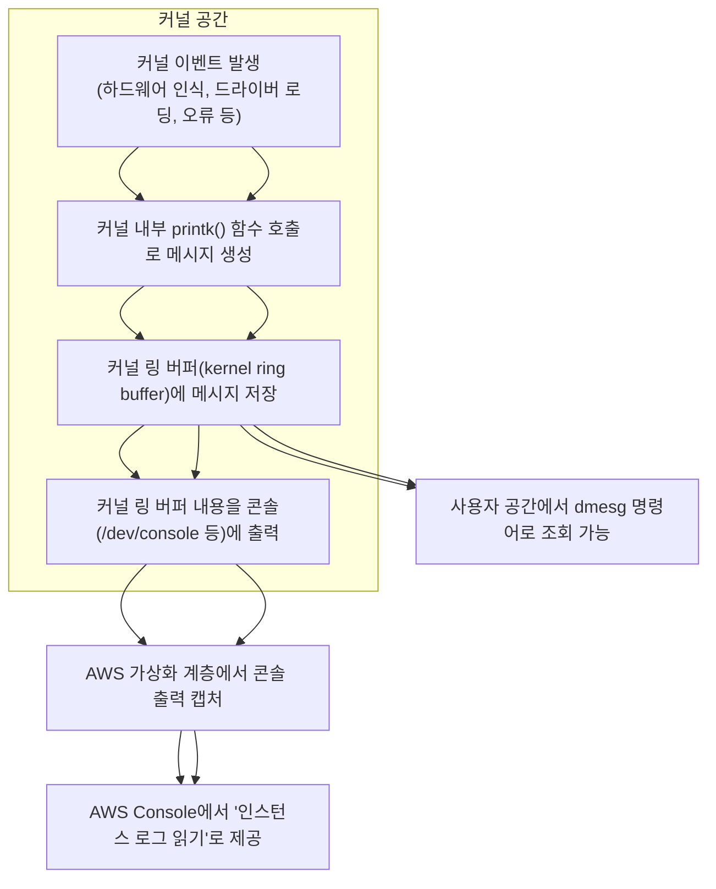

# AWS 콘솔 system log = dmesg 인가

<!-- more -->

## 요약
- AWS Console의 "인스턴스 로그 읽기" 기능은 커널 링 버퍼(dmesg)를 직접 읽는 것이 아니고 EC2의 부팅 과정에서 콘솔(/dev/ttyS0)에 출력된 로그를 AWS에서 캡처하여 제공하는 방식
  
참고: 콘솔 출력(/dev/ttyS0)등은 사용자/프로세스 레벨이 아니므로 stdout,stderr랑 관련이 없음

## 커널 로그 저장 및 출력 순서

AWS Console의 로그는 일부 커널 메시지만 포함되며 커널 링 버퍼의 전체 내용과 완전히 동일하지는 않음

참고: EFI 시스템에서 부팅 순서

|단계|설명|비고|
|--|------|----|
|1|UEFI 펌웨어가 ESP(EFI 시스템 파티션)의 Stage 1 Grub 로더(grubx64.efi 등)를 실행|EFI 파티션 사용|
|2|Stage 1 GRUB 로더가 Stage 2 GRUB를 로드|grub.cfg 설정 파일 참조|
|3|Stage 2 GRUB가 커널 이미지를 메모리에 로드|리눅스 커널(vmlinuz)과 초기 램디스크(initrd)|
|4|커널이 로드되며 커널 링 버퍼가 생성되어 메시지 기록 준비|링 버퍼(dmesg)가 초기화됨|
|5|커널 실행 시작, 하드웨어 초기화 등 부팅 진행|init 프로세스(systemd 등) 실행|