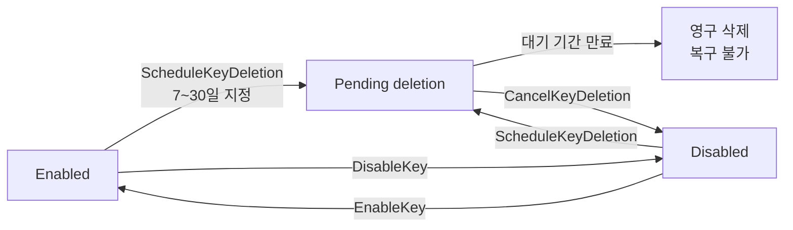
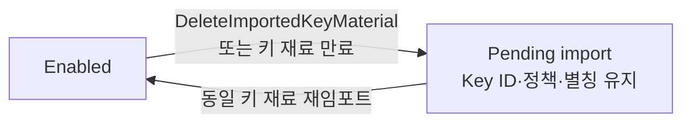

# KMS 키 삭제 정리

AWS KMS 키는 지우겠다고 해서 바로 지워지지 않고 7일에서 30일의 대기 기간을 거친다. 키 유형별 삭제 가능 여부와 임포트 키 재료의 즉시 삭제, 삭제 취소 후 키 상태까지 정리했다.

<!-- more -->

## KMS 키 삭제란
KMS 키 삭제(Key Deletion)란 KMS 키의 키 재료와 모든 메타데이터를 함께 파기하는 비가역 작업

- 삭제 후에는 그 키로 암호화한 데이터를 복호화할 수 없음
- 확신이 없으면 삭제 대신 비활성화(Disable) 권장
- KMS는 사용자가 명시적으로 예약하고 대기 기간이 만료되기 전에는 키를 삭제하지 않음

---

## 키 유형별 삭제 가능 여부

| 키 유형 | 예약 삭제(ScheduleKeyDeletion) | 키 재료만 삭제(DeleteImportedKeyMaterial) |
|---|---|---|
| 고객 관리형 키(KMS가 키 재료 생성) | 가능. 7일~30일 대기 필수 | 해당 없음 |
| 고객 관리형 키(외부 키 재료 임포트, BYOK) | 가능. 7일~30일 대기 필수 | 가능. 대기 기간 없음 |
| AWS 관리형 키 | 불가 | 불가 |
| AWS 소유 키(AWS owned key) | 불가 | 불가 |

- AWS 관리형 키(aws/s3 등)는 계정 안에 보이지만 정책 변경·회전·삭제 예약을 사용자가 할 수 없음
- AWS 문서는 이를 레거시 키 유형으로 분류. 2021년 이후 출시된 서비스는 AWS 관리형 키 대신 AWS 소유 키를 기본으로 씀
- 다만 지금도 생성되는 현역 유형임. 기존 통합 서비스에서 고객 관리형 키를 지정하지 않으면 AWS가 계정에 AWS 관리형 키를 자동 생성함(SSE-KMS 첫 사용 시 aws/s3 생성 등)
- AWS 소유 키는 계정 밖 서비스 계정에 있어 조회조차 되지 않음
- 어느 고객 관리형 키든 Key ID 자체를 파기하는 경로는 예약 삭제 하나뿐

---

## 대기 기간



- 삭제 예약은 Enabled뿐 아니라 Disabled 상태에서도 가능 → 먼저 비활성화해 영향을 관찰한 뒤 예약하는 순서를 권장

- 7일~30일 범위에서 지정. 기본값은 30일
- 실제 삭제 시각은 예약한 시각보다 최대 24시간 늦을 수 있음 → 정확한 시각은 DescribeKey 응답이나 콘솔의 Scheduled deletion date로 확인
- 대기 기간 동안 키 상태는 Pending deletion
- Pending deletion 상태에서는 암호화 작업 불가. 키 재료 자동 회전도 멈춤
- 예약 시점과 실제 삭제 시점이 각각 CloudTrail에 기록됨

```s
aws kms schedule-key-deletion --key-id 1234abcd-12ab-34cd-56ef-1234567890ab --pending-window-in-days 7
```

```json
{
    "KeyId": "arn:aws:kms:ap-northeast-2:111122223333:key/1234abcd-12ab-34cd-56ef-1234567890ab",
    "DeletionDate": 1598304792.0,
    "KeyState": "PendingDeletion",
    "PendingWindowInDays": 7
}
```

---

## 대기 기간이 강제되는 이유

- 삭제는 비가역이고 영향 범위가 계정 전체 암호화 리소스로 번짐 → 실수·권한 오용을 되돌릴 시간을 시스템이 확보
- 대기 기간 안에는 CancelKeyDeletion으로 되돌릴 수 있음
- 대기 기간 동안 CloudWatch 알람으로 해당 키를 쓰려는 시도를 감지 가능 → 아직 쓰이는 키인지 판별하는 용도
- 비대칭 키는 위험이 더 큼. 외부에 배포된 퍼블릭 키로는 계속 암호화가 가능하고 상태 변화 통보도 없어, 삭제 후 복호화 불가능한 암호문이 계속 생성될 수 있음

---

## 삭제가 데이터에 미치는 영향

키가 사용 불가로 바뀐 순간 데이터가 곧바로 못 쓰게 되는 것은 아님. 데이터 키를 다시 복호화해야 하는 시점에 실패가 드러남.

| 시점 | 동작 |
|---|---|
| 삭제 예약 직후 | KMS 암호화 작업 요청은 모두 실패(최종 일관성 적용). 이미 데이터 키를 확보한 리소스는 영향 없음 |
| 리소스가 데이터 키를 다시 복호화할 때 | 실패 → 그 시점부터 접근 불가 |

EBS 볼륨 예시로 보면 다음과 같음.

- 볼륨이 인스턴스에 붙어 있는 동안에는 Nitro 하드웨어에 상주하는 데이터 키로 디스크 입출력이 처리됨 → KMS 키를 못 쓰게 만들어도 즉시 영향 없음
- 볼륨을 분리하면 데이터 키가 제거됨
- 다음 연결 시 KMS 키로 데이터 키를 복호화하지 못해 연결 실패

---

## 삭제 취소

- CancelKeyDeletion이 성공하면 키 상태는 Disabled. 자동으로 사용 가능해지지 않으므로 EnableKey를 따로 호출해야 함
- 대기 기간이 끝난 뒤에는 취소 불가

```s
aws kms cancel-key-deletion --key-id 1234abcd-12ab-34cd-56ef-1234567890ab
aws kms enable-key --key-id 1234abcd-12ab-34cd-56ef-1234567890ab
```

---

## 임포트 키 재료 삭제

임포트 키 재료 삭제는 예약 삭제와 별개 경로이고, 대기 기간이 없는 대신 되돌릴 수 있음.



| 비교 항목 | 예약 삭제 | 임포트 키 재료 삭제 |
|---|---|---|
| 대기 기간 | 7일~30일 | 없음 |
| 대상 | 키 재료 + Key ID + 메타데이터 | 키 재료만 |
| 삭제 후 키 상태 | Pending deletion → 만료 시 소멸 | Pending import |
| 복구 | 대기 기간 안에만 취소 가능 | 동일 키 재료 재임포트로 복구 |

- 삭제 직후 키는 사용 불가 상태가 됨(최종 일관성 적용). 문서에 소요 시간 수치는 명시되어 있지 않음
- Key ID·키 정책·별칭은 그대로 남음 → 사용을 빠르게, 그러나 일시적으로 멈추는 수단
- 만료일이 설정된 키 재료는 만료 시점에 KMS가 자동 삭제
- 대칭 암호화 키는 키 재료를 여러 개 가질 수 있음 → key-material-id를 생략하면 현재 키 재료가 지워짐

```s
aws kms delete-imported-key-material --key-id 1234abcd-12ab-34cd-56ef-1234567890ab
```

---

## 삭제 후 재생성 가능성

전제는 원본 키 재료를 손에 들고 있는 경우, 즉 임포트한 키 재료. KMS가 생성한 키는 재료를 내보낼 수 없으므로 재생성 자체가 성립하지 않음.

| 키 종류 | 동일 키 재료로 재생성 | 비고 |
|---|---|---|
| 대칭 암호화 키 | 불가 | 키마다 고유한 메타데이터가 암호문에 암호학적으로 결합됨 → 남은 암호문은 복구 불능 |
| 비대칭 키 | 가능 | 표준 RSA·ECC 결과물이라 고유 요소 없음 |
| HMAC 키 | 가능 | 표준 HMAC 태그라 고유 요소 없음 |
| 멀티 리전 복제 키 | 가능 | 키 재료와 무관. 같은 primary를 같은 리전에 다시 복제하면 공유 속성까지 동일 |

- 비대칭·HMAC 키를 다시 만들어도 Key ID가 달라짐 → 키 정책·별칭·IAM 정책·그랜트를 새로 구성해야 함
- 결국 "BYOK면 안전하다"가 성립하는 범위는 대칭 암호화 키를 뺀 나머지

---

## 커스텀 키 스토어의 키

- CloudHSM 키 스토어·외부 키 저장소의 키도 대기 기간과 Pending deletion 규칙은 동일. 키 스토어 연결을 끊어 키가 사용 불가가 되어도 상태는 Pending deletion으로 유지되어 대기 기간 내내 취소 가능
- 대기 기간이 끝나면 KMS에서 키를 지우고, CloudHSM 클러스터의 키 재료 삭제는 최선 노력으로만 시도 → 실패 시 클러스터에 남은 키 재료를 직접 지워야 함
- 클러스터 백업에 남은 키 재료는 KMS가 지우지 않음 → 완전 파기가 목적이면 해당 키 생성일 이후 백업까지 삭제할 것
- 외부 키 저장소는 KMS 키를 지워도 외부 키 관리자의 키 자체에는 영향 없음

---

## 멀티 리전 키

- replica 키는 다른 키 상태와 무관하게 언제든 삭제 예약 가능
- primary 키는 모든 replica가 삭제 완료된 뒤에야 대기 기간이 시작됨
- 그동안 primary는 Pending deletion이 아니라 PendingReplicaDeletion 상태 → 암호화 작업은 이미 불가하지만 삭제 타이머는 아직 돌지 않음. 마지막 replica가 지워지면 PendingDeletion으로 전환
- replica를 남긴 채 특정 리전의 primary를 지우려면 primary Region을 옮겨 그 키를 replica로 전환

---

## 삭제 권한 제어

- kms:ScheduleKeyDeletion 권한을 키 관리자에게만 부여
- kms:ScheduleKeyDeletionPendingWindowInDays 조건 키로 최소 대기 기간을 강제. 7일~30일 범위를 더 좁히는 용도

```json
{
  "Effect": "Deny",
  "Action": "kms:ScheduleKeyDeletion",
  "Principal": "*",
  "Resource": "*",
  "Condition": {
    "NumericLessThanEquals": {
      "kms:ScheduleKeyDeletionPendingWindowInDays": "21"
    }
  }
}
```

위 정책은 대기 기간을 21일 이하로 지정한 삭제 예약을 거부함.

---

## 결론

- Key ID를 파기하는 길은 예약 삭제뿐이고 7일~30일 대기는 우회 불가
- 사용을 즉시 멈추는 것이 목적이면 삭제가 아니라 비활성화, BYOK라면 키 재료 삭제가 맞는 도구
- 예약 삭제는 "영구 파기", 키 재료 삭제는 "일시 정지"
