# MCP 서버 만들어 Claude Code에 붙이기

MCP 서버를 Python으로 바닥부터 만들어 Claude Code에 도구로 붙여봤다. Inspector로 스키마와 입력값 검증이 어떻게 동작하는지 확인하고 실제 호출까지 이어진 기록이다.

<!-- more -->

## 목표

---

- 도구 4개, 리소스 1개, 프롬프트 1개를 내놓는 dotoryeee-tools 서버를 FastMCP로 만들고 stdio(클라이언트가 서버를 자식 프로세스로 띄워 표준 입출력으로 주고받는 전송 방식)로 직접 붙여 본다
- MCP Inspector로 tools/list가 실제로 돌려주는 inputSchema·outputSchema를 원문으로 확인하고, 값 제약을 어긴 호출이 어떤 형태로 돌아오는지 실측한다
- 같은 서버를 Claude Code에 등록해 claude mcp add부터 실제 도구 호출까지 명령어로 확인하고, 사양과 어긋나는 지점이 있는지 살펴본다

MCP가 기존 API와 갈리는 지점과 tools/list, tools/call 같은 메시지 흐름은 [MCP vs API 차이점 정리](mcp_vs_api.md)에서 다뤘다. 이 글은 그 흐름을 실제 서버로 만들어, 메시지가 정말 그렇게 오가는지 눈으로 확인하는 데 집중한다.

## 실습 구성

---

Claude Code와 MCP Inspector가 클라이언트 역할을 맡고, 같은 dotoryeee-tools 서버 하나에 각자 stdio로 붙는다.

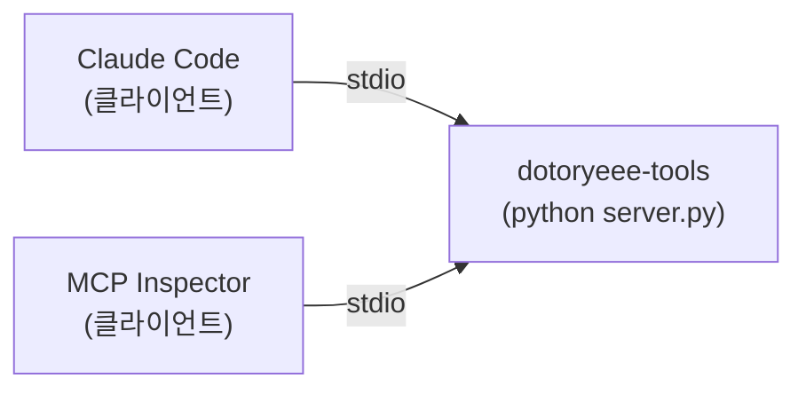
```mermaid
graph LR
    CC["Claude Code<br>(클라이언트)"] -->|stdio| SRV["dotoryeee-tools<br>(python server.py)"]
    INS["MCP Inspector<br>(클라이언트)"] -->|stdio| SRV
```

- dotoryeee-tools: 도구 4개(dotoryeee_order_lookup, dotoryeee_stock_check, dotoryeee_shop_report, dotoryeee_enable_priority_support)와 리소스 1개(dotoryeee://shop/catalog), 프롬프트 1개(dotoryeee-order-triage)를 내놓는 파이썬 서버
- MCP Inspector: 웹 UI로 서버에 붙어 tools/list, tools/call 같은 메시지를 눈으로 확인하는 공식 디버깅 도구
- Claude Code: claude mcp add로 같은 서버를 등록해, 에이전트가 실제로 도구를 고르고 호출하는 경로까지 확인

Python SDK는 mcp[cli] 1.28.1로 버전을 고정한다. mcp 패키지는 Python 3.10 이상을 요구한다.

!!! warning
    💡 mcp[cli]의 2.0.0b1 프리릴리스는 API가 완전히 다르므로 설치 후 버전을 반드시 확인한다

## 서버 작성

---

가상환경을 만들고 SDK를 설치한다.

```s
python3 -m venv .venv
source .venv/bin/activate
pip install "mcp[cli]==1.28.1" 2>&1 | grep -o 'mcp-[0-9.]*' | tail -1
mcp-1.28.1
```

이제 서버 파일을 작성한다.

```s
vi server.py
```

코드 하나에 도구 4개, 리소스 1개, 프롬프트 1개를 담는다. 도구는 앞의 3개(dotoryeee_order_lookup, dotoryeee_stock_check, dotoryeee_shop_report)가 이 실습의 주인공이고, 네 번째 dotoryeee_enable_priority_support는 도구 목록 변경 알림을 실측하려고 따로 심어둔 도구다.

```python title="server.py" linenums="1" hl_lines="29"
"""dotoryeee-tools MCP 서버. mcp[cli] 1.28.1의 FastMCP로 작성."""
from typing import Annotated, Literal

from pydantic import BaseModel, Field
from mcp.server.fastmcp import Context, FastMCP
from mcp.types import ToolAnnotations

mcp = FastMCP("dotoryeee-tools")                                     #서버 이름이 Inspector 사이드바에 그대로 노출


@mcp.tool(annotations=ToolAnnotations(readOnlyHint=True, idempotentHint=True))
def dotoryeee_order_lookup(
    order_id: str,                                                   #필수 문자열 인자
    status: Literal["placed", "paid", "shipped", "delivered", "cancelled"] = "paid",  #enum, 기본값 paid
) -> str:
    """주문 번호와 상태로 dotoryeee 상점의 주문을 조회한다"""
    return f"order {order_id} is {status}"


class StockResult(BaseModel):                                        #반환 타입을 모델로 선언하면 outputSchema가 자동 생성됨
    product_id: str
    quantity: int
    in_stock: bool


@mcp.tool(annotations=ToolAnnotations(readOnlyHint=True))
def dotoryeee_stock_check(
    product_id: Literal["dotoryeee-mug", "dotoryeee-tshirt", "dotoryeee-hoodie"],
    quantity: Annotated[int, Field(ge=1, le=100, description="확인할 수량")] = 1,  #값 제약. 101 이상을 넣으면 실행 단계에서 걸림
) -> StockResult:
    """dotoryeee 상점의 상품 재고를 확인한다. 수량은 1~100만 허용한다"""
    return StockResult(product_id=product_id, quantity=quantity, in_stock=quantity <= 50)


class ShopReport(BaseModel):
    total_orders: int
    total_revenue_krw: int
    top_product: str


@mcp.tool(annotations=ToolAnnotations(readOnlyHint=True))
def dotoryeee_shop_report(period: Literal["today", "week", "month"] = "today") -> ShopReport:
    """dotoryeee 상점의 기간별 집계 리포트를 반환한다"""
    totals = {"today": (12, 288000), "week": (81, 1944000), "month": (340, 8160000)}
    orders, revenue = totals[period]
    return ShopReport(total_orders=orders, total_revenue_krw=revenue, top_product="dotoryeee-mug")


@mcp.resource("dotoryeee://shop/catalog", mime_type="text/plain")
def catalog() -> str:
    """dotoryeee 상점 카탈로그"""
    return (
        "product_id,name,price_krw\n"
        "dotoryeee-mug,dotoryeee 머그컵,12000\n"
        "dotoryeee-tshirt,dotoryeee 티셔츠,24000\n"
        "dotoryeee-hoodie,dotoryeee 후드티,42000\n"
    )


@mcp.prompt(name="dotoryeee-order-triage")
def order_triage(order_id: str) -> str:
    """주문 문제를 분류하는 프롬프트 템플릿"""
    return (
        f"dotoryeee 상점 주문 {order_id}에 문제가 접수됐다. "
        "배송 지연, 재고 부족, 결제 오류 중 어디에 해당하는지 분류하고 "
        "dotoryeee_order_lookup으로 현재 상태를 확인한 뒤 다음 조치를 제안해라."
    )


def _priority_support(order_id: str) -> str:                          #데코레이터가 없어 아직 도구 목록에는 없음
    """런타임에 추가되는 우선 지원 도구"""
    return f"dotoryeee priority ticket opened for order {order_id}"


@mcp.tool(annotations=ToolAnnotations(readOnlyHint=False, idempotentHint=False))
async def dotoryeee_enable_priority_support(ctx: Context) -> str:
    """dotoryeee_priority_support 도구를 런타임에 추가하고 tools/list_changed 알림을 보낸다"""
    mcp.add_tool(                                                     #실행 중에 도구를 새로 등록
        _priority_support,
        name="dotoryeee_priority_support",
        description="우선 지원 티켓을 여는 도구 (런타임에 등록됨)",
    )
    await ctx.session.send_tool_list_changed()                        #등록 후 알림을 직접 쏨
    return "dotoryeee_priority_support 도구를 추가하고 목록 변경 알림을 보냈다"


if __name__ == "__main__":
    mcp.run(transport="stdio")                                        #stdio 전송으로 기동
```

- product_id, status, period는 모두 Literal이라 inputSchema에 enum으로 박힌다. quantity의 Field(ge=1, le=100)만 파이썬 타입만으로는 표현이 안 되는 값 제약이다
- dotoryeee_stock_check와 dotoryeee_shop_report는 반환 타입을 StockResult, ShopReport 같은 BaseModel로 선언했다. 이 타입 힌트 하나로 outputSchema가 자동으로 생긴다
- dotoryeee_enable_priority_support는 데코레이터 없는 _priority_support 함수를 실행 중에 mcp.add_tool()로 등록하고, ctx.session.send_tool_list_changed()로 알림을 직접 보낸다

server.py 하나로 끝난다. 실행은 python server.py면 되고, Inspector와 Claude Code 양쪽 다 이 명령을 그대로 재사용한다.

## Inspector로 붙이기

---

Inspector는 npx로 바로 실행한다. 인증 토큰 없이 붙기 위해 DANGEROUSLY_OMIT_AUTH를 켰다.

!!! warning
    💡 DANGEROUSLY_OMIT_AUTH 사용시 인증이 완전히 꺼지므로 로컬 실습 밖에서는 쓰지 않는다

```s
DANGEROUSLY_OMIT_AUTH=true npx @modelcontextprotocol/inspector
Starting MCP inspector...
⚙️ Proxy server listening on localhost:6277
⚠️  WARNING: Authentication is disabled. This is not recommended.

🚀 MCP Inspector is up and running at:
   http://localhost:6274
```

브라우저에서 열리는 화면의 Transport Type은 기본값 STDIO 그대로 두고, Command에 python, Arguments에 server.py를 넣는다. 가상환경을 활성화한 셸에서 npx를 띄웠고 실행 디렉터리도 server.py가 있는 곳이라, python과 server.py가 각각 venv 파이썬과 그 파일로 풀린다. 다른 셸에서 Inspector를 띄웠다면 이 두 값을 절대경로로 적어야 한다.

Connect를 누르고 이어서 List Tools까지 누르면 아래 순서로 메시지가 오간다. 연결만으로는 initialized까지고, 도구 목록은 버튼을 눌러야 조회된다.

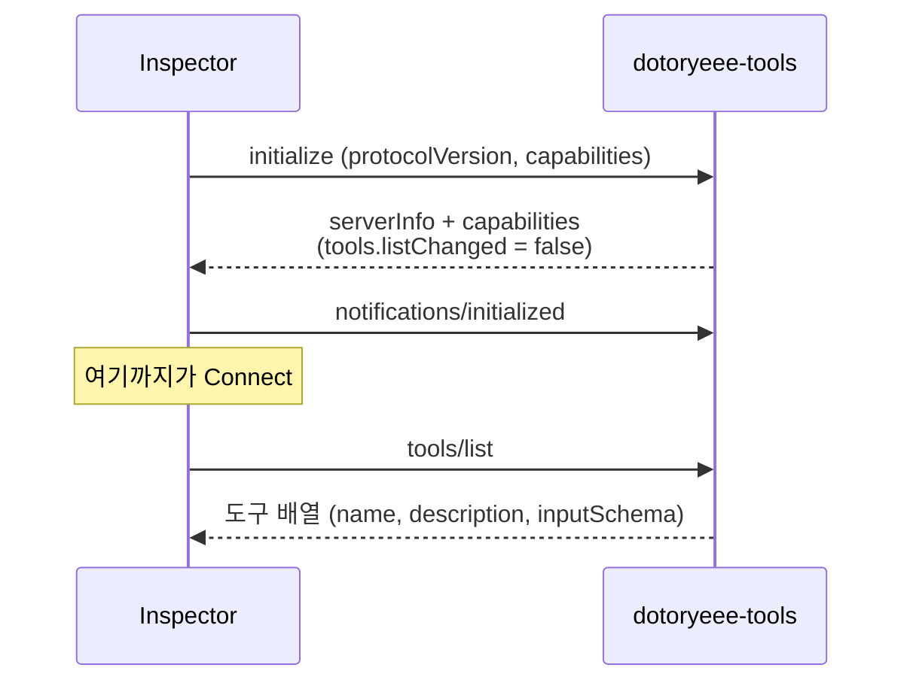
```mermaid
sequenceDiagram
    participant Inspector
    participant Server as dotoryeee-tools
    Inspector->>Server: initialize (protocolVersion, capabilities)
    Server-->>Inspector: serverInfo + capabilities<br>(tools.listChanged = false)
    Inspector->>Server: notifications/initialized
    Note over Inspector: 여기까지가 Connect
    Inspector->>Server: tools/list
    Server-->>Inspector: 도구 배열 (name, description, inputSchema)
```

Connect를 누르면 연결 상태가 Connected로 바뀌고, Tools 탭에서 List Tools를 누르면 도구 4개가 뜬다. 서버 이름 dotoryeee-tools 옆에 버전 1.28.1도 함께 보이는데, 이 버전은 코드 어디에도 직접 적지 않았다. FastMCP는 버전을 따로 지정하지 않으면 설치된 mcp 패키지 버전을 그대로 갖다 쓴다.

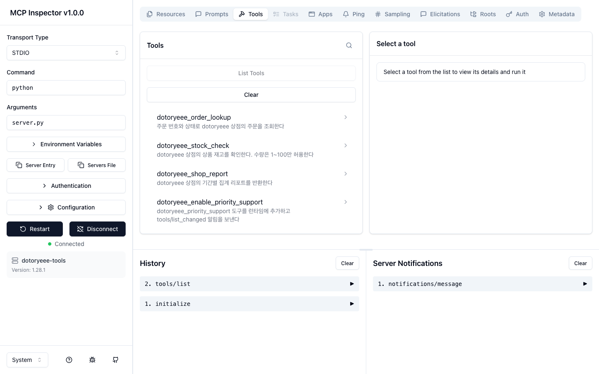

## tools/list가 돌려주는 것

---

도구 하나를 눌러 보면 원시 스키마 대신 렌더링된 폼이 뜬다. dotoryeee_stock_check를 열면 product_id는 enum 세 개짜리 드롭다운으로, quantity는 숫자 스피너로 바뀌어 있고, 위쪽에는 annotations 배지(Read-only, Destructive, Idempotent, Open-world)가 붙는다. Read-only만 서버 코드에서 명시한 값이고 나머지는 지정하지 않아 기본값으로 채워진 값이다.

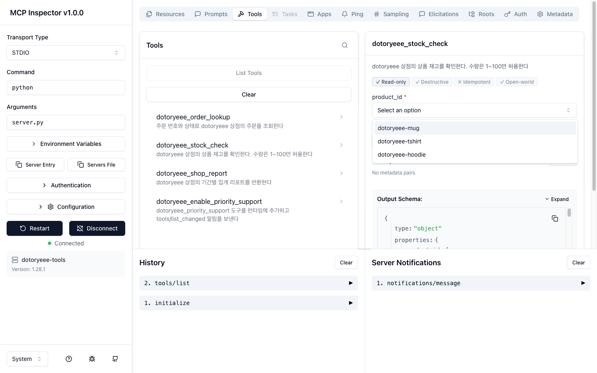

코드에 적은 타입 힌트가 스키마를 거쳐 화면까지 오는 경로는 다음과 같다.

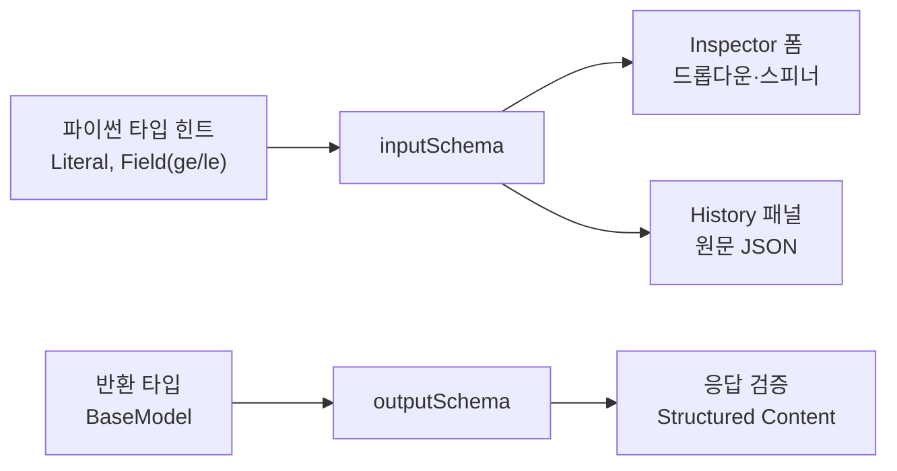
```mermaid
graph LR
    T["파이썬 타입 힌트<br>Literal, Field(ge/le)"] --> IS["inputSchema"]
    R["반환 타입<br>BaseModel"] --> OS["outputSchema"]
    IS --> F["Inspector 폼<br>드롭다운·스피너"]
    IS --> H["History 패널<br>원문 JSON"]
    OS --> V["응답 검증<br>Structured Content"]
```

이 폼은 tools/list가 돌려준 inputSchema를 Inspector가 사람 눈에 맞게 바꾼 결과일 뿐이고, 원문은 따로 봐야 한다. 아래 History 패널에서 tools/list 항목을 펼치고 도구 배열 안의 inputSchema를 열면, dotoryeee_order_lookup의 status가 default와 enum 5개짜리 배열로 그대로 나온다. 필수 인자는 배열 형태의 required 필드에 따로 나열된다.

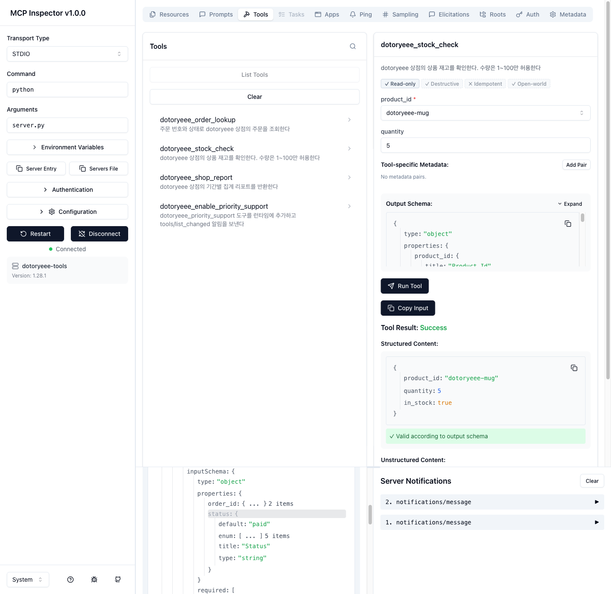

## tools/call 실행

---

product_id에 dotoryeee-mug, quantity에 5를 넣고 Run Tool을 누르면 Tool Result: Success가 뜨고, 그 아래 Structured Content와 Unstructured Content가 나란히 나온다. Structured Content는 반환 타입 StockResult를 그대로 직렬화한 값이고, Valid according to output schema 배지가 붙는다. 반환 타입 힌트 하나만 달았을 뿐인데 outputSchema 검증까지 자동으로 붙는다.

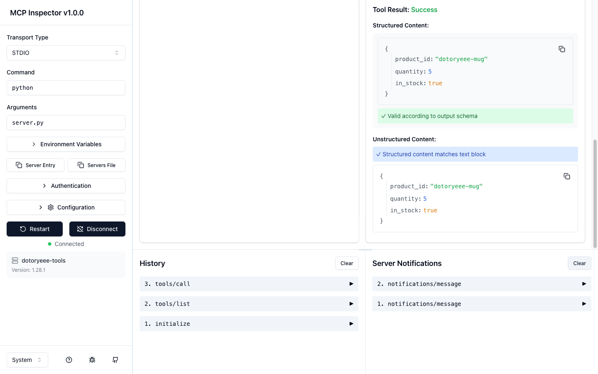

History에 남은 요청과 응답을 펼쳐 보면 실제로 오간 메시지가 보인다. 요청은 method가 tools/call이고, params.name과 params.arguments에 방금 고른 값이 그대로 들어 있다.

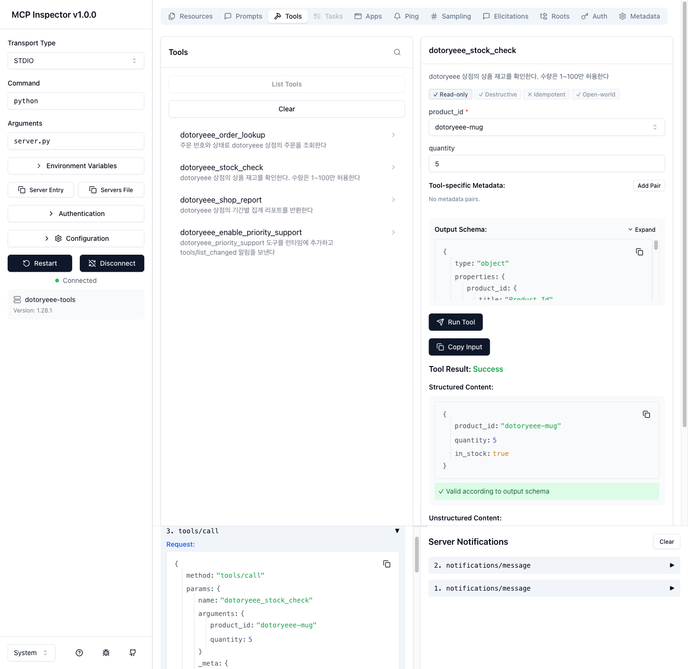

응답은 content 배열과 structuredContent, isError: false로 구성된다. content[0].text는 structuredContent를 JSON 문자열로 한 번 더 감싼 값이라 같은 정보가 두 번 나온다.

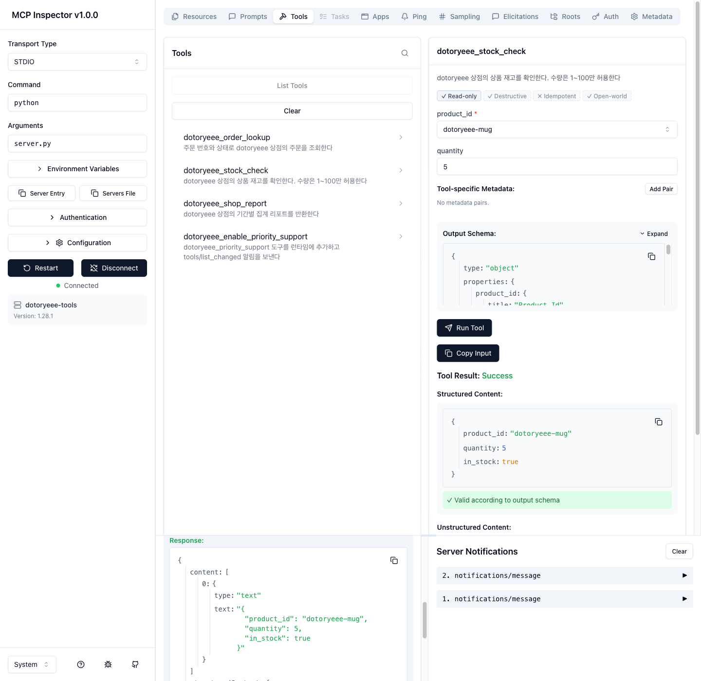

dotoryeee_shop_report도 같은 방식으로 outputSchema가 생긴다. period를 week로 놓고 호출하면 ShopReport 타입 그대로 total_orders, total_revenue_krw, top_product 세 필드가 채워져 돌아온다.

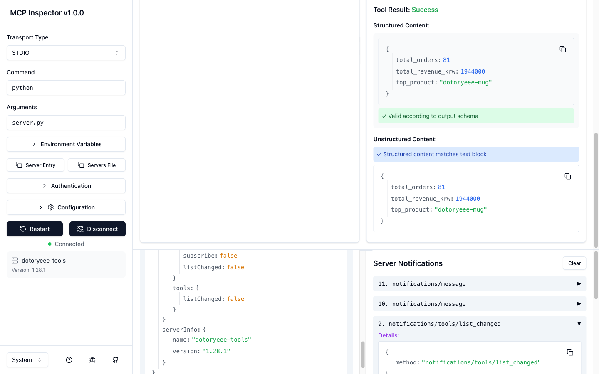

## 값 제약 위반

---

quantity에 100을 넘는 값을 넣으면 다른 그림이 나온다. product_id는 dotoryeee-mug 그대로 두고 quantity를 200으로 바꿔 Run Tool을 누르면 Tool Result: Error가 빨간 글씨로 뜬다.

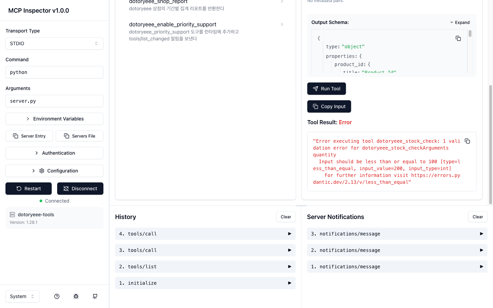

내용은 Field(ge=1, le=100)을 어긴 pydantic 검증 오류 그대로다. Input should be less than or equal to 100이라는 문구와 함께 input_value=200이 찍힌다. 여기서 짚어둘 점은 이게 JSON-RPC 프로토콜 오류가 아니라는 것이다. FastMCP는 인자 검증을 별도의 JSON Schema 단계 대신 도구 함수의 Pydantic 모델로 처리하는데, 여기서 예외가 나면 요청 자체는 정상적으로 끝나고 그 결과 객체 안에 isError: true와 에러 텍스트가 담겨 돌아온다. 메서드를 잘못 부르거나 요청 형식이 깨졌을 때 나오는 진짜 프로토콜 오류와는 다른 층위다.

잘못된 입력이 걸러지는 지점은 세 군데로 갈리고, 각각 돌아오는 모양이 다르다.

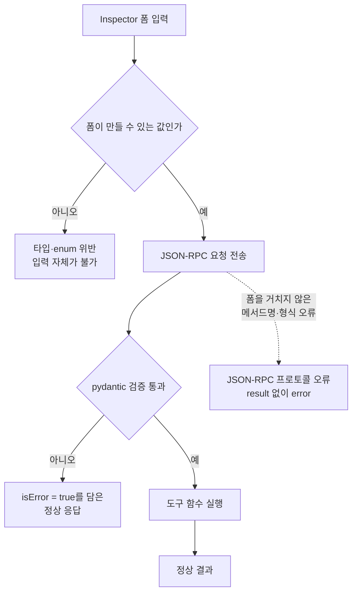
```mermaid
graph TD
    A["Inspector 폼 입력"] --> B{"폼이 만들 수 있는 값인가"}
    B -->|아니오| C["타입·enum 위반<br>입력 자체가 불가"]
    B -->|예| D["JSON-RPC 요청 전송"]
    D --> E{"pydantic 검증 통과"}
    E -->|아니오| F["isError = true를 담은<br>정상 응답"]
    E -->|예| G["도구 함수 실행"]
    G --> H["정상 결과"]
    D -.->|"폼을 거치지 않은<br>메서드명·형식 오류"| I["JSON-RPC 프로토콜 오류<br>result 없이 error"]
```

타입이나 enum 위반은 Inspector에서 애초에 만들 수가 없다. product_id 드롭다운은 세 값 중 하나만 고를 수 있는 선택지라 잘못된 문자열을 넣을 방법이 없다. 폼을 거치지 않고 원시 클라이언트로 직접 보내면 이것도 같은 pydantic 단계에서 걸려 isError로 돌아온다. 폼으로 만들 수 있는 입력 중에서 그대로 통과하는 것은 빈 문자열 쪽이고, order_id를 비워 보내도 검증을 지나 그대로 실행된다.

## resource와 prompt

---

리소스와 프롬프트도 같은 서버 안에 있다. Resources 탭에서 List Resources를 누르면 catalog 하나가 잡히고, 클릭하면 Read까지 바로 실행돼 내용이 뜬다. dotoryeee://shop/catalog가 돌려주는 값은 CSV 텍스트 한 덩어리다.

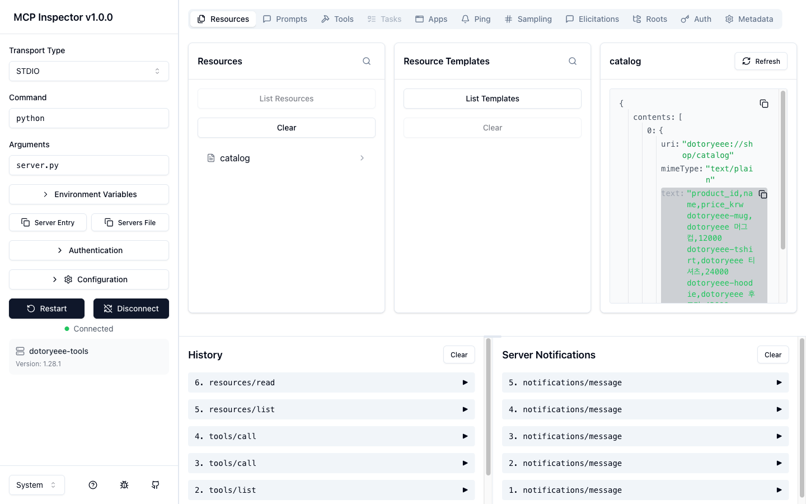

Prompts 탭도 마찬가지다. dotoryeee-order-triage를 고르고 order_id에 dotoryeee-1029를 넣은 뒤 Get Prompt를 누르면, 서버가 만든 메시지 하나가 그대로 나온다. role은 user이고, content.text 안에 주문 문제를 분류해 달라는 문장과 dotoryeee_order_lookup을 호출하라는 지시가 들어 있다.

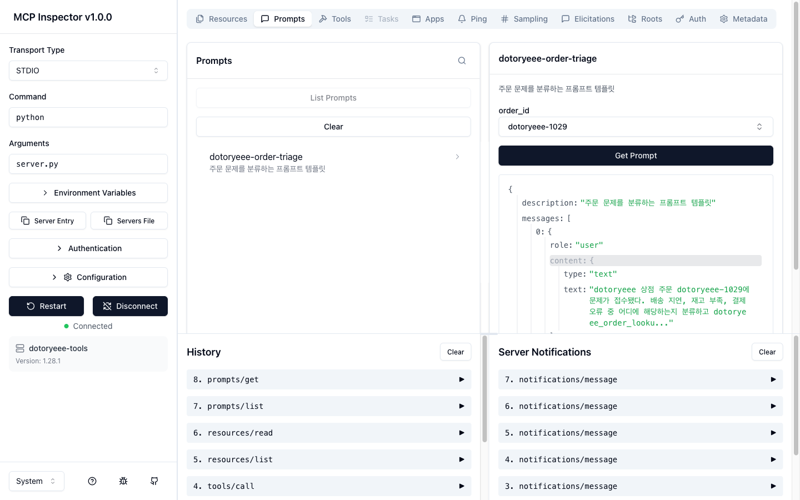

## 도구 목록 변경 알림

---

initialize 응답을 펼쳐 보면 capabilities.tools.listChanged가 false로 선언돼 있다. 선언대로라면 이 서버의 도구 목록은 고정된 것으로 다뤄져야 한다. 그런데 이 선언은 클라이언트에게 주는 약속일 뿐이고, SDK가 선언과 발송을 묶어 강제하지는 않는다.

선언과 실제 발송이 어긋나는 과정을 순서대로 놓으면 다음과 같다.

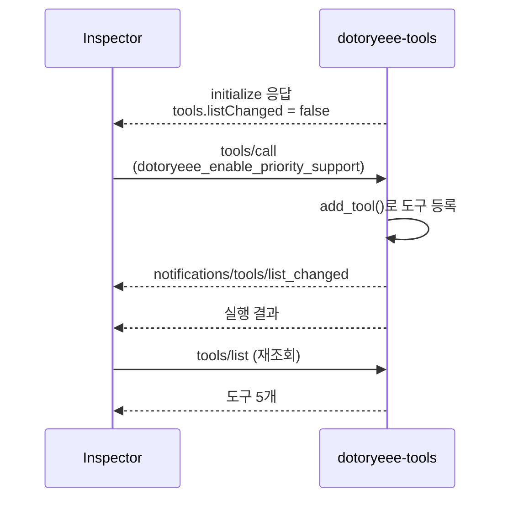
```mermaid
sequenceDiagram
    participant Inspector
    participant Server as dotoryeee-tools
    Server-->>Inspector: initialize 응답<br>tools.listChanged = false
    Inspector->>Server: tools/call<br>(dotoryeee_enable_priority_support)
    Server->>Server: add_tool()로 도구 등록
    Server-->>Inspector: notifications/tools/list_changed
    Server-->>Inspector: 실행 결과
    Inspector->>Server: tools/list (재조회)
    Server-->>Inspector: 도구 5개
```

dotoryeee_enable_priority_support를 호출하면 서버 코드 안에서 mcp.add_tool()로 dotoryeee_priority_support를 새로 등록하고, 곧바로 ctx.session.send_tool_list_changed()를 부른다. 실행해 보면 Tool Result: Success와 함께 오른쪽 Server Notifications 패널에 notifications/tools/list_changed가 그대로 뜬다. 도구 함수가 값을 돌려주기 전에 알림을 먼저 await하기 때문에, 실제로 오가는 순서는 알림이 앞이고 실행 결과가 뒤다.

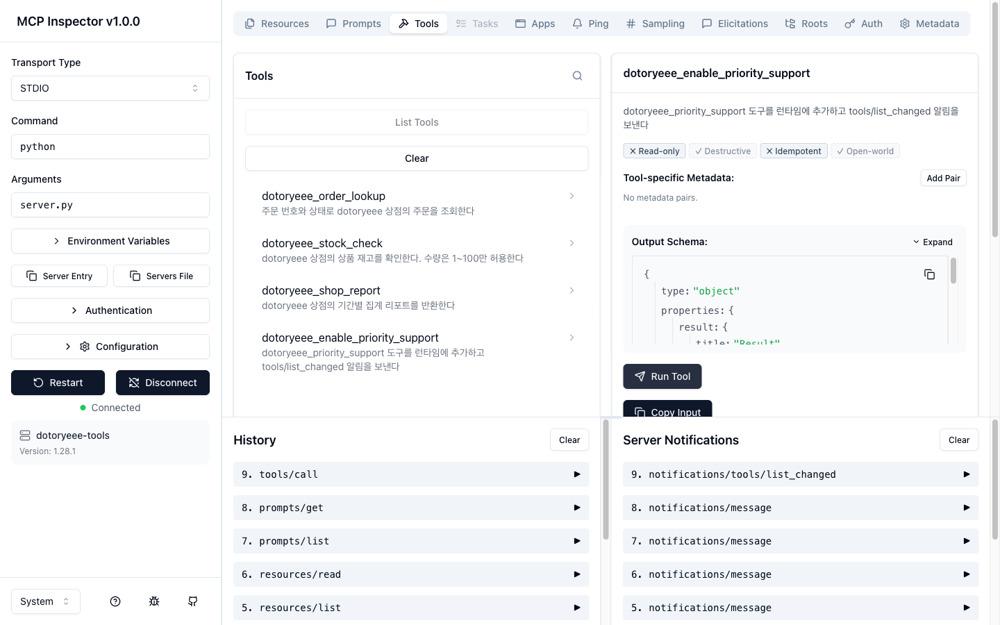

initialize에서 false로 선언한 값과 실제로 온 알림을 나란히 놓으면 어긋난 지점이 분명해진다.

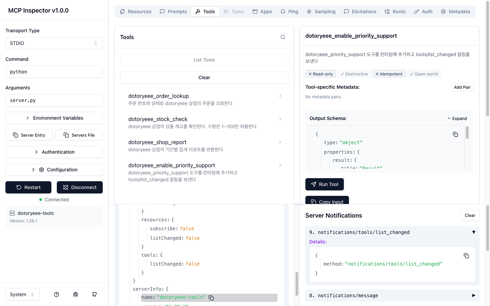

List Tools를 다시 눌러 보면 도구가 5개로 늘어 있다. 알림은 장식이 아니라 실제로 새로 생긴 dotoryeee_priority_support를 가리키고 있었다.

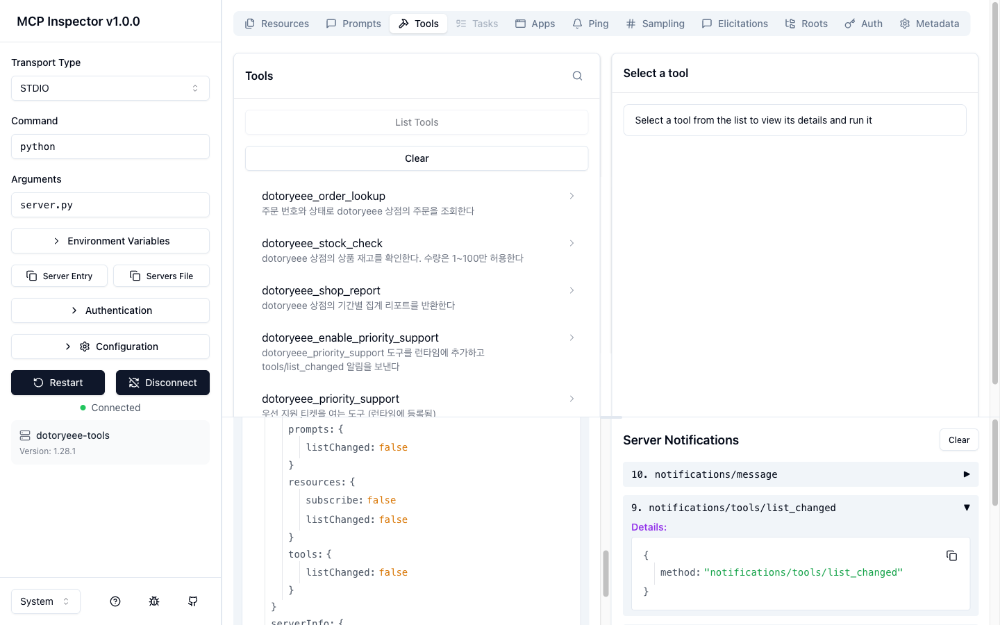

## Claude Code에 등록

---

같은 서버를 Claude Code에도 등록한다. 명령 하나로 끝난다.

```s
claude mcp add dotoryeee-tools -- python server.py
Added stdio MCP server dotoryeee-tools with command: python server.py to local config
```

등록한 서버는 claude mcp list로 확인한다.

```s
claude mcp list
Checking MCP server health…

dotoryeee-tools: python server.py - ✔ Connected
```

claude mcp get으로 서버 하나만 자세히 볼 수도 있다.

```s
claude mcp get dotoryeee-tools
dotoryeee-tools:
  Scope: Local config (private to you in this project)
  Status: ✔ Connected
  Type: stdio
  Command: python
  Args: server.py
  Environment:

To remove this server, run: claude mcp remove dotoryeee-tools -s local
```

대화형 세션에서는 /mcp를 치면 연결 상태 패널이 뜬다. 비대화형(-p) 모드에서는 패널 대신 요약 문장 한 줄로 갈음한다.

```s
claude -p "/mcp"
2 MCP server(s): 2 connected, 0 not connected, 0 disabled. Use `/mcp` in the terminal for details.
Usage: /mcp [reconnect|enable|disable [<server>|all]]. With no server name, applies to all.
```

이제 실제로 도구를 호출해 본다.

````s
claude -p "dotoryeee_stock_check 도구로 product_id=dotoryeee-mug, quantity=3 재고를 확인해줘. 다른 설명 없이 도구 호출 결과만 알려줘."
```json
{"product_id":"dotoryeee-mug","quantity":3,"in_stock":true}
```
````

결과만 보면 도구를 곧장 부른 것 같지만, 안에서 무슨 일이 있었는지는 --output-format stream-json으로 들여다봐야 보인다. 같은 요청을 order_id=dotoryeee-7788로 다시 보내고, 메시지를 jq로 추려서 본다.

```s
claude -p "dotoryeee_order_lookup 도구로 order_id=dotoryeee-7788, status=shipped 상태를 조회해줘. 다른 설명 없이 결과만 알려줘." \
  --output-format stream-json --verbose | \
  jq -c 'if .type=="assistant" then (.message.content[] | if .type=="tool_use" then {step:"tool_use",name,input} elif .type=="text" then {step:"text",text} else empty end) elif .type=="user" then (.message.content[] | if .type=="tool_result" then {step:"tool_result",content} else empty end) else empty end'
{"step":"text","text":"I'll load the tool schema and run the lookup."}
{"step":"tool_use","name":"ToolSearch","input":{"query":"select:mcp__dotoryeee-tools__dotoryeee_order_lookup","max_results":1}}
{"step":"tool_result","content":[{"type":"tool_reference","tool_name":"mcp__dotoryeee-tools__dotoryeee_order_lookup"}]}
{"step":"tool_use","name":"mcp__dotoryeee-tools__dotoryeee_order_lookup","input":{"order_id":"dotoryeee-7788","status":"shipped"}}
{"step":"tool_result","content":"{\"result\":\"order dotoryeee-7788 is shipped\"}"}
{"step":"text","text":"order dotoryeee-7788 is shipped"}
```

이 출력을 순서대로 놓으면 호출 경로가 드러난다.

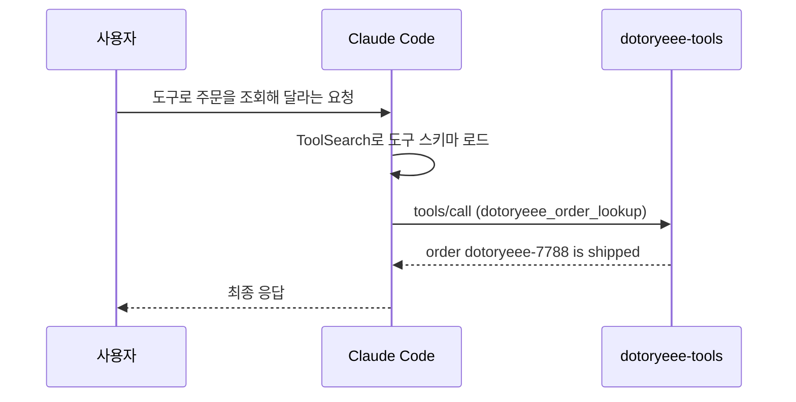
```mermaid
sequenceDiagram
    participant User as 사용자
    participant CC as Claude Code
    participant Server as dotoryeee-tools
    User->>CC: 도구로 주문을 조회해 달라는 요청
    CC->>CC: ToolSearch로 도구 스키마 로드
    CC->>Server: tools/call (dotoryeee_order_lookup)
    Server-->>CC: order dotoryeee-7788 is shipped
    CC-->>User: 최종 응답
```

도구 이름은 mcp__dotoryeee-tools__dotoryeee_order_lookup으로, 서버 이름과 도구 이름을 이중 밑줄로 이어 붙인 형태다. 이건 Claude Code 안에서 쓰는 이름이고, 서버로 나가는 tools/call의 name에는 접두 없이 dotoryeee_order_lookup만 실린다. 그런데 이 이름을 곧바로 부르지 않고, ToolSearch로 먼저 도구를 찾아 로드한 다음에야 실제 호출이 나간다. 도구가 여러 개 붙은 환경에서 매 턴 모든 스키마를 프롬프트에 욱여넣지 않으려고 넣어둔 단계로 보인다. tools/list_changed 때와 마찬가지로, 화면에 나오는 순서가 사양 문서만 보고 예상한 것과는 달랐다.

## 정리

---

- 도구 4개짜리 서버를 만들었는데, 실제로 오간 tools/list·tools/call 메시지는 코드보다 자세했다. inputSchema의 required·enum, 반환 타입에서 나온 outputSchema까지 전부 원문으로 확인됐다
- 값 제약 위반은 JSON-RPC 오류가 아니라 isError: true를 담은 정상 응답으로 돌아왔다. 타입·enum 위반은 폼에서 만들 수조차 없었고, 빈 필수 문자열만 검증을 그대로 통과했다
- tools.listChanged: false로 선언한 서버에서도 add_tool()과 send_tool_list_changed()를 직접 부르면 notifications/tools/list_changed가 실제로 왔다. 선언과 동작이 어긋난 지점이었다
- Claude Code에 등록한 도구는 이름 그대로 곧장 불리지 않고, ToolSearch를 한 번 거친 뒤에야 호출됐다

사양 문서만으로 확신이 안 서는 동작은 Inspector의 History와 Server Notifications 패널을 직접 펼쳐 보는 쪽이 가장 확실하다.
