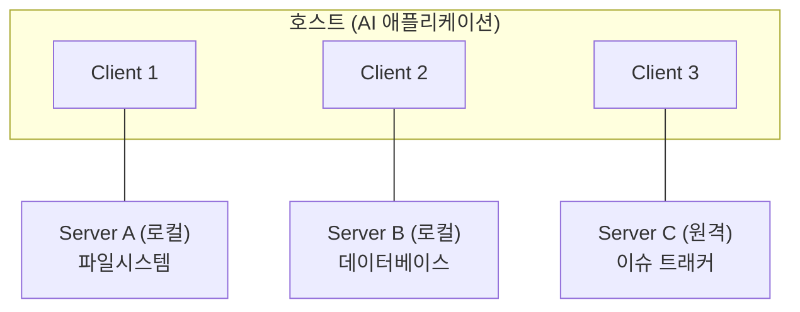
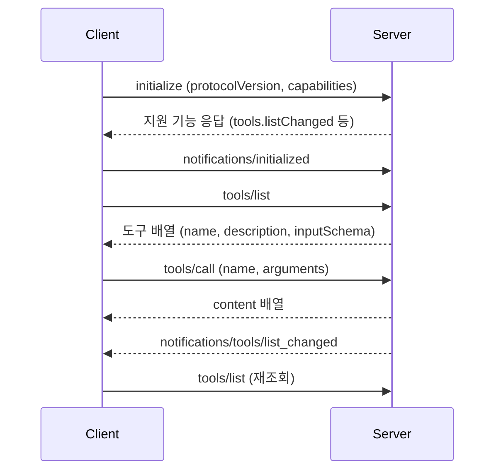

# MCP vs API 차이점 정리

<!-- more -->

## MCP란
MCP(Model Context Protocol)란 AI 애플리케이션이 외부 도구·데이터에 붙는 방식을 표준화한 개방형 프로토콜

- 기반: JSON-RPC 2.0 메시지 교환. 상태를 가지는 연결
- 참여자: 호스트(AI 애플리케이션), 클라이언트(서버당 하나), 서버(도구·데이터 제공)
- 계층: 데이터 계층(생명주기·기능·알림)과 전송 계층(연결·프레이밍·인가)으로 나뉨
- 범위 밖: 컨텍스트 교환 규격만 정하고 모델을 어떻게 쓸지는 규정하지 않음

---

## 기존 API가 에이전트에 맞지 않는 지점
API 자체가 모자란 게 아니라, 사람 개발자가 미리 읽고 코드를 짜는 것을 전제로 설계됐다는 점이 문제

| 문제 | 설명 | MCP의 대응 |
|------|------|-----------|
| 선택지 과부하 | 엔드포인트가 수백 개라도 어느 것을 언제 쓸지는 문서를 읽은 사람이 정함. 모델에는 그 판단 근거가 없음 | `tools/list`가 이름·설명·입력 스키마를 런타임에 반환 → 사전 하드코딩 없이 후보를 좁힘 |
| 변환 오버헤드 | 서비스마다 인증·경로·응답 형태가 달라 도구마다 래퍼를 새로 씀 | 모든 도구를 `tools/call` 하나로 호출하고 응답은 `content` 배열로 통일 |
| 변경 전파 부재 | 도구가 늘거나 바뀌면 프롬프트와 래퍼를 고쳐 다시 배포해야 함 | `notifications/tools/list_changed`로 서버가 알리고 클라이언트가 목록을 다시 읽음 |

OpenAPI 같은 기계 판독 규격과의 차이는 소비 시점에 있음. OpenAPI는 대개 빌드 시점에 읽어 클라이언트 코드를 만들어 두는 쪽, MCP는 연결할 때마다 목록과 스키마를 주고받아 모든 서버를 같은 호출 규약으로 다루는 쪽.

---

## API와의 차이

| 비교 항목 | 기존 API | MCP |
|-----------|---------|-----|
| 주 소비자 | 사람 개발자 | AI 애플리케이션 |
| 통신 규격 | 서비스마다 REST·GraphQL·gRPC 등 제각각 | JSON-RPC 2.0으로 통일 |
| 연결 성격 | 요청마다 독립적인 무상태 호출 | 초기화 후 유지되는 상태 있는 연결 |
| 기능 확인 | 문서를 읽고 개발자가 판단 | `initialize`에서 양쪽이 capability를 선언 |
| 인증 | 서비스별 방식. 키를 클라이언트가 보관 | 전송 계층이 담당. 원격은 OAuth 권장 |
| 버전 관리 | 경로나 헤더로 서비스마다 다르게 | `protocolVersion` 문자열로 연결 시 협상 |

- 기존 API 위에 얹는 계층 → MCP 서버 내부는 대개 기존 API를 그대로 호출
- 통일되는 것은 모델과 도구 사이 구간이고, 도구와 백엔드 사이는 여전히 각자의 API

---

## 구조

- 호스트는 붙는 서버 수만큼 클라이언트를 만들고, 각 클라이언트가 서버 하나와 전용 연결을 유지
- 서버가 로컬에 있는지 원격에 있는지는 전송 방식에 따라 갈림

| 전송 | 쓰이는 곳 | 특징 |
|------|---------|------|
| stdio | 같은 머신의 로컬 프로세스 | 표준 입출력으로 주고받음. 네트워크 구간 없음 |
| Streamable HTTP | 원격 서버 | 단일 엔드포인트에 HTTP POST, 스트리밍은 SSE. bearer 토큰·API 키·커스텀 헤더 지원 |

---

## 서버가 제공하는 primitive
서버가 클라이언트에 내놓는 기능은 세 가지로 나뉨

| primitive | 역할 | 주요 메서드 |
|-----------|------|-----------|
| Tools | 모델이 실행하는 함수. 파일 조작·조회·외부 호출 등 | `tools/list`, `tools/call` |
| Resources | 모델이나 사용자가 참조할 컨텍스트 데이터 | `resources/list`, `resources/read` |
| Prompts | 상호작용을 정형화한 재사용 템플릿 | `prompts/list`, `prompts/get` |

- 반대로 클라이언트가 서버에 내주는 기능도 있음: Sampling(`sampling/createMessage`)으로 서버가 모델 응답을 요청하고, Roots(`roots/list`)로 작업 범위를 알리고, Elicitation(`elicitation/create`)으로 사용자에게 추가 입력을 받음
- 어느 쪽이든 `initialize`에서 선언한 capability 안에서만 동작

---

## 메시지 흐름
탐색과 호출이 분리되어 있다는 점이 기존 API 호출과 갈리는 지점

- `initialize`에서 `protocolVersion`이 맞지 않으면 연결을 끊음(현재 사양 리비전은 2025-11-25)
- `inputSchema`가 JSON Schema라 클라이언트가 인자를 검증한 뒤 호출 가능
- 마지막 알림은 서버가 `listChanged: true`를 선언한 경우에만 옴 → 선언하지 않은 서버는 목록이 고정된 것으로 다뤄짐

---

## 언제 무엇을 쓰나

| 상황 | 권장 |
|------|------|
| 앱 하나가 자기 백엔드 함수 몇 개만 호출 | 직접 함수 호출. 프로토콜 계층은 과함 |
| 도구 목록이 자주 바뀌거나 런타임에 늘어남 | MCP |
| 여러 에이전트·클라이언트가 같은 도구를 나눠 씀 | MCP |
| 외부에 도구를 공개해 다른 팀이 붙게 함 | MCP 서버로 공개 |
| 사람이 쓰는 공개 웹 API 제공 | 기존 API 유지. 필요하면 MCP 서버를 앞에 덧댐 |

---

## 주의
- 도구를 노출하는 순간 그 권한이 모델에 열리는 셈이라 접근 제어를 프로토콜 밖에서 따로 설계해야 함
- 사양은 도구 설명·주석을 신뢰할 수 없는 입력으로 다루라고 명시. 검증되지 않은 서버를 붙이면 설명 자체가 공격 경로가 됨
- 에이전트가 스스로 도구를 고르는 만큼 운영자가 실행 경로를 예측하기 어려워짐
- 사양 리비전이 계속 올라가므로 클라이언트와 서버의 지원 버전을 맞춰야 함

---

## 결론
- MCP는 모델과 도구 사이 구간을 JSON-RPC 2.0으로 통일한 프로토콜이고, 기존 API를 대체하지 않고 위에 얹힘
- 기존 API의 한계는 사람이 미리 읽고 코드를 짜는 전제에 있음
- 런타임 탐색(`tools/list`)과 단일 호출 규약(`tools/call`)이 핵심이고, 목록 갱신은 `list_changed` 알림이 맡음
- 도구가 적고 고정된 앱이라면 함수 호출로 충분하고, 도구가 늘거나 여러 곳에서 소비될 때 MCP의 값어치가 나옴
- API는 "사람이 읽고 짜는 규격", MCP는 "에이전트가 붙어서 물어보는 규격"으로 이해하면 됌
