# llama.cpp로 MoE와 Dense 추론 성능 비교하기

Apple Silicon에서 llama.cpp로 MoE 35B-A3B와 Dense 27B를 나란히 돌려봤다. prefill과 decode 속도, KV cache 크기, 양자화별 차이를 실측해 비교한 기록이다.

<!-- more -->

## 목표

---

- 같은 세대의 MoE(Qwen3.6-35B-A3B)와 Dense(Qwen3.6-27B)를 한 대의 Mac Studio에 올려 prefill과 decode 속도를 실측한다
- 파일도 총 파라미터도 MoE 쪽이 큰데 토큰 생성이 더 빠른지, 빠르다면 활성 파라미터 비만큼 빠른지 확인한다
- 기동 로그의 KV cache 크기를 컨텍스트 4096, 32768, 131072에서 수집해 계산식과 맞춰 본다
- Dense를 Q4_K_M, Q6_K, Q8_0으로 바꿔가며 파일 크기와 속도가 어느 방향으로 움직이는지 본다
- 두 서버의 /metrics를 Prometheus로 긁어 Grafana에서 나란히 놓고 본다

MoE의 구조와 총 파라미터·활성 파라미터의 차이는 [MoE 추론 정리](moe.md)에서 다뤘다. 이 글은 그 위에서 실제로 두 모델을 띄워 숫자가 어느 쪽으로 나오는지 확인한다.

## 실습 구성

---

llama-server는 네이티브로 띄우고 관측 스택만 docker compose로 올린다.

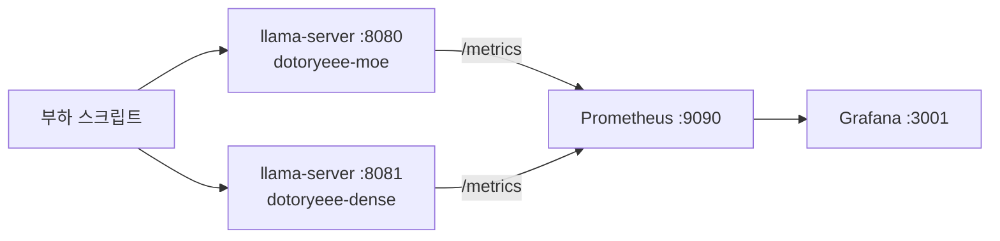

!!! warning
    💡 Docker Desktop for Mac은 Metal 패스스루가 없어 컨테이너 안에서는 GPU를 못 쓰므로 llama-server는 네이티브로 띄운다

기기와 빌드는 다음과 같다.

|항목|값|
|---|---|
|기기|Mac Studio, Apple M1 Max, 10코어(성능 8 + 효율 2)|
|메모리|64GB 통합 메모리|
|llama.cpp|version 10090 (7347430f4), Homebrew 설치|
|백엔드|BLAS, MTL(Metal), CPU|
|GPU family|MTLGPUFamilyApple7|
|recommendedMaxWorkingSetSize|55662.79 MB|
|has unified memory|true|
|has tensor|false(pre-M5 기기라 비활성)|

모델은 GGUF 네 개를 받는다. Dense 쪽은 양자화 사다리를 만들려고 세 단계를 함께 받았다.

|파일|크기|
|---|---|
|Qwen3.6-35B-A3B-UD-Q4_K_M.gguf|22.13GB|
|Qwen3.6-27B-Q4_K_M.gguf|16.82GB|
|Qwen3.6-27B-Q6_K.gguf|22.52GB|
|Qwen3.6-27B-Q8_0.gguf|28.60GB|

구조 차이는 이렇다. 두 모델 다 Gated DeltaNet 3개마다 Gated Attention 1개가 오는 배열이라, 전체 레이어 중 KV cache를 잡는 레이어는 1/4뿐이다. 이 값이 뒤의 KV cache 실측에서 그대로 쓰인다.

|항목|35B-A3B (MoE)|27B (Dense)|
|---|---|---|
|파라미터|35B 총 / 3B 활성|27B|
|전체 레이어|40|64|
|Gated Attention 레이어|10|16|
|Gated Attention|Q 16, KV 2, head_dim 256|Q 24, KV 4, head_dim 256|
|전문가|256개 중 8 Routed + 1 Shared|없음|
|Context|262,144|262,144|

!!! warning
    💡 작업 세트 상한이 55662.79 MB라 Q8_0을 올릴 때는 MoE를 내리고 순차로 돌린다

## 환경 준비

---

1. Homebrew로 llama.cpp를 설치한다.

```s
brew install llama.cpp
```

2. 모델 디렉터리를 만들고 GGUF 네 개를 받는다. 합쳐서 90GB라 회선에 따라 시간이 꽤 걸린다. 뒤에서 기동 로그를 파일로 받아 둘 것이라 results 디렉터리도 함께 만든다.

```s
mkdir -p /Users/aaron/moe_lab/models /Users/aaron/moe_lab/results
cd /Users/aaron/moe_lab
hf download unsloth/Qwen3.6-35B-A3B-GGUF Qwen3.6-35B-A3B-UD-Q4_K_M.gguf --local-dir models
hf download unsloth/Qwen3.6-27B-GGUF Qwen3.6-27B-Q4_K_M.gguf --local-dir models
hf download unsloth/Qwen3.6-27B-GGUF Qwen3.6-27B-Q6_K.gguf --local-dir models
hf download unsloth/Qwen3.6-27B-GGUF Qwen3.6-27B-Q8_0.gguf --local-dir models
```

```s
ls -lh models/*.gguf | awk '{print $5, $9}'
16G Qwen3.6-27B-Q4_K_M.gguf
21G Qwen3.6-27B-Q6_K.gguf
27G Qwen3.6-27B-Q8_0.gguf
21G Qwen3.6-35B-A3B-UD-Q4_K_M.gguf
```

3. 관측 스택 디렉터리를 따로 파고 compose 파일을 작성한다. 호스트 3000번은 다른 데 쓰고 있어 Grafana는 3001로 매핑한다.

```s
mkdir -p observability
vi observability/docker-compose.yml
```

```yaml title="observability/docker-compose.yml"
services:
  prometheus:
    image: prom/prometheus:latest
    container_name: dotoryeee-prometheus
    ports:
      - "9090:9090"
    volumes:
      - ./prometheus.yml:/etc/prometheus/prometheus.yml:ro

  grafana:
    image: grafana/grafana:latest
    container_name: dotoryeee-grafana
    ports:
      - "3001:3000"                      #호스트 3000번 충돌 회피
    environment:
      - GF_SECURITY_ADMIN_USER=dotoryeee
      - GF_SECURITY_ADMIN_PASSWORD=dotoryeee-grafana-demo
      - GF_AUTH_ANONYMOUS_ENABLED=true   #대시보드 확인용, 익명 뷰어 허용
      - GF_AUTH_ANONYMOUS_ORG_ROLE=Viewer
      - GF_USERS_DEFAULT_THEME=dark
    volumes:
      - ./grafana/provisioning:/etc/grafana/provisioning:ro
      - ./grafana/dashboards:/var/lib/grafana/dashboards:ro
    depends_on:
      - prometheus
```

4. Prometheus는 컨테이너 안에서 호스트의 두 포트를 긁어야 하므로 host.docker.internal로 잡는다. 모델 구분은 alias 라벨로 붙인다.

```yaml title="observability/prometheus.yml"
global:
  scrape_interval: 5s
  evaluation_interval: 5s

scrape_configs:
  - job_name: 'dotoryeee-llm'
    metrics_path: /metrics
    static_configs:
      - targets: ['host.docker.internal:8080']
        labels:
          alias: dotoryeee-moe        #MoE 서버
      - targets: ['host.docker.internal:8081']
        labels:
          alias: dotoryeee-dense      #Dense 서버
```

5. compose가 마운트하는 프로비저닝 파일 두 개를 만든다. 이게 없으면 스택은 떠도 데이터소스와 대시보드가 비어 있다.

```yaml title="observability/grafana/provisioning/datasources/datasource.yml"
apiVersion: 1

datasources:
  - name: Prometheus
    uid: dotoryeee-prometheus
    type: prometheus
    access: proxy
    url: http://prometheus:9090    #compose 네트워크 안의 서비스명
    isDefault: true
```

```yaml title="observability/grafana/provisioning/dashboards/dashboard.yml"
apiVersion: 1

providers:
  - name: 'dotoryeee'
    orgId: 1
    folder: ''
    type: file
    disableDeletion: false
    updateIntervalSeconds: 10
    allowUiUpdates: true
    options:
      path: /var/lib/grafana/dashboards
```

대시보드 JSON은 observability/grafana/dashboards 아래에 두면 기동 시 자동으로 읽힌다. 패널은 위에서 확인한 지표명으로 만든다.

6. 스택을 올린다.

```s
cd observability && docker compose up -d
```

```s
docker compose ps --format 'table {{.Name}}\t{{.Status}}\t{{.Ports}}'
NAME                   STATUS          PORTS
dotoryeee-grafana      Up 31 minutes   0.0.0.0:3001->3000/tcp, [::]:3001->3000/tcp
dotoryeee-prometheus   Up 31 minutes   0.0.0.0:9090->9090/tcp, [::]:9090->9090/tcp
```

이 시점에는 llama-server가 아직 없으니 Prometheus 타깃은 둘 다 DOWN이다. 서버를 띄운 뒤 다시 확인한다.

## 모델 기동과 메모리

---

앞에서 cd observability로 작업 디렉터리를 옮겼으니 되돌려 놓는다. 이후 명령은 모두 moe_lab 기준 상대경로다.

```s
cd /Users/aaron/moe_lab
```

두 모델을 각각 다른 포트에 띄운다. alias는 Grafana 범례에 그대로 찍히므로 미리 정해 둔다. 단일 측정에서는 슬롯이 하나만 잡히도록 --parallel 1로 고정한다.

```s
llama-server -m models/Qwen3.6-35B-A3B-UD-Q4_K_M.gguf \
  --port 8080 --alias dotoryeee-moe --parallel 1 --metrics -c 32768 -lv 4 \
  > results/boot_moe_c32768.log 2>&1 &

llama-server -m models/Qwen3.6-27B-Q4_K_M.gguf \
  --port 8081 --alias dotoryeee-dense --parallel 1 --metrics -c 32768 -lv 4 \
  > results/boot_dense_c32768.log 2>&1 &
```

!!! tip
    💡 --parallel 기본값이 auto라 슬롯 수가 달라지면 KV 대조가 통째로 어긋나므로 단일 측정은 --parallel 1로 고정한다

-lv 4가 붙은 이유는 따로 있다. 기본 verbosity로 띄우면 모델 buffer size와 KV cache 줄이 아예 안 찍힌다. 로그를 아무리 뒤져도 안 나와서 한참 헤맸다. 이 실습은 그 두 줄이 1차 근거이므로 트레이스 레벨까지 올려야 한다.

기동 로그에서 가중치가 어디에 얼마나 올라갔는지 확인한다.

|모델|MTL0_Mapped|CPU_Mapped|
|---|---|---|
|MoE|21098.65 MiB|515.31 MiB|
|Dense|16027.69 MiB|682.03 MiB|

MoE가 약 5GiB 더 크다. 고르지 않은 전문가도 메모리에는 상주해야 하니 당연한 결과다. 여기까지는 MoE가 불리한 쪽으로만 나온다.

llama-server는 내장 WebUI를 함께 띄운다. 두 포트에 각각 붙어 보면 --alias로 준 이름이 응답 아래와 입력창에 그대로 표시되어 어느 서버에 물어본 것인지 헷갈리지 않는다.

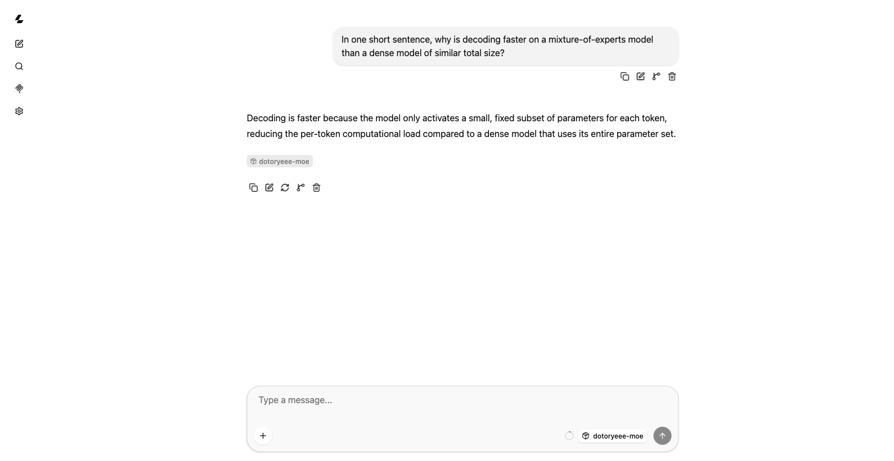

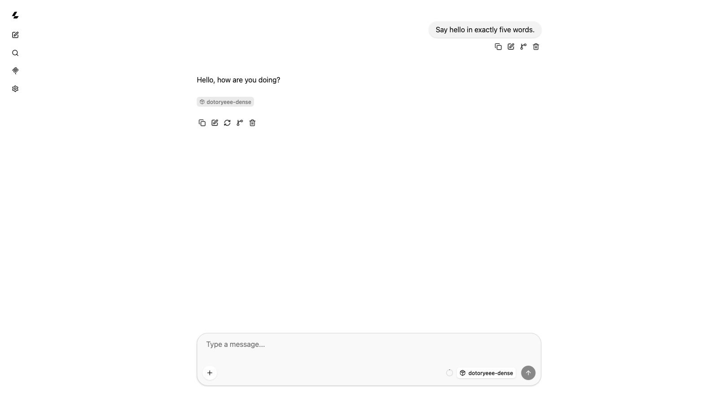

## prefill과 decode 비교

---

llama-bench로 두 모델을 한 호출에 묶어 돌린다. 한 호출로 묶는 이유는 pp512가 전문가를 미리 깨워 주기 때문이다. tg만 따로 돌리면 warmup이 1토큰뿐이라 MoE 전문가가 처음 불려 오는 시간이 계측에 섞인다.

```s
llama-bench -m models/Qwen3.6-35B-A3B-UD-Q4_K_M.gguf \
            -m models/Qwen3.6-27B-Q4_K_M.gguf \
            -p 512 -n 128 -r 3
```

```s
| model                          |       size |     params | backend    | threads |            test |                  t/s |
| qwen35moe 35B.A3B Q4_K - Medium |  20.60 GiB |    34.66 B | BLAS,MTL   |       8 |           pp512 |        835.51 ± 5.03 |
| qwen35moe 35B.A3B Q4_K - Medium |  20.60 GiB |    34.66 B | BLAS,MTL   |       8 |           tg128 |         47.63 ± 1.85 |
| qwen35 27B Q4_K - Medium       |  15.65 GiB |    26.90 B | BLAS,MTL   |       8 |           pp512 |        128.21 ± 0.12 |
| qwen35 27B Q4_K - Medium       |  15.65 GiB |    26.90 B | BLAS,MTL   |       8 |           tg128 |         11.70 ± 0.01 |
build: 7347430f4 (10090)
```

정리하면 이렇다.

|항목|MoE 35B-A3B|Dense 27B|비|
|---|---|---|---|
|GGUF 크기|20.60 GiB|15.65 GiB|MoE가 32% 큼|
|파라미터|34.66 B|26.90 B|MoE가 29% 많음|
|prefill (pp512)|835.51 t/s|128.21 t/s|6.52배|
|decode (tg128)|47.63 t/s|11.70 t/s|4.07배|

**파일도 파라미터도 MoE가 큰데 prefill은 6.52배, decode는 4.07배 빠르다.** 크기와 속도가 반대 방향으로 간다. Dense끼리 견줄 때는 이런 역전이 나오지 않는다.

!!! tip
    💡 tg128은 컨텍스트 0에서 잰 값이라 실사용보다 빠른 상한이며 깊이별 값은 아래에서 따로 잰다

같은 비교를 서버 쪽 지표로 보면 두 곡선이 겹치지 않는다.

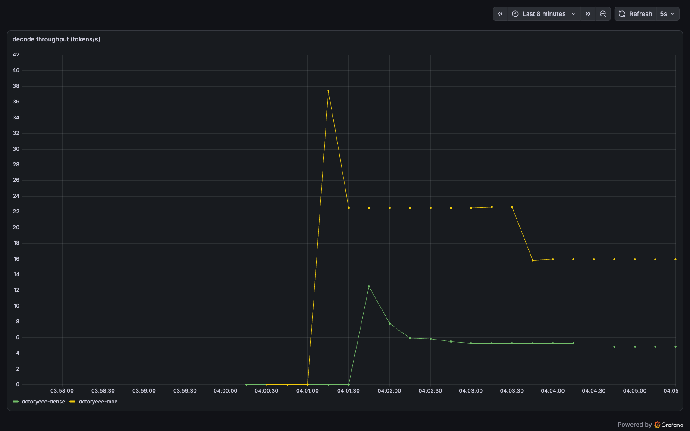

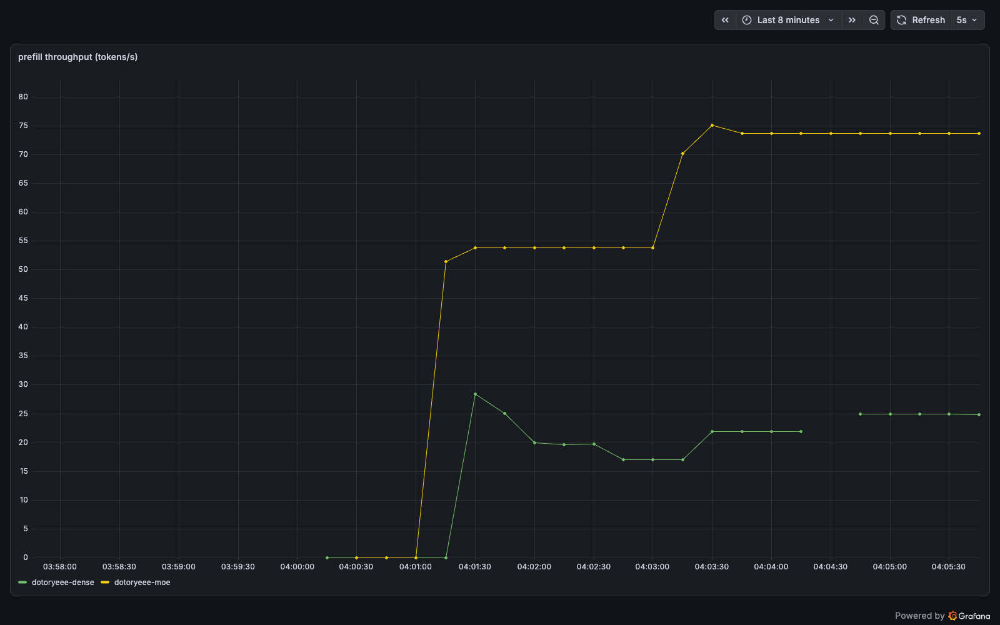

서버 쪽 숫자는 llama-bench보다 낮다. 토크나이즈와 샘플링이 포함되고, 이 구간은 동시 요청 부하를 걸어 둔 상태라 요청 하나당 값이 나뉜다. 두 도구의 절대값을 맞춰 볼 것이 아니라 같은 조건에서 두 모델의 간격을 보는 데 쓴다.

프롬프트를 길게 넣었을 때도 같은 방향인지 확인한다. 16000토큰짜리 프롬프트를 한 번씩 넣고 timings의 prompt 구간만 본다. llama-server는 cache_prompt가 기본 활성이라 같은 프롬프트를 두 번 넣으면 두 번째부터 prompt_ms가 0에 가깝게 찍힌다. 요청마다 앞에 uuid를 붙이고 cache_prompt를 false로 껐다.

|모델|처리 토큰|prompt_ms|prompt tok/s|
|---|---|---|---|
|MoE|16135|22482.03|717.68|
|Dense|16131|133346.64|120.97|

5.93배로, pp512 단발의 6.52배보다 조금 좁다. 프롬프트가 길어지면 어텐션 몫이 커지고 그 몫은 전문가 라우팅으로 줄지 않는다.

## 왜 9배가 아닌가

---

활성 파라미터만 놓고 보면 3B 대 27B, 9배다. 그런데 실측 decode 비는 4.07배로 절반 이하다. decode 한 스텝에서 무엇이 줄고 무엇이 안 줄어드는지 나눠 보면 간격의 방향이 보인다.

|스텝 안의 몫|MoE에서 줄어드는가|
|---|---|
|전문가 FFN 가중치 읽기|줄어듦. 256개 중 8 Routed + 1 Shared만 읽음|
|어텐션 연산|안 줄어듦. 라우팅 대상이 아님|
|Gated DeltaNet 상태 갱신|안 줄어듦. 라우팅 대상이 아님|
|임베딩·출력 레이어|안 줄어듦|
|스텝마다 드는 고정 비용|활성 파라미터 비를 따르지 않음|

9배는 곱셈 연산량과 스텝당 읽는 가중치의 비일 뿐이다. 나머지 몫은 그 비율을 따라 줄지 않는다. MoE는 스텝 자체가 짧아 안 줄어드는 몫의 비중이 상대적으로 커진다.

여기에 커널 모양의 차이가 얹힌다. 전문가 8개를 골라 모으는 행렬곱은 한 덩어리 가중치를 순서대로 훑는 dense 행렬곱과 메모리 접근 모양이 다르다. 같은 바이트를 읽어도 실효 대역폭이 같다는 보장이 없다. 다만 커널별로 시간을 갈라 재지 않았으므로 각 몫이 몇 퍼센트씩인지는 이번 실측으로 확정하지 못했다.

방향을 짐작할 단서는 깊이별 decode에 있다. 컨텍스트가 깊어지면 어텐션 몫이 커지는데, 이때 흔들리는 쪽이 MoE다. 아래 컨텍스트 확장 절의 수치가 그렇다.

## KV cache 실측

---

서버를 -c 4096, -c 32768, -c 131072로 각각 띄워 기동 로그를 모은다. 같은 포트를 다시 쓰므로 띄우기 전에 먼저 돌던 프로세스를 내린다.

```s
pkill -f llama-server
```

MoE의 32768 기동 로그는 다음과 같다.

```s
load_tensors:   CPU_Mapped model buffer size =   515.31 MiB
load_tensors:  MTL0_Mapped model buffer size = 21098.65 MiB
llama_context: n_ctx         = 32768
llama_context: flash_attn    = auto
llama_kv_cache: size =  640.00 MiB ( 32768 cells,  10 layers,  1/1 seqs), K (f16):  320.00 MiB, V (f16):  320.00 MiB
llama_memory_recurrent: size =   62.81 MiB (     1 cells,  40 layers,  1 seqs  0 rs_seq), R (f32):    2.81 MiB, S (f32):   60.00 MiB
resolve_fused_ops: Flash Attention enabled
```

같은 조건의 Dense는 이렇다.

```s
load_tensors:   CPU_Mapped model buffer size =   682.03 MiB
load_tensors:  MTL0_Mapped model buffer size = 16027.69 MiB
llama_context: n_ctx         = 32768
llama_context: flash_attn    = auto
llama_kv_cache: size = 2048.00 MiB ( 32768 cells,  16 layers,  1/1 seqs), K (f16): 1024.00 MiB, V (f16): 1024.00 MiB
llama_memory_recurrent: size =  149.62 MiB (     1 cells,  64 layers,  1 seqs  0 rs_seq), R (f32):    5.62 MiB, S (f32):  144.00 MiB
resolve_fused_ops: Flash Attention enabled
```

로그가 메모리를 두 줄로 나눠 찍는다. llama_kv_cache 줄이 어텐션 KV이고, llama_memory_recurrent 줄이 Gated DeltaNet이 잡는 상태다. **KV 줄의 layers 값에 주목한다. MoE는 40이 아니라 10, Dense는 64가 아니라 16으로 찍힌다.** KV를 가진 레이어만 센 값이다.

토큰당 K+V(f16) 크기는 2 × (KV를 가진 레이어 수) × KV 헤드 × head_dim × 2B로 잡는다.

- MoE: 2 × 10 × 2 × 256 × 2B = 토큰당 20KiB
- Dense: 2 × 16 × 4 × 256 × 2B = 토큰당 64KiB

컨텍스트별로 계산값과 실측을 나란히 놓으면 이렇다.

|컨텍스트|MoE 계산값|MoE 실측|Dense 계산값|Dense 실측|
|---|---|---|---|---|
|4096|80MiB|80.00 MiB|256MiB|256.00 MiB|
|32768|640MiB|640.00 MiB|2048MiB|2048.00 MiB|
|131072|2560MiB|2560.00 MiB|8192MiB|8192.00 MiB|

여섯 항목이 정확히 맞는다. 여기서 레이어 수 자리에 전체 레이어인 40과 64를 넣으면 실측의 딱 4배가 나온다. 식이 어긋난 게 아니라 넣은 값이 어긋난 것이다. 레이어 수 자리에는 KV를 가진 레이어만 넣어야 하고, 이 모델은 그게 전체의 1/4이다. Gated DeltaNet 3개마다 Gated Attention 1개가 오는 배열이 로그의 10과 16으로 그대로 드러났다.

Gated DeltaNet 몫도 확인한다.

|모델|크기|cells|layers|
|---|---|---|---|
|MoE|62.81 MiB|1|40|
|Dense|149.62 MiB|1|64|

이 값은 컨텍스트 4096, 32768, 131072에서 전부 동일했다. 시퀀스당 1셀이라 컨텍스트 길이와 무관하다. layers 값이 전체 레이어 수로 찍히는 것도 눈에 띈다. 두 메모리 풀이 레이어를 나눠 갖는 구조가 로그 두 줄에 그대로 나온다.

Flash Attention은 여섯 번의 기동에서 전부 enabled로 잡혔다. 131072에서도 유지됐다. 여기서 off로 떨어졌다면 중간 버퍼가 불어나 KV 대조가 무의미해진다.

## 컨텍스트 확장

---

크기만 보면 128K에서도 MoE 쪽이 유리하다. 2560MiB 대 8192MiB, 세 배 이상 차이다. 그런데 속도는 다른 이야기다. llama-bench의 -d로 컨텍스트를 미리 채운 뒤 decode 속도를 잰다.

```s
llama-bench -m models/Qwen3.6-35B-A3B-UD-Q4_K_M.gguf \
            -m models/Qwen3.6-27B-Q4_K_M.gguf \
            -p 0 -n 64 -d 0,4096,32768 -r 3
```

```s
| qwen35moe 35B.A3B Q4_K - Medium |  20.60 GiB |    34.66 B | BLAS,MTL   |       8 |            tg64 |         50.23 ± 0.27 |
| qwen35moe 35B.A3B Q4_K - Medium |  20.60 GiB |    34.66 B | BLAS,MTL   |       8 |    tg64 @ d4096 |         47.29 ± 1.10 |
| qwen35moe 35B.A3B Q4_K - Medium |  20.60 GiB |    34.66 B | BLAS,MTL   |       8 |   tg64 @ d32768 |         39.93 ± 0.52 |
| qwen35 27B Q4_K - Medium       |  15.65 GiB |    26.90 B | BLAS,MTL   |       8 |            tg64 |         11.64 ± 0.04 |
| qwen35 27B Q4_K - Medium       |  15.65 GiB |    26.90 B | BLAS,MTL   |       8 |    tg64 @ d4096 |         11.49 ± 0.06 |
```

MoE는 깊이 0에서 32768로 갈 때 50.23 → 39.93으로 약 20% 떨어졌다. Dense는 0에서 4096으로 11.64 → 11.49, 사실상 그대로다. 안 줄어드는 몫이 커질 때 흔들리는 쪽이 MoE라는 앞 절의 서술과 방향이 맞는다.

Dense의 d32768 행은 없다. 깊이를 채우려면 그만큼 prefill을 돌려야 하는데 Dense의 prefill이 128 t/s대라 32768토큰을 채우는 데만 회당 4분이 넘는다. 3회 반복이라 한 조합에 15분 가까이 잡혀 시간상 중단했다. **없는 값이라 표에 넣지 않는다.**

n_tokens_max 패널로 서버가 실제로 본 최대 컨텍스트를 확인할 수 있다.

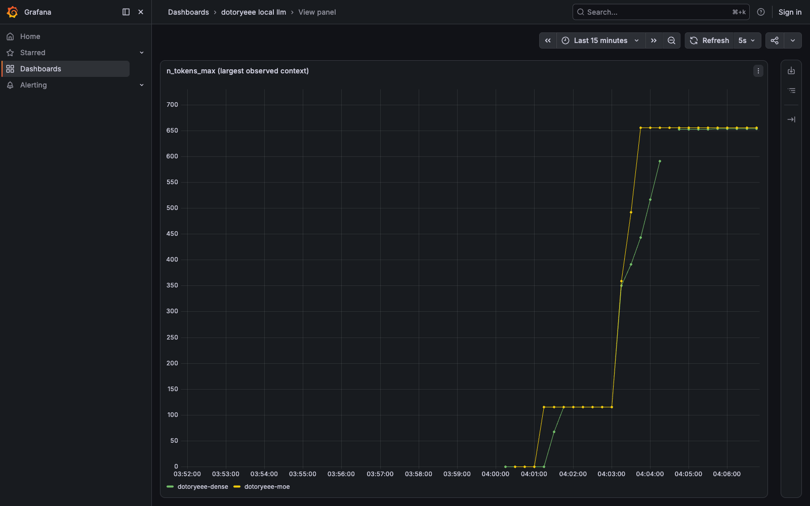

!!! warning
    💡 131072에서는 KV cache만 MoE 2560MiB, Dense 8192MiB가 얹히므로 두 모델을 동시에 128K로 띄우지 않는다

## 양자화 사다리

---

Dense만 Q4_K_M, Q6_K, Q8_0으로 바꿔가며 같은 조건으로 잰다. 파일이 커질수록 스텝마다 읽는 바이트가 늘어나니 decode가 느려질 것으로 보고 시작했다.

```s
llama-bench -m models/Qwen3.6-27B-Q4_K_M.gguf \
            -m models/Qwen3.6-27B-Q6_K.gguf \
            -m models/Qwen3.6-27B-Q8_0.gguf \
            -p 512 -n 128 -r 3
```

```s
| model                          |       size |     params | backend    | threads |            test |                  t/s |
| qwen35 27B Q4_K - Medium       |  15.65 GiB |    26.90 B | BLAS,MTL   |       8 |           pp512 |        126.95 ± 0.30 |
| qwen35 27B Q4_K - Medium       |  15.65 GiB |    26.90 B | BLAS,MTL   |       8 |           tg128 |         11.63 ± 0.01 |
| qwen35 27B Q6_K                |  20.97 GiB |    26.90 B | BLAS,MTL   |       8 |           pp512 |        125.08 ± 0.05 |
| qwen35 27B Q6_K                |  20.97 GiB |    26.90 B | BLAS,MTL   |       8 |           tg128 |         12.42 ± 0.03 |
| qwen35 27B Q8_0                |  26.62 GiB |    26.90 B | BLAS,MTL   |       8 |           pp512 |        144.82 ± 1.20 |
```

Q8_0의 tg128 행이 빠져 나와서 그 조합만 따로 돌렸다.

```s
llama-bench -m models/Qwen3.6-27B-Q8_0.gguf -p 0 -n 128 -r 3
```

```s
| model                          |       size |     params | backend    | threads |            test |                  t/s |
| qwen35 27B Q8_0                |  26.62 GiB |    26.90 B | BLAS,MTL   |       8 |           tg128 |         11.25 ± 0.04 |
```

예상이 빗나갔다. decode는 Q4_K_M 11.63, Q6_K 12.42, Q8_0 11.25로 파일 크기 순서를 따르지 않는다. 가장 작은 Q4_K_M도 가장 큰 Q8_0도 중간인 Q6_K보다 느리다. 스텝당 읽는 바이트만으로 정해지는 값이 아니라는 뜻이다. 블록 구조에 따라 역양자화 커널의 무게가 달라진다는 것이 후보지만, 커널 시간을 따로 재지 않았으므로 원인을 지목하지는 않는다.

pp512는 126.95, 125.08, 144.82로 파일 크기와 뚜렷한 방향을 만들지 않았다. prefill은 연산 바운드라 가중치를 읽는 양이 시간을 정하지 않는다. 앞선 측정에서 같은 Q4_K_M을 128.21 t/s로 쟀는데 이번엔 126.95다. 회차 간 편차가 이 정도는 있다는 것도 함께 봐 둔다.

!!! warning
    💡 Q8_0은 28.60GB라 페이지 캐시에서 다른 모델을 밀어내므로 사다리 측정은 맨 마지막에 돌린다

## 동시 요청

---

여기부터는 pkill -f llama-server로 앞의 서버를 내리고 --parallel 4로 다시 띄운다. 슬롯 4개를 나눠 쓰는 구성에서 동시 요청 1, 2, 4, 8을 걸고 총 처리량과 요청당 지연을 본다. 요청마다 앞에 난수를 붙이고 cache_prompt를 false로 꺼서 프롬프트 캐시가 끼지 않게 했다.

```s
llama-server -m models/Qwen3.6-35B-A3B-UD-Q4_K_M.gguf \
  --port 8080 --alias dotoryeee-moe --parallel 4 --metrics -c 8192 -lv 4 &

llama-server -m models/Qwen3.6-27B-Q4_K_M.gguf \
  --port 8081 --alias dotoryeee-dense --parallel 4 --metrics -c 8192 -lv 4 &
```

부하 스크립트는 요청을 백그라운드로 동시에 던지고 벽시계 시간으로 총 처리량을 계산한다. 요청당 지연은 서버가 돌려주는 timings의 predicted_ms를 쓴다.

```s title="loadtest.sh"
#!/bin/zsh
R=/Users/aaron/moe_lab/results
req() { # port, id
  curl -s http://localhost:$1/completion -H 'Content-Type: application/json' \
    -d "{\"prompt\":\"[req-$2-$RANDOM] Describe mixture of experts routing in exactly three sentences.\",\"n_predict\":96,\"cache_prompt\":false,\"temperature\":0.7}" \
    | python3 -c "import json,sys; d=json.load(sys.stdin); t=d['timings']; print(f\"{t['predicted_n']} {t['predicted_ms']:.1f} {t['predicted_per_second']:.2f}\")"
}
for PORT ALIAS in 8080 moe 8081 dense; do
  for C in 1 2 4 8; do
    START=$(python3 -c "import time; print(time.time())")
    for i in $(seq 1 $C); do req $PORT $i & done > $R/load_${ALIAS}_c${C}.txt
    wait                                  #동시 요청이 전부 끝날 때까지 대기
    END=$(python3 -c "import time; print(time.time())")
    python3 - "$R/load_${ALIAS}_c${C}.txt" "$START" "$END" "$C" "$ALIAS" <<'PY'
import sys
f,s,e,c,a=sys.argv[1],float(sys.argv[2]),float(sys.argv[3]),int(sys.argv[4]),sys.argv[5]
rows=[l.split() for l in open(f) if l.strip()]
tot=sum(int(r[0]) for r in rows); wall=e-s
lat=[float(r[1])/1000 for r in rows]
print(f"{a} 동시{c}: 총토큰={tot} 벽시계={wall:.2f}s 총처리량={tot/wall:.2f}t/s 요청당지연평균={sum(lat)/len(lat):.2f}s 최대={max(lat):.2f}s")
PY
  done
done
```

```s
./loadtest.sh
moe 동시1: 총토큰=96 벽시계=2.27s 총처리량=42.32t/s 요청당지연평균=1.93s 최대=1.93s
moe 동시2: 총토큰=192 벽시계=3.40s 총처리량=56.53t/s 요청당지연평균=2.88s 최대=2.88s
moe 동시4: 총토큰=363 벽시계=5.03s 총처리량=72.18t/s 요청당지연평균=4.34s 최대=4.50s
moe 동시8: 총토큰=743 벽시계=10.40s 총처리량=71.42t/s 요청당지연평균=4.60s 최대=5.05s
dense 동시1: 총토큰=96 벽시계=8.41s 총처리량=11.41t/s 요청당지연평균=7.66s 최대=7.66s
dense 동시2: 총토큰=190 벽시계=15.58s 총처리량=12.20t/s 요청당지연평균=14.49s 최대=14.57s
dense 동시4: 총토큰=366 벽시계=20.68s 총처리량=17.69t/s 요청당지연평균=18.39s 최대=19.24s
dense 동시8: 총토큰=734 벽시계=42.63s 총처리량=17.22t/s 요청당지연평균=18.96s 최대=21.36s
```

|동시 요청|MoE 총처리량|MoE 평균지연|Dense 총처리량|Dense 평균지연|
|---|---|---|---|---|
|1|42.32 t/s|1.93s|11.41 t/s|7.66s|
|2|56.53 t/s|2.88s|12.20 t/s|14.49s|
|4|72.18 t/s|4.34s|17.69 t/s|18.39s|
|8|71.42 t/s|4.60s|17.22 t/s|18.96s|

두 모델 다 동시 4에서 포화한다. 슬롯이 4개뿐이라 동시 8은 4개가 먼저 붙고 나머지가 큐에서 기다리므로, 총 처리량은 동시 4와 거의 같은 자리에 머문다.

**예상과 다른 결과가 나온 지점이 있다.** 배치가 커지면 서로 다른 토큰이 서로 다른 전문가를 불러 한 스텝에 깨어나는 전문가가 늘고, 그만큼 MoE 이득이 줄 것으로 보고 시작했다. 그런데 MoE 우위 비는 동시 1에서 3.71배, 동시 4에서 4.08배로 줄지 않았다. 전문가 256개 중 8개만 고르는 구성이라 동시 4요청 정도로는 깨어나는 전문가가 크게 겹치지 않는 것으로 보인다. 이 구간에서는 이득 축소가 관찰되지 않았다는 것까지만 쓴다. 요청 수를 더 올리거나 슬롯을 더 주면 어떻게 되는지는 이번 측정 범위 밖이다.

큐잉은 Grafana 쪽에서 더 잘 보인다.

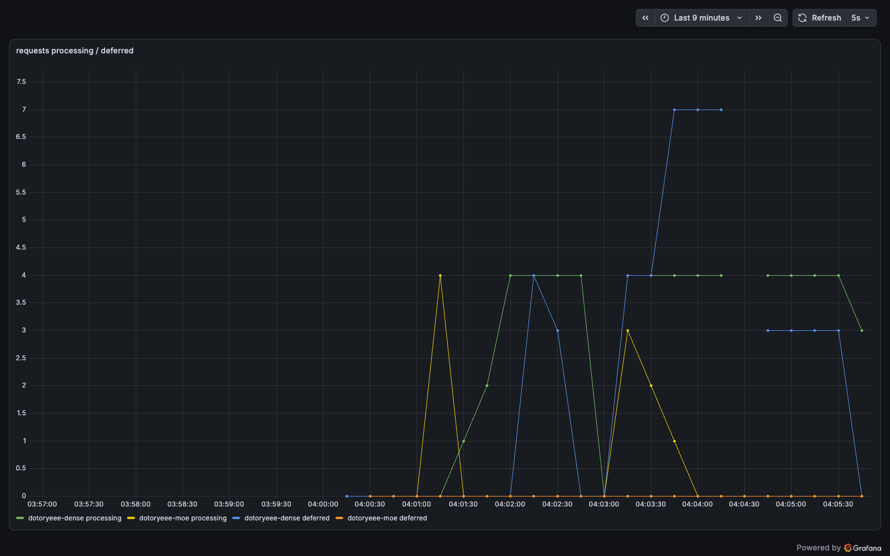

같은 부하인데 대기 줄이 생긴 쪽은 Dense뿐이다. MoE는 요청을 받는 족족 처리해 deferred가 0에서 움직이지 않았다. 다만 대기 줄의 최고값 7은 슬롯 4개에 동시 8요청이면 4가 남는다는 계산보다 크다. 패널 시간창에 부하 단계가 바뀌는 구간이 함께 들어와 있어 어느 시점 값인지까지는 가려내지 못했다.

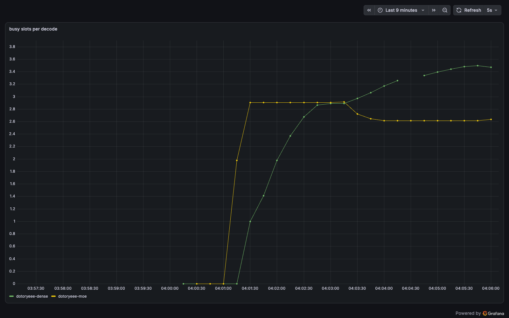

한 번 decode할 때 몇 개의 슬롯이 함께 묶였는지도 갈린다. Dense 쪽이 높은 것은 요청이 오래 물려 있어 같은 스텝에 겹칠 확률이 높기 때문이다.

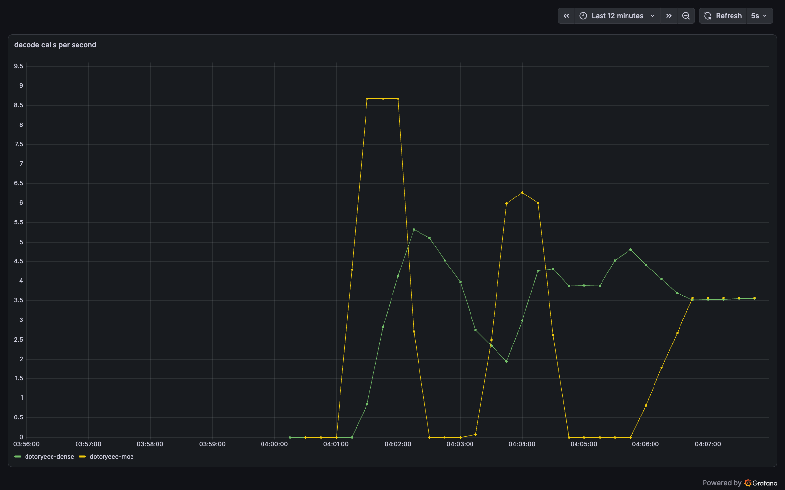

decode 호출 빈도는 MoE 쪽 봉우리가 더 높고 빨리 내려온다. 같은 96토큰을 더 빨리 끝내고 다음 요청을 기다리는 상태로 돌아가기 때문이다.

## 관측 스택

---

Prometheus가 두 서버를 제대로 잡았는지부터 확인한다.

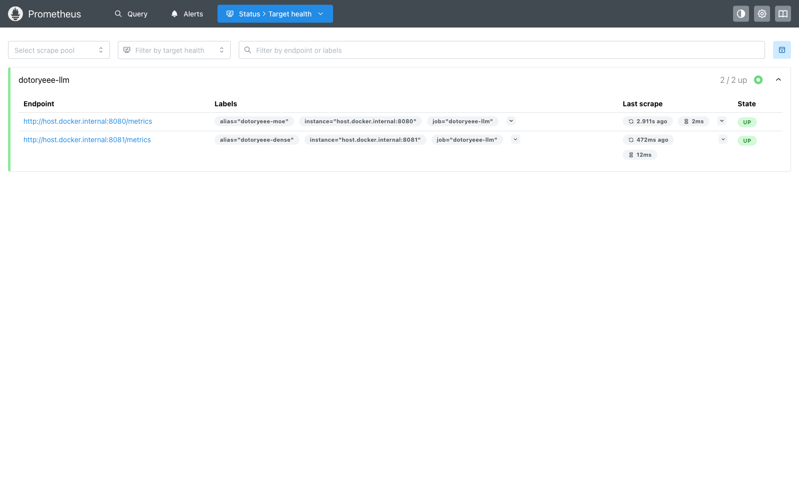

Prometheus 쿼리 화면에서 predicted_tokens_seconds를 직접 그려도 두 서버의 간격이 그대로 나온다.

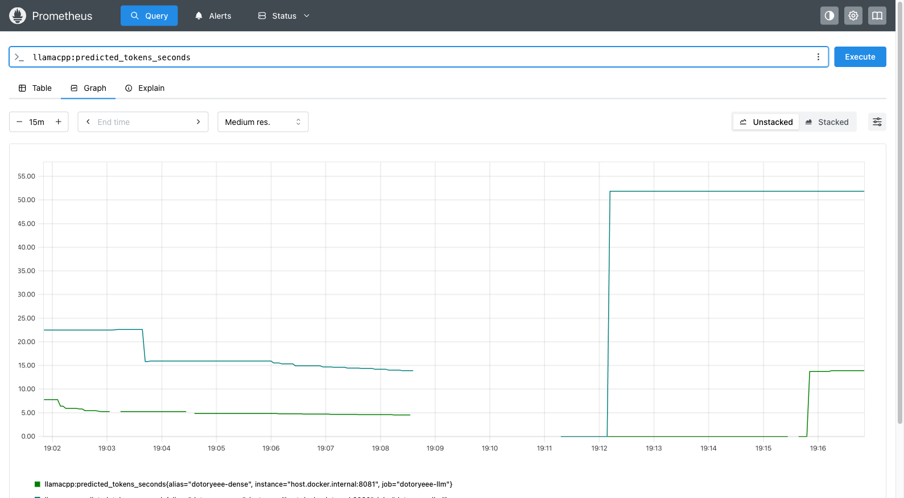

llama-server의 /metrics는 llamacpp: 접두를 단 지표를 내놓는다. 이 빌드에서 실제로 나온 것은 다음과 같다.

```s
curl -s localhost:8080/metrics | grep '^llamacpp:'
llamacpp:prompt_tokens_total 16135
llamacpp:prompt_seconds_total 22.482
llamacpp:tokens_predicted_total 1
llamacpp:tokens_predicted_seconds_total 0
llamacpp:n_decode_total 10
llamacpp:n_tokens_max 16135
llamacpp:prompt_tokens_seconds 717.685
llamacpp:predicted_tokens_seconds inf
llamacpp:requests_processing 0
llamacpp:requests_deferred 0
llamacpp:n_busy_slots_per_decode 1
```

predicted_tokens_seconds가 inf로 찍힌 것은 이 시점에 생성한 토큰이 1개뿐이라 분모가 0이기 때문이다. 부하가 들어오면 정상 값으로 돌아온다.

여기서 계획을 한 번 접었다. KV 사용률 패널을 넣으려 했는데 kv_cache_usage_ratio가 이 빌드에는 없다. 지표명은 빌드마다 갈리므로 패널을 설계하기 전에 /metrics 실출력을 먼저 봐야 한다. 대신 n_tokens_max로 관측된 최대 컨텍스트를 그리는 패널을 만들었다.

대시보드는 여섯 패널로 잡았다. 전부 alias 라벨로 범례를 갈라 두 모델이 같은 축에 겹쳐 보이게 했다.

|패널|쿼리|
|---|---|
|prefill throughput|llamacpp:prompt_tokens_seconds|
|decode throughput|llamacpp:predicted_tokens_seconds|
|requests processing / deferred|llamacpp:requests_processing, llamacpp:requests_deferred|
|busy slots per decode|llamacpp:n_busy_slots_per_decode|
|n_tokens_max|llamacpp:n_tokens_max|
|decode calls per second|rate(llamacpp:n_decode_total[1m])|

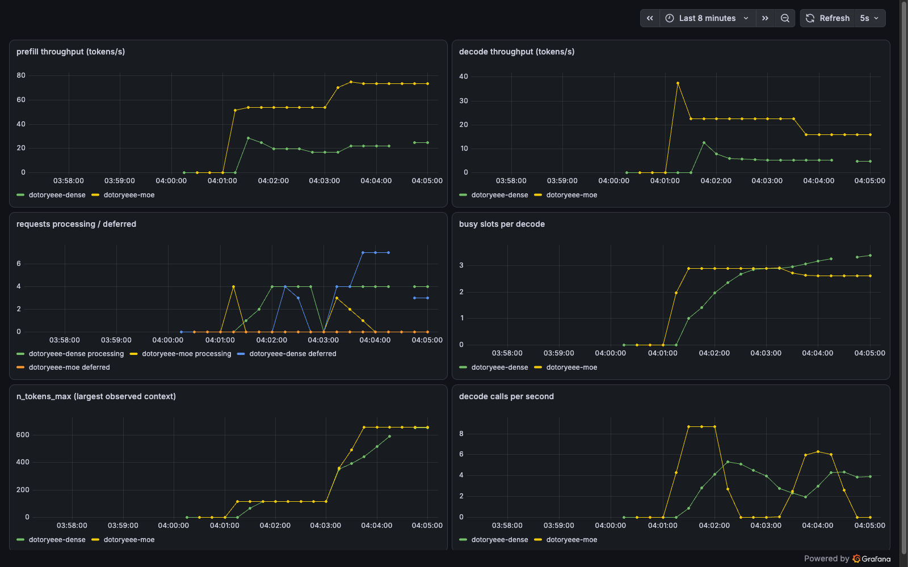

## 정리

---

```s
cd observability && docker compose down -v
```

- 파일 20.60 GiB 대 15.65 GiB, 파라미터 34.66B 대 26.90B로 MoE가 더 큰데 decode는 4.07배, prefill은 6.52배 빨랐다. 크기와 속도가 반대로 갔다
- 활성 파라미터 비 9배는 실측에서 4.07배로 줄었다. 어텐션과 Gated DeltaNet 몫, 스텝당 고정 비용은 라우팅으로 줄지 않는다
- KV cache는 계산식과 여섯 항목 모두 정확히 맞았다. 단 레이어 수 자리에는 KV를 가진 레이어만 넣어야 하고 이 모델은 그게 전체의 1/4이다
- 컨텍스트를 32768까지 깊게 하자 MoE decode가 20% 떨어졌다. Dense는 4096까지 거의 변화가 없었다
- Q6_K가 Q4_K_M보다 파일이 34% 큰데 decode는 조금 더 빨랐다. 파일 크기와 decode 속도는 단순 반비례가 아니다
- 동시 요청이 늘면 MoE 이득이 줄 것으로 봤는데 동시 8까지는 줄지 않았다. 예상이 맞지 않은 구간이다
- KV cache 로그는 -lv 4를 켜야 나오고, kv_cache_usage_ratio는 이 빌드에 없다. 관측 설계는 /metrics 실출력을 보고 시작하는 편이 빠르다
