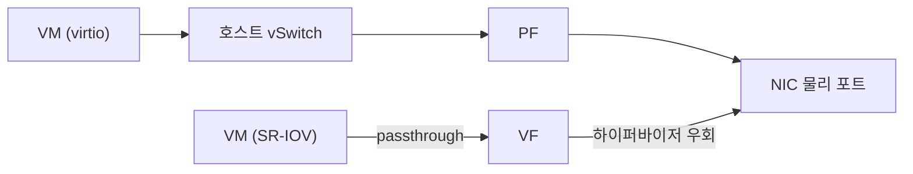

# NIC 가상화와 커널 바이패스 정리

<!-- more -->

## NIC 가상화란
NIC 가상화(NIC Virtualization)란 하나의 물리 NIC를 여러 VM·컨테이너가 각자의 네트워크 장치처럼 나눠 쓰게 만드는 기술

VM 밀도가 올라가면서 소프트웨어로 NIC를 흉내 내는 비용이 그대로 성능 병목이 되어 문제로 떠오름.

- 게스트가 장치 레지스터를 건드릴 때마다 VM exit로 하이퍼바이저에 제어가 넘어감 → 문맥 전환 비용 발생
- 패킷은 호스트의 소프트웨어 스위치(vSwitch)를 거쳐 전달됨 → 스위칭·복사에 호스트 CPU 소모
- I/O가 많을수록 exit 빈도와 스위칭 부하가 누적 → 게스트 처리량은 낮고 호스트 CPU만 바쁨
- 그래서 가상화 방식은 에뮬레이션에서 반가상화, 하드웨어 분할, 커널 바이패스로 진화

---

## 완전 에뮬레이션 (e1000류)
완전 에뮬레이션이란 Intel e1000 같은 실제 NIC의 레지스터와 동작을 하이퍼바이저가 소프트웨어로 그대로 흉내 내는 방식

- 게스트는 실제 NIC용 표준 드라이버를 그대로 사용 → 게스트 수정이 전혀 없음
- 게스트 드라이버가 e1000 레지스터를 MMIO로 접근 → KVM이 트랩해 VM exit → QEMU가 콜백으로 에뮬레이션
- QEMU가 게스트 메모리의 TX 링에서 패킷을 DMA 에뮬레이션으로 복사해 백엔드로 전송
- 레지스터 접근마다 trap-and-emulate가 반복 → 접근 빈도가 높으면 성능이 급격히 낮아짐
- 호환성은 최고지만 성능은 최하 → 레거시 게스트나 부팅 초기 장치로만 실효

---

## virtio (반가상화)
virtio란 게스트가 가상화 환경임을 전제로 설계된 반가상화(Paravirtualization) 표준 I/O 인터페이스로, 실제 하드웨어를 흉내 내지 않음

- 게스트에 virtio 프런트엔드 드라이버, 호스트에 백엔드 드라이버를 두고 둘이 공유 메모리로 통신
- 통신 통로는 virtqueue → 그 실체는 링 버퍼인 vring
- 프런트엔드가 요청을 vring에 넣고 백엔드에 알림(notify) → 실제 하드웨어 레지스터 접근을 대체해 exit 횟수를 줄임
- 실제 NIC 동작을 흉내 낼 필요가 없음 → 에뮬레이션 대비 경로가 짧고 CPU 비용이 낮음

### 두 가지 virtqueue

| 방식 | 구성 | 특징 |
|------|------|------|
| split virtqueue | 디스크립터 테이블 + available ring + used ring | 링이 방향별로 분리, 초기부터 쓰인 기본형 |
| packed virtqueue | 디스크립터 링 + driver/device event suppression | 링 하나로 통합, 캐시 지역성·경합 개선 목적의 후속형 |

---

## vhost (-net / -user)
vhost란 virtio 백엔드(데이터플레인)를 QEMU 프로세스 밖으로 빼내 별도 실행 주체가 처리하게 하는 가속 방식

- 순수 virtio는 백엔드가 QEMU 안에 있음 → 패킷마다 QEMU 유저 프로세스를 거쳐 느림
- vhost-net은 백엔드를 호스트 커널로 이동 → 커널의 vhost 워커 스레드가 vring을 처리해 호스트 네트워크 스택으로 전달
- vhost-user는 백엔드를 QEMU 옆 별도 유저 프로세스로 이동 → 제어 메시지는 UNIX 도메인 소켓, vring 접근은 공유 메모리
- vhost-user 백엔드로 DPDK PMD, OVS-DPDK, SPDK 등을 붙임 → 유저 공간 고속 스위칭과 결합
- 게스트는 그대로 virtio 프런트엔드만 봄 → 백엔드만 교체해 성능을 끌어올리는 구조

---

## SR-IOV
SR-IOV(Single Root I/O Virtualization)란 PCIe 장치 하나를 여러 독립 함수로 하드웨어 수준에서 분할해 VM·컨테이너에 직접 할당하는 PCI-SIG 표준

- PF(Physical Function)는 완전한 SR-IOV 설정 능력을 갖춘 관리용 함수 → 하이퍼바이저가 제어
- VF(Virtual Function)는 자기 BDF 주소를 가진 경량 함수 → 게스트에 직접 패스스루(passthrough)
- VF가 게스트에 붙으면 트래픽이 호스트 소프트웨어 스위치를 건너뜀 → near-native 성능, 호스트 CPU 거의 무개입
- IOMMU(Intel VT-d·AMD-Vi)가 VF의 Requester ID로 DMA 주소를 변환·격리 → VM이 남의 메모리를 건드리지 못하게 보호

### VF 개수: 규격상 한계 vs 실제 NIC

- SR-IOV 확장 능력의 TotalVFs는 16비트 읽기 전용 필드 → 규격상 PF당 최대 65535개까지 표현 가능
- NumVFs는 16비트 읽기/쓰기 필드 → 소프트웨어가 이 값을 써서 VF를 실제로 생성·해제
- 규격 한계와 실제 지원 개수는 별개 → 실제 상한은 NIC 하드웨어 구현이 결정

| NIC | 실제 VF 상한 | 비고 |
|------|-------------|------|
| Intel 82599 (ixgbe) | 포트당 63개 | 포트당 큐 128개를 VF들이 나눠 씀 |
| Intel X710/XL710 (i40e) | 장치당 128개 | 디바이스 전역 기준 |
| NVIDIA ConnectX (mlx5) | 포트당 최대 127개 | 펌웨어 NUM_OF_VFS로 개수 설정, InfiniBand·RoCE 겸용 RDMA 계열 |

- AWS Enhanced Networking도 SR-IOV 기반 → 구형 C3·C4·D2·I2·M4(m4.16xlarge 제외)·R3 계열이 Intel 82599 VF 인터페이스를 그대로 사용
- 규격상 6만 5천 개를 실제 NIC 상한으로 착각하면 안 됨 → 도입 전 해당 NIC 데이터시트로 확인 필요
- ENA·EFA로 이어지는 현행 AWS 스택은 [AWS 고성능 네트워킹 정리](ena_efa.md)에서 다룸

---

## DPDK
DPDK(Data Plane Development Kit)란 커널 네트워크 스택을 건너뛰고 유저 공간에서 NIC를 폴링으로 직접 다루는 패킷 처리 프레임워크

- PMD(Poll Mode Driver)는 유저 공간 NIC 드라이버 → 인터럽트 대신 RX/TX 디스크립터를 직접 폴링(링크 상태만 예외)
- 패킷이 유저 공간에 매핑된 NIC DMA 버퍼에 도착 → PMD가 RX 디스크립터의 완료 표시를 확인해 그 자리에서 처리
- 커널 스택·인터럽트·문맥 전환을 통째로 우회 → 지연이 낮고 PPS가 높음
- 폴링 스레드가 유휴 상태에도 코어를 100% 점유 → 코어를 통째로 내주는 트레이드오프
- 큐를 코어별로 핀 고정 → 코어마다 자기 큐만 처리해 락 경합 제거
- 보통은 NIC를 커널에서 떼어 VFIO 같은 유저 공간 드라이버에 바인딩 → NVIDIA ConnectX의 mlx5 PMD는 예외로, 커널 드라이버를 유지한 채 일부 플로만 유저 공간으로 보내는 bifurcated 모델

!!! notice
    커널 바이패스는 DPDK만의 개념이 아님. RDMA(InfiniBand·RoCEv2)도 유저 공간이 커널을 건너 NIC 큐에 직접 명령을 올리는 커널 바이패스 계열이고, DPDK가 패킷을 유저 공간으로 폴링해 처리한다면 RDMA는 전송 자체를 NIC 하드웨어에 위임하는 점이 다름. InfiniBand·RoCEv2의 무손실·패브릭 원리는 [InfiniBand vs RoCEv2 차이점 정리](gpu_04.md)에서 다룸.

---

## SmartNIC / DPU
SmartNIC/DPU(Data Processing Unit)란 NIC에 프로그래머블 CPU와 가속기를 얹어, 호스트가 하던 인프라 작업을 NIC에서 처리하는 장치

- NVIDIA BlueField 계열은 Arm 코어 + ConnectX + 네트워킹·스토리지·보안 가속기를 한 장치에 통합
- 소프트웨어 정의 네트워킹·스토리지·보안(방화벽·DPI 등)을 호스트 CPU에서 DPU로 오프로드
- 인프라 스택이 테넌트 애플리케이션과 분리돼 별도 CPU에서 동작 → "서버 안의 서버"로 격리
- 오프로드한 만큼 호스트 코어를 테넌트 워크로드에 되돌려줌 → 클라우드 사업자의 코어 회수 동기
- BlueField-3는 400Gb/s 처리에 Arm A78 코어 16개 탑재

---

## 방식 비교

| 방식 | 데이터 경로 | 성능 | 라이브 마이그레이션 | CPU 비용 | 주 사용처 |
|------|-------------|------|---------------------|----------|-----------|
| 완전 에뮬레이션(e1000) | 게스트 → VM exit → QEMU 에뮬레이션 → 백엔드 | 최하 | 가능 | 높음(접근마다 exit) | 레거시 게스트·호환성 |
| virtio | 프런트/백엔드가 vring 공유 메모리로 통신 | 중간 | 가능 | 에뮬레이션보다 낮음 | 범용 VM 기본값 |
| virtio + vhost | 백엔드가 호스트 커널 또는 별도 유저 프로세스 | 높음 | 가능 | 중간 | 처리량 필요한 VM, OVS-DPDK |
| SR-IOV | VF를 게스트에 직접 패스스루, vSwitch 우회 | 매우 높음 | 제약 큼 | 호스트 소모 거의 없음 | 저지연·고PPS |
| DPDK | 유저 공간 PMD가 NIC 큐를 폴링 | 매우 높음 | 앱 재작성 필요 | 폴링 코어 100% | NFV·데이터플레인 |
| SmartNIC/DPU | 인프라 데이터플레인을 NIC의 Arm SoC로 오프로드 | 매우 높음 | 구성에 따름 | 호스트 오프로드 | 클라우드 인프라 오프로드 |

---

## 쿠버네티스 연계
파드에 VF를 직접 붙여 저지연 네트워킹을 주는 구성은 세 컴포넌트의 협업으로 동작

| 컴포넌트 | 역할 |
|----------|------|
| SR-IOV Network Device Plugin | 노드의 VF를 발견해 스케줄러에 할당 가능한 리소스로 광고 |
| Multus CNI | 파드에 기본 인터페이스 외 추가 인터페이스를 붙이는 메타 플러그인 |
| SR-IOV CNI | 할당된 VF를 파드 네트워크 네임스페이스에 실제로 연결 |

- 파드가 VF 리소스를 요청 → 디바이스 플러그인이 광고한 VF가 있는 노드로 스케줄
- Multus가 할당된 VF의 deviceID(PCI 주소)를 읽어 SR-IOV CNI를 호출 → CNI가 그 VF를 파드 네임스페이스로 이동
- 추가 네트워크는 NetworkAttachmentDefinition CRD로 선언(NPWG 표준) → 파드는 고속 VF 인터페이스를 기본 파드 네트워크와 별도로 획득

---

## 함정

- SR-IOV VF는 하이퍼바이저 스위치를 건너뜀 → vSwitch에 걸던 보안그룹·ACL·미러링 같은 소프트웨어 정책이 VF 트래픽엔 적용되지 않음
- 같은 이유로 라이브 마이그레이션과 상충 → VF가 특정 물리 NIC에 종속돼 이주 대상 호스트로 장치·상태를 그대로 옮길 수 없음
- 완화책은 이주 직전 VF를 분리하고 virtio로 폴백하는 bond 구성 → 속도와 이동성 중 하나를 포기하는 절충
- "virtio는 느리다"는 오해 → 백엔드가 QEMU에 있던 초기 얘기이고, vhost-net·vhost-user와 오프로드 조합으로 상당히 빨라짐
- DPDK의 성능은 공짜가 아님 → 폴링 코어가 유휴에도 100%를 먹으므로 처리량과 코어 점유를 저울질해야 함

---

## 결론

- 가상화 NIC은 에뮬레이션 → virtio → vhost → SR-IOV → DPDK/DPU로, exit·복사·스위칭 비용을 줄이는 방향으로 진화
- 축은 두 갈래 → 소프트웨어 경로를 빠르게(virtio+vhost)냐, 소프트웨어 경로를 아예 건너뛰냐(SR-IOV·DPDK·DPU)
- 빠를수록 유연성을 내줌 → virtio 계열은 "이동성", SR-IOV·DPDK 계열은 "성능"
</content>
</invoke>
