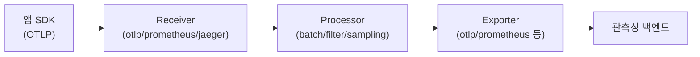

# OpenTelemetry 정리

<!-- more -->

## OpenTelemetry란
OpenTelemetry(OTel)란 언어·인프라·런타임에 종속되지 않고 텔레메트리(trace·metric·log)를 생성·수집·전송하는 방식을 표준화한 관측성(Observability) 프레임워크

- 성격: 계측 API와 SDK, 그리고 수집·전달용 Collector를 묶은 벤더 중립 규격
- 목표: 코드를 한 번 계측해 두면 백엔드를 바꿔도 계측을 다시 쓰지 않는 구조
- 소속: CNCF 프로젝트이며 2026년 Graduated 단계로 승격
- 범위 밖: OTel 자체는 저장·시각화 백엔드가 아님 → 저장·대시보드는 별도 도구 몫

### 등장 배경
- 통합 이전: 분산 추적 표준이 OpenTracing(CNCF)과 OpenCensus(Google)로 갈라져 경쟁
- 통합: 단일 표준을 만들기 위해 두 프로젝트를 2019년 5월에 병합해 OpenTelemetry로 출범
- 정리: OpenTracing은 2022년 1월, OpenCensus는 2023년 7월에 각각 아카이브
- 계승: OpenTracing은 API 추상화, OpenCensus는 SDK·수집기 계보를 각각 물려줌
- 결과: 추적 중심이던 두 전신을 흡수해 trace·metric·log를 한 규격으로 통합

---

## 신호 3종 정리
신호(Signal)란 OTel이 수집하는 텔레메트리의 종류이며, 세 신호 모두 컨텍스트 전파(Context Propagation) 위에서 서로 상관됨

| 신호 | 대상 | 설명 |
|------|------|------|
| Trace | 요청 경로 | 요청이 서비스들을 거치는 전체 경로를 span 트리로 표현 |
| Metric | 수치 측정값 | 런타임에 집계되는 카운터·게이지·히스토그램 |
| Log | 이벤트 기록 | 특정 시점의 이벤트 레코드, trace 컨텍스트와 상관 가능 |

- span: trace를 이루는 최소 작업 단위, 시작·종료 시각과 속성·이벤트를 담음
- span kind: server·client·producer·consumer·internal로 호출 관계의 방향을 구분
- 상관 키: 각 신호가 같은 trace_id·span_id를 공유해야 교차 조회가 성립
- 참고: 프로파일(Profile)을 네 번째 신호로 추가하는 표준화가 진행 중, 현재 Alpha 단계

metric은 계측기(instrument) 종류에 따라 집계 방식이 갈림

| 계측기 | 성격 | 예시 |
|--------|------|------|
| Counter | 단조 증가값 | 누적 요청 수·처리 바이트 |
| UpDownCounter | 증감하는 값 | 큐 길이·활성 커넥션 수 |
| Gauge | 순간 관측값 | CPU 온도·메모리 사용량 |
| Histogram | 분포 집계 | 요청 지연 분포·응답 크기 분포 |

### 컨텍스트와 Baggage
- 컨텍스트(Context): 송·수신 실행 단위가 신호를 서로 상관시키도록 들고 다니는 객체
- 전파(Propagation): 프로세스 경계를 넘겨 컨텍스트를 넘기는 동작, W3C Trace Context의 traceparent 헤더가 표준
- Baggage: 컨텍스트에 얹어 서비스 간 전달하는 key-value 저장소
- 활용: Baggage 값을 하위 서비스의 trace·metric·log 속성으로 재사용 가능
- 주의: 공식 문서는 Baggage도 신호로 분류하나, 실체는 저장되는 텔레메트리가 아니라 신호에 덧붙는 전파용 컨텍스트

---

## 구성요소
OTel은 계측 인터페이스(API), 참조 구현(SDK), 수집·전달 프록시(Collector), 전송 규격(OTLP)으로 나뉨

| 구성요소 | 역할 |
|----------|------|
| API | 계측 코드가 호출하는 벤더 중립 인터페이스, 신호 생성 지점 정의 |
| SDK | API의 언어별 참조 구현체, 처리·샘플링·export 설정을 담당 |
| Collector | 텔레메트리를 receive·process·export 하는 벤더 중립 프록시 |
| OTLP | 소스·Collector·백엔드 사이의 텔레메트리 전송 프로토콜 |
| Semantic Conventions | 속성 이름·의미를 통일한 벤더 중립 표준 규약 |

- API/SDK 분리: 라이브러리는 API에만 의존 → SDK 미설치 시 계측은 no-op으로 동작
- OTLP 전송: gRPC(기본 포트 4317)와 HTTP(기본 포트 4318) 두 방식 제공
- Collector 선택: SDK가 백엔드로 직접 export 가능하나, 중앙 처리·완충을 위해 Collector 경유가 일반적

### 시맨틱 컨벤션
- 목적: http.request.method·db.system.name 같은 속성 키를 표준화해 백엔드 간 해석을 통일
- 효과: 계측·수집·질의가 같은 이름을 공유 → 벤더를 바꿔도 대시보드·알림 재사용
- 범위: HTTP·DB·메시징·클라우드 리소스 등 도메인별 규약을 사양으로 정의
- 위치: 자동 계측이 채워 넣는 기본 속성 다수가 이 규약을 따름

### Collector 파이프라인

- receiver: OTLP·Prometheus·Jaeger 등 여러 포맷으로 텔레메트리 수신
- processor: 배치·필터·속성 편집·tail 샘플링 등 데이터 가공을 순차 적용
- exporter: 가공된 데이터를 하나 이상의 백엔드로 전달
- connector: 한 파이프라인의 exporter이자 다른 파이프라인의 receiver로 연결
- extension: 헬스체크·pprof처럼 파이프라인 밖에서 Collector를 보조
- pipeline: trace·metric·log별로 receiver→processor→exporter 체인을 따로 구성
- 이점: 여러 에이전트를 각각 운영할 필요 없이 수집·가공을 한 곳에 위임

---

## 계측 방식 비교
계측은 코드에 직접 API를 호출하는 수동 방식과, 에이전트가 런타임에 주입하는 자동 방식으로 갈림

| 비교 항목 | 수동 계측(Code-based) | 자동 계측(Zero-code) |
|-----------|----------------------|---------------------|
| 방식 | API·SDK를 코드에서 직접 호출 | 에이전트가 런타임에 계측 주입 |
| 코드 변경 | 필요 | 불필요 |
| 메커니즘 | 도메인 로직에 span 직접 생성 | 바이트코드 조작·몽키패칭·eBPF |
| 계측 범위 | 임의 커스텀 로직까지 세밀 | 라이브러리·프레임워크 경계 위주 |
| 대표 형태 | 언어별 SDK 호출 | Java agent JAR, Python agent |

- 자동 계측의 실체: HTTP 요청·DB 호출·메시지 큐 호출처럼 라이브러리 경계를 자동 계측
- 쿠버네티스 주입: OpenTelemetry Operator로 .NET·Java·Node.js·Python·Go에 자동 계측 주입 가능
- 언어 편차: 자동 계측 방식이 언어별로 달라 바이트코드 조작·몽키패칭·eBPF로 갈림
- 한계: 커스텀 비즈니스 구간은 자동 계측이 못 잡음 → 그 구간은 수동 span이 필요
- 병행 사용: 자동 계측으로 밑그림을 깔고, 도메인 구간만 수동 계측으로 보강하는 조합이 흔함

---

## 샘플링
샘플링(Sampling)이란 모든 trace를 저장하지 않고 일부만 남겨 저장·전송 비용을 줄이는 기법이며, 결정 시점에 따라 head와 tail로 갈림

| 비교 항목 | Head 샘플링 | Tail 샘플링 |
|-----------|-------------|-------------|
| 결정 시점 | trace 시작 시점 | trace 완료 후 |
| 결정 위치 | SDK | Collector(tail_sampling processor) |
| 판단 기준 | 확률 기반 | 에러·지연 등 완성된 trace 조건 |
| 자원 효율 | 미샘플분은 기록·전송 안 함 → 효율적 | 완료까지 span 버퍼링 필요 → 비용↑ |
| 한계 | 에러 trace를 확률적으로 놓칠 수 있음 | 메모리·처리 오버헤드가 큼 |

- head 장점: 버려질 trace를 아예 기록하지 않아 애플리케이션 자원 소모가 적음
- tail 장점: 에러 포함·임계값 초과 지연처럼 완성된 trace 조건으로 선별 가능
- 트레이드오프: 정밀한 선별을 얻으려면 tail의 버퍼링 비용을 감수 → 게이트웨이 Collector에 배치가 일반적

### 샘플링 일관성
- 부분 샘플링 위험: 한 trace의 일부 span만 남으면 경로가 끊겨 조회 불가
- ParentBased: 부모 span의 샘플링 결정을 자식이 승계 → trace 단위 일관성 유지
- 조합 배치: head로 대량을 1차 걸러 부하를 줄이고, tail로 중요한 trace를 재선별
- 위치 원칙: tail 샘플링은 한 trace의 모든 span이 같은 Collector로 모여야 성립

---

## 백엔드 생태계
OTel은 백엔드가 아니므로 export 대상은 자유이며, 오픈소스와 상용(SaaS)으로 경계가 나뉨

| 백엔드 | 영역 | 구분 |
|--------|------|------|
| Jaeger | Trace | 오픈소스(CNCF) |
| Grafana Tempo | Trace | 오픈소스 |
| Prometheus | Metric | 오픈소스(CNCF) |
| Grafana Loki | Log | 오픈소스 |
| Grafana | 시각화 | 오픈소스 |
| Datadog·New Relic·Honeycomb·Grafana Cloud | 통합 관측 | 상용(SaaS) |

- 신호별 분업: trace는 Jaeger·Tempo, metric은 Prometheus, log는 Loki가 대표
- 시각화: Grafana가 여러 백엔드를 데이터소스로 묶어 대시보드를 구성
- 교체 자유: 계측이 OTLP로 통일돼 있어 백엔드를 바꿔도 계측 코드는 그대로 재사용
- 수신 방식: Prometheus는 scrape(pull)가 기본, OTLP 백엔드는 push로 데이터를 받음
- 참고: Prometheus도 --web.enable-otlp-receiver 활성화 시 OTLP push 수신 가능
- 자체 구축: 오픈소스만으로 trace·metric·log·시각화를 조합해 무료 스택 구성 가능
- 상용 경계: 상용 벤더는 저장·질의·알림·상관을 SaaS로 묶어 제공, 다수가 OTLP 수신을 지원

---

## Collector 배포 패턴
Collector는 앱 가까이 붙는 에이전트형과, 독립 서비스로 모으는 게이트웨이형으로 나뉨

| 패턴 | 형태 | 용도 |
|------|------|------|
| Agent(sidecar) | 앱 파드에 사이드카 컨테이너로 동거 | 앱별 근접 수집·초기 가공 |
| Agent(DaemonSet) | 노드마다 한 개씩 상주 | 노드·파드 텔레메트리를 노드 단위 수집 |
| Gateway | 독립 서비스(Deployment)로 상주 | 중앙 집중 필터·샘플링·export |
| Agent-to-Gateway | 위 둘의 조합 | 에이전트가 수집 → 게이트웨이가 집계·처리 |

- 에이전트형: 앱·호스트에 붙어 낮은 지연으로 로컬 수집, 사이드카나 DaemonSet으로 배치
- 게이트웨이형: 여러 소스가 하나의 OTLP 엔드포인트로 보내면 표준 서비스가 중앙 처리
- 조합형: 노드 에이전트가 1차 수집하고 게이트웨이가 tail 샘플링·백엔드 export를 전담
- 선택 기준: 노드 텔레메트리는 DaemonSet, 중앙 정책·샘플링은 Gateway로 역할 분담
- 복원력: exporter의 재시도·큐로 백엔드 일시 장애 시 데이터 유실을 완화
- 부하 분산: 에이전트→게이트웨이 경로에 로드밸런싱을 두어 게이트웨이 수평 확장

---

## 결론
- OpenTelemetry는 계측을 한 번만 해두면 백엔드를 갈아 끼워도 재작성이 없는 벤더 중립 관측성 규격
- 핵심 신호는 trace·metric·log 3종이며, 컨텍스트 전파와 Baggage가 세 신호를 하나의 요청으로 묶음
- 구성은 API(인터페이스)·SDK(구현)·Collector(수집 프록시)·OTLP(전송)로 나뉨
- 계측은 코드 직접 호출(수동)과 에이전트 주입(자동)으로, 백엔드는 오픈소스와 상용 SaaS로 갈림
- Head 샘플링은 "시작할 때 버림", Tail 샘플링은 "끝나고 고름"으로 이해하면 됌
