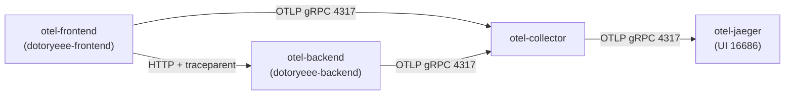
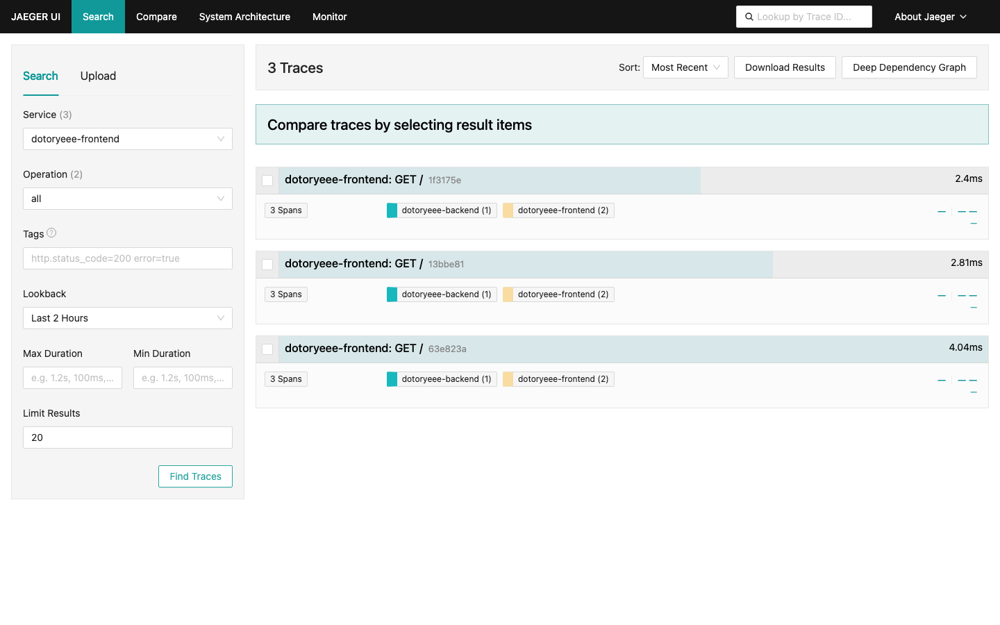
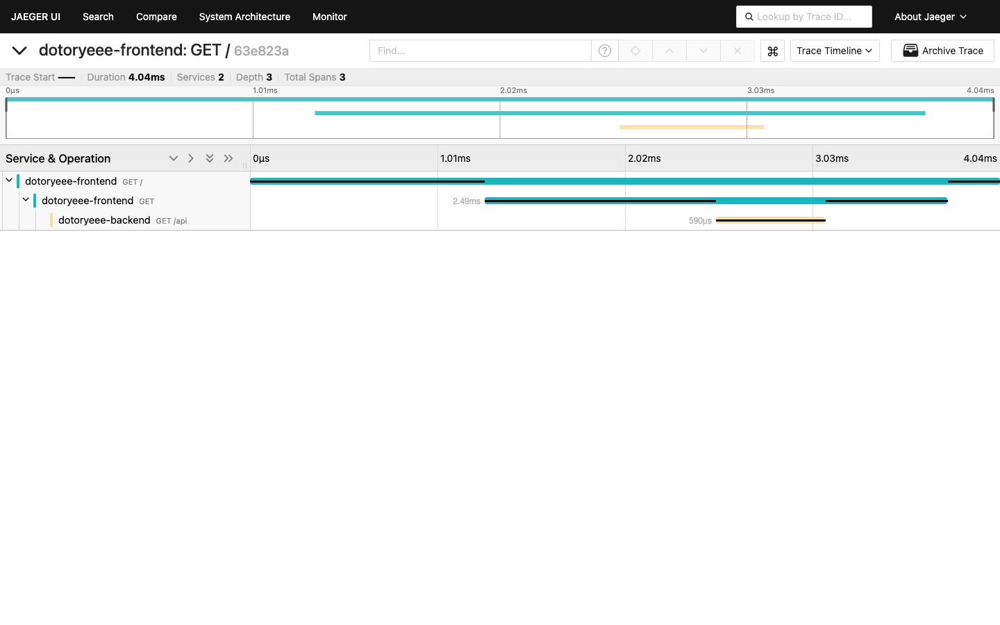

# OpenTelemetry Collector로 분산 트레이싱 실습

<!-- more -->

## 목표

---

- Collector 파이프라인을 로컬에 세우고, 서로 호출하는 두 서비스의 요청 하나가 어떻게 분산 트레이스로 이어지는지 실측한다
- 애플리케이션 코드를 고치지 않는 zero-code 계측으로 파이썬 서비스 두 개를 띄우고, Collector의 debug exporter 로그에서 span 수신을 눈으로 확인한다
- traceparent 헤더가 서비스 경계를 넘어 전달되는 증거를 앱 로그와 span의 부모 관계로 교차 검증한다

!!! tip
    💡 Collector와 Jaeger, 계측 대상 앱을 전부 docker compose로 로컬에서 돌려 클라우드 비용이 들지 않는다

계측 개념과 Collector 구성요소(receiver, processor, exporter), 신호 3종, 샘플링 방식은 OpenTelemetry 정리 글에서 다뤘다. 이 글은 그 위에서 파이프라인을 실제로 세우고, 한 요청이 두 서비스를 거쳐 하나의 trace로 묶이는지 확인하는 데 집중한다.

## 실습 구성

---

컨테이너 네 개를 한 compose 네트워크에 올린다. 앱은 Collector로 OTLP를 보내고, Collector는 받은 trace를 Jaeger로 넘긴다. 흐름은 다음과 같다.



- otel-frontend: 8000 포트에서 요청을 받아 otel-backend를 HTTP로 호출하는 파이썬 서비스
- otel-backend: 9000 포트에서 JSON을 돌려주는 파이썬 서비스
- otel-collector: OTLP를 4317(gRPC)·4318(HTTP)로 받아 가공한 뒤 Jaeger로 export
- otel-jaeger: Collector가 보낸 trace를 저장하고 16686 UI로 조회

이미지는 otel/opentelemetry-collector-contrib:0.109.0, jaegertracing/all-in-one:1.62.0, 앱은 python:3.12-slim에 Flask 3.0.3과 opentelemetry-distro 0.48b0로 고정한다.

## Collector 설정

---

먼저 Collector 설정 파일을 작성한다. otlp receiver를 4317과 4318에 열고, processor로 attributes와 batch를 순서대로 태운 뒤, exporter 두 개(Jaeger용 otlp와 콘솔 확인용 debug)로 내보낸다.

```s
vi otel-collector-config.yaml
```

```yaml title="otel-collector-config.yaml"
receivers:
  otlp:
    protocols:
      grpc:
        endpoint: 0.0.0.0:4317   #OTLP gRPC 수신
      http:
        endpoint: 0.0.0.0:4318   #OTLP HTTP 수신

processors:
  attributes/dotoryeee:          #모든 span에 공통 태그 주입
    actions:
      - key: dotoryeee.lab
        value: otel-collector-lab
        action: insert
  batch:
    timeout: 1s                  #1초 단위로 묶어 export

exporters:
  otlp/jaeger:
    endpoint: otel-jaeger:4317   #Jaeger가 4317에서 OTLP 수신
    tls:
      insecure: true
  debug:
    verbosity: detailed          #수신한 span을 콘솔에 그대로 출력

service:
  pipelines:
    traces:
      receivers: [otlp]
      processors: [attributes/dotoryeee, batch]
      exporters: [otlp/jaeger, debug]
```

- receiver를 0.0.0.0으로 바인딩해야 다른 컨테이너에서 접근할 수 있고, endpoint를 otel-jaeger로 적으면 compose 네트워크가 컨테이너 이름을 DNS로 풀어준다
- debug exporter는 백엔드로 보내는 것과 별개로 콘솔에 span을 찍어, 수신 여부를 로그만 보고 판단할 수 있게 해준다

Jaeger 1.35 이후 all-in-one은 COLLECTOR_OTLP_ENABLED로 4317·4318 OTLP 수신을 켤 수 있다. 이 실습은 Collector가 Jaeger로 다시 OTLP를 보내므로 이 값을 활성화한다.

## 계측 대상 앱

---

두 서비스는 평범한 Flask 앱이다. 계측 코드는 한 줄도 넣지 않는다. frontend는 backend를 requests로 호출하기만 한다.

```python title="frontend.py"
import os
import requests
from flask import Flask

app = Flask(__name__)
#backend 호출 대상 (compose 네트워크의 컨테이너 이름으로 접근)
BACKEND = os.environ.get("BACKEND_URL", "http://otel-backend:9000/api")


@app.route("/")
def index():
    #requests 자동 계측이 traceparent 헤더를 실어 backend로 전파
    r = requests.get(BACKEND, timeout=5)
    return {"service": "dotoryeee-frontend", "backend_response": r.json()}
```

backend는 받은 요청의 traceparent 헤더를 로그로 찍는다. 이 한 줄이 뒤에서 컨텍스트 전파를 육안으로 확인하는 근거가 된다.

```python title="backend.py"
from flask import Flask, request

app = Flask(__name__)


@app.route("/api")
def api():
    #frontend가 전파한 traceparent 헤더를 로그로 남긴다
    traceparent = request.headers.get("traceparent")
    print(f"[dotoryeee-backend] received traceparent={traceparent}", flush=True)
    return {"service": "dotoryeee-backend", "message": "hello from dotoryeee-backend"}
```

zero-code 계측의 핵심은 이미지 빌드 단계에 있다. opentelemetry-distro를 설치한 뒤 opentelemetry-bootstrap을 돌리면, 이미 깔린 라이브러리(Flask, requests)를 감지해 그에 맞는 자동 계측 패키지를 알아서 설치한다.

```dockerfile title="Dockerfile"
FROM python:3.12-slim
WORKDIR /app

#opentelemetry-bootstrap이 pkg_resources를 참조하므로 setuptools 포함
RUN pip install --no-cache-dir \
    setuptools==75.1.0 \
    flask==3.0.3 \
    requests==2.32.3 \
    opentelemetry-distro==0.48b0 \
    opentelemetry-exporter-otlp==1.27.0

#설치된 라이브러리에 맞는 자동 계측 패키지를 감지해 설치 -> 코드 수정 없이 계측
RUN opentelemetry-bootstrap -a install

COPY frontend.py backend.py /app/
```

!!! warning
    💡 python:3.12-slim은 setuptools를 빼고 배포하므로 opentelemetry-bootstrap 실행 전에 setuptools를 함께 설치한다

실행할 때는 flask 명령 앞에 opentelemetry-instrument를 붙인다. 이 래퍼가 프로세스를 감싸 계측을 주입하고, OTEL_로 시작하는 환경변수로 서비스 이름과 export 대상을 넘긴다.

## compose로 스택 기동

---

네 서비스를 한 파일로 묶는다. 앱 컨테이너는 같은 이미지를 쓰고 command와 OTEL_SERVICE_NAME만 다르게 준다. Jaeger UI에는 이 서비스 이름이 그대로 노출되므로 dotoryeee-frontend, dotoryeee-backend로 짓는다.

두 앱이 공유하는 OTEL export 설정은 YAML 앵커로 한 번만 적고 재사용한다.

```yaml title="docker-compose.yml"
x-otel-env: &otel_env          #두 앱이 공유하는 export 설정
  OTEL_EXPORTER_OTLP_ENDPOINT: http://otel-collector:4317
  OTEL_EXPORTER_OTLP_PROTOCOL: grpc
  OTEL_TRACES_EXPORTER: otlp
  OTEL_METRICS_EXPORTER: none  #이 실습은 trace만 다루므로 끔
  OTEL_LOGS_EXPORTER: none

services:
  otel-collector:
    image: otel/opentelemetry-collector-contrib:0.109.0
    container_name: otel-collector
    command: ["--config=/etc/otelcol/config.yaml"]
    volumes: ["./otel-collector-config.yaml:/etc/otelcol/config.yaml:ro"]
    ports: ["4317:4317", "4318:4318"]
    depends_on: [otel-jaeger]

  otel-jaeger:
    image: jaegertracing/all-in-one:1.62.0
    container_name: otel-jaeger
    environment: [COLLECTOR_OTLP_ENABLED=true]
    ports: ["16686:16686"]

  otel-backend:
    build: ./app
    image: otel-lab-app:local
    container_name: otel-backend
    command: opentelemetry-instrument flask --app backend run --host 0.0.0.0 --port 9000
    environment: { <<: *otel_env, OTEL_SERVICE_NAME: dotoryeee-backend }
    depends_on: [otel-collector]

  otel-frontend:
    image: otel-lab-app:local
    container_name: otel-frontend
    command: opentelemetry-instrument flask --app frontend run --host 0.0.0.0 --port 8000
    environment:
      <<: *otel_env
      OTEL_SERVICE_NAME: dotoryeee-frontend
      BACKEND_URL: http://otel-backend:9000/api
    ports: ["18000:8000"]
    depends_on: [otel-backend, otel-collector]
```

- 호스트 8000 포트가 이미 쓰이고 있어 frontend는 18000으로 매핑했다
- Collector와 Jaeger는 4317을 각자의 컨테이너 안에서 쓰므로 포트가 겹치지 않는다

이제 이미지를 빌드하고 올린다.

```s
docker compose up -d --build
```

네 컨테이너가 모두 Up인지 확인한다.

```s
docker compose ps --format 'table {{.Name}}\t{{.Status}}'
NAME             STATUS
otel-backend     Up 8 minutes
otel-collector   Up 8 minutes
otel-frontend    Up 7 minutes
otel-jaeger      Up 8 minutes
```

Collector 로그에서 receiver가 두 포트를 열고 파이프라인이 준비된 것을 확인한다.

```s
docker logs otel-collector 2>&1 | grep -E 'Starting|ready'
info  otlpreceiver@v0.109.0/otlp.go:103  Starting GRPC server  {"endpoint": "0.0.0.0:4317"}
info  otlpreceiver@v0.109.0/otlp.go:153  Starting HTTP server  {"endpoint": "0.0.0.0:4318"}
info  service@v0.109.0/service.go:239    Everything is ready. Begin running and processing data.
```

## span 수신 확인

---

frontend를 세 번 호출한다. 매 호출마다 frontend가 backend를 부르므로 요청당 span이 여러 개 생긴다.

```s
for i in 1 2 3; do curl -s http://localhost:18000/ ; echo; done
{"backend_response":{"message":"hello from dotoryeee-backend","service":"dotoryeee-backend"},"service":"dotoryeee-frontend"}
{"backend_response":{"message":"hello from dotoryeee-backend","service":"dotoryeee-backend"},"service":"dotoryeee-frontend"}
{"backend_response":{"message":"hello from dotoryeee-backend","service":"dotoryeee-backend"},"service":"dotoryeee-frontend"}
```

바로 Collector의 debug exporter 로그를 본다. batch가 1초 단위로 묶어 export한 span 수가 찍힌다. frontend와 backend가 각자 배치를 보내므로 여러 줄이 나오고, 아래는 그중 한 줄이다. 요청 한 번이 frontend 서버·클라이언트 span 2개와 backend 서버 span 1개, 합쳐 span 3개를 만든다.

```s
docker logs otel-collector 2>&1 | grep TracesExporter
info  TracesExporter  {"kind": "exporter", "name": "debug", "resource spans": 1, "spans": 3}
```

debug exporter는 span 하나하나를 detailed로 풀어 찍는다. frontend의 루트 span을 보면 service.name이 dotoryeee-frontend로 채워져 있고, HTTP 속성이 자동 계측으로 붙어 있다. 맨 아래 dotoryeee.lab은 Collector의 attributes processor가 주입한 태그다.

```s
docker logs otel-collector 2>&1 | grep -A18 'GET /'
Resource attributes:
     -> service.name: Str(dotoryeee-frontend)
InstrumentationScope opentelemetry.instrumentation.flask 0.48b0
Span #0
    Trace ID       : 63e823abe8c641b903b92301a1c0f75e
    Parent ID      :
    ID             : 49dc1a5e3533569b
    Name           : GET /
    Kind           : Server
Attributes:
     -> http.method: Str(GET)
     -> http.status_code: Int(200)
     -> dotoryeee.lab: Str(otel-collector-lab)
```

- service.name은 계측 코드가 아니라 OTEL_SERVICE_NAME 환경변수에서 온다
- http.method, http.status_code 같은 속성은 Flask 자동 계측이 시맨틱 컨벤션에 맞춰 채운다
- dotoryeee.lab은 앱이 아니라 Collector가 붙였다 → processor가 파이프라인 중간에서 span을 실제로 손대고 있다는 증거

## 분산 트레이스 확인

---

Jaeger UI 없이 HTTP API로 먼저 구조를 뜯어본다. 등록된 서비스를 조회하면 두 서비스가 잡힌다.

```s
curl -s http://localhost:16686/api/services
{"data":["dotoryeee-frontend","dotoryeee-backend"],"total":2,"limit":0,"offset":0,"errors":null}
```

frontend로 들어온 trace 목록을 뽑아 trace별 span 수와 참여 서비스를 정리한다. 세 번 호출한 만큼 trace 세 개가 잡히고, 각 trace가 두 서비스에 걸쳐 span 세 개로 구성된다.

```s
curl -s 'http://localhost:16686/api/traces?service=dotoryeee-frontend&limit=20&lookback=2h' \
 | jq -r '.data[] | "\(.traceID[0:8])  spans=\(.spans|length)  services=\([.processes[].serviceName]|sort|join(","))"'
13bbe81a  spans=3  services=dotoryeee-backend,dotoryeee-frontend
1f3175ed  spans=3  services=dotoryeee-backend,dotoryeee-frontend
63e823ab  spans=3  services=dotoryeee-backend,dotoryeee-frontend
```

trace 하나를 골라 span 트리를 시작 시각 순으로 펼친다. 요청 하나가 서버 span에서 시작해 클라이언트 span으로 내려가고, 그 아래에 backend의 서버 span이 붙는다.

```s
curl -s http://localhost:16686/api/traces/63e823abe8c641b903b92301a1c0f75e \
 | jq -r '.data[0] as $t | $t.spans | sort_by(.startTime)[]
          | "\($t.processes[.processID].serviceName)  \(.operationName)  [\(.tags[]|select(.key=="span.kind").value)]"'
dotoryeee-frontend  GET /     [server]
dotoryeee-frontend  GET       [client]
dotoryeee-backend   GET /api  [server]
```

- frontend GET /: 사용자 요청을 받은 루트 서버 span, 부모가 없다
- frontend GET: requests가 backend를 부르며 만든 클라이언트 span
- backend GET /api: 그 호출을 받은 backend의 서버 span

같은 구조를 Jaeger UI에서도 본다. 서비스로 dotoryeee-frontend를 고르면 trace 세 건이 뜨고, 각 행에 3 Spans와 dotoryeee-backend, dotoryeee-frontend가 함께 표시된다.



trace 하나를 열면 span 계층이 그대로 드러난다. dotoryeee-frontend의 GET / 아래 GET 클라이언트 span이, 다시 그 아래 dotoryeee-backend의 GET /api가 중첩되고, 상단 요약에 Services 2, Total Spans 3으로 잡힌다.



한 프로세스에서 시작한 요청이 다른 프로세스의 작업까지 하나의 trace로 묶였다. 이걸 가능하게 하는 게 다음 절의 컨텍스트 전파다.

## 컨텍스트 전파 확인

---

두 서비스는 같은 프로세스가 아니다. 그런데도 span이 한 trace로 묶인 건 frontend가 HTTP 요청에 trace 식별자를 실어 보냈기 때문이다. backend가 받은 헤더를 찍어둔 로그를 본다.

```s
docker logs otel-backend 2>&1 | grep traceparent
[dotoryeee-backend] received traceparent=00-63e823abe8c641b903b92301a1c0f75e-c469107a75aafbd5-01
[dotoryeee-backend] received traceparent=00-13bbe81a728607feaa595628779544f4-4f8ed67bfade8283-01
[dotoryeee-backend] received traceparent=00-1f3175edb00847e574c5160ca27821fc-364e753c19a20fd5-01
```

traceparent는 W3C Trace Context 표준 헤더이고, 00-{trace-id}-{parent-span-id}-01 형식이다. frontend가 backend를 부를 때 requests 자동 계측이 이 헤더를 심는다. 첫 줄을 앞선 debug 출력과 맞춰보면 관계가 정확히 들어맞는다.

|traceparent 조각|값|debug 출력에서의 정체|
|---|---|---|
|trace-id|63e823ab...f75e|frontend, backend span이 공유하는 trace ID|
|parent-span-id|c469107a75aafbd5|frontend의 GET 클라이언트 span ID|

즉 frontend가 보낸 traceparent의 parent-span-id는 backend 서버 span의 Parent ID가 된다. backend는 이 헤더를 읽어 새 span의 부모로 삼았고, 그래서 두 프로세스의 span이 한 나무에 붙었다. 헤더를 직접 만들거나 파싱하는 코드는 앱 어디에도 없다 → 전파도 자동 계측이 처리한다.

## processor로 span 가공

---

앞에서 debug 출력에 찍힌 dotoryeee.lab이 attributes processor의 결과다. 설정에서 이 processor를 파이프라인에 넣은 것만으로 모든 trace의 모든 span에 태그가 붙었다. 앱을 다시 배포할 필요가 없다는 게 Collector 가공의 장점이다.

에러나 느린 요청만 남기고 싶으면 tail 샘플링을 얹는다. tail_sampling은 trace가 끝날 때까지 span을 버퍼링한 뒤 조건으로 걸러내므로, 한 trace의 모든 span이 같은 Collector로 모여야 성립한다. 아래는 실행까지는 하지 않은 설정 예시다.

```yaml
#설정 예시 (본 실습에서는 미적용)
processors:
  tail_sampling:
    decision_wait: 10s          #trace 완성을 기다리는 시간
    policies:
      - name: errors            #에러가 포함된 trace는 무조건 보존
        type: status_code
        status_code: { status_codes: [ERROR] }
      - name: slow              #200ms 초과 지연 trace 보존
        type: latency
        latency: { threshold_ms: 200 }
```

## 정리

---

실습이 끝나면 컨테이너와 네트워크, 볼륨을 함께 내린다. 기존에 돌던 다른 컨테이너는 건드리지 않고 이 스택만 정리된다.

```s
docker compose down -v
```

- 코드 한 줄 안 고치고 Flask 두 서비스에 계측을 주입해 분산 trace를 만들었다 → zero-code 계측의 실체는 opentelemetry-instrument 래퍼와 bootstrap이 깐 자동 계측 패키지
- Collector는 받은 span을 debug로 눈에 보여주고, attributes processor로 가공한 뒤 Jaeger로 넘겼다 → 수집·가공·전달이 앱과 분리된 한 곳에 모인다
- 두 프로세스의 span이 한 trace로 묶인 근거는 traceparent 헤더 하나였다. 분산 트레이싱은 결국 "이 헤더를 빠짐없이 이어주는 것"으로 압축된다
