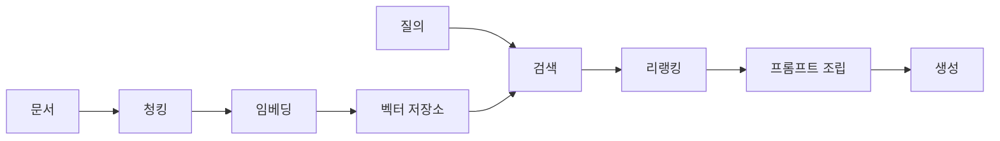

# RAG 정리

<!-- more -->

## RAG란
RAG(Retrieval-Augmented Generation)란 질문에 관련된 문서를 먼저 찾아 프롬프트에 붙여 넣고 그 근거로 답을 생성하는 구조

학습 시점 이후의 자료나 사내 문서는 가중치 안에 없어서, 답을 만들기 전에 밖에서 찾아 와야 함.

- 가중치는 그대로 두고 참조할 문서만 갈아 끼움 → 지식 갱신이 재학습 없이 색인 단계에서 끝남
- 답에 쓰인 문장이 어느 청크에서 왔는지 파이프라인에 남음 → 원문과 대조 가능
- 품질을 가르는 지점은 생성 모델이 아니라 검색 단계 → 틀린 문서가 올라오면 뒤에서 되돌릴 수단이 없음
- 검색된 문서가 프롬프트에 실리는 만큼 컨텍스트와 토큰 비용↑
- 말투나 출력 형식을 바꾸는 일은 이 구조로 안 됨 → 파인튜닝과의 선택 기준은 [LLM 파인튜닝 정리](gpu_08.md)에서 다룸

---

## 파이프라인 구성
색인 단계에서 문서를 잘라 벡터로 바꿔 저장하고, 질의 단계에서 그 저장소를 뒤져 답을 만드는 흐름

| 단계 | 하는 일 | 주요 선택지 |
|------|---------|-------------|
| 수집 | 원본을 텍스트로 변환 | 파서, OCR, 표·코드 처리 |
| 청킹 | 텍스트를 검색 단위로 자름 | 크기, 겹침, 경계 기준 |
| 임베딩 | 청크를 벡터로 변환 | 모델, 차원, 정규화 |
| 저장 | 벡터와 원문을 색인 | 인덱스 방식, 메타데이터 |
| 검색 | 질의와 가까운 청크를 찾음 | top-k, 필터, 하이브리드 |
| 리랭킹 | 후보 순서를 다시 매김 | cross-encoder 사용 여부 |
| 생성 | 근거를 붙여 답을 만듦 | 컨텍스트 배치, 출처 표기 |

- 청킹에서 정한 경계가 검색 단위를 고정함 → 검색 시점에 더 잘게 나눌 수 없음
- 임베딩 모델과 유사도 척도는 저장 단계에 박힘 → 바꾸면 저장소를 새로 만들어야 함
- 메타데이터 필터는 저장할 때 넣어둔 필드로만 걸림 → 나중에 필요해지면 재색인

---

## 청킹 전략
청킹(Chunking)이란 원본 문서를 검색과 프롬프트 삽입의 단위로 자르는 작업

| 방식 | 자르는 기준 | 장점 | 단점 |
|------|-------------|------|------|
| 고정 길이 | 토큰·문자 수 | 구현 단순, 크기 균일 | 문장·문단 중간에서 잘림 |
| 문장·문단 경계 | 구분자 | 의미 단위 보존 | 청크 크기 편차 큼 |
| 재귀 분할 | 구분자에 우선순위를 두고 단계적으로 | 경계 보존과 크기 제어를 절충 | 구분자 설계가 필요 |
| 문서 구조 기반 | 헤딩·목차 계층 | 맥락이 온전함 | 구조가 있는 문서에만 가능 |
| 의미 기반 | 인접 문장의 임베딩 유사도 | 주제 전환 지점에서 잘림 | 색인 비용↑ |

- 겹침(overlap)을 두면 경계에 걸친 문장의 손실이 줄어듦 → 대신 저장량과 중복 검색이 늘어남
- 표·코드 블록은 중간에서 자르면 의미가 깨짐 → 별도 처리 권장
- 적정 크기는 문서 성격이 정함 → 규정 문서와 대화 로그가 같은 값을 쓸 이유가 없음
- 청크마다 출처·제목 같은 메타데이터를 함께 저장 → 필터와 출처 표기에 쓰임

---

## 임베딩 모델 선택
임베딩(Embedding)이란 텍스트를 의미가 가까울수록 서로 가까운 벡터로 바꾸는 변환

| 기준 | 무엇을 보는가 |
|------|---------------|
| 언어 | 한국어 문서면 다국어 학습 범위 |
| 컨텍스트 길이 | 청크가 모델 입력 한도를 넘지 않는지 |
| 임베딩 차원 | 저장 용량·검색 속도와 표현력의 절충 |
| 질의·문서 비대칭 | 질의와 문서에 서로 다른 지시문·프리픽스를 요구하는지 |
| 실행 위치 | 로컬 실행 가능 여부, API 비용 |

- 차원이 크면 표현력↑, 대신 저장량과 검색 비용↑
- 일부 모델은 출력 차원을 잘라 쓸 수 있음 → Qwen3-Embedding-0.6B는 32~1024 범위에서 지정 가능
- 같은 모델이 100개 이상 언어와 32k 컨텍스트를 감당해 한국어 문서와 긴 청크를 함께 받음
- 질의 측에만 지시문(instruct)을 붙이는 것이 이 모델의 권장 사용법 → 생략하면 1~5% 하락한다고 공식 문서가 밝힘
- 로컬 임베딩은 문서량이 많을수록 API 대비 비용 이점이 커짐

---

## 유사도 척도
유사도 척도(Similarity Metric)란 두 벡터가 얼마나 가까운지를 하나의 숫자로 재는 기준

| 척도 | 재는 것 | 특징 |
|------|---------|------|
| cosine | 두 벡터가 이루는 각 | 크기 영향 없음, 값의 범위가 정해짐 |
| 내적(dot product) | 각과 크기를 함께 반영 | 크기가 큰 벡터가 유리, 상한 없음 |
| 유클리드 거리(L2) | 좌표 공간에서의 직선 거리 | 값이 작을수록 가까움 |

- 벡터를 단위 길이로 정규화하면 cosine과 내적이 같은 순위를 냄 → 정규화 여부가 두 척도의 차이를 만듦
- 정규화된 벡터에서는 L2 거리 순위도 cosine과 일치함
- 모델 카드가 전제한 척도와 색인 설정이 어긋나면 오류 없이 순위만 나빠짐
- 색인을 만들 때 정한 척도를 질의에서도 그대로 씀

---

## 벡터 검색 방식
근사 최근접 이웃(ANN, Approximate Nearest Neighbor)이란 정확한 최근접을 포기하는 대신 탐색 범위를 줄여 속도를 얻는 검색 방식

| 방식 | 동작 | 정확도 | 특징 |
|------|------|--------|------|
| Flat | 모든 벡터와 거리 계산 | 정확 | 데이터가 늘면 선형으로 느려짐 |
| IVF | 벡터를 군집으로 나누고 일부 군집만 탐색 | 근사 | 탐색 군집 수로 속도와 정확도 조절 |
| HNSW | 계층 그래프를 따라 가까운 이웃을 좁혀 감 | 근사 | 검색이 빠름, 색인 메모리 사용량이 큼 |

- Flat은 정확한 답을 주지만 규모가 커지면 감당이 안 됨 → 소규모나 정답 기준 비교용
- IVF는 탐색할 군집 수를 늘리면 정확도↑, 대신 지연↑
- HNSW는 벡터마다 이웃 링크를 들고 있어 링크를 늘릴수록 RAM↑
- 양자화를 걸면 메모리를 크게 줄일 수 있음 → Qdrant는 스칼라 4배, 바이너리 최대 32배, 프로덕트 최대 64배 압축을 내세움

---

## 하이브리드 검색
하이브리드 검색(Hybrid Search)이란 벡터 검색과 키워드 검색을 함께 돌려 두 결과를 하나의 순위로 합치는 방식

- 벡터 검색은 표현이 달라도 의미가 같으면 찾음 → 대신 고유명사·코드·희귀 식별자에 약함
- 키워드 검색(BM25 등)은 정확한 토큰 일치에 강함 → 대신 동의어·환언에 약함
- 두 점수는 스케일이 달라 그대로 더할 수 없음 → cosine은 범위가 정해져 있고 BM25는 상한 없이 질의마다 분포가 달라짐
- RRF(Reciprocal Rank Fusion)는 점수 대신 순위를 써서 합침 → 스케일 문제를 우회함
- DBSF(Distribution-Based Score Fusion)는 검색기별 점수 분포를 평균±3σ 구간으로 정규화한 뒤 합산
- Qdrant는 dense 벡터와 sparse 벡터를 한 저장소에서 다루고 두 융합 전략을 모두 제공

| 상황 | 권장 |
|------|------|
| 제품명·오류 코드·식별자 조회 | 키워드 검색 |
| 표현이 다른 같은 개념 조회 | 벡터 검색 |
| 사내 문서처럼 둘이 섞임 | 하이브리드 |

---

## 리랭킹
리랭킹(Reranking)이란 1단계 검색이 올린 후보를 더 정확한 모델로 다시 채점해 순서를 바꾸는 단계

- 1단계는 속도를 위해 질의와 문서를 각각 따로 벡터로 만들어 비교함(bi-encoder)
- 리랭커는 질의와 문서를 한 입력에 넣어 관련도를 직접 매김(cross-encoder) → 정확하지만 느림
- 1단계에서 후보를 넉넉히 뽑고 2단계에서 상위 몇 개만 다시 매기는 구성이 일반적
- 후보 수를 늘릴수록 놓치는 문서는 줄고 리랭킹 비용↑
- 리랭킹은 순서를 고칠 뿐 1단계가 못 찾은 문서를 만들어 내지는 못함
- 문서를 토큰 단위 벡터로 색인에 미리 담아 두고 질의 시점에 토큰끼리 대조하는 late interaction 계열도 있음 → Qdrant의 multivector가 이 용도

---

## 생성 단계
검색이 올린 청크를 프롬프트에 배치하고 답의 범위를 그 안으로 묶는 자리

- 청크를 넣는 순서와 형식이 답에 영향 → 문서 경계와 출처가 구분되게 표시
- 청크마다 문서 식별자를 함께 실으면 답에 인용을 붙이게 할 수 있음
- 검색 결과가 비었거나 점수가 낮으면 생성을 막고 못 찾았다고 답하게 두는 편이 안전
- 작은 청크로 검색하고 생성에는 앞뒤 청크를 붙여 넘기면 검색 정확도와 근거 분량을 함께 챙김
- 프롬프트에 실린 문서가 길수록 지연과 토큰 비용↑ → top-k를 키우기 전에 리랭킹을 먼저 검토

---

## 검색 품질 평가
검색이 올린 문서 목록을 정답 문서와 대조해 점수를 매기는 일

| 지표 | 재는 것 | 쓰는 자리 |
|------|---------|-----------|
| recall@k | 정답 문서가 상위 k개 안에 들어왔는지 | 1단계 후보 확보 점검 |
| precision@k | 상위 k개 중 정답 문서의 비율 | 컨텍스트 낭비 점검 |
| MRR(Mean Reciprocal Rank) | 첫 정답 순위의 역수를 질의 전체에 평균 | 상위 한두 개만 쓰는 구성 |
| nDCG | 순위 가중치를 둔 관련도 누적 | 리랭킹 효과 비교 |

- 질의와 정답 문서를 짝지어 고정해 둔 골든 질의셋이 평가의 출발점
- 질의셋은 실제 사용자 질문에서 뽑는 것이 권장 → 만들어낸 질문은 색인에 유리하게 기울기 쉬움
- 1단계는 recall을 먼저 보고, 리랭킹을 붙인 뒤에는 순위 지표로 봄
- 생성 결과만 보면 검색이 틀린 건지 프롬프트가 틀린 건지 갈라내지 못함 → 검색 지표를 따로 잼

---

## 함정
증상이 생성 쪽에서 나타나도 원인은 대개 색인·검색 설정에 있음

| 문제 | 증상 | 해결 방법 |
|------|------|-----------|
| 색인·질의 임베딩 모델 불일치 | 질의와 무관한 문서가 뽑힘 | 같은 모델로 통일, 교체 시 전체 재색인 |
| 유사도 척도 어긋남 | 정규화 안 된 벡터에서 순위가 뒤집힘 | 모델이 전제한 척도로 색인 설정을 맞춤 |
| 청크가 너무 큼 | 관련 문단이 잡음에 묻혀 점수가 낮게 나옴 | 청크를 줄이고 겹침 조정 |
| 청크가 너무 작음 | 검색은 맞는데 답에 쓸 근거가 모자람 | 인접 청크를 함께 전달 |
| top-k가 과함 | 답이 산만해지고 토큰 비용↑ | 리랭킹으로 상위만 남김 |
| 고유명사 검색 실패 | 코드·식별자를 그대로 넣어도 안 잡힘 | 하이브리드 검색 도입 |
| 근거 없는 답 | 검색 결과가 비어도 답이 생성됨 | 검색 실패 시 생성을 막음 |

---

## 결론

- 청킹·임베딩·척도·색인 설정이 함께 검색 품질을 정함 → 손잡이 하나만 돌려서는 잘 안 움직임
- 하이브리드와 리랭킹은 1단계가 후보를 올려준 뒤에야 효과가 남음
- 임베딩 모델 교체는 전체 재색인을 부름 → 파이프라인에서 가장 먼저 고정할 선택
- 검색 지표를 재는 장치부터 갖추고 청크 크기와 top-k를 건드릴 것
