# 로컬 모델로 RAG 파이프라인 구축하기

<!-- more -->

## 목표

---

- 이 블로그의 글 104편을 코퍼스로 삼아 청킹부터 색인·검색·리랭킹·생성까지 전부 로컬에서 도는 RAG 파이프라인을 세운다
- 같은 코퍼스를 300자, 800자, 2000자 세 벌로 잘라 색인하고 recall@k와 MRR이 어느 쪽으로 움직이는지 본다
- dense 단독 검색과 BM25를 섞은 하이브리드(RRF)를 같은 질의셋으로 대조한다
- dense가 올린 후보 20개를 리랭커로 다시 매겨 순위가 얼마나 바뀌는지, 못 바꾸는 경우는 언제인지 확인한다
- 같은 질문을 RAG 없이, 그리고 검색 결과를 붙여서 MoE와 Dense 두 모델에 각각 넣어 답이 어디서 갈리는지 본다

단계별 선택지와 검색 품질을 떨어뜨리는 함정은 [RAG 정리](rag.md)에서 표로 다뤘다. 이 글은 그 표에 적힌 주장 중 몇 개를 실제 숫자로 확인하고, 맞지 않은 것도 그대로 적는다.

## 실습 구성

---

Qdrant와 Open WebUI만 docker로 올리고 모델은 전부 네이티브 llama-server로 띄운다.

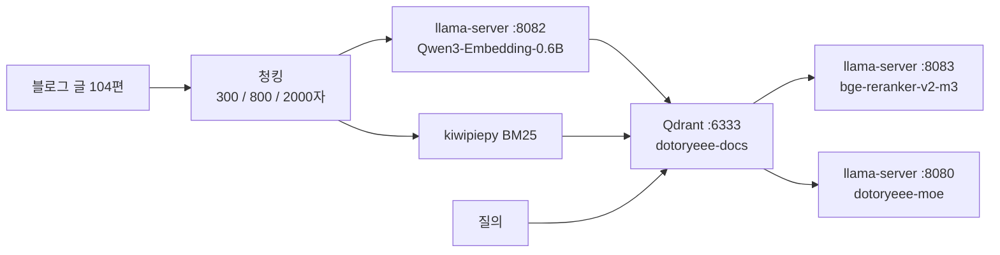

|항목|값|
|---|---|
|기기|Mac Studio, Apple M1 Max, 64GB 통합 메모리|
|Qdrant|1.18.3, docker 컨테이너 dotoryeee-qdrant|
|임베딩 모델|Qwen3-Embedding-0.6B-Q8_0.gguf|
|리랭커|gpustack/bge-reranker-v2-m3-GGUF Q8_0, 606MiB|
|생성 모델|Qwen3.6-35B-A3B-UD-Q4_K_M(22GB, alias dotoryeee-moe)<br>Qwen3.6-27B-Q4_K_M(16GB, alias dotoryeee-dense)|
|llama.cpp|version 10090 (7347430f4)|

!!! warning
    💡 모델 넷을 동시에 올리면 40GB에 육박하므로 임베딩·리랭커 → MoE → Dense 순으로 나눠 띄운다

코퍼스는 이 블로그의 posts 디렉터리 전체다. 정답 문서를 사람이 알고 있으니 검색 적중을 판정할 수 있고, 한국어 기술 문서라 다국어 임베딩이 실제 조건에서 어떻게 동작하는지 볼 수 있다. 발행 보류 중인 글 2편과 템플릿 1편은 로더에서 제외했고, frontmatter는 잘라내고 본문만 색인한다. 청크마다 파일 경로와 H1 제목을 메타데이터로 함께 저장한다.

## 환경 준비

---

1. Qdrant를 docker로 띄운다. 스토리지를 호스트에 붙여 두면 컨테이너를 지워도 컬렉션이 남는다.

```s
mkdir -p /Users/aaron/rag_lab/scripts /Users/aaron/rag_lab/results /Users/aaron/rag_lab/qdrant_storage
cd /Users/aaron/rag_lab
docker run -d --name dotoryeee-qdrant -p 6333:6333 -p 6334:6334 \
  -v /Users/aaron/rag_lab/qdrant_storage:/qdrant/storage qdrant/qdrant:latest
```

이후 명령은 모두 rag_lab 기준 상대경로다.

2. 임베딩 모델을 받아 서버로 띄운다. -ub는 최대 청크 토큰보다 넉넉히 잡고, 슬롯 수는 클라이언트 동시 요청 수와 맞춘다.

```s
hf download Qwen/Qwen3-Embedding-0.6B-GGUF --include "*Q8_0.gguf" --local-dir models/embedding

llama-server -m models/embedding/Qwen3-Embedding-0.6B-Q8_0.gguf \
  --port 8082 --embedding --pooling last -ub 8192 -b 8192 -ngl 99 -np 4 \
  > results/embed_server.log 2>&1 &
```

!!! warning
    💡 --pooling last가 빠지면 서버는 오류 없이 뜨고 검색 순위만 조용히 나빠지므로 기동 플래그를 먼저 확인한다

3. 리랭커도 같은 방식으로 받아 8083 포트에 올린다. 리랭킹 절에서만 쓴다.

```s
hf download gpustack/bge-reranker-v2-m3-GGUF --include "*Q8_0.gguf" --local-dir models/reranker

llama-server -m models/reranker/bge-reranker-v2-m3-Q8_0.gguf \
  --port 8083 --reranking --pooling rank -ngl 99 \
  > results/reranker_server.log 2>&1 &
```

4. 한국어 형태소 분석기를 설치한다. BM25 토큰화에 쓴다.

```s
uv pip install kiwipiepy
```

5. 코퍼스 로더로 문서 통계부터 뽑는다. 청크 크기를 정하기 전에 원본이 얼마나 긴지 봐야 한다.

```s
python3 corpus.py
문서 수: 104
총 문자 수: 723144
평균 문서 길이: 6953.3자
최소/중앙값/최대 문서 길이: 457 / 5716 / 51775
코드펜스 블록 총 개수: 388
```

문서 104편에 코드펜스가 388개다. 청킹 설계에서 이 밀도가 그대로 문제가 된다.

## 문서 청킹

---

경계 우선순위를 문단 → 줄바꿈 → 문장 종결 → 공백 → 길이 강제 순으로 두고 재귀 분할한다. 코드펜스는 원자 단위로 취급해 통째로 한 조각에 넣고, 상한을 넘을 때만 줄 단위로 쪼갠다. 줄 중간은 자르지 않는다.

```python title="scripts/chunker.py"
def split_code_by_lines(code_text, max_size):
    """코드 펜스가 max_size를 초과할 때만 사용. 줄 중간은 절대 자르지 않는다."""
    lines = code_text.split("\n")
    chunks = []
    cur_lines = []
    cur_len = 0
    for line in lines:
        line_len = len(line) + 1
        if cur_len + line_len > max_size and cur_lines:   #상한을 넘으면 줄 경계에서 끊는다
            chunks.append("\n".join(cur_lines))
            cur_lines = [line]
            cur_len = line_len
        else:
            cur_lines.append(line)
            cur_len += line_len
    if cur_lines:
        chunks.append("\n".join(cur_lines))
    return chunks
```

세 벌로 잘라 개수와 길이를 수집한다.

```s
python3 chunker.py
[small] max_size=300 chunks=3145 avg_len=229.6 min=7 max=428 oversized(>300)=5 oversized_max=428
[medium] max_size=800 chunks=1154 avg_len=626.1 min=21 max=800 oversized(>800)=0 oversized_max=0
[large] max_size=2000 chunks=464 avg_len=1557.5 min=119 max=1998 oversized(>2000)=0 oversized_max=0
```

|크기|상한|청크 수|평균 길이|최소 / 최대|상한 초과|
|---|---|---|---|---|---|
|small|300자|3,145|229.6자|7 / 428|5건|
|medium|800자|1,154|626.1자|21 / 800|0건|
|large|2000자|464|1557.5자|119 / 1998|0건|

small에서만 상한을 넘은 청크가 5건 나왔다. 전부 코드 조각이고, 실체는 SSH 공개키 한 줄이나 jq 명령 한 줄처럼 공백이 하나도 없는 단일 긴 줄이다. 줄 중간을 자르는 대신 428자까지 넘기는 쪽을 택한 결과라 정책이 의도대로 동작했다는 증거이기도 하다.

!!! notice
    💡 코드 펜스를 분할 경계로 존중하면 공백 없는 긴 줄에서 상한을 넘는 청크가 나온다

## 임베딩

---

임베딩 차원은 문서에서 읽지 않고 응답에서 직접 확인한다. 1024로 나왔다. 클라이언트는 텍스트 16개씩 묶어 4개 요청을 동시에 던진다. 동시 요청 수는 서버의 -np 4와 맞췄다.

```s
python3 embed_chunks.py medium
[medium] 청크 1154개 임베딩 시작 (prefix=False, batch=16, concurrency=4)
{
  "size_label": "medium",
  "use_prefix": false,
  "chunk_count": 1154,
  "dim": 1024,
  "elapsed_sec": 71.42268705368042,
  "chunks_per_sec": 16.157331061104824,
  "batch_size": 16,
  "concurrency": 4,
  "server_flags": "--pooling last -ub 8192 -b 8192 -ngl 99 -np 4"
}
```

|크기|청크 수|소요 시간|처리량|
|---|---|---|---|
|small|3,145|89.94초|34.97 청크/초|
|medium|1,154|71.42초|16.16 청크/초|
|large|464|67.86초|6.84 청크/초|

청크가 커질수록 청크당 토큰 수가 늘어 처리량은 선형 이하로 떨어진다. 절대 시간은 반대다. medium과 large가 오히려 small보다 짧게 끝났다. 청크 수 자체가 적기 때문이다.

## BM25 sparse 벡터

---

한국어는 교착어라 공백 토큰화로는 샤딩, 샤딩은, 샤딩이란이 전부 다른 토큰이 된다. kiwipiepy로 형태소 분석한 뒤 내용어 태그만 남긴다. 명사류와 용언 어간, 어근, 외국어, 한자, 숫자를 채택하고 조사·어미·기호는 버린다. k1은 1.2, b는 0.75로 뒀다.

IDF를 어디서 곱할지 먼저 정해야 한다. Qdrant sparse 벡터에 modifier idf를 걸면 IDF는 Qdrant가 컬렉션 통계로 서버측에서 적용한다. 클라이언트에서 또 곱하면 같은 항이 두 번 들어간다. 여기서는 클라이언트가 TF 포화항과 문서 길이 정규화까지만 계산하고 IDF는 Qdrant에 맡겼다.

!!! warning
    💡 클라이언트 IDF와 Qdrant의 modifier idf를 함께 쓰면 이중 적용되므로 한쪽에서만 적용한다

medium 기준 어휘는 8,716개, 평균 문서 길이는 99.85토큰이다. 그런데 토큰화 결과를 눈으로 보다가 예상하지 못한 것을 발견했다.

```s
python3 -c "from bm25 import tokenize; print(tokenize('샤딩(Sharding)이란 데이터를 여러 노드에 분산 저장하는 기술이다.'))"
['샤', 'sharding', '데이터', '노드', '분산', '저장', '기술']
```

샤딩이 사라졌다. kiwipiepy 기본 사전에 샤딩이 명사로 등재돼 있지 않아 샤(NNG)와 딩(MAG)으로 쪼갠 것이다. MAG는 내용어 태그가 아니라 버려지고, 색인에는 샤 한 글자만 남는다. 한글 표기만 쓰는 용어였다면 sparse 갈래가 그 주제에서 통째로 헛돌았을 자리다. 사용자 사전은 추가하지 않았다. 질의를 설계하기 전에 사전을 손보면 결과가 유리한 쪽으로 기울 수 있어 기본값 그대로 뒀다.

## Qdrant 색인

---

컬렉션 하나에 dense와 sparse를 명명 벡터로 함께 둔다. dense는 1024차원 Cosine, sparse는 modifier idf다.

```python title="scripts/qdrant_setup.py"
def create_collection(name, with_sparse=True, recreate=True):
    if recreate:
        requests.delete(f"{QDRANT}/collections/{name}")
    body = {
        "vectors": {
            "dense": {"size": DIM, "distance": "Cosine"}   #DIM=1024, 임베딩 응답에서 실측한 값
        }
    }
    if with_sparse:
        body["sparse_vectors"] = {
            "sparse": {"modifier": "idf"}                  #IDF는 Qdrant가 서버측에서 적용
        }
    r = requests.put(f"{QDRANT}/collections/{name}", json=body)
    r.raise_for_status()
    return r.json()
```

medium 1,154개를 올린 뒤 컬렉션 상태를 확인한다. points_count 1154, status green, optimizer_status ok, segments_count 5로 잡혔다.

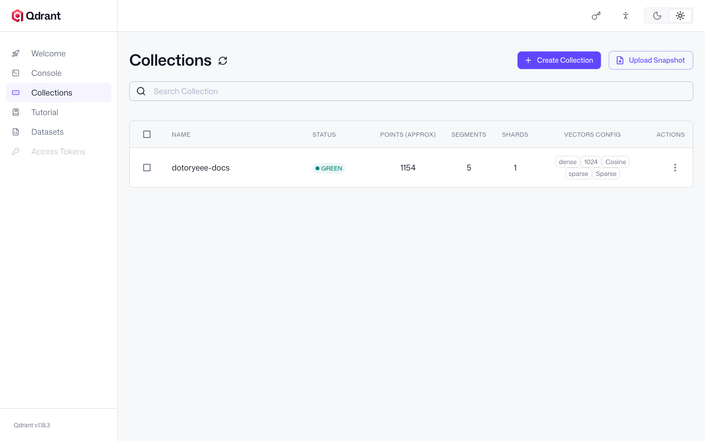

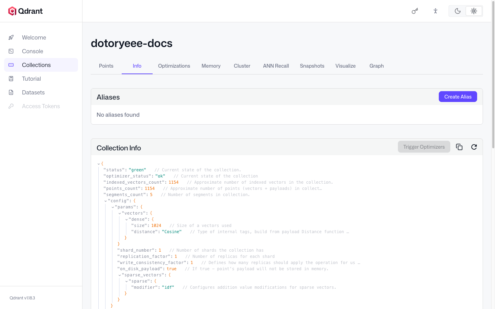

발행 보류 중인 글이 색인에 섞이지 않았는지도 확인한다. doc_path에 data_perimeter를 걸어 필터하면 결과가 비어 있다.

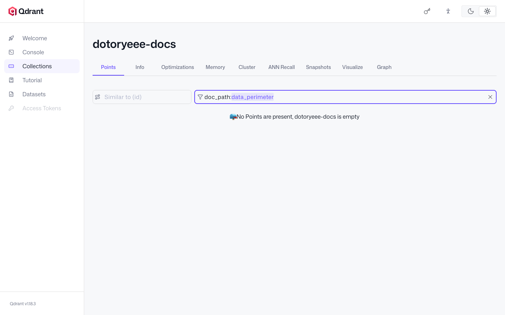

Visualize 탭은 색인된 벡터를 2D로 투영해 보여준다. 1,154개 청크가 주제별로 덩어리를 이루는 것이 보인다.

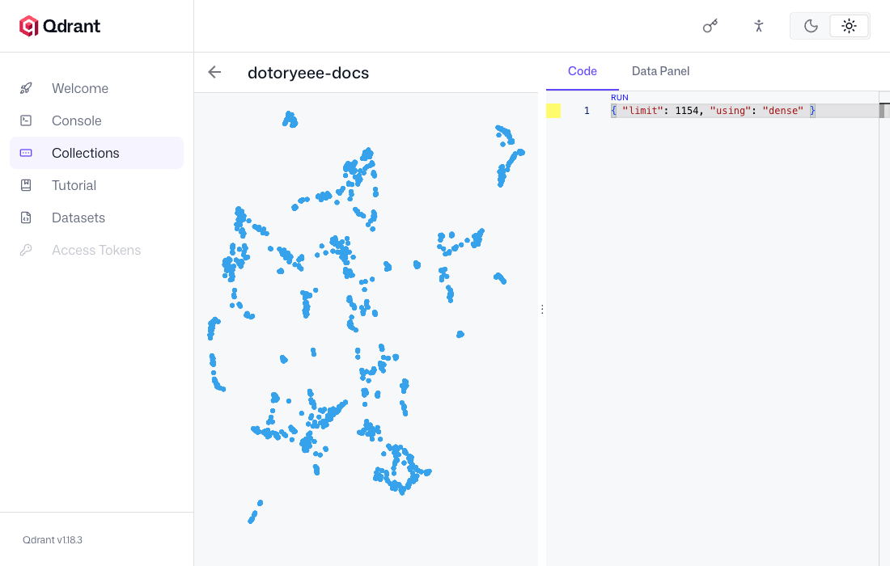

## 질의셋과 판정 기준

---

정답 문서를 아는 질의를 12개 주제로 만들고, 주제마다 문서 표현을 그대로 쓴 형태와 환언한 형태를 짝으로 뒀다. 합쳐서 24개다.

편향을 줄이려고 본문을 다시 열지 않고 파일 제목 목록과 기억만으로 작성했다. 식별자 질의 3개는 예외다. 벡터 검색이 약하다는 자리를 겨냥해 처음부터 정해 둔 문자열이라 grep으로 맥락만 확인했다.

```json
{
  "id": "working_set_size",
  "docs": ["Cloud Infra/moe_lab.md"],
  "verbatim": "recommendedMaxWorkingSetSize 값은 얼마인가",
  "paraphrase": "Metal이 권장하는 최대 작업 세트 크기는 몇 MB인가",
  "is_identifier": true
}
```

판정 기준은 다음과 같이 고정했다.

|항목|정의|
|---|---|
|top-k 단위|검색된 청크 개수. 고유 문서 개수가 아님|
|적중|상위 k개 청크의 doc_path 중 하나라도 정답 문서 집합에 속하면 그 k에서 적중|
|순위|정답 문서가 처음 등장하는 청크의 순번(1부터)|
|MRR|1/순위, 정답이 없으면 0|
|정답 문서 집합|정리와 실습이 짝을 이루는 3개 주제는 문서 2개까지 허용|

!!! warning
    💡 질의셋을 저자가 직접 만들었으므로 아래 recall 수치는 실사용 분포가 아니라 상한치로 읽는다

## 청크 크기별 검색 적중

---

같은 질의셋을 세 컬렉션에 각각 던졌다.

|조건|recall@1|recall@3|recall@5|recall@10|MRR|
|---|---|---|---|---|---|
|dense, small(300자)|0.833|0.917|0.917|1.000|0.878|
|dense, medium(800자)|0.792|0.958|0.958|1.000|0.879|
|dense, large(2000자)|0.792|0.917|0.917|0.958|0.861|

**청크 크기와 recall은 단조 관계가 아니다.** medium이 recall@3과 recall@5에서 가장 좋고, small이 recall@1에서 가장 좋고, large는 전 구간에서 가장 나쁘다. recall@10이 1.0에 못 미친 것도 large뿐이다.

질의가 24개뿐이라 1건의 순위 변화가 recall@1을 4.2%p 움직인다. 집계만 보고 있으면 무엇이 움직였는지 알 수 없으니 순위가 바뀐 질의만 따로 뽑았다.

|질의|형태|small|medium|large|
|---|---|---|---|---|
|ebpf_concept|paraphrase|1|2|1|
|kv_cache_metric|paraphrase|3|2|2|
|working_set_size|verbatim|8|10|top-10 밖|
|working_set_size|paraphrase|1|1|6|
|wireguard_ipip|paraphrase|2|1|1|
|k8s_cni|paraphrase|9|2|2|
|k6_slo|paraphrase|1|2|2|

표에 없는 17개 질의는 세 조건 모두 1위로 변화가 없었다.

식별자 질의는 청크가 커질수록 뚜렷하게 나빠진다. working_set_size verbatim 하나만 따라가면 8위에서 10위, 그다음엔 top-10 밖으로 밀렸다. top-20까지 넓혀서 보면 14위다. 긴 청크일수록 식별자 토큰이 청크 전체 임베딩에서 차지하는 비중이 옅어지는 쪽으로 읽힌다.

**그런데 반대 방향으로 움직인 질의도 있다.** k8s_cni paraphrase는 small에서 9위로 가장 나쁘고 medium과 large에서 2위다. 청크를 줄이면 검색이 좋아진다거나 키우면 맥락이 살아난다는 식의 단일 규칙은 이 코퍼스에서 성립하지 않았다. 주제에 따라 방향이 갈린다.

## instruct 프리픽스

---

Qwen3-Embedding은 질의 측에만 지시문을 붙이는 것이 권장 사용법이다. 문서 임베딩은 프리픽스 없이 한 벌로 고정하고 같은 질의셋만 프리픽스 유무 두 벌로 임베딩해 medium 컬렉션에 던졌다.

|조건|recall@1|recall@3|recall@5|recall@10|MRR|
|---|---|---|---|---|---|
|dense, medium|0.792|0.958|0.958|1.000|0.879|
|dense, medium + instruct 프리픽스|0.875|0.917|0.917|1.000|0.905|

recall@1과 MRR은 올랐는데 recall@3과 recall@5는 오히려 떨어졌다. 개별 질의를 열어 보면 방향이 갈린 것이 보인다. ebpf_concept와 kv_cache_metric paraphrase는 둘 다 2위에서 1위로 올라왔다. working_set_size verbatim은 10위에서 9위로 겨우 움직여 식별자 문제 자체는 그대로였다. 반대로 k8s_cni paraphrase는 2위에서 10위로 밀려 top-3에서 이탈했다.

측정 전에는 이 규모에서 순위가 갈리지 않을 것으로 봤다. 실제로는 개별 질의 단위로 꽤 흔들렸다. 집계 MRR만 보고 프리픽스를 켜면 어느 질의가 망가졌는지 모른 채 넘어가게 된다.

## 하이브리드 검색 대조

---

Qdrant Console에서 같은 질의를 두 방식으로 던져 비교한다. 질의 벡터는 1024차원이라 콘솔에 그대로 붙여 넣기 부담스럽다. 색인된 포인트의 id를 query에 넘기면 그 포인트의 벡터로 검색해 주므로 본문을 짧게 두고 동작을 확인할 수 있다.

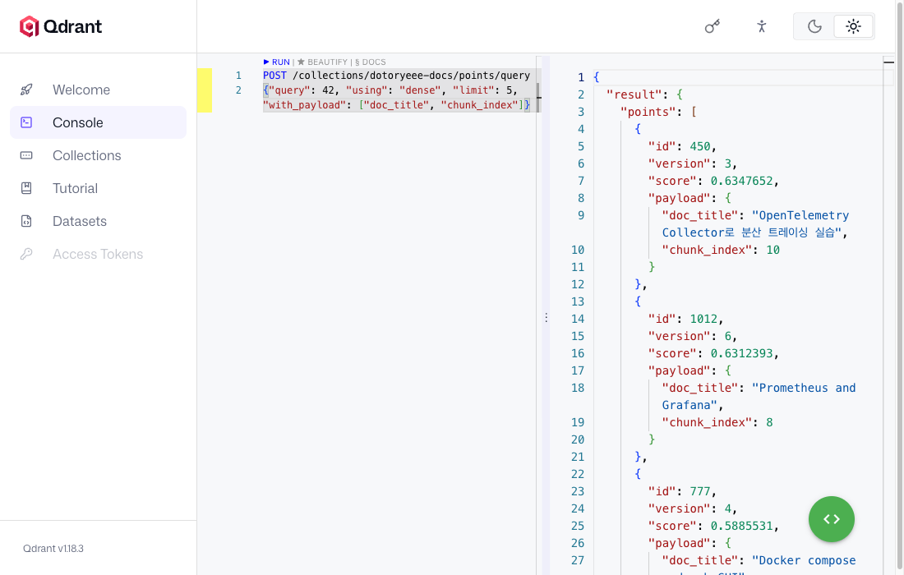

dense 단독은 질의 벡터 하나만 넘긴다. working_set_size verbatim 질의를 던지면 1위가 swap.md 청크다. 정답인 moe_lab.md는 10위까지 내려가 있다.

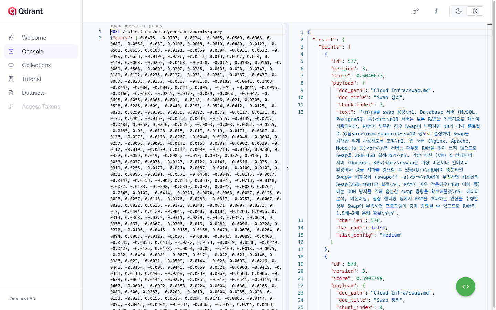

하이브리드는 prefetch에 dense와 sparse 두 갈래를 각각 50개까지 뽑아 두고 fusion에 rrf를 지정한다.

!!! tip
    💡 하이브리드 질의는 prefetch 갈래마다 limit을 따로 주고 상위 query에 fusion rrf를 지정한다

같은 질의에서 1위가 바뀐다. moe_lab.md 청크가 올라오고, 그 청크 본문에 recommendedMaxWorkingSetSize|55662.79 MB 행이 실제로 들어 있다. 파일명만 맞은 게 아니라 근거가 그 청크 안에 있다는 뜻이다.

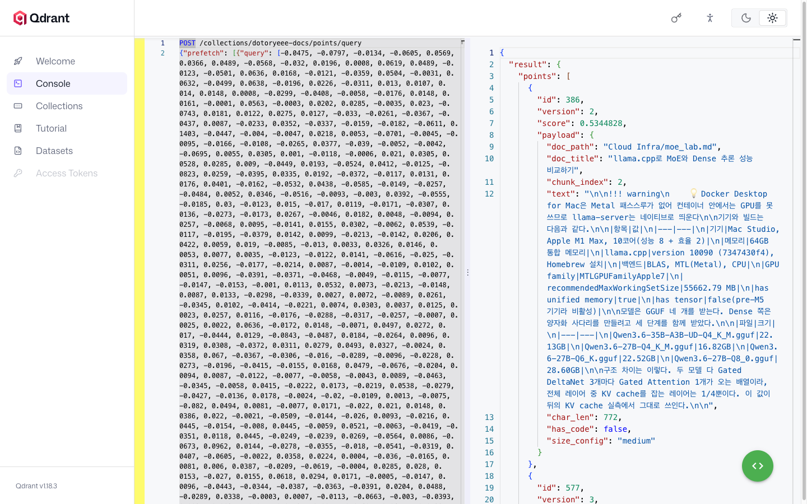

|조건|recall@1|recall@3|recall@5|recall@10|MRR|
|---|---|---|---|---|---|
|dense, medium|0.792|0.958|0.958|1.000|0.879|
|하이브리드(RRF), medium|0.917|0.958|1.000|1.000|0.948|

집계로는 하이브리드가 전 구간에서 같거나 좋다. 가장 크게 벌어진 곳이 방금 본 식별자 질의다. dense가 1위로 올린 swap.md는 스코어 0.6041로 오답이었고, 하이브리드는 정답을 스코어 0.5345로 1위에 올렸다.

**진 사례도 있다.** k8s_cni paraphrase는 dense 2위에서 하이브리드 4위로 후퇴했다. 1위인 nic_virtualization.md의 SR-IOV Network Device Plugin 표 행은 dense 단독에서도 1위였으니 융합이 만들어낸 결과가 아니다. 정답을 민 것은 그 아래다. dense에서 5위였던 gpu_06.md 청크와 5위권 밖이던 container_internals.md 청크가 BM25 겹침을 타고 정답 위로 올라왔다. 의미상 먼 문서도 키워드가 겹치면 순위를 밀어 올린다.

!!! notice
    💡 dense·하이브리드 결과 화면의 질의 벡터는 소수점 4자리로 반올림한 사본이다

원본 벡터는 22,000자가 넘어 Monaco 에디터에 그대로 붙여 넣으면 입력이 안정적으로 되지 않았다. 자릿수를 줄인 사본으로 다시 실행했고, 그렇게 얻은 dense 스코어 0.6040673은 전체 정밀도로 계산한 평가 결과와 소수점 넷째 자리까지 같다. 하이브리드 스코어 0.5344828은 순위 기반 융합이라 완전히 일치했다.

## 리랭킹

---

dense가 올린 top-20을 bge-reranker-v2-m3로 다시 매긴다. 리랭커는 질의와 문서를 한 입력에 넣어 관련도를 직접 계산하므로 1단계보다 느리지만 정확하다.

medium 컬렉션에서 working_set_size verbatim을 돌리면 부분적으로만 살아난다. 정답 청크 하나가 원순위 20위에서 6위로 올라왔고, 첫 정답 순위 기준으로는 10위에서 6위가 됐다. 다만 같은 문서의 다른 정답 청크는 10위에서 11위로 밀렸다. 리랭킹이 관련 청크를 함께 끌어올리는 것은 아니다.

같은 질의를 large 컬렉션에서 돌리면 폭이 훨씬 크다. dense 14위였던 청크가 리랭킹 후 1위다. relevance_score는 -4.87로 여전히 음수지만 후보 20개 중에서는 최고점이다.

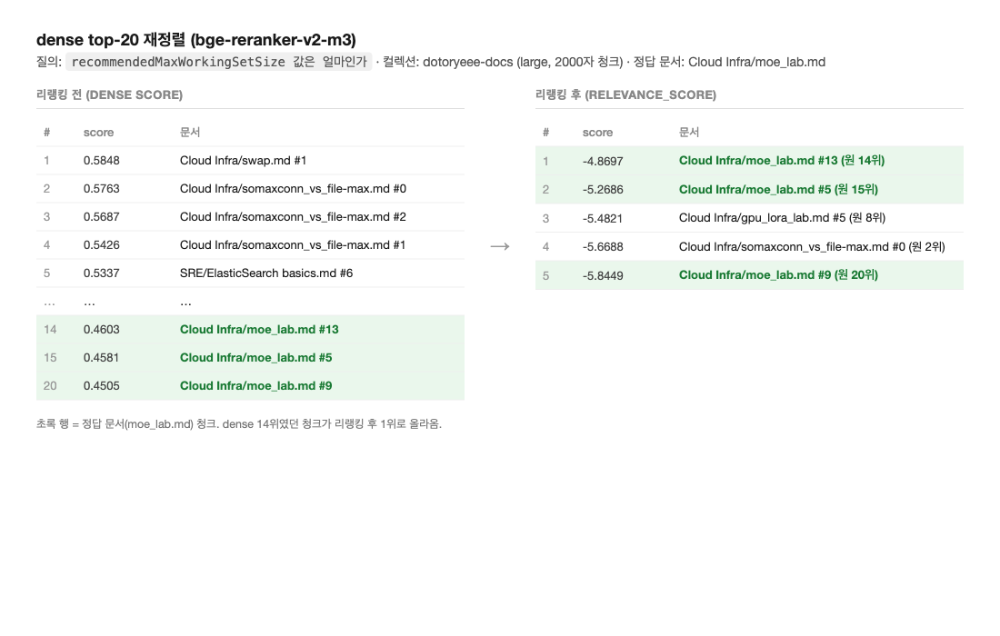

세 번째는 살릴 수 없는 경우다. 코퍼스에 없는 주제를 물으면 dense top-20의 최고 스코어가 0.4805로 나온다. 정답이 있는 질의의 1위 스코어는 0.44~0.9대인데, 가장 낮은 0.448이 이 무근거 질의의 0.4805보다도 아래다. 스코어 하나로 경계를 그을 수 없다는 뜻이다. 리랭커는 상위 5개에 -4.81에서 -5.64 사이의 음수 relevance_score를 매겼고 나머지는 그보다 더 낮다. 애초에 후보 안에 정답이 없으니 순서만 바뀔 뿐이다. 리랭킹은 1단계가 데려온 후보를 다시 정렬할 뿐 검색 실패 자체를 고치지 못한다.

## 답변 생성 대조

---

여기서부터 임베딩·리랭커 서버를 내리고 MoE를 8080 포트에 띄운다. 메모리가 겹치지 않게 단계를 나눠 기동하는 것이다.

```s
pkill -f llama-server

llama-server -m /Users/aaron/moe_lab/models/Qwen3.6-35B-A3B-UD-Q4_K_M.gguf \
  -ngl 99 -c 8192 --reasoning off \
  --port 8080 --host 127.0.0.1 --alias dotoryeee-moe \
  > results/moe_server.log 2>&1 &
```

Open WebUI는 모델이 제대로 붙었는지 눈으로 확인하는 프런트 데모로만 썼다. OpenAI 호환 엔드포인트로 llama-server를 가리키게 한다.

```s
docker run -d --name dotoryeee-webui -p 8088:8080 \
  -e OPENAI_API_BASE_URL=http://host.docker.internal:8080/v1 \
  -e OPENAI_API_KEY=sk-dotoryeee-1234 \
  -e ENABLE_OLLAMA_API=false \
  -e WEBUI_NAME=dotoryeee-lab \
  ghcr.io/open-webui/open-webui:main
```

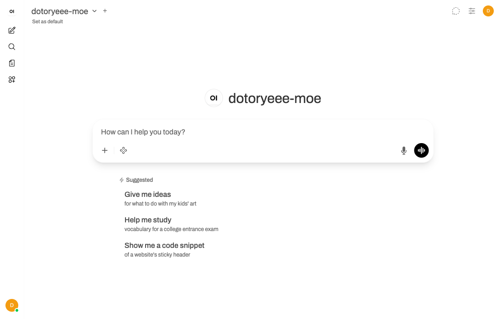

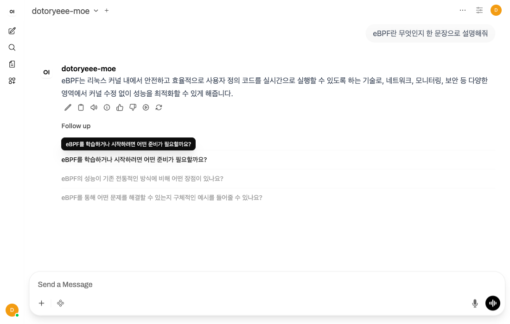

이 제품의 지식 기능은 자체 청킹, 자체 임베딩, 자체 벡터 저장소를 쓰는 별개 파이프라인이다. 거기에 코퍼스를 넣으면 지금까지 만든 컬렉션이 아니라 다른 시스템을 재게 된다. **측정은 전부 llama-server의 /v1/chat/completions를 직접 호출해서 했다.**

통제 변수는 이렇게 잡았다. 시스템 프롬프트 골격은 동일하고 차이는 사용자 메시지에 컨텍스트 블록이 붙는지 여부뿐이다. temperature는 0, max_tokens는 300, 단일 턴, 추론 모드는 끈 상태다. 판정 기준도 생성 전에 정했다. 47.6~47.7 t/s 수치가 나오면 정답, 모른다고 답하면 정직한 거부, 다른 수치를 대면 환각으로 본다.

질문은 이 블로그에만 있는 실측 수치를 골랐다. 코퍼스 대부분이 공개 지식의 정리라 그쪽을 물으면 모델이 사전 지식으로 맞혀 버린다.

```s
for f in gen_decode_speed_dotoryeee-moe.json gen_decode_speed_dotoryeee-dense.json; do
jq -r '.rag_off.model_alias + " RAG미적용: " + (.rag_off.answer|gsub("\n";" ")) , (.rag_on.model_alias + " RAG적용: " + (.rag_on.answer|gsub("\n";" ")))' $f
done
dotoryeee-moe RAG미적용: dotoryeee 블로그의 구체적인 테스트 데이터나 기록을 확인할 수 없으므로, 정확한 수치를 알 수 없습니다.
dotoryeee-moe RAG적용: 문서에 따르면 Mac Studio에서 측정한 MoE(Qwen3.6-35B-A3B) 모델의 decode(tg128) 속도는 **47.63 t/s**입니다.
dotoryeee-dense RAG미적용: 제공된 dotoryeee 블로그의 내용에는 Mac Studio M1 Max에서 llama.cpp를 사용하여 MoE 모델을 테스트한 구체적인 decode 속도(tg128 기준 초당 토큰 수)에 대한 정보가 포함되어 있지 않습니다.  따라서 해당 질문에 대해 정확한 답변을 드릴 수 없습니다.
dotoryeee-dense RAG적용: 문서 2의 표에 따르면, Mac Studio에서 측정한 MoE 모델(Qwen3.6-35B-A3B)의 decode(tg128) 속도는 **초당 47.63 토큰**입니다.
```

Dense 차례에는 MoE를 내리고 같은 방식으로 8081 포트에 올린다. 검색 결과와 프롬프트는 MoE 때 쓴 것을 파일로 저장해 두고 그대로 재사용한다.

```s
pkill -f llama-server

llama-server -m /Users/aaron/moe_lab/models/Qwen3.6-27B-Q4_K_M.gguf \
  -ngl 99 -c 8192 --reasoning off \
  --port 8081 --host 127.0.0.1 --alias dotoryeee-dense \
  > results/dense_server.log 2>&1 &
```

|모델|RAG|판정|wall-clock|decode 속도|
|---|---|---|---|---|
|MoE|미적용|정직한 거부|1.00초|45.2 t/s|
|MoE|적용(top-3)|정답|2.46초|48.9 t/s|
|Dense|미적용|정직한 거부|6.41초|12.4 t/s|
|Dense|적용(top-3)|정답|13.19초|12.4 t/s|

환각은 나오지 않았다. 두 모델 다 모른다고 답했고, 검색 결과를 붙이자 둘 다 47.63을 그대로 재현했다. **검색 결과가 답을 만들었고 모델을 바꿔도 그 답은 유지됐다.**

속도는 이 조건에서도 갈린다. 프롬프트 처리까지 포함한 wall-clock으로 검색 결과를 붙인 조건에서 MoE가 5.4배 빠르고, decode 속도만 보면 MoE 45~49 t/s 대 Dense 12.4 t/s로 3.8배 정도다.

!!! notice
    💡 이 표의 decode 속도는 llama-server가 응답에 실어 주는 timings 값이라 llama-bench 수치와 계측 방식이 다르다

llama-bench는 같은 조건을 여러 번 돌려 평균을 내지만 여기 값은 58~64토큰짜리 단발 생성 하나에서 나왔다. MoE가 45.2와 48.9로 흩어진 것이 그 편차 폭이다. 순수 decode 벤치마크에서 잰 4.07배와 방법론은 다르지만 방향과 배율은 비슷하게 재확인됐다.

## 검색이 실패했을 때

---

두 가지 조건으로 나눠 봤다. 먼저 코퍼스에 아예 없는 주제다. 블록체인이라는 문자열 자체가 104편 어디에도 없는 것을 grep으로 확인하고 PoW와 PoS의 차이를 물었다.

|모델|RAG|답변 요지|
|---|---|---|
|MoE|미적용|PoW와 PoS를 사전 지식으로 설명|
|MoE|적용(무관 문서 top-3)|제공된 문서에 없다며 거부|
|Dense|미적용|블로그 범위 밖이라며 거부|
|Dense|적용(동일 무관 문서)|마찬가지로 거부|

RAG 미적용 조건에서 두 모델의 기본 행동이 갈렸다. 같은 시스템 프롬프트를 MoE는 일반 지식으로 답해도 된다는 뜻으로 읽었고, Dense는 블로그 범위 밖은 답하지 않는다는 뜻으로 더 엄격하게 읽었다. 모델을 바꾸면 답만이 아니라 거부 기준까지 달라진다.

MoE 쪽에서 눈에 띄는 것은 적용 조건이다. 미적용 조건에서 답을 알고 있다는 것이 증명됐는데도, 무관한 문서가 컨텍스트로 들어오자 문서에 없다며 아는 답을 내놓지 않았다.

두 번째 조건은 오답 문서다. recommendedMaxWorkingSetSize 값을 물으면서, dense가 실제로 1위로 올렸던 바로 그 swap.md 청크를 일부러 컨텍스트로 줬다.

|모델|RAG|답변 요지|
|---|---|---|
|MoE|미적용|모른다. Windows 일반 지식을 부연|
|MoE|적용(swap.md)|제공된 문서에 정보가 없다|
|Dense|미적용|모른다|
|Dense|적용(swap.md)|정보가 없다|

두 모델 다 swap 용량 권장치를 엉뚱하게 답으로 재활용하지 않고 없다고 판별했다. **잘못된 검색 결과가 그대로 잘못된 답을 만드는 사례는 이번 실험에서 관찰되지 않았다.** 검색 단계가 답을 바꾸는 것은 맞는데, 이번 조건에서 그 방향은 오답 문서가 오답을 만드는 쪽이 아니라 답을 못 하게 만드는 쪽이었다.

## 이번 측정의 한계

---

- 질의셋을 저자가 직접 만들었다. 문서를 쓴 사람이 질의를 만들면 어휘가 겹치기 쉬우므로 recall 수치는 상한치다
- 적중 판정은 문서 단위다. top-k는 청크 개수 기준이고, 상위 k개 청크의 doc_path 중 하나라도 정답 집합에 들면 적중으로 봤다. 청크 본문에 근거가 실제로 있는지는 대표 사례 하나만 열어 확인했다
- kiwipiepy 사용자 사전을 쓰지 않았다. 도메인 용어가 많은 코퍼스라면 사전 등록이 sparse 갈래의 전제 조건이다
- 하이브리드는 medium 컬렉션에서만 쟀다. 리랭킹도 대표 질의 몇 건에서만 돌렸고 24개 질의 전체에 대한 리랭킹 후 집계는 재지 않았다
- 콘솔 스크린샷의 질의 벡터는 원본을 그대로 입력하지 못해 반올림 사본을 썼다. 스코어를 전체 정밀도 계산값과 대조해 두긴 했다
- Open WebUI는 프런트 데모로만 썼고 지식 기능에 코퍼스를 넣지 않았다
- 임베딩·리랭커·MoE·Dense를 동시에 상주시키지 않고 단계별로 기동했다. 같은 시점에 네 서버를 놓고 잰 값이 아니다

## 정리

---

```s
docker rm -f dotoryeee-webui
```

- 청크 크기와 recall은 단조 관계가 아니었다. medium이 recall@3/@5 최고, small이 recall@1 최고, large가 전 구간 최저였다
- 같은 크기 변화가 주제마다 반대로 작용했다. 식별자 질의는 청크가 커질수록 나빠졌고 k8s_cni 질의는 small에서 가장 나빴다
- 하이브리드는 집계에서 MRR 0.879에서 0.948로 올랐지만, dense 2위였던 질의를 4위로 밀어낸 사례가 함께 나왔다
- 리랭킹은 14위를 1위로 끌어올렸다. 대신 top-20에 정답이 없으면 아무것도 못 하고, 같은 문서의 다른 청크를 밀어내리기도 했다
- instruct 프리픽스는 MRR을 0.879에서 0.905로 올렸지만 질의별로는 개선과 악화가 갈렸다. 집계만 보면 안 보이는 변화다
- 임베딩 서버에 --pooling last가 빠지면 오류 없이 검색 순위만 나빠진다. IDF는 클라이언트와 Qdrant 중 한쪽에서만 적용한다
- kiwipiepy 기본 사전이 샤딩을 샤와 딩으로 쪼갰다. 색인에 남은 것은 한 글자였다
- 무관한 문서를 컨텍스트로 줘도 두 모델 다 낚이지 않았다. 논지와 맞지 않는 결과지만 나온 대로 적는다
