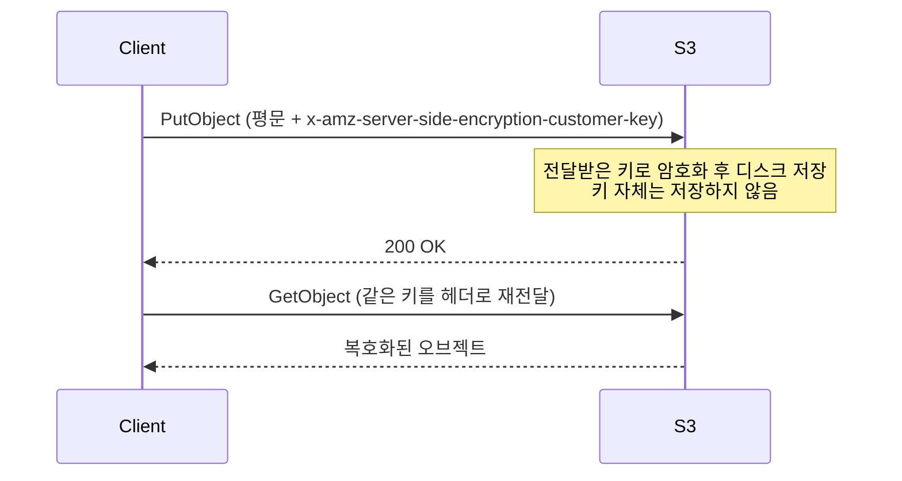
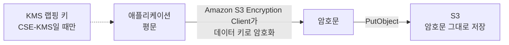

# S3 암호화 방식 비교

S3 서버 측 암호화 4종과 클라이언트 측 암호화가 어디서 갈리는지 정리했다. SSE-C 기본 차단 변경, S3 Bucket Keys의 KMS 비용 절감, 전송 중 암호화 강제까지 다룬다.

<!-- more -->

## S3 암호화 방식이란
S3 암호화 방식이란 오브젝트를 누가 어디서 암호화하고 그 키를 누가 쥐는지에 따라 갈리는 선택지

- 저장 시 암호화(at rest)와 전송 중 암호화(in transit)는 별개 축 → 둘 다 설정 대상
- 2023년 1월 5일 이후 업로드되는 오브젝트는 별도 지정이 없으면 SSE-S3로 자동 암호화됨
- 업로드 CLI 옵션과 boto3 예시는 [S3 object encryption](S3%20object%20encryption.md)에 정리

---

## 암호화 위치와 키 소유 기준 분류

| 방식 | 암호화 연산 위치 | 키 관리 주체 | KMS 사용 |
|---|---|---|---|
| SSE-S3 | S3 | AWS | 미사용 |
| SSE-KMS | S3 | KMS 키(고객 관리형 또는 AWS 관리형) | 사용 |
| DSSE-KMS | S3 | 1층은 KMS 키, 2층은 S3 관리 키 | 사용 |
| SSE-C | S3 | 사용자. 매 요청 헤더로 전달 | 미사용 |
| CSE | 클라이언트 | 사용자 또는 KMS 랩핑 키 | 선택 |

DSSE-KMS의 "두 겹"은 서로 독립적인 AES-256 두 층을 뜻함.

- 1층은 KMS가 생성한 데이터 키, 2층은 S3가 관리하는 별도 AES-256 키로 이미 암호화된 데이터를 다시 암호화
- KMS 키는 버킷과 같은 리전이어야 함
- 연산 부담과 KMS 호출이 늘어 SSE-KMS보다 지연과 비용이 큼

---

## SSE-C

SSE-C(Server-Side Encryption with Customer-Provided Keys)란 암호화 연산은 S3에 맡기고 AES-256 키는 요청마다 HTTP 헤더로 직접 넘기는 방식



- S3는 이 키를 저장하지 않음 → 다운로드 때마다 같은 키를 다시 넘겨야 함
- 어떤 오브젝트를 어떤 키로 암호화했는지 매핑을 사용자가 관리. 키를 잃으면 오브젝트도 잃음
- 버저닝 버킷에서는 버전마다 다른 키를 쓸 수 있음 → 추적 부담 증가
- SSE-C 헤더를 쓰는 요청은 HTTPS 필수. HTTP 요청은 S3가 거부하며, 실수로 HTTP로 보낸 키는 유출된 것으로 간주하고 교체할 것
- S3 콘솔에서는 SSE-C 업로드·수정 불가
- 별도 암호화 요금은 없고 표준 S3 요청 요금만 발생

!!! warning
    2026년 4월부터 신규 범용 버킷은 SSE-C가 기본 차단됨. SSE-C로 암호화된 오브젝트가 하나도 없는 계정은 기존 버킷까지 함께 차단됨. 차단 상태에서 SSE-C를 지정한 PutObject·CopyObject·POST Object·멀티파트 업로드·복제 요청은 HTTP 403 AccessDenied로 거부.

- 차단은 쓰기 요청에만 적용됨 → 차단 이전에 SSE-C로 암호화된 오브젝트는 헤더를 넘기면 GetObject·HeadObject로 계속 읽을 수 있음
- 차단을 풀려면 PutBucketEncryption API로 버킷 기본 암호화 설정의 BlockedEncryptionTypes를 NONE으로 지정해야 함
- AWS가 기본 차단으로 방향을 잡은 이유는 매 요청 키 전달 구조 때문. 다른 사용자·역할·AWS 서비스와 접근 공유가 사실상 불가능하고, 관리형 서비스가 오브젝트를 복호화하지 못함

---

## CSE

CSE(Client-Side Encryption)란 데이터를 로컬에서 암호화한 뒤 암호문만 S3로 보내는 방식



- Amazon S3 Encryption Client가 PutObject·GetObject 과정에 끼어들어 오브젝트마다 고유한 데이터 키로 암복호화
- S3는 암호문을 평범한 오브젝트로만 인식 → 암호화 여부 자체를 모름
- 랩핑 키를 KMS 키로 두는 CSE-KMS와 사용자가 직접 보관하는 클라이언트 관리 키 방식으로 갈림
- Amazon S3 Encryption Client는 S3 Bucket Keys를 사용하지 않음 → KMS 호출 절감 효과 없음
- Amazon S3 Encryption Client와 AWS Encryption SDK는 호환되지 않음. 한쪽으로 암호화한 데이터는 다른 쪽으로 복호화 불가

"AWS도 원본을 볼 수 없다"가 성립하는 범위는 클라이언트 관리 키를 쓸 때. CSE-KMS는 랩핑 키가 KMS에 있으므로 그 키를 쓸 권한이 있으면 데이터 키 복호화가 가능함.

---

## Athena 등 분석 서비스와의 궁합

CSE는 분석 서비스에서 무조건 못 쓰고 SSE-C는 제약만 있다는 통념과 실제가 반대.

| 암호화 방식 | Athena 지원 | 비고 |
|---|---|---|
| SSE-S3 | 지원 | 추가 권한 불필요 |
| SSE-KMS | 지원. 권장 | 리전 간 지원 |
| CSE-KMS | 지원 | 리전 간 미지원. CREATE TABLE에 has_encrypted_data 또는 encryption_option 지정 필요 |
| SSE-C | 미지원 | |
| CSE(클라이언트 관리 키) | 미지원 | |
| 비대칭 키 | 미지원 | |

- Athena가 직접 지원하는 클라이언트 측 도구는 Amazon S3 Encryption Client뿐. AWS Encryption SDK로 암호화한 데이터는 쿼리해도 암호문이 그대로 나옴
- Athena 문서 자체가 CSE-KMS보다 SSE-KMS를 권장. 클라이언트 유지보수 부담, 버전 간 호환 문제, KMS 호출 증가가 이유
- 오브젝트 수가 많으면 KMS 요청이 스로틀될 수 있음 → S3 Bucket Keys 활성화 또는 KMS 할당량 상향

---

## SSE-KMS 비용과 S3 Bucket Keys

| 항목 | 요금 |
|---|---|
| 고객 관리형 KMS 키 보관 | 키당 $1/월(시간 단위 비례 배분) |
| 요청 무료 한도 | 월 20,000건(전 리전 합산) |
| 대칭 키 요청 | 10,000건당 $0.03 |

Bucket Keys 없이 SSE-KMS를 쓰면 오브젝트마다 개별 데이터 키를 쓰므로 KMS 암호화 오브젝트에 접근할 때마다 KMS 호출이 발생함.

- S3 Bucket Keys는 S3가 버킷 수준의 단기 키를 KMS에서 받아 잠시 보관하고, 그 키로 새 오브젝트의 데이터 키를 생성하는 구조 → KMS 요청 비용 최대 99% 절감
- 절감 폭은 요청자 수·요청 패턴·오브젝트 나이에 따라 달라짐. 요청자가 적고 짧은 기간에 몰릴수록 절감이 큼
- DSSE-KMS는 Bucket Keys 미지원
- 이미 버킷에 있던 오브젝트에는 적용되지 않음 → CopyObject로 다시 써야 함
- 암호화 컨텍스트가 오브젝트 ARN에서 버킷 ARN으로 바뀜 → 오브젝트 ARN을 암호화 컨텍스트로 쓰는 IAM·키 정책은 미리 수정할 것
- KMS CloudTrail 이벤트에 버킷 ARN이 기록되고 이벤트 건수 자체가 줄어듦
- KMS가 생성한 키뿐 아니라 임포트한 키 재료, 커스텀 키 스토어 기반 키와도 호환됨

---

## 전송 중 암호화 강제

저장 암호화와 별개로 HTTPS가 아닌 요청을 버킷 정책에서 거부하는 설정.

```json title="bucket-policy.json"
{
  "Version": "2012-10-17",
  "Statement": [
    {
      "Sid": "DenyInsecureTransport",
      "Effect": "Deny",
      "Principal": "*",
      "Action": "s3:*",
      "Resource": [
        "arn:aws:s3:::dotoryeee-bucket",
        "arn:aws:s3:::dotoryeee-bucket/*"
      ],
      "Condition": {
        "Bool": {
          "aws:SecureTransport": "false",
          "aws:PrincipalIsAWSService": "false"
        }
      }
    }
  ]
}
```

- 버킷 자체를 대상으로 하는 작업까지 막으려면 Resource에 버킷 ARN도 함께 넣을 것
- aws:PrincipalIsAWSService를 false로 함께 걸어 AWS 서비스 주체를 Deny에서 제외할 것

!!! warning
    AWS 서비스가 사용자를 대신해 다른 서비스를 호출할 때는 aws:SecureTransport·aws:SourceIp·s3:TlsVersion 같은 네트워크 컨텍스트가 가려짐. 이 조건 키를 Deny에 쓰면 복제·로깅 등 서비스 간 호출이 의도치 않게 차단될 수 있음.

- SSE-C와 SSE-KMS는 이미 HTTPS가 강제됨. SSE-KMS 암호화 오브젝트의 GET·PUT 요청은 SSL/TLS로만 가능
- SSE-S3와 평문 업로드는 이 정책이 없으면 HTTP 요청이 허용됨 → 정책의 실질 효과는 이쪽

---

## 선택 기준

| 상황 | 권장 |
|---|---|
| 별도 요건 없음, 키 감사 불필요 | SSE-S3 |
| 키 정책·수명주기·CloudTrail 감사가 필요한 일반 업무 | SSE-KMS |
| 대량 트래픽으로 KMS 요청 비용이 부담 | SSE-KMS + S3 Bucket Keys |
| 두 겹 암호화가 규정 요건 | DSSE-KMS |
| S3에 평문이 도달하는 것 자체를 막아야 함 | CSE |
| 키를 AWS 밖에만 두어야 함 | CSE(클라이언트 관리 키) |

---

## 결론

- 플랫폼 기본값은 SSE-S3지만, 보안 아키텍처를 설계할 때 잡을 권장 표준은 SSE-KMS. 비용이 걸리면 방식을 바꾸지 말고 S3 Bucket Keys를 먼저 켤 것
- SSE-C는 2026년 4월 기본 차단 이후 신규 설계의 선택지가 아님
- CSE는 S3가 평문을 보지 않는 대신 키 관리와 클라이언트 유지보수를 전부 떠안는 교환
