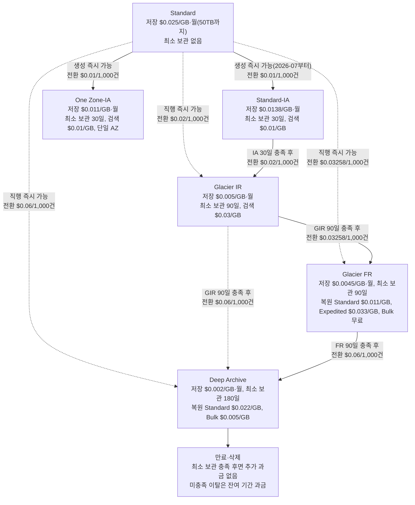

# S3 성능·비용 최적화 정리

<!-- more -->

## S3 최적화란
S3 최적화란 데이터의 접근 패턴에 맞춰 스토리지 클래스·전송·요청 방식을 조정해 성능과 비용을 함께 맞추는 작업

- 성능 축: 프리픽스당 요청률, 객체 지연(latency), 대용량 전송 처리량
- 비용 축: 저장 비용(클래스별 단가), 요청 비용(PUT/GET 건수), 전송 비용(리전 밖·인터넷 아웃), 검색·전환 비용
- 두 축은 자주 충돌 → 저렴한 아카이브 클래스는 검색 비용·복원 지연을 대가로 가짐
- 최적화 판단 기준은 단가가 아니라 "얼마나 자주, 얼마나 빨리 꺼내는가"

---

## 스토리지 클래스 비교
접근 빈도와 검색 속도 요구에 따라 클래스가 갈리며, 저렴할수록 최소 보관 기간·검색 비용이 붙음

| 클래스 | 접근 패턴 | 최소 보관 | 검색 비용 | 특징 |
|--------|-----------|-----------|-----------|------|
| S3 Standard | 자주 접근(월 1회 이상) | 없음 | 없음 | 기본 클래스, 밀리초 접근, AZ 3개 이상 |
| S3 Express One Zone | 지연 민감 핫데이터 | 없음 | 없음 | 단일 AZ 디렉터리 버킷, 한 자릿수 ms, Standard 대비 최대 10배 빠름 |
| S3 Standard-IA | 가끔 접근(월 1회) | 30일 | 있음 | AZ 3개 이상, 최소 과금 128KB |
| S3 One Zone-IA | 재생성 가능·가끔 접근 | 30일 | 있음 | 단일 AZ, Standard-IA보다 저렴, AZ 손실에 취약 |
| S3 Intelligent-Tiering | 불규칙·예측 불가 | 없음 | 없음 | 접근 패턴 따라 자동 계층 이동, 객체당 모니터링 요금 |
| S3 Glacier Instant Retrieval | 분기 1회·즉시 필요 | 90일 | 있음 | 밀리초 검색, Standard-IA급 지연·처리량 |
| S3 Glacier Flexible Retrieval | 연 1~2회·지연 허용 | 90일 | 있음(복원 필요) | 분~시간 복원, Bulk 무료, 실시간 접근 불가 |
| S3 Glacier Deep Archive | 연 1회 미만 | 180일 | 있음(복원 필요) | 최저가, 수시간 복원, 실시간 접근 불가 |

- 내구성은 모든 클래스가 99.999999999%(11 nines) 동일 → 차이는 가용성·AZ 수·검색 속도·단가
- 단일 AZ 클래스(One Zone-IA, Express One Zone)는 AZ 물리 손실에 견디지 못함 → 재생성 가능하거나 사본인 데이터에만 권장
- Standard-IA·One Zone-IA·Glacier IR은 128KB 미만 객체도 128KB로 과금
- Glacier Flexible·Deep Archive는 객체당 40KB 메타데이터 추가 과금(32KB는 Glacier 요율, 8KB는 Standard 요율)

### Glacier 복원 모드

| 클래스 | 모드 | 복원 시간 | 비고 |
|--------|------|-----------|------|
| Glacier Flexible Retrieval | Expedited | 1~5분 | 건당 요금 가장 높음 |
| Glacier Flexible Retrieval | Standard | 3~5시간 | 기본값 |
| Glacier Flexible Retrieval | Bulk | 5~12시간 | 무료 |
| Glacier Deep Archive | Standard | 12시간 이내 | |
| Glacier Deep Archive | Bulk | 48시간 이내 | |

### Intelligent-Tiering 계층
객체별 접근 이력을 보고 자동으로 계층을 옮기며, 저지연 3계층은 항상 켜져 있고 아카이브 2계층은 선택 활성

| 계층 | 이동 조건 | 접근 | 활성화 |
|------|-----------|------|--------|
| Frequent Access | 업로드·전환 직후 | 밀리초 | 기본 |
| Infrequent Access | 30일 연속 미접근 | 밀리초 | 기본 |
| Archive Instant Access | 90일 연속 미접근 | 밀리초 | 기본 |
| Archive Access | 최소 90일 미접근 | 분~시간(복원 필요) | 선택 |
| Deep Archive Access | 최소 180일 미접근 | 수시간(복원 필요) | 선택 |

- 검색 비용 없음, 객체당 월 모니터링·자동화 요금만 부과
- 128KB 미만 객체는 모니터링 대상이 아니며 항상 Frequent Access에 고정 → 소형 객체엔 자동 절감 효과 없음
- Archive Access·Deep Archive Access는 비동기 접근 가능한 데이터에만 켬 → 켜면 RestoreObject 복원 절차 필요

---

## 라이프사이클과 전환
라이프사이클(Lifecycle) 규칙은 객체 나이·태그·프리픽스 기준으로 클래스 자동 전환과 만료를 처리하는 버킷 정책

요금은 ap-northeast-2 기준 USD(2026-07 확인), 실선은 폭포수 사슬, 점선은 직행·건너뛰기 경로

- 전환(Transition): 일정 기간 지난 객체를 저렴한 클래스로 이동(예: 생성 30일 후 Standard-IA, 90일 후 Glacier IR)
- 만료(Expiration): 지정 기간 후 객체 삭제, 미완료 멀티파트 업로드·이전 버전 정리도 라이프사이클로 처리
- Standard → IA 전환은 생성 즉시 가능(2026-07부터 30일 경과 제한 폐지) → 단 최소 보관 30일 과금은 그대로 적용
- 사슬 전환은 직전 클래스의 최소 보관 기간을 채워야 다음 단계 지정 가능(단일 규칙 기준) → IA 경유 Glacier IR은 IA에서 30일 뒤부터
- Standard에서는 중간 단계 없이 Glacier IR·FR·Deep Archive로 직행 가능 → 모두 생성 즉시 지정 가능
- 전환 자체가 요청 → 객체 1,000건당 전환 요청 비용 발생
- 과금 단가는 라이프사이클 규칙 충족 시점부터 대상 클래스 기준 → 물리 이동이 늦어도 충족일부터 새 단가·최소 보관 기간 시작(Intelligent-Tiering만 물리 전환 후 변경)

### 전환 함정

- 작은 객체 다수를 IA·Glacier로 내리면 손해 → 128KB 미만도 128KB로 과금되고 전환 요청비까지 붙음
- 최소 보관 기간 전 삭제·재전환 시 조기 삭제 요금 → Standard-IA에서 30일 전에 지우면 남은 기간만큼 과금
- Glacier로 전환하면 객체당 40KB 메타데이터가 얹힘 → 수백만 개의 초소형 객체 아카이브는 오히려 비쌈
- 접근 패턴이 불규칙하면 수동 라이프사이클보다 Intelligent-Tiering이 나음 → 전환 타이밍을 사람이 못 맞춤

---

## 요청 성능
S3는 요청률을 자동으로 확장하며, 병렬화 단위는 버킷이 아니라 파티셔닝된 프리픽스(prefix)

- 프리픽스당 한도: 초당 최소 3,500 PUT/COPY/POST/DELETE, 5,500 GET/HEAD
- 버킷 내 프리픽스 수에 상한 없음 → 프리픽스 10개로 읽기를 분산하면 초당 55,000 GET까지 확장
- 자동 확장은 점진적 → 급증 시 일시적으로 503(Slow Down) 응답, 확장 완료되면 해소
- 병렬화는 여러 프리픽스에 걸쳐 읽기·쓰기를 분산하는 방식

!!! warning
    과거엔 성능을 위해 키 앞에 해시·랜덤 프리픽스를 붙이라는 조언이 있었음. 지금은 S3가 프리픽스를 자동 파티셔닝하므로 불필요. 오히려 날짜·경로 기반의 읽기 좋은 키 구조를 권장.

- 멀티파트 업로드: 대용량 객체를 여러 파트로 쪼개 병렬 업로드 → 100MB 이상 권장, 5GB 초과는 필수
- 멀티파트는 파트 단위 재전송 가능 → 네트워크 실패 시 전체 재업로드 회피
- SSE-KMS 워크로드는 KMS 요청 한도가 별도 병목 → 대량 요청 시 S3 Bucket Keys로 KMS 호출 축소
- Express One Zone은 단일 AZ에 데이터를 두어 왕복 지연을 줄인 최상위 성능 위치 → 디렉터리 버킷 하나가 초당 200만 읽기·20만 쓰기 처리
- 지연 민감·고빈도 소용량 접근(체크포인트·중간 산출물)은 Express One Zone, 범용 저장은 Standard로 역할 분담

---

## 전송 최적화
전송은 병렬 분할과 엣지 경유 두 방향으로 최적화하며, 요청 수·거리·처리량이 변수

- 멀티파트 업로드: 업로드를 파트로 나눠 동시 전송 → 처리량↑, 재시도 범위↓
- 바이트레인지(Byte-range) 페치: Range 헤더로 객체를 구간별 병렬 다운로드 → 대용량 읽기 가속
- Transfer Acceleration: CloudFront 엣지 로케이션을 경유해 원거리 전송을 가속 → 별도 요금, 이득 있을 때만 활성
- 단일 EC2 인스턴스도 데이터 레이크 스캔에서 최대 100Gb/s 처리 가능 → 여러 인스턴스로 집계하면 테라비트급
- 정적 콘텐츠 배포·캐싱은 CloudFront가 담당 → 오리진에서 CloudFront로의 전송비 절감(상세는 [CDN과 동적콘텐츠 통합 시 차이점](cdn_alb_association.md))
- 리전 간·인터넷 아웃 전송비는 별도 → 같은 리전 내 서비스와 붙이고 VPC 엔드포인트로 경유하면 아웃 전송 회피

---

## 비용 함정 정리
저장 단가만 보고 클래스를 고르면 검색·요청·전송 비용에서 역전됨

| 함정 | 설명 | 대응 |
|------|------|------|
| 최소 보관 기간 | 30/90/180일 전 삭제·재전환 시 잔여 기간 과금 | 보관 기간이 최소치를 넘는 데이터만 저가 클래스로 |
| 검색 비용 | IA·Glacier는 GET·복원 시 GB당 요금, 자주 꺼내면 Standard보다 비쌈 | 접근 빈도 실측 후 클래스 결정 |
| 작은 객체 오버헤드 | 128KB 미만도 128KB 과금 + Glacier는 40KB 메타데이터 추가 | 소형 객체는 묶어서 저장하거나 Standard 유지 |
| 요청 비용 | PUT·GET 건수 단위 과금, LIST·전환도 요청 | 잦은 소량 요청을 배치·멀티파트로 축소 |
| 리전 간 전송비 | 다른 리전·인터넷으로 나가는 트래픽에 GB당 요금 | 동일 리전 배치, VPC 엔드포인트·CloudFront 경유 |
| 모니터링 요금 | Intelligent-Tiering은 객체당 월 모니터링·자동화 요금 | 객체 수가 많고 개별 용량이 작으면 오히려 손해 |
| 미완료 멀티파트 | 실패한 업로드 파트가 남아 조용히 과금 | 라이프사이클로 미완료 업로드 자동 정리 |

- Intelligent-Tiering은 128KB 미만 객체를 모니터링하지 않고 Frequent Access에 고정 → 소형 객체엔 자동 절감 효과 없음
- 검색 비용이 없는 클래스는 Standard, Express One Zone, Intelligent-Tiering 세 가지
- Storage Class Analysis로 객체 접근 빈도를 실측 → 감으로 IA 전환하지 말고 데이터로 판단
- S3 Storage Lens로 요청·전송·클래스 분포를 가시화 → 어느 프리픽스에서 비용이 새는지 식별

---

## 최근 변경
2024~2026 사이 확인된 신기능과 요금 변화

- 조건부 쓰기(2024-08): PutObject·CompleteMultipartUpload에 If-None-Match 헤더 지원 → 같은 키의 덮어쓰기 방지, 별도 존재 확인 요청 불필요. 범용·디렉터리 버킷 모두 지원, 추가 비용 없음
- 조건부 덮어쓰기(2024-11): If-Match 헤더로 ETag가 일치할 때만 덮어쓰기 → 동시 갱신 충돌을 요청 단에서 차단
- S3 Tables(2024 re:Invent): 완전관리형 Apache Iceberg 테이블 → 범용 버킷에 둔 Iceberg 대비 최대 10배 높은 초당 트랜잭션, Spark·Trino·Athena·Redshift 연동
- S3 Metadata: 객체 메타데이터를 질의 가능한 테이블로 자동 생성 → 대규모 버킷의 객체 검색·분석 용도
- Express One Zone 요금 인하(2025): 스토리지·요청 요금을 대폭 낮춤(출처: AWS News Blog, 2025). 정확한 인하율·과금 방식은 변동이 크니 현행 요금표에서 확인
- 최소 과금 단위·모니터링 요금 등 구조는 유지 → 소형 객체·불규칙 접근에 대한 판단 기준은 그대로

---

## 최적화 체크리스트
접근 빈도와 지연 요구를 먼저 정하고 클래스·전략을 매핑

| 상황 | 추천 | 사유 |
|------|------|------|
| 자주 읽고 지연에 민감 | S3 Standard | 최소 기간·검색 비용 없음 |
| 한 자릿수 ms가 필요한 핫데이터 | Express One Zone | 단일 AZ 근접 저장으로 최저 지연 |
| 접근 패턴을 모름·불규칙 | Intelligent-Tiering | 자동 계층 이동, 검색 비용 없음 |
| 월 1회 접근·즉시 필요 | Standard-IA | IA 단가 + 밀리초 접근 |
| 재생성 가능한 사본 | One Zone-IA | 단일 AZ로 IA보다 저렴 |
| 분기 1회·즉시 필요 | Glacier Instant Retrieval | 저가 + 밀리초 검색 |
| 연 1~2회·지연 허용 | Glacier Flexible Retrieval | 더 낮은 단가, 분~시간 복원 |
| 연 1회 미만·장기 보관 | Glacier Deep Archive | 최저가, 수시간 복원 |

- 요청률이 병목이면 프리픽스를 나눠 병렬화 → 해시 프리픽스는 불필요
- 대용량은 멀티파트 업로드·바이트레인지로 분할 전송
- 미완료 멀티파트·이전 버전은 라이프사이클로 자동 정리
- 저가 클래스 전환 전 최소 보관 기간·검색 빈도·객체 크기를 확인

---

## 결론
- 저장 단가만 낮은 클래스는 검색·요청·전송·전환 비용에서 역전될 수 있음 → 접근 빈도 실측이 먼저
- 요청 성능은 프리픽스 분산으로 확장, 전송은 멀티파트·바이트레인지·엣지 경유로 가속
- 성능은 "요청을 프리픽스로 분산", 비용은 "접근 빈도에 맞춘 클래스 선택"으로 나눠 접근할 것
