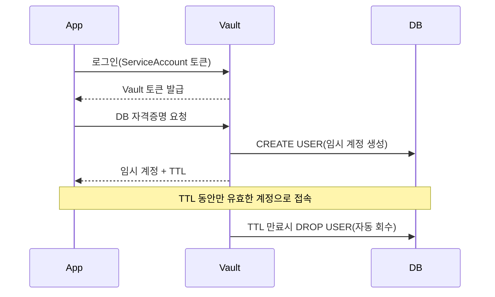

# 시크릿 관리 정리

<!-- more -->

## 시크릿 관리란
시크릿 관리(Secret Management)란 DB 비밀번호·API 키·인증서 같은 민감 값을 코드와 이미지 밖에서 저장·배포·회전(Rotation)·폐기하는 체계

쿠버네티스 기본 Secret만으로는 부족해서 별도 체계가 필요해짐.

- base64는 인코딩이지 암호화가 아님 → 매니페스트를 읽을 수 있으면 곧 평문
- etcd 저장도 기본은 평문 → encryption at rest는 별도로 설정해야 함
- Git에 한 번 올라간 시크릿은 지워도 커밋 이력에 영구 잔존
- "모든 것을 Git에 둔다"는 GitOps 전제와 정면 충돌 → [GitOps와 ArgoCD 정리](../DevOps/gitops_argocd.md)에서 남겨둔 숙제

---

## 접근 방식 3유형

| 유형 | 대표 도구 | 동작 방식 | 장점 | 단점 |
|------|-----------|-----------|------|------|
| 암호화 후 Git 저장 | Sealed Secrets, SOPS | 시크릿을 암호화해 Git에 커밋, 클러스터 안에서만 복호화 | 추가 인프라 없음, GitOps 워크플로 유지 | 회전·감사 없음, 키 유실 시 복구 불가 |
| 외부 스토어 동기화 | External Secrets Operator | AWS Secrets Manager 등 외부 스토어를 참조해 k8s Secret 생성 | 원본이 Git 밖, 스토어 교체 유연 | 외부 스토어 의존, 결과물은 결국 k8s Secret |
| 중앙 시크릿 서버 | Vault, OpenBao | 전용 서버가 저장·발급·회전·감사를 전담 | 동적 시크릿, TTL 자동 회수, 전 요청 감사 | 서버 운영 부담(HA·unseal), 학습 곡선 |

---

## Sealed Secrets
Sealed Secrets란 시크릿을 비대칭 암호화해 Git에 올릴 수 있게 만드는 Bitnami Labs의 쿠버네티스 컨트롤러

- kubeseal CLI가 컨트롤러의 공개키로 암호화 → 개발자는 암호화만 가능하고 복호화는 클러스터만 가능
- 암호문인 SealedSecret 리소스는 Git에 올려도 안전 → pull request 리뷰·이력 관리가 일반 매니페스트와 동일
- 기본 scope는 네임스페이스·이름에 바인딩 → 다른 네임스페이스로 복사해 재사용하는 우회를 차단
- 컨트롤러 개인키가 단일 장애점 → 키를 백업하지 않으면 클러스터 재구축 시 전부 재암호화
- 회전 기능 없음 → 값을 바꾸려면 다시 암호화해 커밋하는 수동 절차
- 2025년 Bitnami 컨테이너 카탈로그 유료화와는 무관하게 독립 배포·유지보수 지속

---

## External Secrets Operator
External Secrets Operator(ESO)란 외부 시크릿 스토어의 값을 읽어 k8s Secret으로 동기화하는 오퍼레이터

- SecretStore CRD가 "어디서"(스토어 종류·인증), ExternalSecret CRD가 "무엇을"(키 경로) 정의
- 프로바이더: AWS Secrets Manager·SSM Parameter Store, GCP Secret Manager, Azure Key Vault, Vault 등 다수
- Git에는 참조(CRD)만 커밋되고 실제 값은 외부 스토어에 존재 → GitOps와 양립
- `refreshInterval` 주기로 재동기화 → 스토어에서 값을 회전하면 클러스터로 자동 전파
- CNCF Sandbox 프로젝트(2022) → 2025년 봄 유지보수 공백으로 릴리스가 멈췄다가 후원 확충으로 회복, v1 API 안정화
- 결과물은 여전히 k8s Secret → etcd 암호화와 RBAC 최소화는 별도로 챙겨야 함

---

## Vault
Vault란 HashiCorp가 만든 중앙 시크릿 관리 서버로, 저장을 넘어 발급·회전·폐기·감사까지 시크릿 생명주기 전체를 다루는 도구

소속과 라이선스가 자주 바뀌어 선택 전 확인이 필요함.

- 2023년 오픈소스(MPL 2.0)에서 BUSL 1.1로 전환 → 경쟁 호스팅 서비스 구축만 제한, 일반 사용은 무료
- 2025년 IBM의 HashiCorp 인수 완료 → 현재는 IBM 소프트웨어 제품군
- 라이선스 전환에 반발한 커뮤니티가 마지막 MPL 버전을 포크 → Linux Foundation 산하 OpenBao로 발전 중

### 핵심 구성 요소

| 구성 요소 | 설명 |
|-----------|------|
| Secret Engine | 시크릿 저장·생성 백엔드. KV(정적 저장), database(임시 계정 발급), transit(암호화 대행), pki(인증서 발급) |
| Auth Method | 클라이언트 인증 방식. kubernetes(ServiceAccount 토큰 검증), approle, oidc 등 |
| Policy | 경로 기반 접근 제어. 어떤 주체가 어떤 시크릿 경로를 읽을지 정의 |
| Lease/TTL | 발급된 시크릿의 유효 기간. 만료 시 자동 폐기 |
| Seal/Unseal | 재시작 시 마스터 키 조각(Shamir)으로 봉인 해제. 클라우드 KMS에 맡기는 auto-unseal 가능 |
| Audit Device | 모든 요청·응답을 감사 로그로 기록 |

### 동적 시크릿
동적 시크릿(Dynamic Secrets)이란 요청 시점에 실제 계정을 만들어 TTL과 함께 발급하고, 만료되면 자동 회수하는 방식

- 고정 비밀번호가 존재하지 않음 → 유출돼도 TTL이 지나면 무효
- 회전을 사람이 아니라 시스템이 수행 → "비밀번호 언제 바꿨더라"가 사라짐
- 감사 로그에 누가 언제 어떤 계정을 발급받았는지 전부 남음 → 유출 시 추적 범위가 계정 단위로 좁혀짐

### 쿠버네티스 연동 3종

| 연동 방식 | 동작 | 특징 |
|-----------|------|------|
| Agent Injector | 사이드카가 시크릿을 파일로 주입 | 앱 수정 없음, Pod마다 사이드카 오버헤드 |
| CSI Provider | 볼륨 마운트 시점에 주입 | k8s Secret 객체를 만들지 않는 구성 가능 |
| Vault Secrets Operator | CRD 선언으로 k8s Secret 동기화 | 셋 중 최신, GitOps 친화 |

---

## 3유형 비교

| 비교 항목 | Sealed Secrets | External Secrets Operator | Vault |
|-----------|----------------|---------------------------|-------|
| 시크릿 원본 위치 | Git(암호문) | 외부 스토어 | Vault 서버 |
| 동적 시크릿 | 미지원 | 미지원(스토어 기능에 의존) | 지원 |
| 회전 | 수동(재암호화 후 커밋) | 스토어 회전 → 자동 동기화 | TTL 기반 자동 회수 |
| 감사 로그 | Git 이력이 전부 | 스토어 측 로그 | 전 요청 감사 로그 |
| 운영 부담 | 컨트롤러 1개 | 오퍼레이터 + 외부 스토어 | 서버 클러스터(HA·unseal) 운영 |
| 도입 난도 | 낮음 | 중간 | 높음 |

## 사용 사례

| 상황 | 추천 방식 | 추천 사유 |
|------|-----------|-----------|
| 소규모 클러스터, 외부 의존 최소화 | Sealed Secrets | 컨트롤러 하나로 끝나고 Git 워크플로 유지 |
| 클라우드 시크릿 스토어를 이미 운영 | External Secrets Operator | 기존 스토어를 단일 원본으로 재사용 |
| DB 계정 자동 발급·회전, 감사 요구 | Vault | 동적 시크릿과 전 요청 감사 로그 |
| 멀티 클라우드·수백 서비스 규모 | Vault | 스토어 종속 없는 중앙 정책·발급 체계 |
| BUSL 라이선스가 걸림 | OpenBao | MPL 2.0을 유지하는 Vault 포크 |

---

## 결론

- 셋은 대체재가 아니라 층위가 다른 도구 → 작게 시작하고 회전·감사 요구가 생기는 시점에 위 층위로 이행
- 어느 방식이든 결과물이 k8s Secret이면 etcd 암호화·RBAC 최소화는 공통 숙제
- Sealed Secrets는 "Git에 안전하게 넣는 법", ESO는 "밖에 두고 가져오는 법", Vault는 "쓸 때마다 발급받는 법"
