# Software Architecture Patterns 정리
!!! Warning ""
    [Udemy "The Complete Cloud Computing Software Architecture Patterns" 강의](https://www.udemy.com/course/the-complete-cloud-computing-software-architecture-patterns/)를 듣고 복습을 위해 정리하였음

    ```md linenums="1"
    Pipes and Filters
    Scatter Gather
    Execution Orchestrator
    Choreography
    Map Reduce
    Saga
    Transactional Outbox
    Materialized View
    CQRS
    CQRS + Materialized View
    SideCar & Ambassador
    Anti-Corruption Adaptor
    BFF(Backend For Frontend)
    Throttling and Rate Limiting
    Retry
    Circuit Braker
    DLQ(Dead Letter Queue)
    Rolling Deployment
    Blue-Green Deployment
    Canary Release, A/B test deployment
    Chaos Engineering
    ```

<!-- more -->
---
## Pipes and Filters
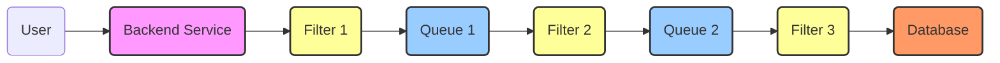

입력으로부터 결과물을 산출해내는 과정에 여러 처리 과정들이 포함되는 개념. 데이터 핸들링의 ETL이나 로그수집의 ELK스택의 Logstash에서 많이 본 패턴이고 강의에서는 콘텐츠 provider가 제공한 video source를 다양한 format과 resolution으로 인코딩 후 chunk를 분리하여 고객의 네트워크 회선 상태에 따라 적합한 resolution의 video를 제공하는 예시를 알려준다.
## Scatter Gather
### Flow Graph
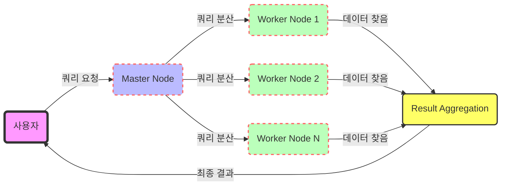

### Sequence Diagram
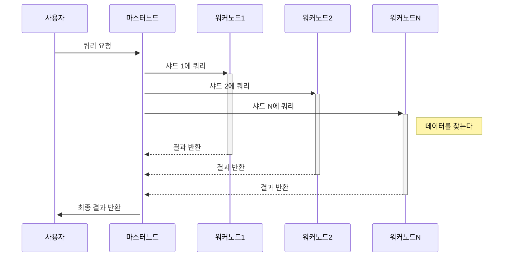
## Execution Orchestrator
### Flow Graph
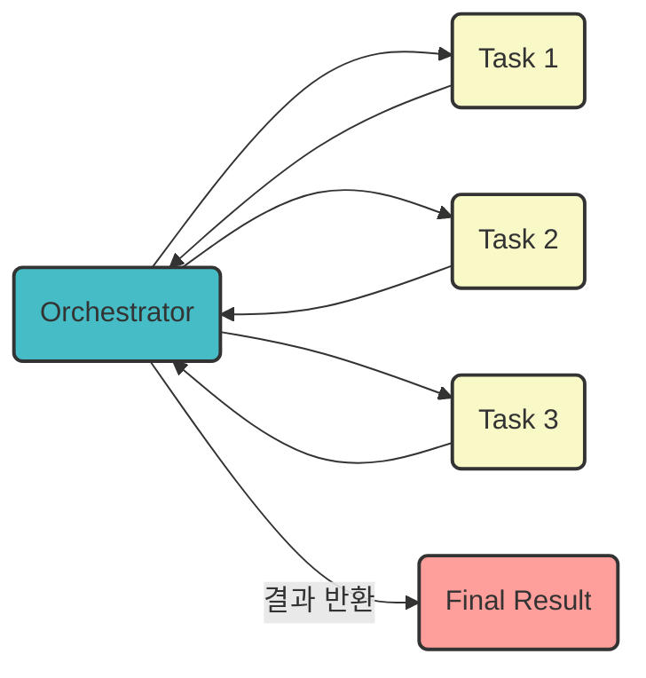
### Sequence Diagram
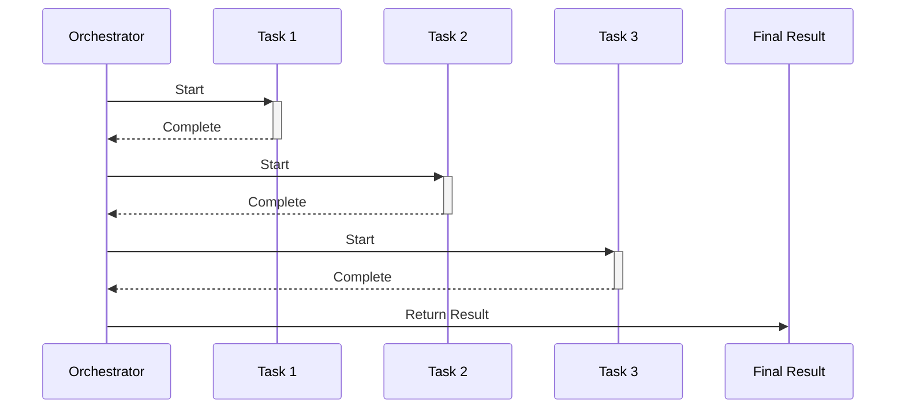
Orchestrator가 모든 Task의 입력/출력 등 동작을 동기식으로 관리한다. 따라서 Coupling(결합도)가 높다.<br>
대표적인 예시: Kubernetes

## Choreography
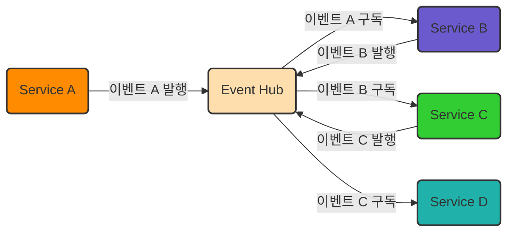
Orchestrator는 동기식이지만 Choreography 패턴은 Event Hub(MQ, Kafka등)에 메시지를 발행하는 방식으로 비동기식이며 이벤트 발생에 따라 자동으로 반응하는 분산형 아키텍처를 허용한다. 따라서 Coupling(결합도)가 낮아 확장성과 유연셩이 높지만 복잡하다.<br>
특히 이슈 발생 시 대응이 매우매우 어렵다고 한다.(어디가 문제가 발생했는지 추적하기가 매우 어렵다)

## Map Reduce
### Flow Graph
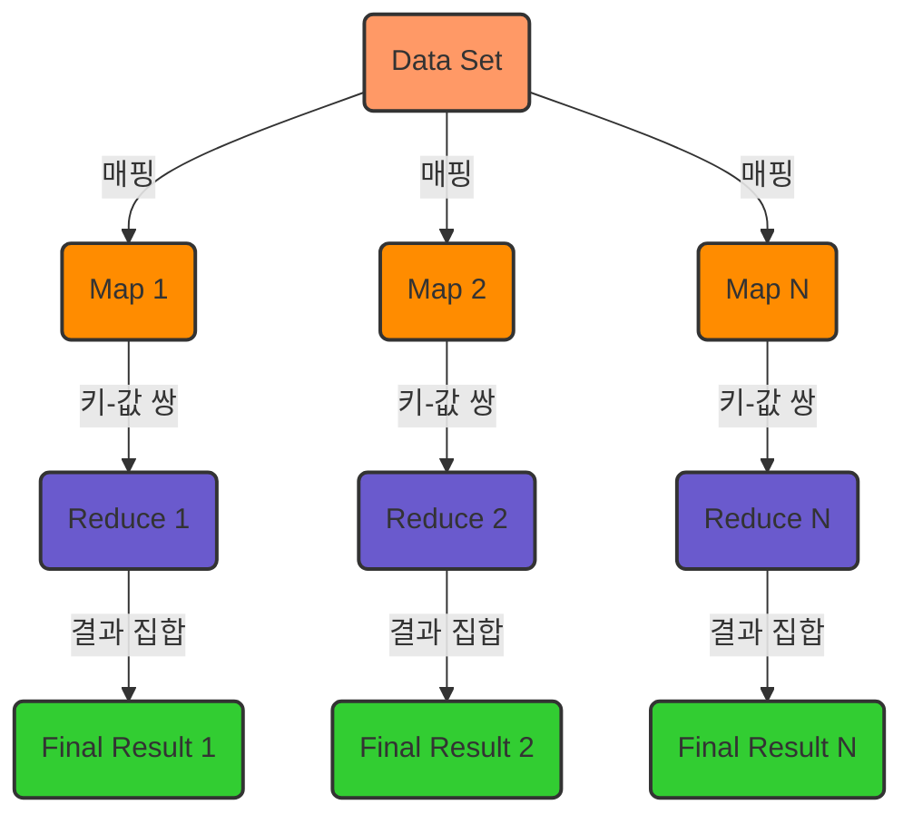
### Sequence Diagram (Hadoop EcoSystem)
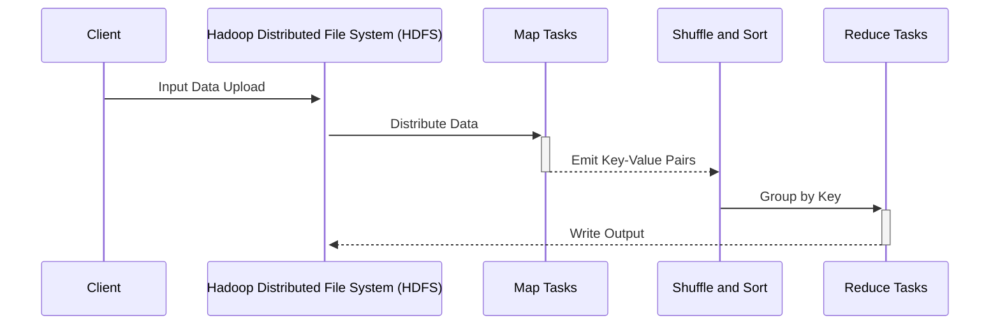

## Saga
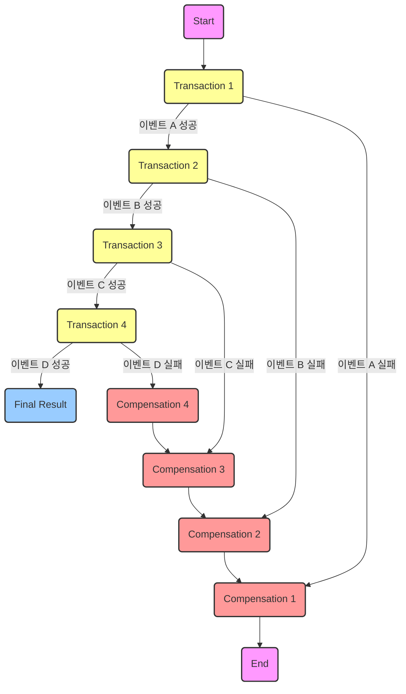
## Transactional Outbox
### Flow Graph
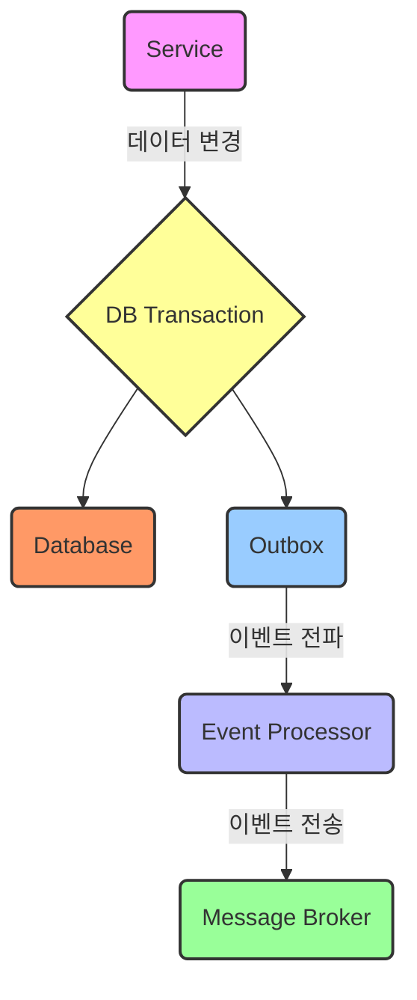
### Sequence Diagram
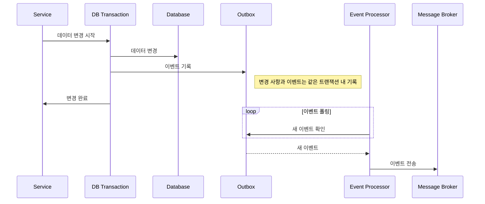

Database 변경사항 발생 시 원래 Table 업데이트 뿐만 아니라 별개의 "outbox" table생성 후 Table update가 발생했음을 기록하여 다른 서비스에서 Database가 변경했음을 알 수 있게 한다. 이때 원래 Target table과 Outbox table의 업데이트를 하나의 트랜잭션으로 묶어 처리하는 것을 통해 Target Table의 업데이트가 발생했다는 정보는 시스템 에러와 무관라게 "반드시" Outbox테이블에 기록될 수 있으므로 "최소 1회 전송 보장"된 Queue를 사용하는 효과를 가진다.

## Materialized View
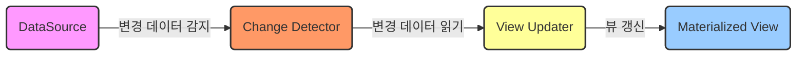

- 미리 계산된 데이터의 스냅샷을 제공한다. 쓰기 작업의 결과로 발생하는 이벤트에 의해 업데이트되며 데이터 조회가 빨라져 읽기 작업이 많은 시스템에서 유리하다.
- Materialized View는 복잡한 조인이나 계산을 필요로 하는 쿼리에 대해 더 빠른 읽기 성능을 제공할 수 있다.

## CQRS
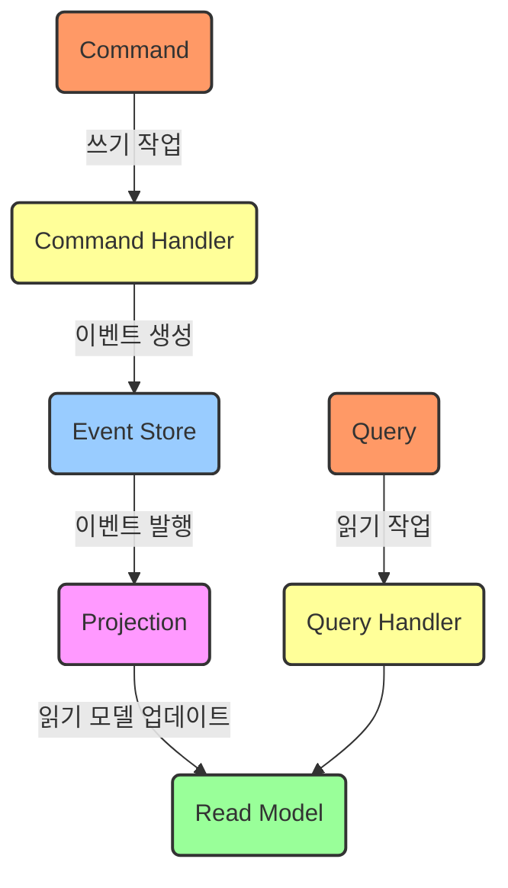

- 시스템의 '쓰기(Command)'와 '읽기(Query)'를 명확히 분리하여 복잡한 도메인 로직이나 비즈니스 규칙을 갖는 시스템에서 성능과 확장성을 향상시키기 위해 사용한다.
- 쓰기 모델(Command Model): 커맨드를 통해 상태 변경 작업을 수행한다. 비즈니스 로직과 유효성 검사가 여기에 포함
- 읽기 모델(Query Model): 쿼리를 통해 데이터를 조회한다. 높은 조회 성능을 제공하기 위해 별도로 설계할 수 있다. 변경 사항은 이벤트 소싱을 통해 읽기 모델에 반영한다.
- 단점: Eventual Consistency만 적용 가능하다

## CQRS + Materialized View
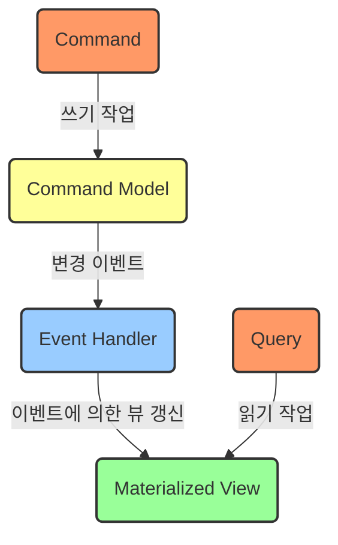

- CQRS에 Materialized View를 추가하면, 읽기 모델의 데이터가 미리 계산되고 저장되어, 조회 요청에 대한 응답이 빨라진다.
- 읽기 성능: Materialized View는 미리 계산된 결과를 저장하여 읽기 작업이 빠르다.
- 데이터 동기화: Materialized View를 사용하면 쓰기 작업 후 읽기 모델의 데이터를 업데이트하는 과정이 필요하다.
- 복잡성: Materialized View를 도입하면 데이터 일관성을 관리하는 추가적인 복잡성이 발생한다.
- 스케일링: CQRS 자체는 읽기와 쓰기 작업의 분리를 통한 스케일링을 가능하게 하지만, Materialized View는 읽기 성능을 향상시키는 데  중점을 둔다.
- 결론: CQRS+Materialized View 구조는 CQRS만 사용할 때보다 더 빠른 읽기 작업을 위해 설계된 구조이다.
- 단점: CQRS특성 상 Eventual Consistency만 적용 가능하다

## SideCar & Ambassador
```mermaid

```
## Anti-Corruption Adaptor
```mermaid

```
## BFF(Backend For Frontend)
```mermaid

```
## Throttling and Rate Limiting
```mermaid

```
## Retry
```mermaid

```
## Circuit Braker
```mermaid

```
## DLQ(Dead Letter Queue)
```mermaid

```
## Rolling Deployment
```mermaid

```
## Blue-Green Deployment
```mermaid

```
## Canary Release, A/B test deployment
```mermaid

```
## Chaos Engineering
```mermaid

```