# Software Architecture Patterns 정리
!!! Warning ""
    [Udemy "The Complete Cloud Computing Software Architecture Patterns" 강의](https://www.udemy.com/course/the-complete-cloud-computing-software-architecture-patterns/)를 듣고 복습을 위해 정리하였음

    ```md linenums="1"
    Pipes and Filters
    Scatter Gather
    Execution Orchestrator
    Choreography
    Map Reduce
    Saga
    Transactional Outbox
    Materialized View
    CQRS
    CQRS + Materialized View
    SideCar & Ambassador
    Anti-Corruption Adaptor
    BFF(Backend For Frontend)
    Throttling and Rate Limiting
    Retry
    Circuit Braker
    DLQ(Dead Letter Queue)
    Rolling Deployment
    Blue-Green Deployment
    Canary Release, A/B test deployment
    Chaos Engineering
    ```

<!-- more -->
---
## Pipes and Filters
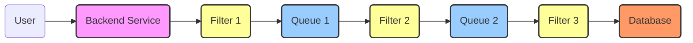

입력으로부터 결과물을 산출해내는 과정에 여러 처리 과정들이 포함되는 개념. 데이터 핸들링의 ETL이나 로그수집의 ELK스택의 Logstash에서 많이 본 패턴이고 강의에서는 콘텐츠 provider가 제공한 video source를 다양한 format과 resolution으로 인코딩 후 chunk를 분리하여 고객의 네트워크 회선 상태에 따라 적합한 resolution의 video를 제공하는 예시를 알려준다.
## Scatter Gather
### Flow Graph
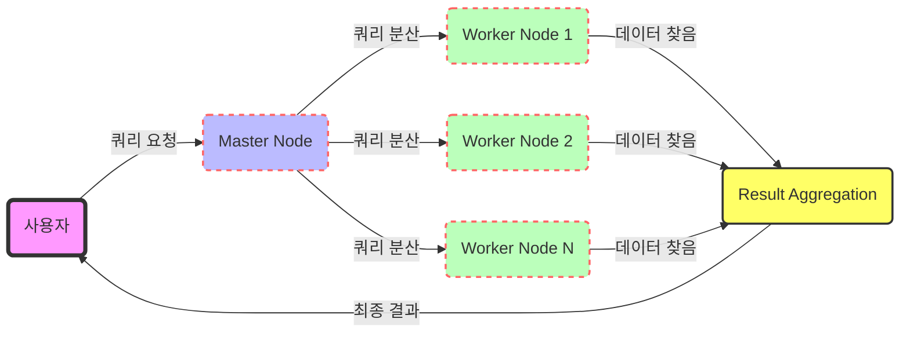

### Sequence Diagram
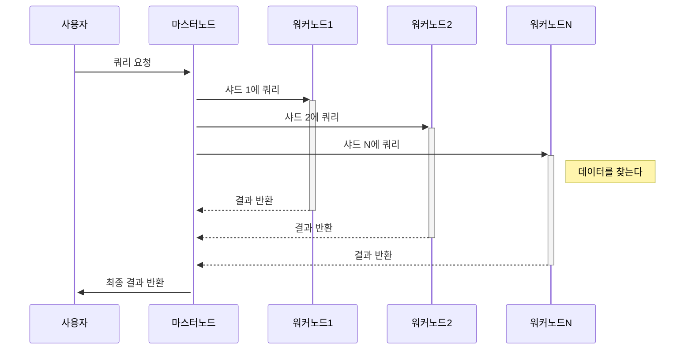
## Execution Orchestrator
### Flow Graph
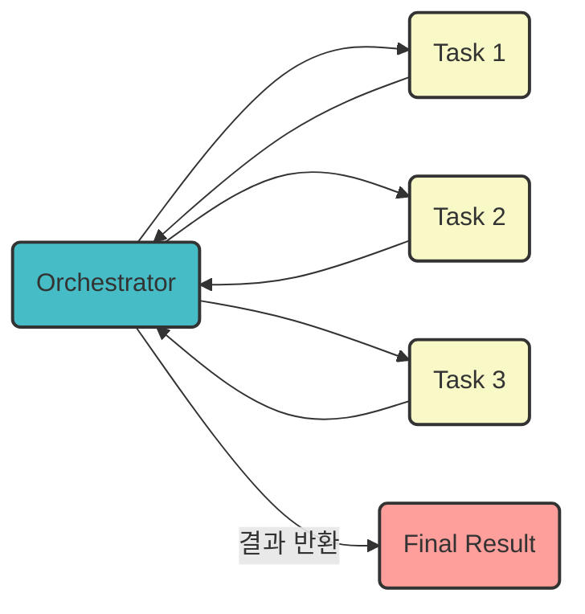
### Sequence Diagram
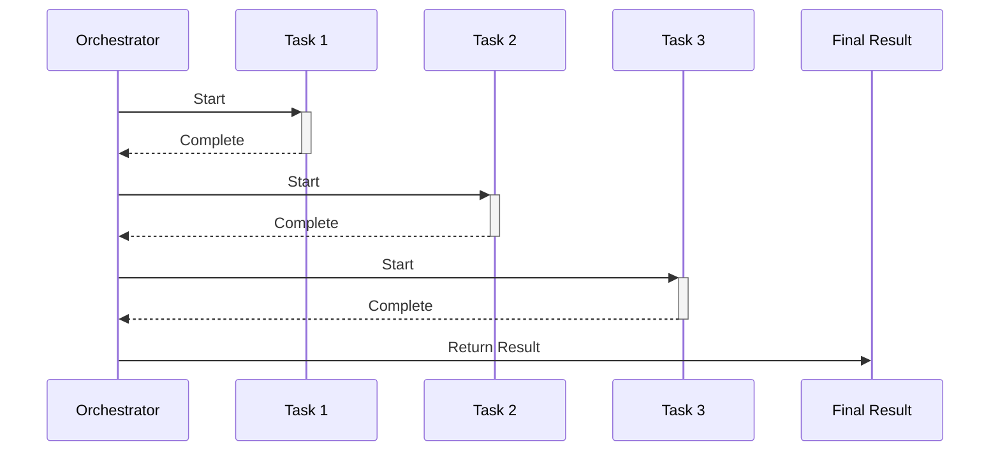
Orchestrator가 모든 Task의 입력/출력 등 동작을 동기식으로 관리한다. 따라서 Coupling(결합도)가 높다.<br>
대표적인 예시: Kubernetes

## Choreography
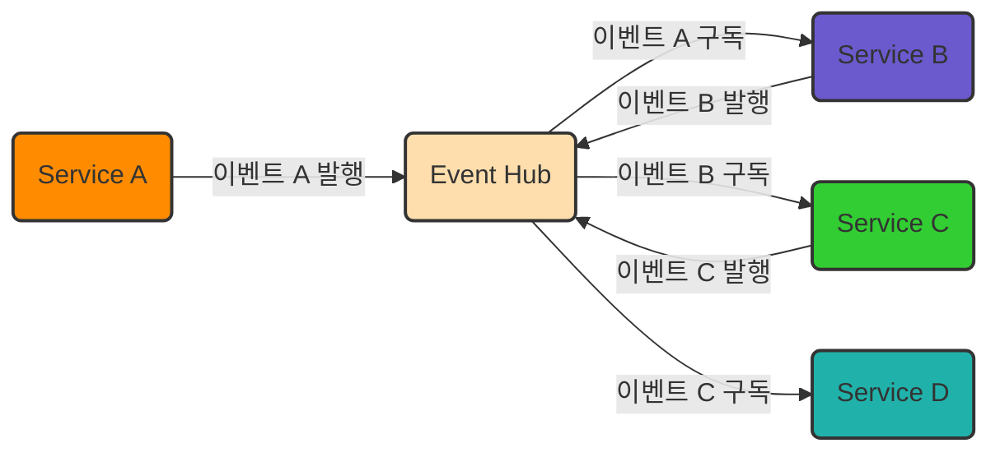
Orchestrator는 동기식이지만 Choreography 패턴은 Event Hub(MQ, Kafka등)에 메시지를 발행하는 방식으로 비동기식이며 이벤트 발생에 따라 자동으로 반응하는 분산형 아키텍처를 허용한다. 따라서 Coupling(결합도)가 낮아 확장성과 유연셩이 높지만 복잡하다.<br>
특히 이슈 발생 시 대응이 매우매우 어렵다고 한다.(어디가 문제가 발생했는지 추적하기가 매우 어렵다)

## Map Reduce
### Flow Graph
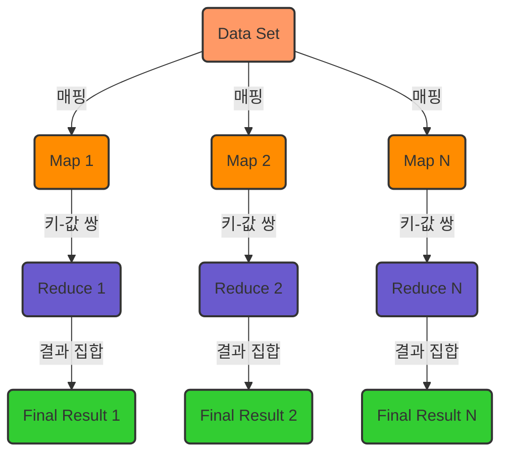
### Sequence Diagram (Hadoop EcoSystem)
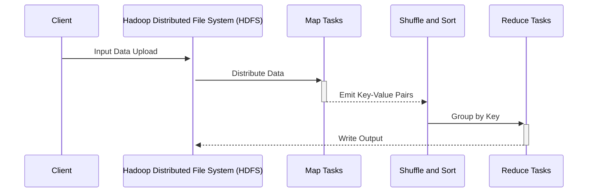

## Saga
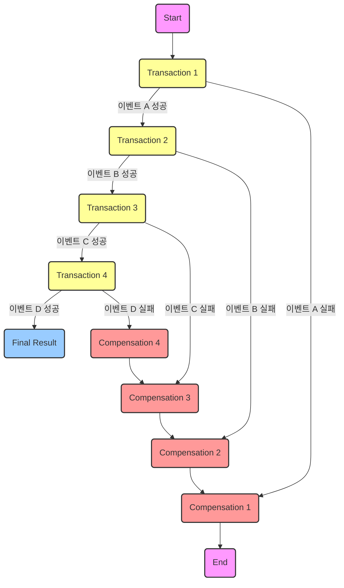
## Transactional Outbox
### Flow Graph
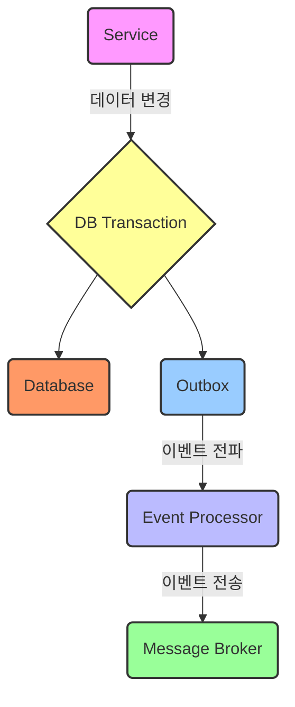
### Sequence Diagram
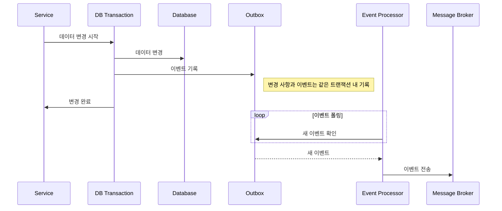
MSA 환경에서는 각 서비스별 DB가 분리되어 있어 트랜잭션 유지가 어렵다. 특히, A서비스의 DB가 업데이트되고 B서비스에 메시지를 전달해야 하는 순간에 서비스 단절이 발생하면 A서비스 DB와 B서비스 DB의 형상이 유지되지 않는다. 이를 해결하기 위해, A서비스의 DB 업데이트가 발생하는 시점에 Outbox라는 별도의 테이블을 생성한다. B서비스는 A서비스의 Outbox 테이블을 구독하여, 서비스 단절 발생 시에도 동작 재개 시점에서 완료되지 않은 메시지의 존재를 파악해 트랜잭션을 재개할 수 있다. 데이터베이스 변경사항이 발생할 때, 원래 테이블 업데이트와 함께 별도의 Outbox 테이블에 업데이트 사실을 기록한다. 이 두 업데이트를 하나의 트랜잭션으로 묶어 처리하여, 시스템 에러에도 불구하고 Outbox 테이블에 업데이트 사실이 반드시 기록될 수 있도록 함으로써, 최소 1회 전송 보장되는 큐의 효과를 낼 수 있다.

## Materialized View
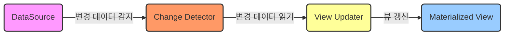

- 미리 계산된 데이터의 스냅샷을 제공한다. 쓰기 작업의 결과로 발생하는 이벤트에 의해 업데이트되며 데이터 조회가 빨라져 읽기 작업이 많은 시스템에서 유리하다.
- Materialized View는 복잡한 조인이나 계산을 필요로 하는 쿼리에 대해 더 빠른 읽기 성능을 제공할 수 있다.

## CQRS
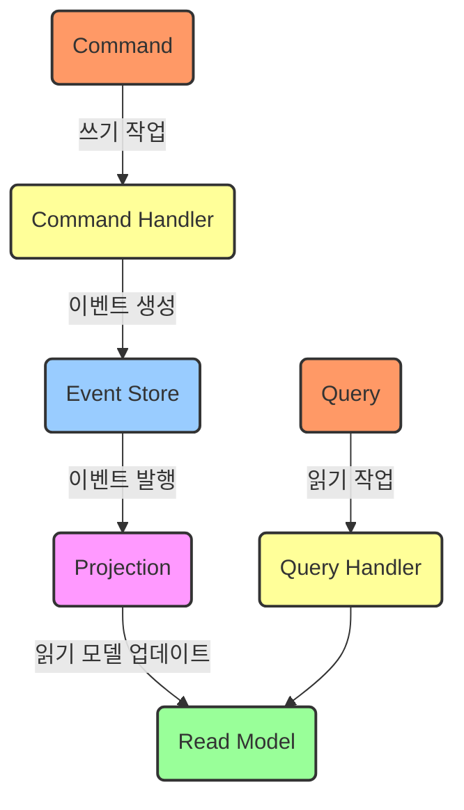

- 시스템의 '쓰기(Command)'와 '읽기(Query)'를 명확히 분리하여 복잡한 도메인 로직이나 비즈니스 규칙을 갖는 시스템에서 성능과 확장성을 향상시키기 위해 사용한다.
- 쓰기 모델(Command Model): 커맨드를 통해 상태 변경 작업을 수행한다. 비즈니스 로직과 유효성 검사가 여기에 포함
- 읽기 모델(Query Model): 쿼리를 통해 데이터를 조회한다. 높은 조회 성능을 제공하기 위해 별도로 설계할 수 있다. 변경 사항은 이벤트 소싱을 통해 읽기 모델에 반영한다.
- 단점: Eventual Consistency만 적용 가능하다

## CQRS + Materialized View
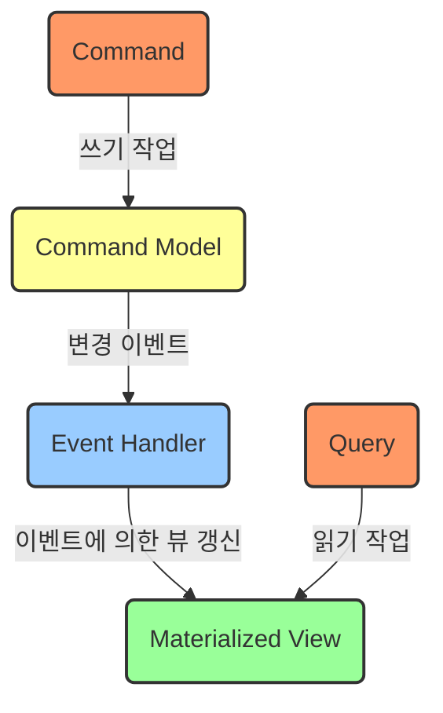

- CQRS에 Materialized View를 추가하면, 읽기 모델의 데이터가 미리 계산되고 저장되어, 조회 요청에 대한 응답이 빨라진다.
- 읽기 성능: Materialized View는 미리 계산된 결과를 저장하여 읽기 작업이 빠르다.
- 데이터 동기화: Materialized View를 사용하면 쓰기 작업 후 읽기 모델의 데이터를 업데이트하는 과정이 필요하다.
- 복잡성: Materialized View를 도입하면 데이터 일관성을 관리하는 추가적인 복잡성이 발생한다.
- 스케일링: CQRS 자체는 읽기와 쓰기 작업의 분리를 통한 스케일링을 가능하게 하지만, Materialized View는 읽기 성능을 향상시키는 데  중점을 둔다.
- 결론: CQRS+Materialized View 구조는 CQRS만 사용할 때보다 더 빠른 읽기 작업을 위해 설계된 구조이다.
- 단점: CQRS특성 상 Eventual Consistency만 적용 가능하다

## SideCar
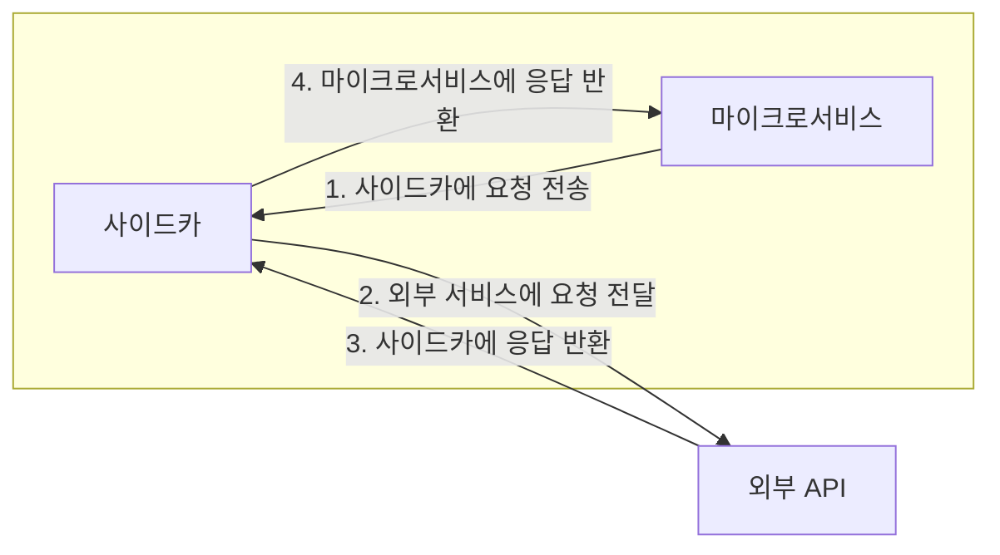
각 마이크로서비스의 옆에 '사이드카'라 불리는 보조 컴포넌트를 함께 배치한다. 이 사이드카 컴포넌트는 해당 마이크로서비스만을 위한 기능을 수행하고 마이크로서비스와 함께 생성되고 소멸한다. 사이드카는 마이크로서비스와 동일한 컨테이너나 Pod 내에서 실행되는 것이 일반적이다.

사이드카 패턴이 적용되는 예시

- 네트워크 트래픽 관리 및 프록시 기능
- 로깅과 모니터링
- 보안 관련 작업 (예: TLS 종료)
- 마이크로서비스의 설정이나 리소스 관리

## Ambassador
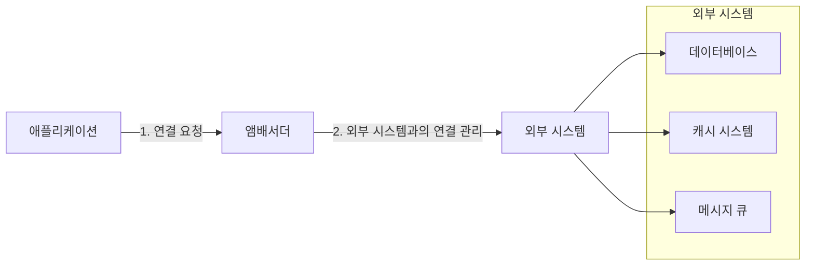
'앰배서더' 컴포넌트가 마이크로서비스와 외부 시스템(예: 데이터베이스, 외부 API)과의 인터페이스 역할을 수행한다. 앰배서더는 마이크로서비스의 네트워크 요청을 중계하고 외부 시스템과의 통신을 단순화한다. 앰배서더 패턴은 보통 외부 리소스에 대한 액세스를 중앙화하고, 외부 리소스에 대한 요청을 보내기 위한 통합 엔드포인트를 제공하는 데 사용한다.

앰배서더 패턴을 사용하는 예시: 

- Service Discovery
- Request Routing
- Load Balancing
- Circuit Breaker pattern

### Sidecar 패턴과 Ambassador 패턴 차이점
| 기준        | 사이드카 패턴                                            | 앰배서더 패턴                                                 |
|-----------|--------------------------------------------------------|------------------------------------------------------------|
| 적용 범위    | 특정 마이크로서비스에 국한되며, 해당 서비스의 생명주기를 따름       | 하나 이상의 마이크로서비스에 공통적으로 사용되며, 외부 시스템의 인터페이스 역할 |
| 주요 목적    | 마이크로서비스의 부수적 기능(로깅, 모니터링 등) 처리                 | 외부 시스템(데이터베이스, 외부 API 등)과의 통신 중계 및 관리             |
| 실행 위치    | 마이크로서비스와 동일한 환경(컨테이너 또는 Pod) 내 실행              | 외부 시스템에 가깝게 위치하거나 마이크로서비스와 같은 환경에서 실행 가능      |
| 기능적 역할 | 네트워킹, 보안, 리소스 관리 등 마이크로서비스를 직접 지원하는 기능들 | 서비스 디스커버리, 로드 밸런싱, 요청 라우팅 등 외부 서비스와의 연결을 관리 |


## Anti-Corruption Layer(ACL)
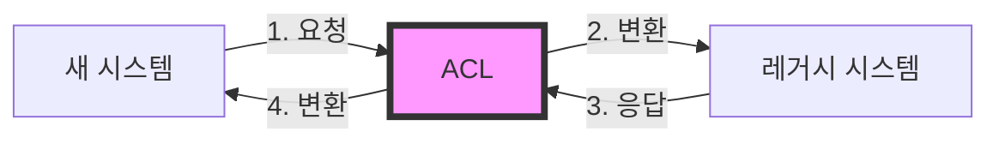
빅뱅이 아닌 분할정복 전략으로 새 시스템을 구축하는 경우 새 시스템에 레거시 시스템과 통신을 위한 "옛날"기술을 굳이 탑재하여 새 시스템을 "오염"시키고싶지 않다. 이때 ACL이라는 중간 Layer를 삽입하여 레거시와 새 시스템의 호환성을 유지해주다가 레거시를 밀어버릴때 ACL도 같이 밀어버리면 깔끔하다.


## BFF(Backend For Frontend)
```mermaid

```
## Throttling and Rate Limiting
```mermaid

```
## Retry
```mermaid

```
## Circuit Braker
```mermaid

```
## DLQ(Dead Letter Queue)
```mermaid

```
## Rolling Deployment
```mermaid

```
## Blue-Green Deployment
```mermaid

```
## Canary Release, A/B test deployment
```mermaid

```
## Chaos Engineering
```mermaid

```