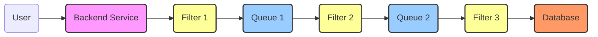
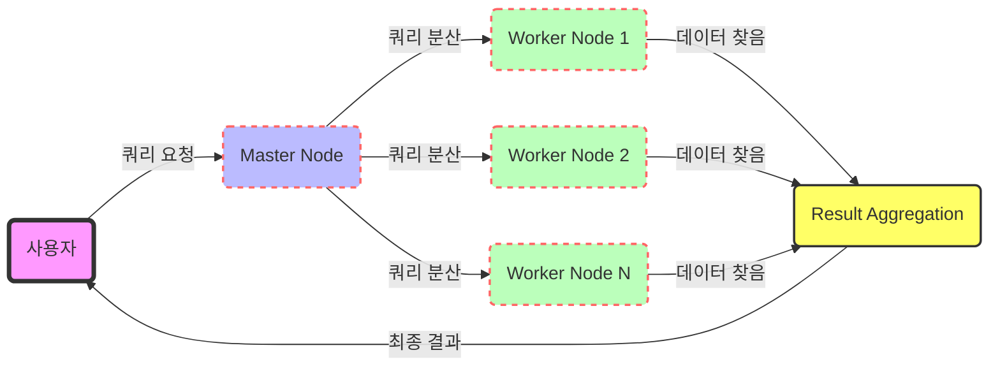
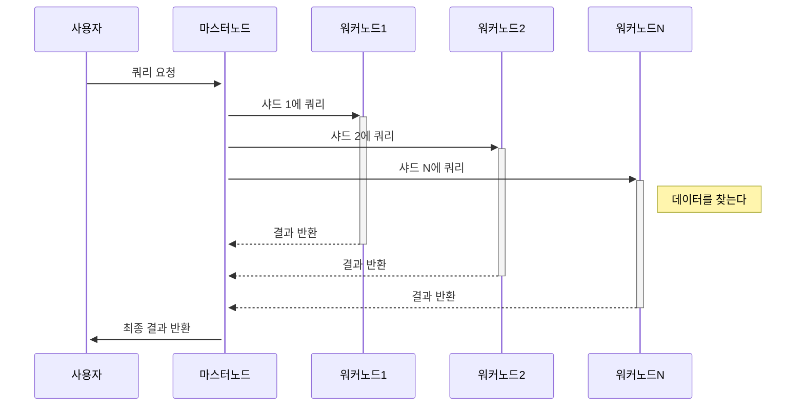
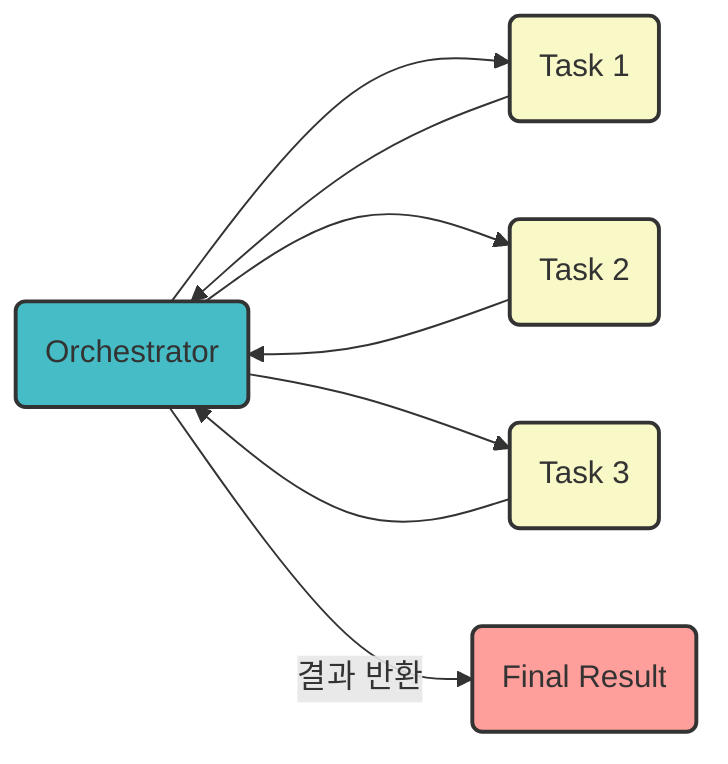
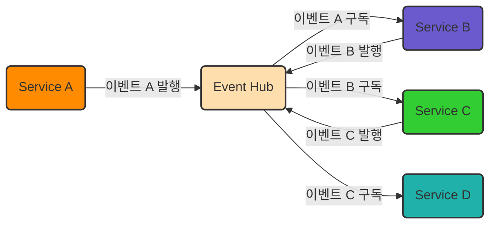
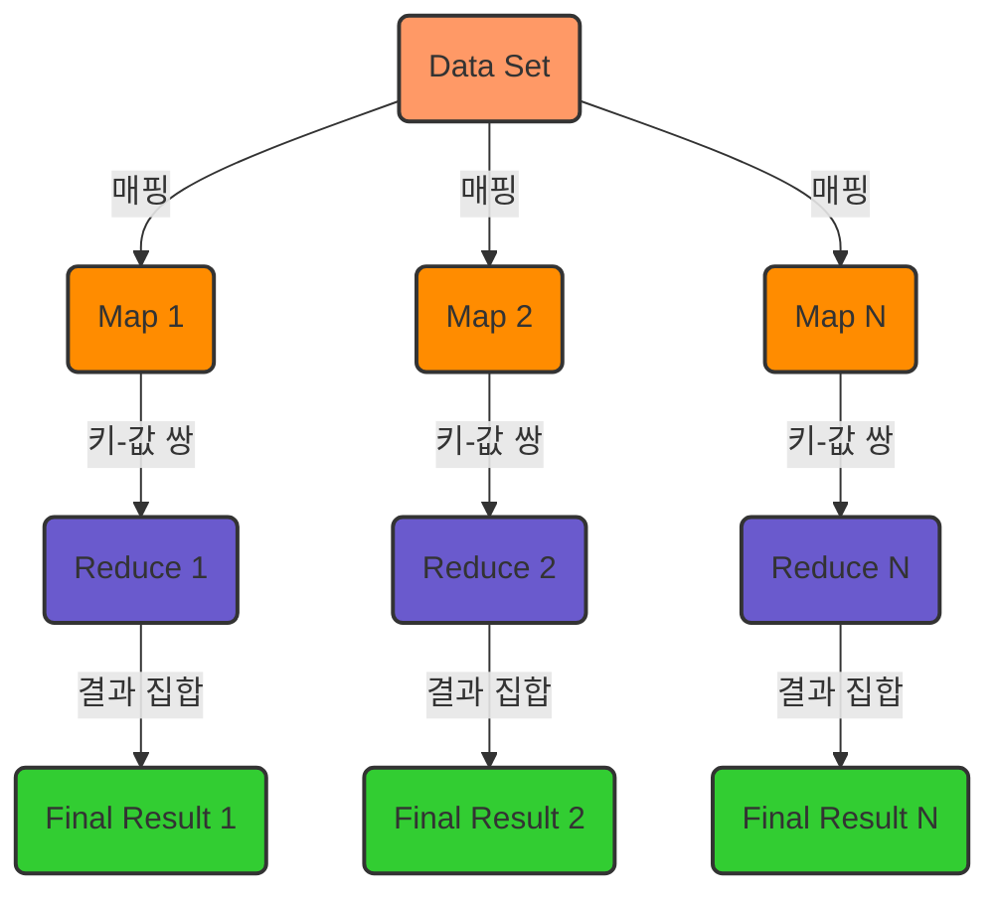
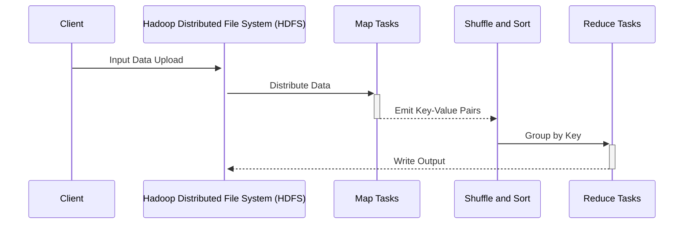
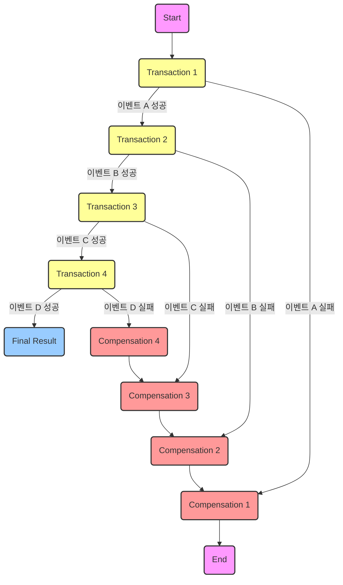
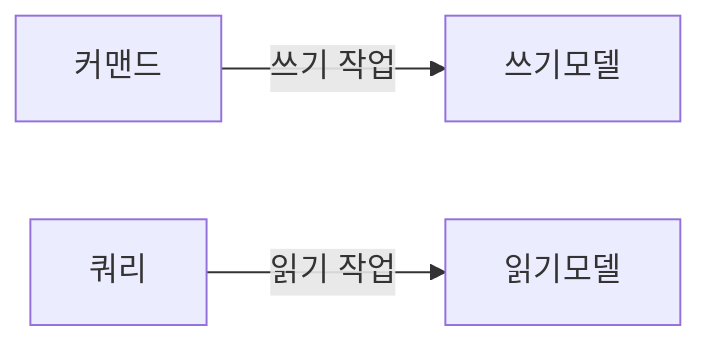
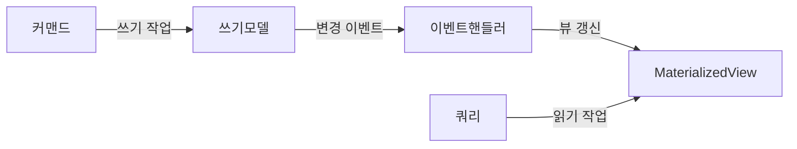

# Software Architecture Patterns 정리
!!! Warning ""
    [Udemy "The Complete Cloud Computing Software Architecture Patterns" 강의](https://www.udemy.com/course/the-complete-cloud-computing-software-architecture-patterns/)를 듣고 복습을 위해 정리하였음

    ```md linenums="1"
    Pipes and Filters
    Scatter Gather
    Execution Orchestrator
    Choreography
    Map Reduce
    Saga
    Transactional Outbox
    Materialized View
    CQRS
    CQRS + Materialized View
    SideCar & Ambassador
    Anti-Corruption Adaptor
    BFF(Backend For Frontend)
    Throttling and Rate Limiting
    Retry
    Circuit Braker
    DLQ(Dead Letter Queue)
    Rolling Deployment
    Blue-Green Deployment
    Canary Release, A/B test deployment
    Chaos Engineering
    ```

<!-- more -->

## Pipes and Filters


입력으로부터 결과물을 산출해내는 과정에 여러 처리 과정들이 포함되는 개념.<br> 데이터 핸들링의 ETL이나 로그수집의 ELK스택의 Logstash에서 많이 본 패턴이고 강의에서는 콘텐츠 provider가 제공한 video source를 다양한 format과 resolution으로 인코딩 후 chunk를 분리하여 고객의 네트워크 회선 상태에 따라 적합한 resolution의 video를 제공하는 예시를 알려준다.
## Scatter Gather
### Flow Graph



### Sequence Diagram

## Execution Orchestrator

## Choreography

## Map Reduce
### Flow Graph

### Sequence Diagram


## Saga

## Transactional Outbox

## Materialized View

## CQRS

## CQRS + Materialized View

## SideCar & Ambassador
```mermaid

```
## Anti-Corruption Adaptor
```mermaid

```
## BFF(Backend For Frontend)
```mermaid

```
## Throttling and Rate Limiting
```mermaid

```
## Retry
```mermaid

```
## Circuit Braker
```mermaid

```
## DLQ(Dead Letter Queue)
```mermaid

```
## Rolling Deployment
```mermaid

```
## Blue-Green Deployment
```mermaid

```
## Canary Release, A/B test deployment
```mermaid

```
## Chaos Engineering
```mermaid

```